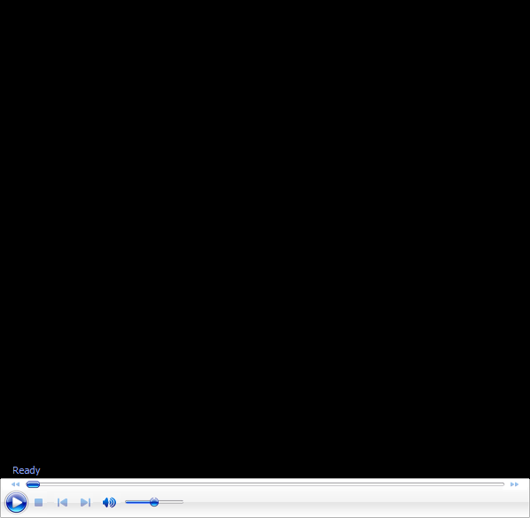

# The Sampras Serve-Racquet Head Speed

**The Sampras Serve: Racket Head Speed**

**By John Yandell**

{width="3.3333333333333335in"
height="2.5in"}

**How fast is Pete\'s racket really going when - and for how long?**

\"Racket head speed.\" Everyone one talks about it. TV commentators
claim they can see it. Every player wants it, and every coach claims to
know its secret.

But have you ever actually heard a commentator or a coach tell you how
fast the racket is going at various moments in the various strokes? No.
And there is a reason for that. They have no idea because they have no
evidence or data to back up their claims.

Does that type of evidence even exist? The answer is yes. Over the years
there have been academic studies, but little or none of this data has
ever filtered down into coaching, teaching or commentating.

Now the work of Brian Gordon is changing all that. We\'ve already
published his groundbreaking series on the biomechanics of the serve.
([Click Here.)](../Biomechanics/Science%20of%20Biomechanics%20TOC.docx)
Now he and I are collaborating on another amazing project - the first
ever 3 dimensional analysis of the serve of Pete Sampras - filmed in
live competitive play.

Working with the Tennisplayer team, Brian completed a two camera high
speed filming of Pete during an exhibition match versus Sam Querry,
played at the Tiburon Peninsula Club, in beautiful Marin County,
California. Then Brian went into a dark room with a few computers, some
software, and tracked 25 different points on Pete\'s body and racket.

{width="3.3333333333333335in"
height="2.5in"}

**2 cameras at 200 frames per second tracking 25 points on the body and
racket.**

What was the outcome? A lot of incredible new information. But for the
sake of simplicity in this series of articles, we decided to focus on
one event, a first serve hit down the T in the ad court. More than
likely, the general findings discussed below would be similar over the
full range of his deliveries.

To me what made this collaboration so exciting is that right from the
start Brian agreed to let me ask my own questions of this data. That
doesn\'t necessarily mean, by the way, that he and I will agree on every
point of interpretation. That would be impossible and it isn\'t the goal
anyway.

But I do believe the results will lead us to a greater understanding of
Pete\'s serve and also of the technical elements involved in all high
level serving. I also know this article will stimulate further
discussion - between myself and Brian, as well as other coaches, and
everyone else in the Tennisplayer community.

I\'m sure Brian and I will agree on much, but we\'ll both probably be
disappointed if we don\'t find at least a few issues to debate. (I could
have said argue.)

{width="3.3333333333333335in"
height="2.5in"}

**New data bases are the key to discussion and collaboration.**

And that is one of the main points. We are past the stage in the history
of coaching where one all-seeing individual has all the answers. The
sport is just too complex and the motions too dynamic, and\--up until
the last few years - our tools, primarily the naked eye, have been far
too limited. Now through the development of extensive new data bases -
both qualitative and quantitative\--we are in a phase where our
understanding of the game can really advance.

In future articles we will take a quantitative look at other aspects of
Pete\'s motion beyond the basic analysis of racket speed. For example,
the path of the racket. At any given moment how much is it moving
upward, downward, sideways, forward or back?

And the actual biomechanics. How fast are the various parts of his body
moving? In what direction and for how long? What are the angles of the
legs, shoulders, hips, hitting arm, etc, at the critical moments and how
they relate to each other?

{width="3.3333333333333335in"
height="2.5in"}

**How much will we have to modify or previous analyses?**

To me one of the fascinating aspects will be seeing what the numbers
tell us about the accuracy of the analyses I\'ve done in previous
articles on Pete\'s serve. These are the qualitative high speed video
analysis I did in conjunction with our 3D filming ([[Click
Here]{.underline}](http://www.tennisplayer.net/members/tour_strokes/john_yandell/sampras_serve/sampras_serve_part_1/sampras_serve_part_1.html)),
and the longer series of articles on Pete\'s motion I did that was one
of the seminal components when we launched Tennisplayer over 6 years
ago. ([[Click
Here]{.underline}](http://www.tennisplayer.net/members/avancedtennis/john_yandell/sampras_serve/sampras_new_filming_protocols/sampras_new_filming_protocols.html).)
How much of all that will this new perspective confirm, and how much
needs modification?

**A Simple Question**

But in this article, let\'s start with what seems like a simple
question. How fast is Pete\'s racket really going during the service
motion? And by that we are referring to the speed of the center of the
racket - the part of the string bed that makes contact with the ball.

I think the answer is going to surprise you. I believe the data shows
that some of the most common assumptions about how racket speed develops
are misleading.

{width="3.3333333333333335in"
height="4.375in"}

**Advance the animation and study Pete\'s racket head speed for
yourself.**

**The Answers**

Brian\'s camera\'s filmed Pete at 200 frames a second. Because the
motion takes around 2 seconds from start to finish, that means we have
about 400 points where we can stop and see how the racket is moving.

Let\'s start with the key moment - contact\--the moment of truth when
the racket is about to strike the ball. According to Brian\'s data
Pete\'s racket was traveling about 90mph in that last fraction of a
second just before contact.

There were no radar guns to give us the ball speed, but the Australian
physicist Rod Cross has estimated on a first serve the ball is traveling
about 1.35 times the speed of the racket at contact. So this means the
ball speed was somewhere above 120mph.

So the racket itself is going much slower that the ball. That in itself
is interesting news. But the more interesting question is how is that
90mph of racket speed really created?

One common theory is that the wind up and the backswing develop racket
speed gradually over the course of the motion, that it\'s a long, slow
build up over the course of the stroke.

{width="3.3333333333333335in"
height="2.5in"}

**30mph to 90mph in about 1/10th of a second.**

But the data shows exactly the opposite. There is no gradual build up.
The vast majority of the racket speed is actually created in the last
1/10 of a second before contact. That is 1/10 of one second in a 2
second long motion. In that 1/10 of a second interval, the racket head
accelerates from 30mph all the way to 90mph.

This critical final burst begins from what we have called the pro racket
drop position. The racket has fallen along his right side with the tip
pointing downward at the court. The plane of the racket face forms a
right angle with the torso.

At that point the racket has reached a speed of 30mph. In the next
1/10th of a second this triples from 30mph to 90mph at the contact.
Building that initial 30mph took about a second and a half, or three
quarters of the overall time of the motion. Then the other 60mph - two
thirds of the total speed is generated in a blinding flash.

Rather than thinking of the wind up and backswing as continuously
building speed, it is probably more realistic to think of them as
setting up Pete\'s body and racket for a violent explosion. Getting to
that drop position is critical, and this fact explains why a player like
Jay Berger, who reached the top 10 in the world, could serve well over
100mph with no windup, literally starting from the drop position.

{width="3.3333333333333335in"
height="2.5in"}

**The Arm Drop: a half second develops 3.5mph of racket speed.**

**The First 30**

The bulk of the acceleration may have occurred in a fraction of the
overall time increment, from the racket drop to the contact. But how the
racket reached that speed of 30mph at the drop turns out to be
fascinating in its own right.

Creating this initial 30mph took exponentially longer and may not
account the bulk of the racket speed, but obviously it is still
important, since it does actually account for a third of the overall
racket speed at contact.

Does this longer, slower movement leading to the drop fit better with
the continuous acceleration theory?

Interestingly the answer is no, not really. This is because racket goes
through 3 distinct phases on the way to the drop, all of which are quite
different. Together they may account for ¾ of the time of the motion,
but in each phase the speed of the racket changes by different amounts
at different rates in intervals of different lengths.

  ---------------------------------------------------------------------------------
  [Phase 1]{.mark} [Speed at       [Speed at     [Gain in        [Duration
                   Start]{.mark}   End]{.mark}   Speed]{.mark}   (Approx)]{.mark}
  ---------------- --------------- ------------- --------------- ------------------
  [The Arm         [0 mph]{.mark}  [3.5          [3.5            [1/2
  Drop]{.mark}                     mph]{.mark}   mph]{.mark}     second]{.mark}

  ---------------------------------------------------------------------------------

In Pete\'s motion the first of the 3 phases is the arm drop. At the
start of his motion, he drops his arms until they both point more or
less directly downward at the court. Interestingly, the racket doesn\'t
really accelerate during this phase.

From the ready position until the completion of the arm drop the speed
of the racket is virtually constant - between 4 and 5 mph. In fact when
the arms reach the bottom of the drop, the racket actually slows
slightly to about 3.5 mph.

Just this segment of the motion takes over a quarter of the entire
duration of the serve, a total of about a half second. So after half a
second, a quarter of the total time, Pete\'s racket is traveling at less
than 5mph.

{width="3.3333333333333335in"
height="2.5in"}

**The move to the Power Position takes the speed to 10mph.**

**The Power Position**

What happens next? The second phase is from the completion of the arm
drop to the classic power position in which the tossing arm and the
racket tip are pointing directly upward.

To reach this position, Pete uses a partially abbreviated wind up. This
means that after the arms drop, he begins to raise the racket arm and
racket from the shoulder. But he also begins to bend the elbow. This
combination movement takes him to the power position.

During this phase, the racket actually starts to accelerate, compared to
the virtually even speed during the arm drop.

From 3.5mph at the arm drop, the racket reaches 10mph at the power
position, a gain of 6.5mph. The acceleration is also quite even over the
course of this phase, increasing only slightly as the racket gets closer
to the power position.

But this move to the power position is also the part of the motion that
takes the longest - over a second and a half. So, again, the surprise is
how little speed is really developed during this interval.

  ------------------------------------------------------------------------
  **Phase 2**           **Speed at  **Speed at  **Gain in   **Duration
                        Start**     End**       Speed**     (Approx)**
  --------------------- ----------- ----------- ----------- --------------
  **Arm Drop to Power   **3.5 mph** **10 mph**  **6.5 mph** **1.5
  Position**                                                seconds**

  ------------------------------------------------------------------------

So, again, from the arm drop to the power position there is a gain of
6.5mph, but that is still a long way from the 90mph racket speed at
contact. Pete is now more than two thirds of the way through the
duration of motion and his racket speed has only reached 10mph, a little
more than 10% of its eventual top speed.

{width="3.3333333333333335in"
height="2.5in"}

**Things start to speed up as the racket drops, gaining 20mph in 2/10 of
a second.**

**Power Position to the Drop**

The next phase is the movement from the power position to the racket
drop. This is where things start to happen a lot more quickly. Here we
see a big jump in racket speed in a very short interval.

In 2/10s of a second the racket moves from 10mph to 30mph. It took Pete
almost a second and a half to create the first 10mph of racket speed.
Now in a blink of an eye he triples it.

But as with the previous phase from the arm drop to the power position,
the rate of acceleration is quite even. As the racket tip falls, Pete\'s
upper arm is rotating backwards in the shoulder joint. In the first 15
or so frames the racket picks up about 5 mph.

Thereafter, it adds another 5mph about every 8 frames, until it reaches
30mph. The racket has now reached the drop position and is positioned
for the final explosion to contact.

  ------------------------------------------------------------------------
  Phase 3            Speed at     Speed at    Gain in      Duration
                     Start        End         Speed        (Approx)
  ------------------ ------------ ----------- ------------ ---------------
  Power Position To\ 10 mph       30 mph      20 mph       .2 seconds
  Racket Drop                                              

  ------------------------------------------------------------------------

**Drop to Contact**

What happens in the move from power position to the drop is in some ways
a harbinger of what is about to happen because the racket speed
increases so much more dramatically in such a shorter interval, compared
to the first 2 phases.

{width="3.3333333333333335in"
height="2.5in"}

**The bulk of the speed developed in a few 10ths of a second.**

In the move to the contact, however, it is far more extreme. The racket
picks up 3 times as much speed but in half the time, accelerating, as we
have seen, from 30mph to 90mph in 1/10 of a second.

But in addition to the huge gain in racket speed, there is another
characteristic to this phase that separates it from those leading up to
it. This is how rapidly the racket accelerates.

In the move to the contact, the acceleration of the racket increases
almost literally frame by frame as the racket approaches contact.
Instead of gaining about the same amount of speed in each frame, the
racket gains more and more the closer to approaches to the ball.

In the first 10 frames of the upward motion the racket gains 5mph and is
traveling 35mph. But just 3 frames later it has gained another 5mph.
Then in 3 more frames it gains 9mph. At this point the racket is still
on edge and is traveling at a speed of 50mph.

{width="3.3333333333333335in"
height="2.5in"}

**As the hand turns in the last 6 frames the racket gains 40mph.**

Now the hand and arm start to turn the racket toward the ball and the
acceleration jumps once again. In the next 4 frames the racket head
gains 24 mph to reach a speed 74mph. This gain of 24mph happens in
2/100\'s of a second!

These changes are becoming more and more difficult even to visualize.
But there are still two more frames before contact.

In each of these last 2 frames, the racket adds 8mph more so this
additional 16mph takes the racket to its maximum speed of 90mph speed
just before contact. This gain of the final 16mph takes only 1/100 of a
second!

  --------------------------------------------------------------------------
  Phase 4              Speed at     Speed at    Gain in      Duration
                       Start        End         Speed        (Approx)
  -------------------- ------------ ----------- ------------ ---------------
  Racket Drop To       30 mph       90 mph      60 mph       .1 seconds
  Contact                                                    

  --------------------------------------------------------------------------

**Deceleration**

This speed data we have looked at so far is amazing and in and of itself
raises many questions to ponder. But really, we have only told half the
story of racket speed in the motion. To understand the motion more fully
we have to consider the data on the racket speed deceleration after
contact.

{width="3.3333333333333335in"
height="2.5in"}

**From 90mph to 30mph in the same interval.**

The story here is equally fascinating. The contact knocks 20mph off the
racket speed virtually instantaneously. This takes it down from 90mph
down to about 70mph. And this deceleration then continues at an
extremely rapid pace.

Within about 1/10 of second after contact, the speed is back down to
about 30mph. At this point the racket tip is pointing more or less
directly down at the court, and the famous Sampras elbow bend in the
followthrough is clearly visible.

So there is an interesting symmetry here. It took the racket about 1/10
of a second to go from 30mph to 90mph from the drop to the contact. Now
in about the same interval, 1/10 of a second, the racket has dropped
back down from 90mph to 30 mph.

Think about that! In 2/10s of one second, the racket goes from 30mph to
90mph and then back from 90mph to 30mph. That\'s a total speed change of
120mph in a total 2/10s of a second! And these mind boggling changes
have occured in a very small fraction of the overall time interval of
the motion.

This racket deceleration continues on as the motion finishes. Another
1/10 of a second later, the racket speed has dropped all the way back
down to less that 5mph. And no, you didn\'t see any of that with your
naked eye.

**And the Meaning?**

So what does that all mean? If your head is spinning, mine is as well.
These are many issues we will try to sort out in more detail later in
the series, but for now there are a few obvious general points.

{width="3.3333333333333335in"
height="2.5in"}

**Pronation and the High Elbow position - 2 elements in the deceleration
phase.**

First the real attention for players in maximizing their own racket
speed has to be on what is happening in the motion that critical instant
between drop and contact. The wind up and the backswing are generating
some racket speed for sure, but their greater purpose appears to be to
position the racket, body and ball for that explosive split second when
the bulk of the racket head speed is developed in the movement upward to
the ball.

One other fascinating implication is what the data reveals about
elements in the motion that coaches and players often identified as
causes of racket head speed. One of these is pronation. A second, often
seen as unique in Pete\'s case, is his high elbow position in the
followthrough.

Pronation is a tricky term because in coaching lexicon it has become
associated with the counter clockwise turning of the racket face after
contact. Technically though, in biomechanical terms, it refers only to
the rotation of the forearm between the elbow and the wrist. The reality
is that as the racket goes up toward contact, it is actually rotating
from the shoulder as well.

Regardless, when we look at the position of the racket as it moves into
the followthrough, we can see that the racket has actually lost half its
speed at what is usually identified as the point of maximum
\"pronation.\" This is with the racket face on inverted edge.

**Click here to study Brian\'s 200 frame per second video for
yourself.**

At that point the racket is traveling only about 45mph. So there is no
way pronation, as it is generally understood, can be \"causing\" racket
head speed.

The same point can be made about the elbow position. At the time that
famous elbow bend becomes most prominent, the racket has slowed down
even further to about 24mph.

So it\'s the same about the elbow bend, as with pronation. They can\'t
be generating racket speed. They seem to be more effects than causes.
They may be evidence of a great motion, but that evidence is more of a
by product.

So if pronation and or the high elbow position are effects, what are in
fact is the cause of racket speed in Pete\'s serve?

Is it the path of the racket to the ball? The position of the ball at
contact? Pete\'s physical flexibility and the relaxation in the motion?
All of the above? Or something else?

Good questions. As we work through the data on the other aspects of the
motion, we\'ll see what light may be shed. Stay tuned.

**To view the complete Stroke Archives of Pete Sampras serves,
[\]{.underline}
[click here.](Advanced%20Tennis%20TOC.docx)**

{width="1.8208333333333333in"
height="2.6493055555555554in"}

John Yandell is widely acknowledged as one of the leading videographers
and students of the modern game of professional tennis. His high speed
filming for Advanced Tennis and Tennisplayer have provided new visual
resources that have changed the way the game is studied and understood
by both players and coaches. He has done personal video analysis for
hundreds of high level competitive players, including Justine
Henin-Hardenne, Taylor Dent and John McEnroe, among others.

In addition to his role as Editor of Tennisplayer he is the author of
the critically acclaimed book Visual Tennis. The John Yandell Tennis
School is located in San Francisco, California.
