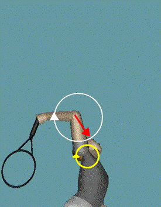
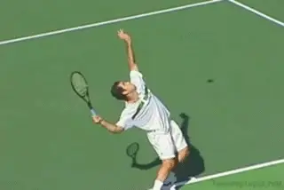
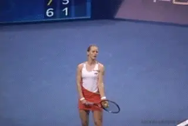
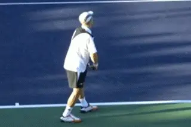

# The 3D Serve - Upward Swing - Part 1

**The 3D Serve: Upward Swing Part 1**

**Dr. Brian Gordon**

In my previous articles we\'ve looked at the windup [(Click
here)](3D%20Technologies%20and%20Analysis%20-%20The%20serve%20wind%20up.docx)
and the backswing ([Click here)](The%20Backswing%20-%20Part%201.docx)
from a three dimensional, quantitative perspective. We\'ve seen there
are many possible ways to organize the motions of individual body
segments in the service motion.[(Click
Here)](http://www.tennisplayer.net/members/biomechanics/brian_gordon/serve_back_swing_upper_body/serve_back_swing_upper_body.html)

{width="2.8645833333333335in"
height="3.6979166666666665in"}

**Let\'s start our analysis of the complexities in the upward swing.**

Players who want to improve their serves have to understand these
options, and consider them in the context of their physical
capabilities. Now, in the next two articles, let\'s take the same
approach and explore the options in our investigation of the upward
swing. We\'ll start in this article by seeing how the conditions of the
trunk are critical for setting up certain elements of the upward motion.

As in the previous articles, we\'ll use 3D data for a high level junior
player to provide examples of how the various segments interact.
Developmental coaches should take special note of this data, as this
junior exhibits issues that are almost universal in the development of
the serve. My belief is that these issues should be addressed in
coaching as early as possible.

{width="3.3333333333333335in"
height="2.5in"}

**Blinding acceleration gaining 70mph in a fraction of a second.**

We\'ve already seen that defining the options in the motion becomes more
difficult as the speed of the motion increases, for example, when we
moved from the windup to the backswing. When we try to analyze the
upward path of the arm and racket this difficulty becomes even greater.

The primary is reason is that as we move into this phase the body
segments achieve amazing speeds. For example, in just 1/10 of a second,
the center of the racquet face can gain 70 MPH as it moves toward the
contact.

**Conditions at the End of the Backswing**

We\'ve covered a lot of complex ground in the previous articles, so
before we start on the upward swing, let\'s review where we are in the
motion at the end of the backswing. We\'ll start with the legs, then
look at the trunk.

We\'ll also add some further analysis about the role of the trunk in the
backswing as it relates to the upper swing. ***[[The trunk is what I
call \"The Momentum Super Highway.\" Its position and the way it moves
during the upward swing are critical for creating the correct racket
path and maximizing racket speed.]{.mark}]{.underline}***

{width="3.3333333333333335in"
height="2.2291666666666665in"}

**[Once the legs leave the ground, a finite amount of momentum moves up
the chain.]{.mark}**

**[Starting with the legs, we see that the knees have fully extended.
The leg drive is therefore complete, and the body has been driven or
pushed upward into the air.]{.mark}**

***[[Since the feet have lost contact with the ground, this means that
the legs can generate no further force from the ground. This means that
angular momentum can neither increase or decrease, and is now constant
around all axes of the body. How this finite amount of momentum moves
through the kinetic chain is critical for the rest of the
motion.]{.underline}]{.mark}***

**The Trunk**

**[[At the end of the backswing, the trunk has also gone through a
complex series of motions. These motions have been the driving force in
the racquet drop.]{.mark}]{.underline}**

1.  **[The first motion is the natural elevation of the trunk as the leg
    drive pushes the whole body up in the air.]{.mark}**

2.  **[The second is the backward bending of the spine, which we also
    called trunk extension.]{.mark}**

3.  **[The third movement is the sideways or lateral bending of the
    spine, called the cartwheel effect.]{.mark}**

4.  **[Finally, we have the twisting of both the hips and shoulders or
    the upper and lower trunk.]{.mark}**

{width="3.3333333333333335in"
height="2.2291666666666665in"}

**Shoulder elevation, cartwheeling, and trunk twist\--all parts of the
backswing.**

**[The net effect of all these motions is that the trunk is tilted
sideways to the left when viewed from a back view. The hips and
shoulders are roughly aligned with each other when viewed from overhead.
This alignment occurs at roughly 60 degrees away from the
baseline.]{.mark}**

**The Hitting Arm**

**[[In the previous article we also saw that during the backswing, the
dominant hitting arm motion was external rotation of the upper arm. This
motion, combined with the elevation of the upper arm at the shoulder,
are the factors that are most responsible for the depth of the racket
drop.]{.underline}]{.mark}** ***[[The depth of the racket drop is
important because it dictates the available range of motion during the
upward swing for developing racket head speed.]{.underline}]{.mark}***

{width="3.3333333333333335in"
height="2.2291666666666665in"}\
\
**Internal rotation; the dominant arm motion in the backswing.\**

**The Upward Swing Goals**

***[[Simply put, the performance goal of the upward swing is to generate
as much racquet speed as possible. The companion goals are to contact
the ball at the greatest height with the racquet face traveling on the
optimal path for the desired shot direction.]{.mark}]{.underline}***

***[[The velocity (speed and direction) of the racquet face is the sum
of the rotations of the joints of the body, considering the joint\'s
proximity to the racquet face.]{.underline}]{.mark}*** Elbow extension,
for example, can cause the racquet face to move \-- the velocity of the
movement being determined by the rate of the elbow extension and the
elbow\'s location in relation to the racquet face.

With 3D analysis, it is possible to determine how the action of each
joint contributes to the speed of the racquet. These contributions have
been discussed in a previous article on this site and elsewhere. ([Click
Here](http://www.tennisplayer.net/members/biomechanics/brian_gordon/serve_tennis_science%20_brian_gordon/serve_tennis_science%20_brian_gordon.html).)
They provide great insight into how racquet speed is developed in the
upward swing, as we\'ll see below.

***[[It is important to understand, however, that the joint rotations
and their contributions to racquet speed do not occur on their
own.]{.underline}]{.mark}*** **[Instead they are effects of complex
kinetic interactions. It is not my intention to unravel this kinetic
puzzle in this article because this has never been accomplished.
Instead, the goal is to investigate pieces of the puzzle that relate to
actionable performance issues.]{.mark}**

**The Trunk\--Momentum Super Highway**

***[[At the highest level, the kinetic fuel that produces racquet head
speed is angular momentum. To generate a large amount of racquet speed
at contact, you must generate a large amount of angular momentum in the
hand/racquet.]{.mark}]{.underline}***

***[[The most important component for racquet speed is forward angular
momentum.]{.underline}]{.mark}*** This momentum is first acquired by
pushing on the ground with the legs. Then it must accumulate in the
trunk where it can be transferred to the hitting arm, and then on to the
racket. So the trunk is a major hub in the transfer highway.

To understand the flow of forward angular momentum into and out of the
trunk, we must briefly revisit the backswing.

{width="3.3333333333333335in"
height="2.2291666666666665in"}

**The cartwheel sets up the momentum transfer to the trunk.**

**The \"Cartwheel\" and Shoulder Motion**

***[[The critical portion of the forward angular momentum transfer into
the trunk occurs during the backswing.]{.underline}]{.mark}*** **[This
transfer is through the so-called cartwheel motion of the trunk. The
backward lean at the end of the windup (seen in a side view) sets up
this transfer. This is the so-called \"archer\'s bow\". It is an
attribute shared by all high level servers, but one that many younger
players are slow to develop.]{.mark}**

The momentum transfer from the legs to the trunk begins early in the
backswing. This is caused by the contraction of muscles on the outside
of the front hip and in the trunk combined with some push from the back
leg. These actions cause the momentum to be redistributed from the legs
to the trunk. The trunk then straightens into alignment with the legs
during the cartwheel.

***[[The transfer to the hitting arm starts later in the backswing and
continues into the early upward swing.]{.underline}]{.mark}*** **[The
transfer is accomplished through muscular activity causing motion at the
shoulder joint. The motion starts as an upward movement of the upper arm
(abduction), later combined with a forward movement of the upward arm
(horizontal adduction).]{.mark}**

And here is our first important coaching implication for junior players.
These two key factors\--the cartwheel action of the trunk early in the
backswing and the shoulder joint motion at a later stage\--are often
limited in the service motions of young juniors.

{width="3.3333333333333335in"
height="2.2291666666666665in"}

**Shoulder abduction; the movement of the upper arm upward and
forward.**

My research indicates that ***[[at the start of the upward swing, high
level servers have used the cartwheel and shoulder joint motion to
transfer around 75% of their total forward angular momentum into the
upper body (trunk and arm).]{.underline}]{.mark}***

But if we look at the 3D data in user interface for our junior player,
we see he has transferred only a little over 50 percent of his total
forward angular momentum to the upper body at the same point in the
motion.(To see this start by selecting \"Angular Momentum\" from the
\"Data Options\" menu, then scroll down though the table values 3
lines.)

That is a huge difference and therefore a major problem. My coaching
experience shows that until this problem is resolved, players can not
make further substantive improvement in the serve. But to resolve the
problem, you must understand whether the deficiency in the momentum
transfer is the transfer into the trunk (cartwheel), or into the arm
(shoulder abduction), or both.

In the case of the junior player, the answer is both. But if you don\'t
happen to have 3D technology on hand to measure angular momentum, how
can you detect this problem? ***[[A good indicator of the potential
momentum transfer into the trunk is the backward lean of the trunk at
the end of the windup.]{.underline}]{.mark}***

{width="3.3333333333333335in"
height="2.2291666666666665in"}

**Little backward lean means little momentum transfer.**

Our example player has a small angle of about 5-6 degrees. ***[[This
compares to a target value of 30 degrees for the high performance
servers in our data base.]{.underline}]{.mark}*** (We can see this by
selecting \"Segment/Joint Angles\" in the \"Data Options\" and scrolling
down to backward lean of the trunk at the end of the wind up). This
small angle indicates that the potential for trunk cartwheel is low, and
because of this, it is likely that the forward angular momentum transfer
into the trunk will be insufficient.

***[[As for the shoulder joint motion (upward and forward upper arm
movement) and associated angular momentum transfer into the arm, young
and inexperienced players will almost always lack the strength or
technique to lift the upper arm at the shoulder
joint.]{.underline}]{.mark}*** So while I always verify with 3-D data
the extent of the problem, I systematically start strength work on
exercises that mimic this arm position and motion. (More on my views on
the strength training aspect in a future series of articles.)

***[[Unless this deficiency in the shoulder motion in the early upward
swing is addressed, the body will devise its own solution. It\'s not a
great solution, unfortunately.]{.underline}]{.mark}*** **[This solution
is to replace shoulder motion with elbow extension as the source of
racket speed early in the upward motion. *[This dissipates the
contribution of the elbow extension too soon and causes irregularity in
racquet speed development later in the motion.]{.underline}* The player
loses racket acceleration at the point where the elbow extension should
be contributing, but now cannot. And this problem can be very difficult
to correct.]{.mark}**

{width="3.3333333333333335in"
height="2.2291666666666665in"}

**During the backswing, the lateral tilt increases to various degrees.**

**Trunk Motion in Upward Swing**

Sufficient transfer of momentum into the trunk through the cartwheel
action means that the trunk will rotate during the upward swing in a way
that is advantageous to motion of the hitting arm. Particularly this
rotation is the shoulder joint.

But understanding how the trunk moves during the upward swing, and more
importantly why, is a daunting task. This is complicated by the wide
variation in pattern at all levels of play. Much of the variation
depends on how much lateral trunk tilt a given player has in his motion.
(Remember that lateral trunk tilt is the angle the trunk is tilted to
the left when seen in a back view).

***[[As I indicated in the earlier review of backswing positions, the
trunk enters the backswing with at least some lateral tilt due to the
bend of the knees at the end of the wind up. The tilt then continues to
increase to varying degrees.]{.underline}]{.mark}*** **[This amount of
additional tilt is related to the amount of lateral angular momentum
generated by the leg drive. But another factor affecting the source of
the tilt is the progression of hip rotation. This is in turn affected by
the nature of the stance.]{.mark}**

{width="3.3333333333333335in"
height="2.2291666666666665in"}**\
What is the function or value of more extreme tilt?**

***[[The bottom line is that some lateral tilt is optimum, but too much
is detrimental.]{.underline}]{.mark}*** **[Why is the amount of the tilt
so important? The reason is that it affects how the player can position
the arm and racket at contact when he executes the upward
swing.]{.mark}**

***[[With junior players this tilt is frequently excessive. It can
already have gone too far by the completion of the windup. But it can
increase even further in the backswing phase and also in the upward
swing.]{.mark}]{.underline}***

For our junior player, the tilt at the end of the wind up is already 67
degrees. (To see this in our junior player, select \"Segment/Joint
Angles\" from the \"Data Options\" menu. Scroll through the table lines
to lateral tilt at the end of the wind up.)

At the end of the backswing the tilt has reached 54 degrees, and by
contact the angle is 49 degrees. (These are all measured from a line
parallel to the baseline.) That\'s far too much. But to give you an idea
of the pervasive nature of this problem I\'ve measured angles at contact
that are less than 40 degrees in several other junior players.

{width="3.8229166666666665in"
height="3.7708333333333335in"}

**Tilting the torso increase rotation with angular momentum as a
constant.**

***[So why do these junior players tilt this much? As I said, the body
tends to find its own solutions. Many young players cannot create enough
forward angular momentum, or transfer it to the trunk sufficiently with
the cartwheel. Their solution is to compensate with excessive trunk
tilt.]{.mark}***

**[Why do junior players tend to do this naturally? It may have other
negative effects, but tilting the trunk laterally will allow the player
to significantly increase the speed at which the trunk rotates. This is
a way to directly or indirectly gain racket speed. But it is not the
optimum way, and it may create long term limitations in the motions of
young players.]{.mark}**

***[[Why does more tilt increase trunk rotation speed? The animation
illustrates this concept. When the trunk is upright it rotates slowly
forward \-- however, when on its side, the rate of rotation increases
drastically even when fueled by the same amount of angular momentum.
It\'s similar to the way an ice skater can increase the speed of a spin
by pulling her arms in closer to the body.]{.underline}]{.mark}***

{width="3.3333333333333335in"
height="2.2291666666666665in"}

**Tilt affects the hitting arm configuration at the contact.**

This action makes a lot of sense for a junior player (or any player) who
lacks the leg drive to generate great forward angular momentum. By
manipulating the trunk tilt, the server can maximize the segment
rotation speed even with a lack of momentum. But as I said it is far
from the ideal solution.

**Hitting Arm and Racket at Contact \-- Cart Before Horse?**

**[When the players use trunk tilt to increase the speed of the trunk
rotation how does it limit the rest of the motion? The answer is that
excessive trunk tilt affects how the player can position his arm and
racket at contact.]{.mark}**

To see this, let\'s compare the configuration of the trunk and hitting
arm at contact for our group of elite servers with the less preferable
options.

{width="2.3958333333333335in"
height="5.552083333333333in"}

**3 variations in the angle of tilt angle, and how they affect the
angles of the arm and racket.**

The graphic shows three possible configurations. Look at the red lines
first. The red lines show the alignment of the trunk and hitting arm at
contact for our elite college servers. (The white line at the top shows
the height of the racquet tip defined by this body and these joint
positions.)

Note in the red lines that the trunk tilt is about 55 degrees from the
left horizontal. This tilt is combined with a shoulder joint angle of
147 degrees. This is the line of the shoulders to arm. Finally, the
angle between the extended arm and the racquet for the elite servers is
148 degrees.

Now look at the yellow lines. The yellow lines show how increasing the
trunk tilt changes the other critical angles with the same contact
height. The angle of the trunk tilt is now 40 degrees, the extreme
version of what I have actually measured with junior players. This
configuration shows the common tendency we see in so many developing
players.

**[[You can see how this change in the angle of the trunk tilt affects
the other angles. The hitting arm in the yellow lines is now at a 160
degree angle to the shoulder line. The angle between the arm and the
racket has increased as well to 169 degrees.]{.underline}]{.mark}**

***[[The changes in these angles have performance outcome consequences,
and small changes can have big impact. And the choice could not be more
important.]{.mark}]{.underline}***

To see how these angles affect performance outcomes, let\'s take a look
at our previous work on the contributions of joint rotations to racket
speed. The contributions to pre-contact racquet speed for the elite
servers are shown in the table. Note that 23 percent of racket head
speed prior to contact comes from the combination of Shoulder Internal
Rotation and Forearm Pronation. Compare that to the contribution of
Upper Trunk Twist or rotation at 13 percent.

***[[Remember that by tilting the trunk, greater trunk twist rotation
speed can be achieved with relatively low forward angular momentum. It
follows that this greater trunk twist rotation will contribute more to
racquet speed near contact.]{.underline}]{.mark}***

  --------------------------------------------------------
            Contributions Just Prior to Contact:
  --------------------------------------------------------
                Elbow Extension: 35 percent

                 Wrist Flexion: 24 percent

           Shoulder Internal Rotation 17 percent

               Upper Trunk Twist: 13 percent

                Forearm Pronation: 6 percent
  --------------------------------------------------------

***[[Also, when players tilt more, the increased speed of upper trunk
twist rotation, combined with better alignment of the upper arm with the
line of the shoulders reduces the role of the shoulder joint in creating
racquet speed. This is because much of the upper arm motion can be
obtained directly from the trunk motion, with less need for independent
shoulder joint action.]{.mark} ]{.underline}***

{width="3.3333333333333335in"
height="2.2291666666666665in"}

**The angle of the arm to the racket affects the amount of internal
rotation and pronation.**

This is the approach used by our junior player: extensive trunk tilt
combined with a changed alignment of the arm to the line of the
shoulders. His trunk tilt was 49 degrees contact. He couples this with a
159 degree shoulder joint angle. (To see the data, scroll through the
\"Segment/Joint Angles\".)

The impact of Shoulder Internal Rotation and Pronation---two major
contributors---is reduced, on the other hand, with the larger angles
between the arm and racquet we see with our junior players who tilt a
lot.  The contribution can, however, be increased when that angle is
smaller. In fact, the smaller this angle, the better.\
\
But a smaller angle between the arm and racquet is possible only in less
tilted configurations.  A more favorable value for this angle (148
degrees) is seen in red for our elite college servers.  We can see the
same effect in the green lines which show less tilt and an even smaller
angle.  In the green lines, the angle of the trunk tilt is 70 degrees. 
This reduces the angle between the arm and the racket to 140 degrees.

***[[So to summarize, more tilted configurations favor trunk twist
rotation, elbow extension, and wrist flexion as the main contributors,
largely at the expense of shoulder internal rotation and pronation. Less
tilted configurations increase the role of shoulder internal rotation
and pronation.]{.underline}]{.mark}***

{width="3.3333333333333335in"
height="2.2291666666666665in"}

**Less tilted configuration increase the contribution of internal
rotation and pronation.**

The bottom line is that the lateral trunk tilt dictates the organization
of the joint rotations in creating racquet speed. Excessive trunk tilt,
may help with the contribution of one segment\--upper trunk twist
rotation\--but this is at the expense of other critical contributors
around the contact\--internal shoulder rotation and, to a lesser extent,
forearm pronation.

In every server\'s motion there is a balance of many complex factors.
Definitely there are a range of options that can produce effective
results. The problems occur when one or another factor becomes too
extreme at a certain point in the motion. This is the issue at the start
of the upward swing with the angle of trunk tilt.

If there is too much tilt, the resulting trade off is not advantageous
for servers looking to maximize racket speed and the efficiency of their
motions. This is why we work towards intermediate tilt angles of 55 \--
65 degrees at contact at our training centers, somewhere in the range
between the red and the green lines in the diagram.

Now that we understand how the trunk is critical in conveying momentum
to the hitting arm and racket, let\'s look at the rest of the upward
motion in more detail in the next article!

+----------------------------------------------------------------------------------------------------------------------------------------------------------------------------------------+---------------------------------------------------------------+
| {width="1.9626870078740157in" | biomechanics of high level tennis technique. His              |
| height="2.525699912510936in"}                                                                                                                                                          | Biomechanically Engineered Stroke Technique (BEST) is the     |
|                                                                                                                                                                                        | only empirically based stroke mechanics system in the world,  |
|                                                                                                                                                                                        | growing from three decades of both academic and applied on    |
|                                                                                                                                                                                        | court research. He is a founder of the Tennis Center for      |
|                                                                                                                                                                                        | Performance Research in Miami, Florida, which is creating a   |
|                                                                                                                                                                                        | new paradigm for player development. The center has assembled |
|                                                                                                                                                                                        | an unprecedented group of specialists with cutting edge       |
|                                                                                                                                                                                        | knowledge across the entire range of tennis performance.      |
|                                                                                                                                                                                        |                                                               |
|                                                                                                                                                                                        | To visit his website, [**[Click                               |
|                                                                                                                                                                                        | Here!]{.underline}**](https://tennisperformanceresearch.com/) |
|                                                                                                                                                                                        |                                                               |
|                                                                                                                                                                                        | Top contact him directly, [**[Click                           |
|                                                                                                                                                                                        | Here!]{.underline}**](mailto:gamabrian@icloud.com)            |
+========================================================================================================================================================================================+===============================================================+
