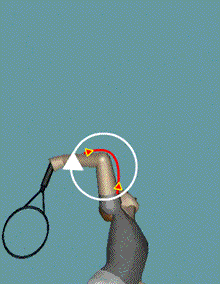
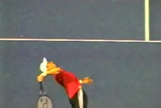

# The 3D Serve - Upward Swing - Part 2

**The 3D Serve: Upward Swing Part 2**

**Dr. Brian Gordon**

Our first article on the upward swing in the serve dealt primarily with
the role of the torso or trunk. We identified the \"cartwheel\" action
as most responsible for the transfer of forward angular momentum to the
hitting arm.

We then discussed ways to alter the rotational speed of the trunk by
changing its orientation in time and space. Finally we saw how the
possible variations in the use of the trunk affected the positioning of
the hitting arm at contact. ([Click
Here.)](The%203D%20Serve%20-%20Upward%20Swing%20-%20Part%201.docx)

We concluded that there are different ways to take the racket to the
contact point, and these differences are a function of a series of
specific joint rotations that can occur in different combinations.

But measuring and describing these components of the upward swing is
different from explaining how the upward swing is actually executed.

Joint forces and torques are the engines that transfer momentum upward
to the racquet. They drive the joint and segment rotations. But how do
players make these joint and segment rotations happen? Let's address
that in this article.

**How do players actually make the upward swing happen?**

Let's start with a basic distinction and see what parts of the motion
are driven by active muscle contraction and what happens as a
consequence of other motions, what we've called dependent motion
effects.

Finally, let's address some of the most common problems we see with the
upward swing in coaching. We'll see how our 3D analysis allows us to
pinpoint the problems and make subtle changes in the motion that can
have a significant impact on racket speed.

**The upward swing: the subject of conjecture and misunderstanding.**

**The Mystery**

**The movement of the racket to contact is the subject of much
conjecture and misunderstanding in the tennis world. It's not hard to
understand why. Just look at the many elements involved: upper arm
rotation, elbow extension, forearm supination and pronation, ulnar
deviation, and wrist flexion.**

We are talking about a very complicated motion. It is also a motion that
happens very fast. During the upward swing the racket head speed can
increase by up to 70mph in 1/10th of second. This is far too fast for
the naked eye to observe accurately. The motion is so complicated that
the full picture has yet to be fully described. Still, I believe we can
identify pieces of the puzzle that will help any player.

**How contraction causes joint rotations.**

**Active Muscle Contraction**

***The first step in the process is to understand the causes of joint
and segment rotation, what I call the \"engines\" of angular momentum
transfer.***

1.  **The first is active muscle contraction.**

2.  **The second is what we have called the motion dependent effect, or
    motion dependent torque.**

***What do I mean by active contraction? When a muscle is contracted,
it pulls on the adjacent bones. These bones are connected by a joint.
The muscle contraction creates torque, called a joint torque, which
causes the joint to either open or close.***

The animation shows how this mechanism works. The muscle in the
animation connects the forearm and upper arm. The arrows show what
happens when the muscle is shortened by a contraction. The result is the
rotation of one or both segments around the spanned joint. Put in simple
English, in this case, the elbow extends.

**How a Joint Force Causes Segment Rotation.**

**Motion Dependent Effects**

***[[The second engine is what I call the motion dependent effect. This
is a torque that is not created directly by muscular contraction. Rather
it is created by joint torques and joint forces elsewhere in the chain
of the motion.]{.mark}]{.underline}***

We introduced this concept when we discussed racquet drop in the back
swing. The animation shows how this works. In this hypothetical
scenario, a muscular joint torque (the circular yellow arrow) is used to
rotate the upper arm at the shoulder joint.

This rotation causes the upper arm to exert a force on the forearm at
the elbow joint (the red arrow). If the force is not directed through
the center of mass of the forearm (i.e. not aligned with the forearm
bone(s), the forearm will tend to rotate. The result of the application
of this force in the animation is that the elbow extends (the circular
white arrow).

Making sense of these motion dependent effects is difficult. Our
animation example here is actually over simplified, because there is
also a joint force acting on the forearm at the wrist which plays a
role. Another problem is that we don't as yet fully understand the
origins of all the joint forces.

**Investigate the causes of the joint rotations for yourself.**

Nonetheless without fully understanding how they are generated, I
believe it is still possible to examine the role of these joint forces
in the creation of the upward swing. My hope is this explanation well
shed some light on serve mechanics and answer some lingering questions
that all players and coaches ponder.

**Hitting Arm Kinetics**

It is critical that players and coaches have a basic understanding of
hitting arm kinetics when addressing stroke technique. This is because
every player will use his own combination of muscular contraction (joint
torque) and joint forces (motion dependent torque) to rotate the
segments of the hitting arm.

To aid in the understanding of the kinetics of the hitting arm segment
rotations, I've constructed an animation that allows the reader to
investigate the causes of the rotations. The animation uses the data
from my database of top college players.

For each hitting arm segment, you can select a rotation axis and a view.
The rotation axis is displayed as a red arrow originating at the segment
center of mass. The arrow corresponds to the joint axis of rotation (for
example, the flexion/extension of the elbow). Another red arrow rotates
around the axis. This rotating arrow simply describes a rotational
direction around the axis, a direction I'll call positive.

As discussed, kinetic sources of a segment rotation may include muscular
contractions around the joints at either end of the segment (proximal
and/or distal). An additional source can be the turning effect of joint
forces, again at either end of the segment.

**The complexity of the upward swing has to be understood segment by
segment.**

The bars at the top of the animation indicate whether these kinetic
sources tend to cause rotation in the direction of the red rotating
arrow (positive), or in the opposite direction (negative). A green bar
extending to the right indicates that the kinetic source is contributing
to the positive rotational direction, shown by the rotating red arrow. A
red bar extending to the left indicates that this source is contributing
in the opposite direction.

The rotational effect of the joint forces can be hard to visualize.
Therefore, the actual force at each joint is shown in the animation
where applicable. Its rotational effect can be visualized by thinking of
the arrow as a rope. Pulling the rope in the direction of the arrow can
cause the segment to rotate around its center and this is the turning
effect of that force.

This animation gives a real indication of how complex the kinetics
during the upward swing really are. Many individual components interact
to cause the motion we see. To make sense of it all, let's go segment
by segment and see how all these factors work together, starting with
the upper arm.

**Shoulder abduction: the upward and forward motion of the upper arm
from the shoulder joint.**

**Upper Arm Non-Twisting Rotation**

Upper arm rotation at the shoulder joint is driven primarily by
conscious muscular torque throughout the upward swing. Early in the
upward swing the elbow is both lifted (abduction: Y axis) and moved
forward (horizontal adduction: X axis). In both cases, the motion
dependent effect acts in opposition to the muscle torque.

Doesn't this mean the player is actually working against himself?
Actually, this phenomenon is beneficial to muscular force production.
The motion dependent torque allows the conscious contraction to occur in
slower conditions than it would otherwise. As pointed out earlier in
this series, muscle can produce more force if contraction is slower.

This is one of the scenarios often referred to by coaches as \"loading\"
\-- a muscle is pre-contracted\--or opposed in contraction\--due to
effects of other body motions. In the case of the shoulder, the loading
is a result of the joint force at the shoulder resulting primarily from
cartwheel and twisting rotation of the trunk.

**The sequence of external and internal rotation in the upward swing.**

**Upper Arm Twisting Rotation**

Early in the upward swing, the shoulder externally rotates even though
the internal rotator muscles are active. This is a continuation of the
pattern discussed at length in the backswing.

This pattern can be beneficial to muscle force production. Once internal
rotation is initiated, it activates components of the stretch-shorten
cycle. This internal rotation of the joint starts approximately half way
through the upward swing. Active muscle contraction drives the shoulder
internal rotation the rest of the way to contact.

Given the link between shoulder internal rotation and racquet speed
around contact, maximizing internal muscle torque seems important. With
3D measurement we can verify the attributes of this change from external
to internal rotation. But the efficacy of this transition can also be
inferred by looking at the back view of a server.

In the interface watch the stick figure from the back view (center). Now
step through the upward swing until the tip of the racquet reaches its
furthest position to the right. Note the angle of the racquet shaft. Is
it pointing directly downward or has it gone further? Higher level
players generally rotate past vertical to the court. The racket shaft
stays basically parallel to the tilt of their trunk. This indicates good
external to internal transition. Notice that our junior player has less
of a transition, with the racket tip pointing vertically directly down
at the court.

**Forearm rotation of the forearm during the middle and late portions of
the upward swing.**

**Elbow Flexion/Extension**

Rotation of the forearm at the elbow is important during the middle and
late portions of the upward swing. Early in the upward swing the
muscular torques are active, starting the extension of the elbow. There
is also a contribution from the joint force at the elbow.

***Past the midpoint of the upward swing, the contribution of the
joint force at the elbow becomes much larger as the rate of extension
increases.*** **[During this time, it is
interesting to note that the muscular driven joint torque at the elbow
changes to a flexion tendency.]{.mark}**

It is possible that during this time the extensor muscles can't keep up
with the rate of extension, creating an inhibiting influence on this
action. A second possibility, though less likely, is that the flexors
are used to control the rate of extension.

**[Either way, the mechanism links back to the actions of the trunk and
shoulder.]{.mark}** **[That is because they are the sources of the elbow
force driving elbow extension. This is an attribute of high level
performers, but is often lacking in developing players. In any case, as
the racket approaches contact, the muscle driven elbow torque once again
becomes the primary driver of elbow extension. Truly this is a complex
chain of events, that, remember is happening within that 1/10th of
second duration.]{.mark}**

**Initial forearm supination, followed by
pronation.**

**Pronation/Supination**

***In the popular literature, the term pronation is used to describe a
vast array of motions.*** **[These include the
turning of the racket after contact, and turning of the hand and wrist
at various points of the swing.]{.mark}** ***[[But anatomically, the
terms pronation and supination specifically refer to the twist rotation
of the forearm independent of the upper arm
rotation.]{.mark}]{.underline}***

***Forearm pronation is controlled by joint torque throughout the
upward swing.*** **[Initially in the upward swing,
the forearm tends to supinate. However this effect is slowed by a
pronator torque. This torque is responsible for the timing of the
forearm pronation, such that it begins closer to contact. The slowing of
supination through the pronator torque could represent another
application of the stretch-shorten cycle.]{.mark}**

**Upper arm rotation creates speed, pronation positions the
racket.**

**[Although pronation is a term that gets a lot of attention in
coaching, its impact is arguably much less than the upper arm in
creating racquet speed on the serve. *The fact is that much of the
forearm rotation observed by coaches is due to shoulder internal
rotation, and not independent forearm pronation.*]{.mark}** ***[[The
reality is that independent forearm pronation is used more for
positioning the wrist joint and racquet head than for generating racquet
head speed.]{.mark}]{.underline}***

**The Hand/Racquet**

***The hand and racquet are considered as a single segment in this
discussion. They rotate as a function of wrist joint
motion.*** The motion of the wrist during the
upward swing is (surprise) also complex. ***You may recall that wrist
extension was a significant contributor to racquet speed entering the
upward swing.***

**During the mid portion of the upward swing, wrist ulnar deviation
takes over as the most important wrist contributor to racquet speed.
This is the motion of the hand in the direction of the pinky finger.
This ulnar deviation is not caused by conscious contraction. It is
driven primarily by joint forces and their motion dependent effects.
These forces come primarily from the rapid extension of the elbow, as
the ulnar deviation occurs in tandem with this
extension.**

**Ulnar deviation, the wrist flex to the right, is motion
dependent.**

***Ulnar deviation has its greatest influence at the time elbow
extension is being driven by the joint force at the elbow. This means
that it is also driven by the actions of the trunk and shoulder that
actually create the elbow joint force.*** ***[[This
observation highlights how a seemingly simple joint motion can occur due
to an intricate pattern of body motions \-- motions that if not
understood by coaches can yield sub-standard or even dangerous
results.]{.mark}]{.underline}***

**Late in the upward swing, forearm pronation positions the wrist
flexion axis so that wrist flexion can have the biggest impact on the
forward component of racquet head velocity. And indeed, wrist flexion is
a major contributor to racquet speed near and at
contact.** ***The significant portion of this
flexion is caused by active and conscious muscular contraction and
associated joint torque. Motion dependent effects have an inhibitory
influence on this joint motion near contact.***

**Pronation positions the wrist flexion axis for maximum effect.**

**Implications of Hitting Arm Kinetics**

And there we have it: **upper arm motion, external and internal
rotation, elbow extension, ulnar deviation, pronation, and wrist
flexion. Some parts driven by contraction, others not, forces that come
from the hitting arm segment itself, and others from the previous links
in the biomechanical chain-all in that magic 1/10th of a
second.**

**So what does it all mean to players and
coaches?** ***[I believe the lesson is that the
tendency in coaching to focus on isolated pieces of the upward swing
should be reevaluated. Statements such as \"snap here\" or \"extend
there\" only make sense if made in the context of the overall motion and
with an understanding of the unintended consequences.]{.mark}***

**[[For every action, there is a reaction. Advice to initiate a muscular
contraction to move a joint in a certain way can actually do far more
harm than good if other factors throughout the body have not been
considered.]{.mark}]{.underline}**

**We have to keep this complexity in mind when we use great players as
models for our strokes. A top player may have an isolated observable
motion pattern that is predicated on many other factors that are not so
readily observable.**

**Angular momentum is generated from the ground up.**

***What we need to understand is the big picture. The serve is built
from the ground up. Angular momentum is generated from leg
drive.*** **This is optimized by body position,
and transferred to the hitting arm by timely use of conscious muscular
force.** ***The rotational body sequencing
produces motion dependent effects, which dictate further muscular
contraction \-- all this leads to contact racquet speed and direction.
Again, it's a complex picture and it's a mistake to isolate one or two
factors as the magic key to high performance
serving.***

**Common Upward Swing Problems**

We've covered a lot of issues in part 1 and part 2 of the upward swing.
Now let's apply what we've learned to some common upward swing
problems I see in coaching, and pose some possible solutions. In this
way perhaps we can see how technical analysis can actually come into
play in coaching practice.

***Despite the vast array of things that could go wrong, amazingly,
the common problems that actually occur are within a fairly narrow
range. And fortunately, we now have a clear way to gauge when problems
occur and in what specific part of the upward
swing.***

This is because, in our 3D data, the errors will nearly always manifest
themselves as irregularities, or plateaus, in the curve charting racquet
speed. So if the curve doesn't show smooth continuous acceleration, we
are suspicious the player may not have maximized his racket speed.

**The legs are key to transferring angular momentum during the
backswing.**

***These plateaus can occur as a result of insufficient, mistimed, or
nonexistent joint rotations in the kinetic sequencing of events. Care
must be taken to identify these errors early in development because they
are much more difficult to correct later. Worse, in many cases they can
also expose players to potential injury.***

**Insufficient Upper Trunk Twist Rotation**

Insufficient upper trunk twist is the most common error that can reduce
racquet head speed development by 10% or more. Further, it diminishes
the force placed on the upper arm at the shoulder joint, a force that,
as we have repeatedly seen, is important to the sequencing of the
various kinetic events.

**The biggest related problem is that if there is insufficient trunk
twist, this racquet speed source must be
replaced.**

***It turns out that the way players do is this is by adding
independent (non-twist) rotation of the shoulder joint. Repetitive and
excessive use of the shoulder joint in this fashion gives us concern for
injury.***

The causes of the insufficient upper trunk twist rotation can be traced
to problems in generating or transferring angular momentum during the
backswing. These problems generally relate to either timing problems in
the leg drive, or in the case of many junior players, insufficient power
in the required muscles. (This is why off court training is so
important.)

**A complex chain of interrelated actions: shoulder abduction, elbow
extension, ulnar deviation, internal shoulder rotation, wrist flexion.**

**Hitting Arm Motion Sequencing**

Let's review the chain of events for the hitting arm.

***First shoulder joint motion to elevate and move forward the elbow
joint.***

***Next there is elbow extension along with ulnar
deviation.***

***Finally there is internal shoulder rotation along with wrist
flexion.***

**Deficiencies along this chain have a negative impact on racquet
speed development, which we can see in the velocity
curves.**

**The most common breakdown in this chain at the beginning, [the initial
shoulder joint motion.]{.underline} Due to lack of strength or poor
technique, the elbow is never correctly positioned during the upward
swing. [This means it does not move upward and/or forward from the
shoulder joint.]{.underline}**

**[[This can happen for two reasons.]{.mark}]{.underline}**

**First, the elbow positioning occurs strictly as a function of trunk
rotation [without independent shoulder joint motion.]{.underline}**

**Second, the player [substitutes early elbow extension]{.underline} for
the independent shoulder joint movement.**

***[In the first case the result is that the orientation and direction
of the elbow extension reduces the contribution to racquet
speed.]{.mark}***

***[In the second case, the early elbow extension throws off sequence of
racket speed development.]{.mark}*** **[In effect, the elbow extension
is contributing at the wrong time. This creates a plateau in velocity in
the later stages. The effect of the elbow extension has been depleted at
the time it should be playing it's critical role. This leaves a void in
the middle portion of the upward swing.]{.underline}**

**The latter deficiency is often a result of an [unconscious effort by
the neuromuscular system to bypass a weak link]{.underline} - to
compensate for the absence of shoulder joint motion by substituting the
next link in the chain. But the effect here is always the same, [the
player ends up supplementing the late racket speed development with
extra non-twisting shoulder joint motion.]{.underline}**

**The X Factor: explosive internal shoulder rotation.**

**Shoulder Internal Rotation**

My experience has been that the ability to integrate explosive internal
shoulder rotation into the upward swing is the x-factor in developing a
high level serve. It has also been my experience poor utilization of
this resource dooms developing players to mediocrity.

To a large degree, developing a player's use of this action relates to
natural ability, although this can be enhanced significantly by a well
designed off-court training program. This is not the place to go into
the details of this type of training, although I plan to write more
about that later. But there is no doubt that regardless of the natural
ability to internally rotate the shoulder, the mechanics themselves play
an important role.

To review, **[the external rotation in the backswing, (which also
continues into the early upward swing) allows the use of a
stretch-shorten cycle.]{.underline}** **[This occurs when the internal
rotating muscles are used to slow the external rotation. This means the
internal rotators are activated and put on stretch before the actual
internal rotation of the segment begins later in the upward
swing.]{.mark}** Recall that the effectiveness of this mechanism can be
estimated by viewing the angle of the racquet in a back view. **[We want
to see the racket shaft in line with the angle of the
torso.]{.underline}**

**Racket to Arm Angle**

The configuration of the body segments near contact is also critical. No
amount of internal shoulder rotation will move the racquet forward
unless **[the proper racquet to arm angle is used. This angle is also
related to other angles in constructing the contact body
configuration.]{.mark}**

**The angle of the racket shaft in line with the angle of the
torso.**

This has been one of the main areas of emphasis in my work with the
junior shown in the user interface. To see the effect of improved
positions, select \"Compare Trials\" and the date 111106 in the left
margin of the interface.

Specifically, we have worked with our model player to decrease lateral
trunk tilt, and that has met with some success. In the comparison mode
select \"Display Angle View\" \-- then use \"Show Next Angle\" to toggle
through to the contact angles. It shows how the trunk is less tilted in
the more recent serve (49 vs. 44 degrees from the left horizontal).

Let's see how that relates to the critical hitting arm angle. Toggle
two more angles and notice the angle between the hitting arm and racquet
has decreased from 165 to 148 degrees. The result is that the
contribution of internal rotation to racquet head speed is increased.

Select \"Velocity Graphs\" from the \"Graphical Displays\" menu, then
select \"Upper Arm Twist Rotation\" in the selections below the graph.
The numbers show that the contribution to racquet speed from internal
rotation increased from 3 to 8 MPH. Still, 8 MPH is only 13% of the 62
MPH racquet speed so more work is needed.

The improved angle of the hitting arm to the racket has another benefit,
because it can also reduce the contribution of the non-twisting shoulder
contribution over the same interval. This can be verified by selecting
\"Shoulder Joint Motion\" also below the graph.

**The followthrough should gracefully slow the segments.**

**The Follow Through**

**[The foremost goal of the follow through is to gracefully slow the
segments so that injury can be avoided. To accomplish this, the range of
slowing should be made as long as possible.]{.mark}** Because slowing
the segments often requires contracting muscles that are lengthening
(eccentric contraction), the high forces involved should be spread over
the longest possible duration.

Of particular interest here is the shoulder internal rotation.
Post-contact, the external rotator muscles will be eccentrically
activated to slow the internal rotation. Because the body will attempt
to extend the duration of this slowing for safety, the position attained
can be readily observed and used as a rough indicator of the extent to
which internal rotation was used leading into contact. The hitting side
of the racquet face pointing at least towards the right sideline
indicates strong internal rotation.

The dynamic elbow extension advocated in this article comes with certain
risks. At the point of full extension, there can be extensive bone on
bone contact between the forearm and upper arm. The risk of joint damage
can be reduced by a technique seen in many players, but lacking in
others.

**[Research done in pitching discovered [a quick flexion of the elbow
following the rapid elbow extension into release.]{.underline} This
flexion combined with shoulder internal rotation already present,
decreases the magnitude of the bone on bone contact at full
extension.]{.mark}** My experience is that is something that often needs
to be trained. You can see this very readily in the Sampras motion where
the elbow bends almost immediately after contact and earlier than
virtually any other player.

**A quick elbow flexion can decrease the risk of injury following full
extension.**

***Recovery from the serve involves quickly regaining balance and
control of the body.*** This goal is in stark
contrast of the mechanics to create racquet speed which imposes
rotational chaos to the body. The amount of angular momentum that is
required to generate racquet speed will create a less than graceful
transition into the point if not dealt with in the recovery.

***In the same way angular momentum was transferred into the trunk
during the hitting phases, it can be transferred out during the recovery
phase. This is accomplished by redistributing the body momentum back to
the legs, and specifically the trailing leg.***

**[This is the reason for the leg kick back we see all the top players
used. The kick back transfers angular momentum to this leg causing the
rest of the body to rotate more slowly, and allowing smoother
recovery.]{.mark}**

**[The extent and direction of the leg kick also speaks volumes about
how angular momentum was generated earlier. It's a good key for
diagnosing what actually happened in the motion.]{.underline}**

- The lack of kick back indicates insufficient angular momentum to hit a
  big serve.

- A kick back to the side indicates too much lateral angular momentum,
  something that should be addressed immediately.

- The preferred motion is a strong, straight back
  kick. This indicates ample forward angular
  momentum.

**Parting Shots**

**The leg kick allows players to transfer angular momentum for smooth
recovery.**

My goal is initiating this series of articles was to begin bridging the
gap between the research concepts in tennis sport science publications
and the real world of player development. I tried to do this in two
ways. First, by trying to explicate some findings from my research and
those of others. Second, by showing how this work can be integrated in
the coaching work we do at our training facilities.

In this process I found myself walking a fine line between strict
mechanical precision and making the work comprehensible to players and
coaches with a wide range of backgrounds. To some extent this may have
been a zero-sum game. Some readers probably found it lacking adequate
technical specificity, while many others found it still quite
complicated. Nonetheless I believe we have succeeded in highlighting the
many factors and choices that go into constructing a high level serve
for yourself or for your players.

**One Note of Caution**

- **All these factors require dynamic patterns of motions.**

- **This brings me to a final word of caution, which is that mastering
  them requires preparation of the body in terms of strength,
  conditioning, and flexibility.**

- **If something feels as if it is causing you, or might cause you an
  injury, it probably will.**

- **Investigate this for yourself with your coach or a strength trainer
  and use your instincts and common sense before making radical changes
  in your motion in your desire to serve like a top pro.**

|  | Biomechanically Engineered Stroke Technique (BEST) is the |
|  | only empirically based stroke mechanics system in the world, |
|  | growing from three decades of both academic and applied on |
|  | court research. He is a founder of the Tennis Center for |
|  | Performance Research in Miami, Florida, which is creating a |
|  | new paradigm for player development. The center has assembled |
|  | an unprecedented group of specialists with cutting edge |
|  | knowledge across the entire range of tennis performance. |
|  |  |
|  | To visit his website, [**[Click |
|  | Here!]{.underline}**](https://tennisperformanceresearch.com/) |
|  |  |
|  | Top contact him directly, [**[Click |
|  | Here!]{.underline}**](mailto:gamabrian@icloud.com) |

