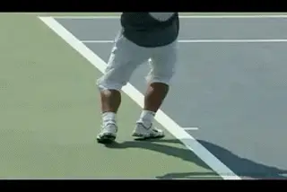
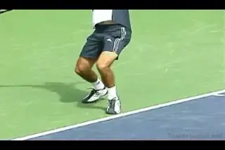

# The Backswing - Part 1

**The Backswing: Part 1**

**Dr. Brian Gordon**

{width="3.3333333333333335in"
height="4.5in"}

**The backswing; more complex than it looks, but with clear
benchmarks.**

**In my last article I covered the first phase of the serve, the wind up
([Click
Here](3D%20Technologies%20and%20Analysis%20-%20The%20serve%20wind%20up.docx)).**

Now let\'s move on to the second phase, the backswing. It may look
simple, but far and away, the backswing is the most difficult phase of
the serve to comprehend. So let\'s examine its components and see what
makes it so complex.

We\'ll also outline the conditions for maximizing the backswing in your
motion. Since there are a lot of issues to cover, we\'ll analyze the
backswing in two parts: part 1 in this article and part 2 to follow in
the next issue.

Before we start, let\'s review what we\'ve established so far. First we
divided the serve into 4 parts or Phases.

  -----------------------------
  **4 Phases:**
  -----------------------------
  1\. Wind Up

  2\. Back Swing

  3\. Upward Swing

  4\. Follow Through
  -----------------------------

In our previous article on Phase 1 or the Wind Up, we looked at various
techniques for both the upper and lower body motions. We saw that there
were pluses and minuses, but that varied techniques could lead to
success in the later phases.

{width="3.3333333333333335in"
height="2.2291666666666665in"}

**Wind Ups can be circular, abbreviated, or somewhere in between.**

First, we saw that the path of the arm and racquet in the wind up can be
viewed on a continuum from a pendulum, or semi-circular wind up, to a
fully abbreviated motion.

Second we saw that there are various possible footwork patterns. There
are two versions of the \"platform\" stance, either narrow or wide.
There are also two versions of the \"pinpoint\" stance, either standard
or lateral.

We saw that the choice of footwork has implications for several
important biomechanical characteristics of the overall motion. These
include the direction of the ground reaction force, the ending position
of the server\'s center of mass, the generation of forward angular
momentum, and the timing of the leg flexion and extension. ([Click
Here](3D%20Technologies%20and%20Analysis%20-%20The%20serve%20wind%20up.docx).)

{width="3.3333333333333335in"
height="2.2291666666666665in"}

**The range of footwork options in the wind up.**

The first article ends by describing several \"conditions\" or
\"benchmarks\" that are important at the end of the windup. My
conclusion was that all the options had potential to be effective if
executed correctly, assuming that they were within physical capabilities
of the player.

**[There are many ways to skin a cat]{.underline}**, and in my coaching
experience I can and have achieved higher benchmarks for different
players with differing techniques. Making these determinations is where
the data gives way to the art of coaching.

**The Backswing**

Now let\'s move forward to the second phase of the serve: the back
swing. What are the conditions or benchmarks you want to achieve as a
server at the end of the backswing phase? As an example, we\'ll use the
serve of the same junior player we saw in the first article. Again, you
can access the 3-D data on his motion through the interface below.

**[[As I define it, the back swing begins at the start of the looping
motion with the racquet, that is, when the racket starts to move
downward, or possibly forward, toward the racket
drop.]{.underline}]{.mark}** **[The backswing concludes when the racquet
face center reaches its lowest point, or the point closest to the
court.]{.mark}**

Determining the exact start of the backswing, or the transition point
from the wind up to the backswing, is somewhat subjective. In the
animation, Andy Roddick for example, looks very different at the start
of his backswing compared to a player with a traditional motion like
Mario Ancic.

{width="3.3333333333333335in"
height="2.2291666666666665in"}

**How far the racket travels during the backswing varies with windup
style.**

But determining the end of the back swing is more concrete. This is
because we can quantify the lowest point of the racquet path with our 3D
measurements.

Why is the backswing the most complex phase? **[In the other phases, the
actions of the upper and lower body are independent, at least to some
extent. No such separation is possible in the back swing. [The actions
of the upper and lower body movements must be coordinated very
precisely.]{.underline}]{.mark}**

By this I mean **[[coordinating the timing of the movement of the arm
and racket and the timing of the leg drive.]{.underline}]{.mark} [[Our
research shows that to maximize the benefit for the server, the arm and
racket motion and the leg drive should start and end at the same time.
This means that they must also have the same duration. This close
synchronization is characteristic of all high level service
motions.]{.underline}]{.mark}**

The coordination of the backswing and leg drive is difficult to verify
with the naked eye, or even with conventional video. If we look at the
stick figure of our junior player in the interface, it may appear that
his timing matches the top servers. But, if we look at the data, **[[it
reveals there is actually a discrepancy that we can
measure.]{.underline}]{.mark}**

{width="3.3333333333333335in"
height="2.2291666666666665in"}

**The correlation of the racket drop and leg drive is difficult to
verify.**

For our player, the data shows the **[[backswing and leg drive are
slightly out of sync, with the timing of the arm and racquet motion
slightly ahead of the leg drive.]{.underline}]{.mark}** In other words,
arm and racquet motion starts before the leg drive, and ends while the
leg drive is still ongoing. The problem here is that if the arm motion
starts before the leg drive, the player may not fully utilize the push
against the ground in contributing to the early speed of the hitting arm
and racquet.

This type of measurement is one of the advances in coaching that
quantitative analysis can offer. It provides a very precise benchmark
that players strive toward, plus a concrete way to validate when they
have achieved it.

The question for our player, and many others with similar timing
problems, is what causes the leg and arm to go out of sync? And how can
it be corrected? This is where the complexity sets in.

**[[To answer this we have to go back to something we addressed in
Phase 1. This is the nature of the transition between the wind up and
backswing phase.]{.underline}]{.mark}**

{width="3.3333333333333335in"
height="2.2291666666666665in"}

**The transition from windup to backswing affects the timing of the leg
drive.**

**[In the last article we saw that the transition between the phases
could be either a continuous transition or a hesitation transition. [In
a continuous transition, the racket moves from the wind up to the
backswing at continuous or at an accelerating pace. With the hesitation
transition, the racket slows down or even
hesitates.]{.underline}]{.mark}**

Either transition can be fine. It\'s a matter of how the transition
affects the coordination of the timing of the arm and racquet with the
timing the leg drive.

Timing problems here can propagate into the upward swing. This ripple
effect is a real danger with some abbreviated motions in which the arm
and racquet are positioned lower to the hitting side of the body at the
start of the backswing.

We saw in the last article that our player had a continuous transition.
But in his specific case, we found his transition caused his hitting arm
to outrun the leg drive. His racquet is moving into the backswing at a
speed which makes it difficult for him to synchronize his arm with the
leg drive.

{width="3.3333333333333335in"
height="4.59375in"}

**An example from our research of the leg drive outrunning the racket
drop.**

For our server, luckily, this timing issue is a relatively minor problem
since he is only slightly out of phase. It can be solved by a slight
adjustment in the speed of the racket at the end of the wind up or by
manipulating the leg drive timing.

**[The timing problem can be more severe, however, when the leg drive
ends before the arm and racquet reach their end of back swing position.
In this case the influence of the leg drive on the hitting arm motion is
reduced significantly.]{.mark}**

This problem can be an unintended consequence when players adopt an
extreme abbreviated windup on the model of Andy Roddick. The reason is
the racquet must travel further from the start of the abbreviated
backswing position. Roddick is able to pull this motion off, but if the
player is unable to complete the backswing on time, the leg drive will
run ahead of the racquet and arm.

**[The most direct result of this problem is that the latter part of the
racquet drop occurs while legs are no longer pushing against the
ground.]{.mark}** The consequence is a loss of racquet head speed and a
decrease in the depth of the racquet drop at the end of the back swing.
The exact relationship between these benchmarks and the leg drive will
be covered in the next article.

**The Three Roles of the Leg Drive**

So, again, maximizing the influence of the leg drive requires precise
timing between the motion in the upper and lower body. Now let\'s get
more specific about the nature of these upper and lower body motions and
what they should accomplish from a mechanical perspective.

We\'ll start with the lower body or legs and address their role in the
remainder of this article. Then we\'ll move on to the upper body action
in the second backswing article next month.

**[The leg drive has three primary roles during the back swing. These
are:]{.mark}**

1.  **[the acceleration of the body in the vertical direction;]{.mark}**

2.  **[the creation of forward angular momentum,]{.mark}**

3.  **[and assistance in rotating the hips.]{.mark}**

**Vertical Acceleration of the Body**

**The role of the legs in vertically accelerating the body is the
easiest concept to understand. If you push down on the ground with the
legs, your body\'s center of mass will rise vertically in response. For
most servers this means you will leave the ground.**

{width="3.3333333333333335in"
height="4.96875in"}

**The red arrow shows the force placed on the upper arm by the motion of
the trunk. Part of this comes from vertical acceleration of the body via
the leg drive.**

The vertical acceleration of the body is proportional to the size of the
vertical component of this ground reaction force. The stronger the leg
drive, the greater the acceleration. (Assuming that the ground force is
acting in the same direction in both cases.)

The ground force can be measured in terms of pounds of force. We can
then compare this to the body weight of the player. Based on our
database of elite servers, we believe that a ground force equal to twice
the bodyweight of the player is a minimum goal. High level servers can
generate ground force values between 2.5 \-- 2.8 times their own
bodyweight.

Again, this is where quantitative analysis can help players by supplying
a measurable bench mark, in this case, a way to evaluate how changes in
technique are affecting the amount of ground force the player generates.

So how is our subject doing? The estimate of the size of the vertical
ground force he is generating can be found in the \"Data Options\" under
\"Angular Momentum\". The table below the graph shows the highest
measured value during the leg drive on line 3.

Our player is generating a ground force equal to 1.9 times of his
bodyweight. So that value is slightly below our minimum.

In the wind up article, I explained the foot placement adjustment we
made with this player. The goal of this adjustment was to attempt to
elicit more vertical ground force reaction.

Specifically, I mentioned that we asked him to keep his feet closer
together during his set up and leg drive (narrow platform). This
suggestion was based on the intuition and experience of our coaches, and
resulted in an improvement in the ground force profile, something we
were able to measure and share with our player.

This change in the stance, combined with the proper timing and the
amount of his leg flexion and extension, was the best technical solution
for this player at this time. Since his value is still somewhat low, our
belief is that more improvement will require power training in the
weight room.

Why is this vertical acceleration so important? First, this acceleration
can lead to a higher contact point, which improves the chances of
directing a high speed serve into the service box.

{width="3.3333333333333335in"
height="3.46875in"}

**The ground force causes forward angular momentum when directed behind
the center of mass.**

But a second important reason is that the vertical acceleration of the
body is linked to vertical acceleration of the hitting shoulder joint.
This generates forces which are applied to the hitting arm and which
turn out to be critical for an effective racquet drop. More on this in
the next article.

**Forward Angular Momentum**

**[The second role of the leg drive is in the creation of forward
angular momentum. Forward angular momentum means body rotation around an
axis passing through the center of mass and parallel to the baseline. An
important attribute of body angular momentum is that it can be
redistributed to the various segments along the biomechanical chain,
potentially increasing the speed of rotation of these segments about the
same axis.]{.mark}**

{width="3.3333333333333335in"
height="2.2291666666666665in"}

**The \"Cart Wheel\": the forward rotation of the trunk, along an axis
parallel to the baseline.**

**[The most important redistribution of this momentum early in the back
swing is into the trunk. This results in forward rotation of the trunk
relative to the legs.]{.mark}** This rotation may also be enhanced by
the backward lean of the trunk at the end of the wind up. **[[The trunk
rotation at this point is often described as a \"cartwheel\" rotation
because the body and trunk are generally oriented sideways to the
net.]{.underline}]{.mark}**

Our measurements show that the direct contribution of body forward
angular momentum to racquet speed at contact is a modest 5 \-- 10 %.
However, there is a major indirect benefit. This is because the creation
and redistribution of forward angular momentum has a beneficial
influence on the segmental sequencing of the motion in the upper body,
as we\'ll see in a later article. ***[[For this reason, it is important
to generate as much forward angular momentum as
possible.]{.underline}]{.mark}***

The lion\'s share of forward angular momentum generated during the serve
is generated during the back swing. As the player pushes on the ground
with the legs, a reactionary ground force then pushes back on the body.
**[If this force can be directed [behind]{.underline} the body center of
mass (as seen from the side along the baseline), the player adds more
forward angular momentum to that generated already during the wind
up.]{.mark}**

{width="3.3333333333333335in"
height="2.2291666666666665in"}

**For our player a narrower platform increased the push from the
ground.**

**The direction of the ground force, the size of the ground force, and
the position of the body center of mass during the leg drive are factors
that determine how much angular momentum is generated. [[But to a great
extent, the player\'s ability to generate these factors in the backswing
is also related to what happened in the previous or first phase, the
wind up.]{.underline}]{.mark}**

{width="3.3333333333333335in"
height="2.2291666666666665in"}

**The third leg drive contributor is hip rotation.**

Based on the stick figures the foot positioning is similar and therefore
it is also reasonable to assume that the direction of the ground force
is similar between the two measurements.

This improvement can be attributed to decisions on stance. The narrower
platform stance influenced the direction of the ground force by making
it more vertical. We stayed with a version of the platform stance
because of the improved effectiveness of the muscle contractions when
extension immediately follows the flexion, compared to the pinpoint
options.

**[Another reason for narrowing the platform stance was to allow the
center of mass to be more forward. These two factors\--the improved
vertical ground force and the forward movement of the center of
mass\--explain the increased forward angular momentum.]{.mark}**

**Hip Rotation Assistance**

**The third contribution of the leg drive is to aid hip rotation. [[The
dominant angular momentum component on the serve is forward. We need to
keep in mind, however, that rotation about the other axes is also
important. Of particular interest is rotation about the axis passing
through the center of mass that is perpendicular to the
court.]{.underline}]{.mark}** [I will refer to momentum around this axis
as **[\"spin momentum\".]{.underline}**]{.mark}

**[Like forward angular momentum, spin angular momentum is also
generated in the body by pushing on the ground with the legs to elicit a
horizontal ground reaction force component.]{.mark}** **[[This spin
angular momentum can also be redistributed to the other body segments.
An important portion of this redistribution is to the hips, creating
spin rotation of the hips.]{.underline}]{.mark}**

**[[Rotation of the hips on the serve is important primarily because
this in turn impacts the rotation of the upper trunk or
shoulders.]{.underline}]{.mark}** **[Rotating the hips increases the
overall range of shoulder rotation. Rotation of the hips also allows the
upper trunk rotating muscles to contract in slower more favorable
conditions.]{.mark}**

The animation illustrates how this is accomplished. Both diagrams show
90 degrees of rotation by the shoulders. But in the first diagram, there
is no hip rotation. In the second diagram the hips rotate 60 degrees and
the shoulders rotate an additional 30 degrees relative to the hips.

This is still a total of 90 degrees of shoulder rotation, but in this
second case, two thirds of the shoulder rotation is coming from the
rotation of the hips.

If these rotations occur in the same amount of time, the upper trunk
rotating muscles would be responsible for all 90 degrees of rotation in
the first case. But in the second case, this is only 30 degrees. This
indicates that the contraction speed in the first case was much faster.
We know this because the muscles generated the additional 60 degrees of
rotation in the same time internal.

**[In biomechanics, a basic fact is that a muscle produces less force
with a faster contraction speed.]{.mark}** So it is evident that from a
mechanical perspective hip rotation is important. It allows the muscles
that rotate the shoulders to contract at a more optimal speed.

The question becomes how do servers rotate the hips in order to do this?
The diagram shows all the factors that go into hip rotation towards
contact. Generally these include contracting the muscles crossing the
hip joints, or using leg extension to force the pelvis to rotate.

Although more research is still needed in this area, my belief is that
the back leg extension plays the major role in generating this hip
rotation by forcing the pelvis to turn. It does this by pushing the
right side of the pelvis forward. There are two different pieces of
evidence we can examine that support this conclusion.

The first piece of evidence is that the center of mass is located more
over the front foot than the back foot during the back swing. Because of
this, the horizontal component of the ground force coming from the back
foot will tend to be much more effective in creating spin momentum of
the body, and therefore rotation of the hips. This is because it located
further from the center of mass.

{width="3.3333333333333335in"
height="2.2291666666666665in"}

**Horizontal ground force from the back foot creates hip rotation.**

The data shows that the greatest increase in hip rotation speed occurs
during the back swing phase. This increase occurs as the legs begin to
extend from roughly the same angle (95 degrees for one leg and 96
degrees for the other.)

But the data shows that by the end of the back swing the back leg has
extended more. Since the time of extension is the same, it follows that
the back leg has extended more quickly. This is what causes the back
foot to leave the ground before the front foot, something that can also
be qualitatively verified by the leg action clips on the serve in the
Stroke Archive. (Click Here.)

Why would the back leg extend more quickly? One possible explanation is
that the server simply pushed harder with the back leg than the front.
Another possible explanation is that the push was of equal strength but
that the back leg was pushing against less resistance.

This would be the case if more of the back leg push was being used to
generate spin momentum. The reason this is possible is that the body is
much less resistant to rotation (inertia) around the \"spinning\" axis
compared to the other axes.

{width="3.3333333333333335in"
height="2.2291666666666665in"}

**The back leg encounters less resistance and leaves the ground first.**

**[Put simply, it is easier to spin the body and hips than it is to
rotate the entire body forward and over in the \"cartwheel\"
rotation.]{.mark}** **[[The back leg is pushing against the hips,
encountering less resistance, and therefore extending more quickly and
leaving the ground sooner.]{.underline}]{.mark}**

Of course the time interval between the back foot and front foot leaving
the court varies among the pro players. But I believe that the greater
the premium placed on hip rotation speed in the motion of a particular
player, the earlier the back foot will leave the ground relative to the
front foot.

**[[The role of the back leg push in generating hip rotation can be
enhanced by changes in the stance, by placing the foot further behind
the front foot in a wide platform, or more to the side of the front foot
in a lateral pinpoint.]{.underline}]{.mark}**

Does this mean that extensive hip rotation from use of the rear leg is
the necessary key to a more effective serve? Not at all. And remember,
we took the opposite tack with our junior player in narrowing his
platform stance.

{width="3.3333333333333335in"
height="2.2291666666666665in"}

**Hip rotation: one of the myriad factors that contributes to effective
serving.**

***[[Hip rotation is only one of the myriad, interrelated biomechanical
factors in elite serving. With our player we chose a different stance
option to increase forward angular momentum, probably at the expense of
spin angular momentum.]{.underline}]{.mark}***

**[Our research shows that there are trade offs with many technical
options in each of the phases of the serve. Quantitative analysis
provides us with an evaluation process of the pluses and minuses of all
these options for a given server.]{.mark}**

This gives coaches the courage to follow their intuition because they
can evaluate the impact of their various technical experiments. This
process, applied over the long term, is likely to help players truly
maximize their potential.

More in the next article on how the upper body interacts with legs in
the backswing phase. Stay tuned.

+----------------------------------------------------------------------------------------------------------------------------------------------------------------------------+---------------------------------------------------------------+
| {width="1.9626870078740157in" | biomechanics of high level tennis technique. His              |
| height="2.525699912510936in"}                                                                                                                                              | Biomechanically Engineered Stroke Technique (BEST) is the     |
|                                                                                                                                                                            | only empirically based stroke mechanics system in the world,  |
|                                                                                                                                                                            | growing from three decades of both academic and applied on    |
|                                                                                                                                                                            | court research. He is a founder of the Tennis Center for      |
|                                                                                                                                                                            | Performance Research in Miami, Florida, which is creating a   |
|                                                                                                                                                                            | new paradigm for player development. The center has assembled |
|                                                                                                                                                                            | an unprecedented group of specialists with cutting edge       |
|                                                                                                                                                                            | knowledge across the entire range of tennis performance.      |
|                                                                                                                                                                            |                                                               |
|                                                                                                                                                                            | To visit his website, [**[Click                               |
|                                                                                                                                                                            | Here!]{.underline}**](https://tennisperformanceresearch.com/) |
|                                                                                                                                                                            |                                                               |
|                                                                                                                                                                            | Top contact him directly, [**[Click                           |
|                                                                                                                                                                            | Here!]{.underline}**](mailto:gamabrian@icloud.com)            |
+============================================================================================================================================================================+===============================================================+
