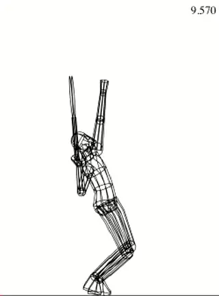

# The Backswing: The Upper Body

**Part 2**

**Dr. Brian Gordon**

In the last article, we examined the role of the lower body during the
back swing ([link](The%20Backswing%20-%20Part%201.docx)). Now
let's move on to the upper body motion in the backswing. This includes
the movement of the trunk, the hitting arm segments, and the racquet
itself.

**What are the real factors that create racket speed in the backswing?**

**[The ability to generate racket speed in the back swing is one of the
main differentiating factors at all levels of play, including
professionals.]** So let's take the backswing motion apart and
see what we can learn from our quantitative studies.

Then let's see how we can apply this knowledge in player development,
using the example of our young player's serve from the previous
articles, and the data provided on his service motion in the 3D
interface below.

**4 Goals**

**To begin, let's identify the four primary upper body goals of the
backswing.**

1.  **[The first goal is to have all of the joints in configurations
    that provide for optimal range of motion in the upward
    swing.]**

2.  **[The second goal is to have the muscles surrounding those joints
    in the best contractile conditions possible.]**

3.  **[The third goal is to attain the lowest possible position of the
    racquet face center at the end of the back swing.]**

4.  **[The final goal is to generate the highest possible racquet speed
    as the racquet starts its upward trek.]**

**How do \"motion dependent effects\" drive pro backswings?**

**The Motion Dependent Effect**

The goals are clear, but achieving them is another story. To understand
what is really going on, we have to learn more about how the body moves
in this phase of the motion.

One of the major findings in our research is that **most of the goals
in the backswing are achieved through what are called \"motion dependent
effects.\"** What this means is that **nearly all
the arm motion, especially in the second half of the backswing, is the
result of motion in other segments of the body.**

Put another way, **the various rotations are not caused by active
muscle contractions, but instead by joint forces arising from the motion
of the other segments. This is why we call them motion dependent
effects**.

In my opinion, ***[the way these motion dependent effects work in the
back swing is the most mechanically interesting set of motions in
tennis.]***

**[[The motion dependent effect, or] [joint movement without
active muscular contraction], is an important source of
motion in all strokes.]** ***[On the serve backswing, the main
cause of this effect is [the motion of the trunk], [which
results in a force being placed on the upper
arm.]]*** To understand this force, it is necessary
to take a detailed look at trunk motion during the backswing.

I've already established **a link between the lower body and upper
body with the discussion of hip rotation** in the
last article. **The legs drive the hip rotation, which facilitates an
upper trunk (shoulder) twisting rotation, that occurs around the
spine.** ([link](The%20Backswing%20-%20Part%201.docx).)

***In the back swing, this upper trunk twist helps in driving the
motion of the hitting arm.*** As we will see in
future articles, this is also linked to a significant part of the
racquet speed in the upward swing.

**Note the subtle additional backward lean during Pete's backswing.**

**The twisting rotation of the upper trunk is not, however, as simple as
it appears. It's effectiveness in driving the motion of the hitting
arm, especially late in the back swing, is related to the angle of the
trunk at the end of the backswing.**

As we have seen, **the server's trunk inclines or leans backward (as
seen in a back view) during the windup as a function of the knee
bend.**

**This lean increases during the back swing, causing a shift in the
angle of the torso.** The increase in this angle
that can be difficult to detect with the naked eye, or even with the use
of video, but can be measured in 3D dimensional analysis.

Although it is subtle, this increased lean, or tilt, is critical in
driving the motion of the shoulder. **It is what allows the upper
trunk twist to drive the shoulder forward and upward. Without the tilt
there would be no upward motion, only the forward component. The upward
component, however, is a critical part in creating racket head
speed.**

To create the additional lean, the player initially leans back slightly
at the hips and/or extends the spine. Then, as the body turns into the
shot and faces more forward later in the backswing, the tilt continues
to increase due to a lateral (sideways) bending in the spine to the left
side. This bending is referred to a \"cartwheel rotation\" of the trunk.

So, **the twisting rotation of the upper trunk\--a critical component
of high level serving\--occurs around an axis that is not vertical, but
rather tilted to the left. This tilt, or angle, is what allows the
twisting motion to elevate the hitting shoulder later in the
swing.** This elevation is often attributed to the
cartwheel rotation of the trunk. However, its primary cause is the upper
trunk twist once the body has achieved the proper angle of incline.

**The backswing is a motion dependent effect, [driven mainly by forces
from the legs and the trunk twist.]**

A quick reference to the data interface and our example player shows
more about how this occurs. It is directly related to the position of
the player's center of mass.

Looking at the stick figure in the center (the pure back view), we can
see that the center of mass, which is near the line of the trunk and
about one third of the distance from the mid-hip to the mid-shoulder, is
slightly to the left of the feet.

**This leftward position of the center of mass causes the body to lean
progressively further backwards as the leg drive
occurs.** This is due to lateral angular momentum
generated by the ground force from the leg drive. *[The lateral momentum
is shown by the yellow arrow in the animation.]* This momentum is
transferred to the trunk, which causes it to increase its lean during
the back swing.

In general, considerable variation is seen in the amount of trunk lean
players use at all levels. There are pros and cons associated with
varying degrees of trunk lean as we will see in the upward swing phase.
Players that choose more tilted configurations often use a lateral
pinpoint stance as that shifts the ground force even further to the
right in a back view.

The tilted configuration of the trunk also plays an important role in
the ability to maintain twisting rotation speed once the server loses
contact with the ground, as we will see, as well as dictate hitting arm
segment orientations near contact.

**[The timing and speed of these critical actions, combined with
vertical effects from the leg drive, [result in motion of the shoulder
joint]. This in turn affects the motion of the hitting arm
and racquet, which we will now look at in detail.]**

**Note the subtle additional backward lean during Pete's backswing.**

**The Hitting Arm and Racquet**

When we look at the various shapes of the backswing, we see a continuum
of almost infinite possible variations. But for the sake of conceptual
simplicity, we can define two general categories. These have to do
mostly with the amount of flexion or bend at the elbow as the racket
starts downward.

**Alpha Loop**

**[The first backswing shape is what I call the \"Alpha Loop,\" named
after the Greek letter \"a\" turned upward.]** In the Alpha Loop,
as the racket starts to move downward, the elbow bend increases and
there is a pronounced forward movement of the tip of the racket (that
is, forward toward the target).

Watch in the animation as the player flexes his elbow forward, tilting
the racket head at an angle toward the target. This downward racket path
is on an arc that resembles the shape of the Greek letter \"a\" or
\"Alpha.\"

Both the forward and the downward movement of the racket in the Alpha
backswing have a positive impact on the racquet head speed at this point
in back swing. Specifically elbow flexion and wrist radial deviation,
are linked to the forward component of the racquet speed.

Note that these both have positive impact on the racquet head speed
early in the back swing. And while they help with racquet speed, these
actions also prepare the joints for increased range of rotational motion
in elbow extension and ulnar deviation in the upward swing.

**The shape of the loop is determined by forward racket movement.**

**Gamma Loop**

Some servers possess much less of a forward component in the motion as
the racket starts down. This narrows the shape of the loop. I call this
second general backswing shape the \"Gamma Loop\" pattern after the
Greek letter \"g\" (which may appear inverted).

At the start of the Gamma Loop, watch how the elbow flexion stays
unchanged, with the forearm at about 90 degrees to the upper arm. As the
drop starts, watch the player's hand. Compared to the Alpha Loop, the
hand in the Gamma Loop starts down more steeply. The racket tip points
more to the side as the racket starts down, instead of pointing directly
forward.

This pattern is more prevalent with servers who have lower elbow
positions at the start of the backswing, and with players whose hitting
arm and racquet structure is more side of the body \-- both common
attributes of abbreviated back swings.

**External Rotation**

**In both loop patterns, the most important motion is external
rotation of the shoulder.** \"External rotation\"
is a concept that has become increasingly prevalent in the discussions
of high level serving. But what is it, and how is it achieved?

Take a look at the motion in the animation. (Note this is a graphic
recreation of the pure loop shapes, not a representation of actual
data.) Look at the motion of the upper arm, forearm, hand, and racquet.
The backward rotation of the arm and racquet at the shoulder joint is
due to external rotation. As the arm and racket rotate externally\--or
backward in the shoulder joint\--the racket drop happens as a
consequence.

How does the server achieve this? It is reasonable to assume that if a
server contracted the muscles surrounding the shoulder joint in the
direction of the external rotation, he could cause the external rotation
motion to occur. In reality though, this isn't exactly the way it
works.

**The relationship between the forces on the shoulder and external
rotation.**

Instead, the majority of the external shoulder joint rotation, and
therefore the racquet drop, is a result of the motion dependent effect
described earlier. The actual mechanism is shown in the animation. Look
at the red arrow. This represents force applied to the upper arm through
the shoulder joint. This force is the result of motion of the trunk,
motion directly or indirectly tied to the leg drive.

**As the shoulder accelerates in the direction of the red arrow, force
is applied to the upper arm causing the forearm, hand, and racquet
\"lag\" behind.** **[This causes the backward or
external rotation of the upper arm and the downward movement of the
racket depicted by the green arrow in the animation.]**

Again, most of this joint rotation can occur with little or even no
contributing muscle activity. We saw in the first part of the backswing
article [link](The%20Backswing%20-%20Part%201.docx) that there
are two types of transitions from the wind up to the backswing. These
are a Continuous Transition and a Hesitation Transition.

In the case of a Continuous Transition, the external rotation from the
wind up actually carries the racket over the top so that it starts on
way down already possessing external rotation. With a Hesitation
Transition, there is some amount of conscious muscle contraction. But
once the racket tip starts to drop, the rest of the external rotation
comes from the motion dependent effect.

So let's see more specifically the complex interplay that drives the
backswing. We'll do this by breaking the motion into 3 parts, each
covering roughly the same amount downward motion in the racket tip.

**The First Third**

**Trunk twist drives the first third of the backswing.**

**[The first third of the downward racquet motion starts with the racket
in the trophy position and continues until the racket travels about a
third of the way down the backswing, pointing (from a rear view) to
roughly at 10:00 on the face of a clock.]**

Again, this motion can be in the shape of either a Gamma or an Alpha
loop. **Either way, shoulder external rotation is the most important
aspect of this motion in both loop patterns.**

This rotation occurs as a result of several contributing sources. For
some servers, this rotation is initiated partially by active muscular
contraction. This is usually the case with the player uses the
hesitation transition from the wind up to the backswing.

However, if the server has already built external rotation while moving
through the trophy position, the role of conscious contraction is
reduced or even eliminated. This is typical of players with a more
continuous transition.

**Regardless of the early presence of this conscious contraction, the
main impetus for the (non-muscular) external rotation of the shoulder is
the twisting rotation of the upper trunk and the force this applies to
the arm at the shoulder joint.**

**[This trunk twist creates much of the motion dependent effect that
drives the racket and hitting arm downward.]** This is evident
from the animation combining the serves of nine NCAA Division I players.
**[The red arrow depicts the size and direction of the force applied to
the upper arm.]**

***As the first third of the backswing progresses, notice how the
direction of the shoulder force assumes a more horizontal orientation.
This orientation is more in the plane of the shoulders indicating the
importance of upper trunk twist.***

Understanding this mechanism is critical for coaches in learning how to
increase the effectiveness of the backswing in the serve. You may recall
from the previous article, that the timing of the leg drive was critical
to the development of racket speed in the back swing. In the first
third, its importance relates to the leg's influence in generating spin
momentum and hip/trunk rotation.

You may also recall that our young player, whose data we have been
studying in the 3D interface, started his leg drive late, perhaps
mitigating to some extent the benefit of the force from upper trunk
twist in generating shoulder external rotation. We found that this late
leg drive was caused by issues related to the timing of his transition
from the wind up to the backswing.

**Second Third**

The second third of the backswing motion takes the tip of the racket
from **[roughly 10:00 to 8:00 on the face of a clock as seen from
behind.]** The arm action in this second third of the back
swing continues to be almost entirely external or backward shoulder
rotation.

But due to the configuration of the hitting arm in this second third of
the motion, the role of the twisting rotation of the trunk in driving
this motion is reduced. This is because the hitting arm and racquet are
positioned closer to the plane of the shoulders.

**For the motion dependent shoulder force to continue driving the
racquet downward with the arm in this position, the force must become
more vertical. This is in fact what we see in the NCAA player composite
animation during the second third.**

|  |
|  |
| **In the second third of the motion, the legs drive the racket downward.** |

To understand the origin of this vertical influence, we must recall what
trunk motion occurs at this time. There are two factors consider. The
first, is the leg drive, which is certainly contributing to the vertical
acceleration of the entire body, and therefore the trunk.

**In addition to the legs, there is also another potential
contributing factor. This is the so-called \"cartwheel\" trunk
rotation.** This rotation is also contributing to
the upward shoulder motion, and therefore also contributing to driving
the racket downward.

  ------------------------------------------------------------------------------------------------------------------------------------------------------------------------------------------
                                                              
  ------------------------------------------------------------------------------------------------------------------------------------------------------------------------------------------
                                                      **The external rotation in the backswing puts the internal rotators on stretch.**

  ------------------------------------------------------------------------------------------------------------------------------------------------------------------------------------------

**Role of the Muscles?**

So clearly the motion dependent effect is critical in the second third,
but what about active external muscle contraction? My research, in
support of previous findings of other researchers, indicates that not
only are the muscles not aiding racquet drop through contracting
external rotators, the muscles are actually attempting to internally
rotate the shoulder in the opposite direction through contraction of
internal rotating muscles. This may seem surprising, but actually it is
probably a critical factor in creating racket speed.

**Let's see how this happens.**

The NCAA player composite animation illustrates the relationship here.
The rotating arrow drawn around the upper arm shows the average
direction of the muscle pull during the backswing. The yellow color
indicates the muscles are pulling in the direction of external rotation.
When the arrow direction and color change to red this indicates the
muscles are pulling in the direction of internal rotation.

Why would this be the case in high level serving? The internal rotating
influence indicates that the muscles are being stretched even as they
attempting to shorten or contract in the opposite direction. Muscle
physiology tells us that this condition can be beneficial to muscular
force output. We call this a ***\"stretch shorten
cycle.\" [Stretching the muscles in the opposite
direction can increase the force they generate when they eventually
succeed in shortening.]***

***[The speed of this stretching effect is also important. In general
[the faster the contracting muscle stretches, the better the enhancement
to subsequent force production.]]*** ***But
mechanics research seems to indicate that it is important to spread the
duration of this stretching sufficiently to prevent
injury.***

**Does the speed of Andy's backswing increase the stretch in the
internal rotators?**

***This is how the leg drive functions in the motion, allowing the
contracting internal rotators to stretch a fast rate, but also keeping
this rate within safe limits.*** This is why the
timing of the leg drive is so important. If it is exhausted too soon,
the stress on the shoulder may reach unsafe levels.

Research done at the Olympic games showed that when the leg drive was
reduced, there was more loading on the shoulders among professional
players.

***[Without enough leg drive, creating the full racket drop requires
active muscular contraction to externally rotate the shoulder. Players
[who limit the use of the legs] or [end the leg drive too
soon] may end up using conscious contraction to abruptly
reverse the motion and [shift to the internal rotators to bring the
racket upward]. The result is very high force applied in a
very short time. [The subsequent loading can exceed the estimated force
threshold that leads to injury.]]***

This mechanism provides one potential explanation of how Andy Roddick
generates so much racket head speed. By taking his hitting arm and
racket out to the side in his windup, Roddick sets the stage to move
through the backswing very quickly. This increases the speed that the
internal rotators stretch, and may contribute to the speed of the
internal rotation in the upward swing. But unlike many players with
abbreviated backswings, Roddick times the leg drive perfectly with the
execution of his backswing.

  ------------------------------------------------------------------------------------------------------------------------------------------------------------------------------------------
                                                        
  ------------------------------------------------------------------------------------------------------------------------------------------------------------------------------------------
                                               **In the third segment of the backswing, the primary force comes once again from trunk twist.**

  ------------------------------------------------------------------------------------------------------------------------------------------------------------------------------------------

**Third Third**

***The third segment takes the racket tip to the lowest point,
measured as the distance between the racket tip and the mid-point
between the hips.***

We have already seen in the animation that for high level servers the
muscles are actually opposing the shoulder external rotation that is
causing this arm and racquet motion. Again, we can look to the motion
dependent effects as a cause of this last portion of the racquet drop
and try to identify its sources.

Observation of the NCAA player animation shows a gradual orientation
change away from vertical back into the plane of the shoulders, a plane
that is now more tilted due the lean of the trunk.

**Cartwheel rotation of the trunk is still contributing to the
vertical force, but it is reasonable to assume the leg drive has much
less influence.** This is because at this point in
the swing you have exhausted much of the potential of the legs.

The conclusion is that we are now back to upper trunk twist as a major
factor continuing to drive the racket down the back. The upper trunk
twist is once again creating the majority of the force at the shoulder,
and driving the racket downward toward the bottom of the motion.

**[The final depth of the racquet drop, a critical component to racquet
speed in the upward swing, depends on the timing of the leg drive, and
related trunk rotation, in relation to the position of the
racket.]** There is a major potential problem if the leg drive
ends prior to the end of the backswing. This problem, you may recall, is
sometimes symptomatic of an abbreviated wind up, especially in
developing players.

  ------------------------------------------------------------------------------------------------------------------------------------------------------------------------------------------
                                                                   
  ------------------------------------------------------------------------------------------------------------------------------------------------------------------------------------------
                                               **Two other joint motions: the wrist laying back, and the upper arm lifting from the shoulder.**

  ------------------------------------------------------------------------------------------------------------------------------------------------------------------------------------------

**Other Joint Motions**

Although shoulder external rotation is the most important motion in the
back swing, we also need to look at two other important joint actions.

**Throughout the second half of the backswing, the wrist joint is
progressively extending and moving toward a laid back position. This is
a relatively passive action that provides an extended range of motion
for wrist flexion in the upward swing.**

**The second movement also involves the shoulder joint. But now the
motion shifts to abduction or the lifting of the upper arm
lifting.** Very near the end of the back swing, we
can see how this works by watching the elbow start to elevate. This
lifting or abduction of the upper arm establishes a joint rotation that
is very important to the early part of the upward swing as we will see
in the next installment.

**Penultimate Racquet Head Speed**

One of the primary goals for the backswing we identified at the
beginning of the article was the creation racquet head speed. This
effect is one of the first things I look for in developing players. So
let's take a look at our example player and see what we can see.

In the data interface racket head speed can be assessed in two ways. The
first is by selecting \"Stroke Phase Statistics\" in the \"Data
Options\" menu and looking at the bars exhibiting the temporal length of
the phase. This value should be less than 15 % of the total time and
preferably closer to 10 %. We can get another perspective by selecting
\"Racquet Speed Data\" and looking at the slope of the white line in the
back swing, an increasing slope should be evident.

But even among pro players, there seems to be great variation in the
speed of the racquet at the end of the back swing. This is not
surprising as this speed is the result of a very complex array of
seemingly independent body actions, actions I've tried my best to
describe in this article.

**Even in pro tennis there is a wide range of backswing speeds.**

To assess how these body actions are linked to the speed of the racquet,
let's look at some more of the supporting 3 dimensional data in our
interface. This will allow us to see quantitatively how these factors
actually contribute the speed of the racquet at the end of the back
swing.

Once again click on \"Segment Contribution\" in the \"Data Options\"
menu. Activate all of the available joint contributors by clicking their
name in the legend. The first thing to notice is that our example server
does increase his racquet speed during the back swing although the rate
of increase is not earth shattering.

Focus on the end of the back swing and note that three biggest
contributors to racquet speed at the end of the back swing are hip
rotation speed, wrist extension, and shoulder joint external rotation in
that order. Based on earlier observations this pattern makes sense.

Our subject's less than impressive increase in racket speed seems to
relate to two factors. These are a disappointing contribution from
shoulder external rotation and virtually zero contribution from upper
trunk twisting rotation.

  --

  --

  --

  --

**A composite study of college players shows the factors in racket
speed.**

Based on our analysis of the causes of shoulder external rotation, the
fact that these occur together is not surprising. Still, it is
interesting to see how things have changed over time.

It is clear that racquet speed improved in the latest measurement. To
understand why, select \"Upper Arm Twist\" in the data options menu (at
bottom). Here we see a marked improvement. This is most evicent in the
second third of the backswing but carries over into the final third as
well.

Now select \"Upper Trunk Twist Rotation. There is virtually no change
from the previous measurement except right at the end of the backswing.
This indicates that the gains were due to improvement in leg drive
profiles discussed in previous articles. Further the improvement has
been primarily in the second third of the backswing motion.

It is also clear that further improvement in the back swing goals will
require not only continuing to improve leg drive, but to a greater
extent working on upper trunk rotation speed and timing. This should
improve performance in the first and third thirds of the backswing.

To put our players values in perspective, I refer the reader to an
earlier article on this site in which I report contribution to racquet
speed from joint rotations as a composite of 9 N.C.A.A. Division I
players. At the \"racquet low point\" or at the end of the back swing in
the context of this article, the results indicated that upper trunk
twist accounts for 22% of 29 m.p.h. or 6.4 m.p.h. (junior = 0% of 19.4
m.p.h. or 0 m.p.h.) of racquet speed, and shoulder external rotation 26%
of 29 m.p.h. or 7.5 m.p.h. (junior = 24% of 19.4 or 4.6 m.p.h.).

Let's finish our analysis by identifying the key ending positions for
the backswing back swing. As with the wind up, this list is not
exhaustive but provides a frame of reference to assess a server's
motion at the end of this phase.

  -----------------------------------------------------------------------------------------------------------------------------------------------------------------------------------------
                                                                
  -----------------------------------------------------------------------------------------------------------------------------------------------------------------------------------------
                                                          **Racket Drop: from the mid hip to the lowest point of the racket tip.**

  -----------------------------------------------------------------------------------------------------------------------------------------------------------------------------------------

**Depth of Racquet Drop**

This is the distance in inches from the mid hip to the tip racquet at
the lowest point in the backswing. If the value is positive this means
the tip is below the mid-hip. This indicates the player has ample range
of motion for generating racket head speed in the upward swing.

The measured distance can be in found in \"Racquet Path Data\" section
of the \"Data Options\" menu by scrolling to the table below the graph.
As you can see, this junior player gets the racquet well below the
mid-hip (9 inches). While good, it is not unusually for junior players
to accomplish this feat as they tend to have good shoulder flexibility
and their racquet is long relative to their body size.

  ------------------------------------------------------------------------------------------------------------------------------------------------------------------------------------------
                                                                     
  ------------------------------------------------------------------------------------------------------------------------------------------------------------------------------------------
                                                                 **Elbow Angle: measured between the uper arm and forearm.**

  ------------------------------------------------------------------------------------------------------------------------------------------------------------------------------------------

**Angle of the Elbow**

The second position is the angle at the elbow joint between the upper
arm and the forearm at the completion of the backswing. This is the
defining factor in the range of available rotation in elbow extension.
As we will see in a future article, elbow extension is an important part
of the upward swing. But it is very difficult to see without an overhead
view.

This is where 3D measurements make it possible to evaluate factors that
even experienced coaches may be uncertain about on court. The goal angle
here is 70 degrees. This is fairly aggressive, as most players range
from 70 \-- 90 degrees.

  -----------------------------------------------------------------------------------------------------------------------------------------------------------------------------------------
  \
  \
  **Upper Arm Angle: For gifted players the angle may approach zero.**
  -----------------------------------------------------------------------------------------------------------------------------------------------------------------------------------------

  -----------------------------------------------------------------------------------------------------------------------------------------------------------------------------------------

**Angle of Upper Arm to the Horizontal Axis**

***The goal here is to attain an angle of no more than 20 degrees
between the upper arm and a horizontal extending from the
shoulder.***

***Larger angles above the horizontal will decrease racquet drop depth
and reduce the range of motion of early shoulder rotation in the upward
swing.*** ***For gifted pro players this angle may
approach something close to zero.***

**\<\< Also increase the chance of shoulder impingement because of the
shoulder abduction when the angle is above 0 degree
\>\>**

In a testament to the flexibility of youth, our example server is only
slightly above the horizontal line at 10 degrees. Older athletes can
find it increasingly difficult to attain even the goal angle of 20
degrees.

  ------------------------------------------------------------------------------------------------------------------------------------------------------------------------------------------
                                                          
  ------------------------------------------------------------------------------------------------------------------------------------------------------------------------------------------
                                                                  **Trunk Segments: when do the shoulders and hips align?**

  ------------------------------------------------------------------------------------------------------------------------------------------------------------------------------------------

**Angle of the Trunk Segments (X-Factor)**

This bench mark measures the angle of the hips and the shoulders at the
key point in the backswing when they are aligned. We can identify this
point by viewing the motion from an overhead in our 3D reconstructions.

We know that the hips and the shoulders rotate independently. The hips
rotate first, but at some point in the motion the shoulders catch up so
that the two are in alignment. We define this position as an angle of 25
\-- 35 degrees to a line perpendicular to the baseline. Achieving this
benchmark will facilitate the proper sequence of hip and shoulder
rotation in the upward swing.

**Conclusion**

There are many options in developing the backswing than can maximize the
effectiveness of the upward swing and development of racket speed. I
find the backswing to be one of the most fascinating phases of any
stroke because of its complexity, its diversity in mechanical
mechanisms, and the link between motion of the upper and lower body. As
a coach I have found that addressing these issues has also had the most
positive impact on the serves of my students.

**References:**

The research referenced regarding upper body joint loading as it relates
to leg drive was headed by Dr. Bruce Elliott. Elliott, B., G. Fleisig,
R. Nichols, and R. Escamilla. 2003. **Technique effects on upper limb
loading in the tennis serve**. Journal of Science and Medicine in Sport 
6(1): 76-87.

Previous research indicating activity of shoulder internal rotator
muscles during upper arm external rotation in the back swing, and the
repercussions, was reported in:

Bahamonde, R.E. **Kinetic analysis of the serving arm during performance
of the tennis serve**, In R.J. Gregor, R.F. Zernicke, and W.C. Whitting
(Eds.), XVIIth International Society of Biomechanics, 1989.

Noffal, G. **Where do high speed serves come from**?, In B. Elliott, B.
Gibson, and D. Knudson (Eds.), XVIIth International Symposium on
Biomechanics in Sports, 1999.

|  | Biomechanically Engineered Stroke Technique (BEST) is the |
|  | only empirically based stroke mechanics system in the world, |
|  | growing from three decades of both academic and applied on |
|  | court research. He is a founder of the Tennis Center for |
|  | Performance Research in Miami, Florida, which is creating a |
|  | new paradigm for player development. The center has assembled |
|  | an unprecedented group of specialists with cutting edge |
|  | knowledge across the entire range of tennis performance. |
|  |  |
|  | To visit his website, [**[Click |
|  | Here!]**](https://tennisperformanceresearch.com/) |
|  |  |
|  | Top contact him directly, [**[Click |
|  | Here!]**](mailto:gamabrian@icloud.com) |

