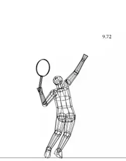

# The Most Complex Motion in Sports

**The Most Complex Motion in Sport?**

**Dr. Brian Gordon**

I have stated in many venues that the upward swing of the "power" tennis
serve is the most technically complicated movement in all of sport. The
upward swing is defined in my work as beginning at the instant the tip
of the racquet attains its lowest point vertically coming out of the
backswing, ending at contact.

I presume some would debate that it is the \"most\" complex. Indeed, I
concede that certain sports possess complicated (and often dangerous)
feats of strength, balance and motion. Yet having researched the serve
for many years\--actually decades\--I've noted several attributes of
the "power" serve upward swing that support my position.

 **Flip\>\>\>** 

**The Evidence**

For a high-level server the racquet head speed can be increased by 70
mph in 1/10 of a second during the upward swing. (To see an analysis of
this on the Sampras serve, [Click
Here.)](../Advanced%20Tennis/The%20Sampras%20Serve-Racquet%20Head%20Speed.docx)

**To accomplish this that server will utilize at least nine unique
body rotations, many in sequence. And at the end of the upward swing
these joint rotations must position the racquet into a precise
orientation with very little margin for error.**

**A side view composite of the upward swing.**

It would be hard to argue, especially for those who have tried to serve
well, that these facts are not impressive. For those of us who try to
develop this skill in young players these facts are also quite daunting.
Try teaching this rotation sequence, occurring in 1/10 of a second, to
your average child of 10 years -- good luck.

**Reverse Engineering**

**True understanding of the serve requires knowledge of the body
motions that produce the racquet speed in the upward
swing.** **[*[This understanding in turn leads to
understanding the body actions that occur in earlier parts of the motion
to facilitate the upward swing mechanics.]{.underline}* This reverse
engineered approach, assessing the ends to understand the means, is a
historical microcosm of how I developed my research of serve mechanics
over three decades.]{.mark}**

So\...in this serve article let's start at the beginning (the end of
the serve) as a first step to understand all aspects of the entire serve
motion. The goal is to describe the serve upward swing motions as a
precursor to understanding the underlying mechanics, and as a means to
evaluate other portions of the serve. This information from my doctoral
dissertation forms the foundation of my coaching methodology.

**A rear view of the upward swing composite.**

**Upward Swing Kinematics**

***Kinematics is the branch of mechanics that describes motion
(displacement, velocity, acceleration) without addressing the cause of
these motions.*** Using advanced 3D motion
measurement equipment and techniques it is possible to determine with
high precision the angular velocity (rotational speed) of the body
segments and therefore joints.

These angular velocities along with the measured distance from a joint
to the racquet face make it possible to determine the contribution each
joint rotation makes to the speed of the racquet at each analyzed
instant. To describe the primary contributors during the upward swing I
consider three rough intervals.

**Early Upward Swing**

Exiting the backswing the racquet sweeps to the outside prior to moving
significantly upward. The primary contributors to this racquet motion
are torso twist rotation (predominantly hips) and shoulder external
rotation. Wrist extension also contributes during this interval. The
vertical influence is from shoulder adduction.

### Early Upward Swing Contributors

1.  **Torso Twisting Rotation**

2.  **Shoulder External Rotation**

3.  **Shoulder Adduction**

**Mid Upward Swing**

**[The main direction of the racquet motion in this interval is
vertically upward. Shoulder adduction contributes most early in the
interval. As adduction contribution wanes, elbow extension becomes the
largest contributor to the speed of the racquet. This contribution
continues until the elbow angle approaches 180 degrees (straight).
Concurrent with elbow extension, but to a lesser extent, wrist ulnar
deviation contributes to the vertical motion of the racquet.]{.mark}**

### Mid Upward Swing Contributors

1.  **Shoulder Adduction**

2.  **Elbow Extension**

3.  **Wrist Ulnar Deviation**

**Near Contact**

Prior to contact racquet motion transitions from vertically up to
forward. Just before contact (0.007 sec prior to contact is the last
instant for which calculations are possible) shoulder internal rotation
and wrist flexion are the primary contributors to racquet speed in
roughly equal proportion. Together they account for 80% of the racquet
head speed. Torso (predominantly upper trunk or shoulders) twist
rotation contributes about 20%.

### Near Contact Contributors

1.  **Shoulder Internal Rotation**

2.  **Wrist Flexion**

3.  **Upper Torso Twist Rotation**

**What It All Means**

From a technical perspective this information is critical to
understanding the serve and should be basic knowledge for any coach. But
from a practical perspective it is not directly useful to instructing a
player to hit a high level serve. The intricacy of these body and joint
rotations, and the associated timing pattern is well beyond the
pedagogical capability of players.

**Take a look at the serve mechanics Brian describes in Novak's upward
swing.**

But\...understanding the complexity of the upward swing allows us to
understand the implication of the other serve motions (backswing plane,
leg drive, cartwheel rotation, etc.) to generating the desired result in
the upward swing. This understanding, in turn, allows us to design
teaching and training protocols focused on more controllable phases of
the serve---the wind up and the backswing.

And this is the key to coaching advanced serve mechanics. By targeting
and perfecting the more controllable parts of the motion we can then
indirectly build the complex upward swing rotations that account
directly for 100% of racquet head speed at ball contact.

This fact seems contrary to common belief that the legs and body
rotations are the drivers. It is not contrary, it simply highlights that
body motions early in the serve are used to facilitate the rotations in
the upward swing\--they do not create the racquet speed directly. These
relationships are important and will be explored in future articles.

**Click 'Play' to hear Brian's video explanation of the upward
swing.**

# Train Virtually with Brian! 

Dr. Brian Gordon is among the most influential and innovative stroke
mechanics coaches in tennis\--a formally trained sport scientist with a
PhD in biomechanics and a high performance coach dedicated to the
construction of stroke mechanics solutions for all players.

[Click Here](https://tennisperformanceresearch.com/virtual-training/)
for More Information!

|  | Biomechanically Engineered Stroke Technique (BEST) is the |
|  | only empirically based stroke mechanics system in the world, |
|  | growing from three decades of both academic and applied on |
|  | court research. He is a founder of the Tennis Center for |
|  | Performance Research in Miami, Florida, which is creating a |
|  | new paradigm for player development. The center has assembled |
|  | an unprecedented group of specialists with cutting edge |
|  | knowledge across the entire range of tennis performance. |
|  |  |
|  | To visit his website, [**[Click |
|  | Here!]{.underline}**](https://tennisperformanceresearch.com/) |
|  |  |
|  | Top contact him directly, [**[Click |
|  | Here!]{.underline}**](mailto:gamabrian@icloud.com) |

