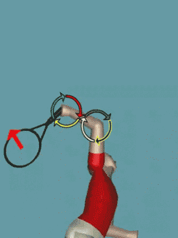

# The Serve and Tennis Science

**The Serve and Tennis Science**

**Dr. Brian Gordon**

In 1992, after 10 years as a working teaching pro, I decided to try to
learn more about the great game of tennis. When reading the popular
literature about the game I would often note references to things like
\"forces\" and \"torques.\"

Even though I had no idea what the authors were talking about, I decided
they must be important. My desire was to learn more about tennis, how to
teach it, and how science could benefit real tennis players. And so I
transited into the world of the academic study of tennis.

  ----------------------------------------------------------------------------------------------------------------------------------------------------------------------------------
                                                             {width="3.0208333333333335in"
                                                                                  height="4.1875in"}
  ----------------------------------------------------------------------------------------------------------------------------------------------------------------------------------
                                **The result of the mathematical combination of nine NCAA Division I players can be displayed in a computer graphic**

  ----------------------------------------------------------------------------------------------------------------------------------------------------------------------------------

Now 10 years later, as I finish up my PhD, I still have no idea what
many of the same authors are talking about. The problem is no longer
that I don\'t understand the technical meaning of terms like \"forces\"
and \"torques.\" The problem is that the use of such terms was and
continues to be so misguided.

Unfortunately, reading the scientific journals is just as frustrating.
It seems I usually need every bit of my eleven years of graduate
education just to understand the title, not to mention the body of an
article which probably does contain informative research on tennis
strokes.

Most of what players and coaches know about tennis stroke technique is
based on interpretation of observations made by esteemed coaches, what
is called qualitative analysis. Sport biomechanists have been acquiring
and analyzing data, and making quantitative measurements in many sports
for decades, including tennis. The problem is that the results have not
been user friendly, nor have they generally been easily accessible to
practitioners of the game.

I believe there is an uncrossed bridge between the qualitative insight
of coaches and the quantitative results of scientists. While some modest
efforts have been made to cross the bridge, we will not really gain a
complete understanding of the tennis strokes until the scientific and
coaching communities truly collaborate.

This article makes a foray across that bridge, based on my quantitative
study of the service motion. First I want to explain what the study
found about 3 key points in the service motion. Then I want to relate it
to some of the qualitative study that has appeared on Tennisplayer.net,
specifically the analysis of Advanced Tennis high speed video done by
John Yandell.

The new high speed video technology has radically improved our ability
to observe tennis strokes. While this analysis represents a major
forward step in our understanding, its implementation is still
subjective, and I feel there is still not enough information to reach
unbiased conclusions.

This subjectivity is inherent to qualitative analysis at any level, and
is not necessarily a negative attribute, as it does initiate a debate
process and stimulates critical thinking that facilitates further
understanding of the strokes. Still, more information about the strokes
would be useful to add credibility to the conclusions of the qualitative
process.

This is where science can come in, providing an additional type of
information to solidify our understanding of the game. This information
in the form of quantitative data is created through physical
measurements of actual players.

Recently I have completed a body of research on the \"power\" tennis
serve that I think illustrates how potentially beneficial such a
collaboration could be. Many of the findings relate to issues discussed
by John Yandell in his article entitled \"The Myth of the Wrist.\"

  --------------------------------------------------------------------------------------------------------------------------------------------------------------------
                                             {width="3.0in"
                                                                     height="4.229166666666667in"}
  --------------------------------------------------------------------------------------------------------------------------------------------------------------------
                      **The combination computer graphic indicates the intricate pattern of segment motions used to give speed to the racquet .**

  --------------------------------------------------------------------------------------------------------------------------------------------------------------------

Most players and coaches would acknowledge that ***[[the most important
characteristic of the power serve in tennis is the speed of the ball,
assuming the speed can be controlled.]{.underline}]{.mark}*** Further,
the speed of the ball is determined in large part by the speed of the
racquet at contact. The speed of the racquet is determined by the
intricate combined motion of all the segments of the body.

In the mid-eighties, a researcher from my laboratory outlined a method
to calculate the contribution of the various body segment motions to the
speed of the hand in a volleyball spike. In the nineties other
researchers including the Australian biomechanist, Bruce Elliott,
applied a similar technique to the tennis serve.

In 2003 I completed my own somewhat expanded analysis. My work was based
on studying the serves of nine NCAA Division I players, measuring how
the motion of each segment of the body contributed to the speed of the
racquet head.

To do this, I mathematically combined the motions of nine servers. Next
I calculated the contribution of the motions to the speed of the racquet
face center. **This information is broken down by the following body
segments:**

1.  **Legs**

2.  **Trunk**

3.  **Hitting upper arm**

4.  **Hitting forearm**

5.  **Hitting hand/racquet**

The contribution from each segment (or associated joint action) was
determined every 1/100 second from the racquet low point to just prior
to contact. For this article, I\'ve summarized the results at three key
points in the motion:

1.  **The racquet low point**

2.  **Just prior to contact (1/100 second before)**

3.  **Half way between the first two points, what I call the mid-point**

  ---------------------------------------------------------------------------------------------------------------------------------------------------------------------------------------------------------------------------------------------------------------------------------------------------------------------------------------------------------------------------------------------------------------------------------------------------------------------------------------------------------------------------------------------
                                                                         {width="1.5729166666666667in"   generated](media_the-serve-and-tennis-science/media/image4.jpg){width="1.5625in"   confidence](media_the-serve-and-tennis-science/media/image5.jpg){width="1.5729166666666667in"
                                                                                 height="1.78125in"}                                                                                                                                                     height="1.9583333333333333in"}                                                                                                                                               height="2.2604166666666665in"}
  ---------------------------------------------------------------------------------------------------------------------------------------------------------------------------------- ---------------------------------------------------------------------------------------------------------------------------------------------------------------------- -----------------------------------------------------------------------------------------------------------------------------------------------------------------------------------
                                                                                **Racquet Low Point**                                                                                                                                                          **Halfway Point**                                                                                                                                                         **Just Prior to Contact**

  ---------------------------------------------------------------------------------------------------------------------------------------------------------------------------------------------------------------------------------------------------------------------------------------------------------------------------------------------------------------------------------------------------------------------------------------------------------------------------------------------------------------------------------------------

At the racquet low point as represented in the first figure, the speed
of the racquet head was about 24 mph. Four major segment motions
contributed to this speed. Most important was the twisting of the trunk,
which accounted for about 50% of the speed. Extension of the wrist
(backward movement of the hand) accounted for about 29% of the racquet
head speed.

Upper arm twist (external rotation) and shoulder horizontal adduction
(movement of the upper arm towards the mid-line of the body) contributed
virtually equally, adding around 26% each. These can add up to 100%
because other segment motions contributed negatively. It is important to
note that a negative contribution may be necessary for a segment to
correctly position itself or to contribute to the positioning of other
adjacent segments.

### Contributions to Racquet Head Speed at the Low Point

  ---------------------------------------------------------------------------------------------------------------------------------------------------------------------
                                                         {width="3.125in"
                                                                      height="4.166666666666667in"}
  ---------------------------------------------------------------------------------------------------------------------------------------------------------------------
   **The solid figure graphic indicates the rotation of the two main contributing segments from the racquet low point to the mid point. Note the lateral motion of the
      racquet (left to right) is caused mainly by trunk twist while the upward influence is caused mainly by motion at the shoulder joint (horizontal adduction).**

  ---------------------------------------------------------------------------------------------------------------------------------------------------------------------

+---------------------+------------+
| wisting of Trunk    | 50%        |
|                     |            |
|                     | (28% hips) |
|                     |            |
|                     | (22%       |
|                     | shoulders) |
+:===================:+:==========:+
| Wrist Extension     | 29%        |
+---------------------+------------+
| Upper Arm Twist     | 26%        |
| (external rotation) |            |
+---------------------+------------+
| Shoulder Movement   | 26%        |
+---------------------+------------+

The racquet head speed by the mid-point of the upward swing (second
figure) had increased from about 24 mph to about 39 mph. Again, this
speed was mainly a function of four primary segment motions. The main
contributor was forearm motion from elbow extension which accounted for
about 29% of the racquet head speed.

The other main contributors, following very closely in importance, were
shoulder horizontal adduction (same motion as at the low point but with
the elbow held somewhat higher) with 24%, trunk twist with 22%, and
wrist ulnar deviation (hand movement sideways towards the pinky) which
was about 18%.

### Contributions to Racquet Head Speed at the Halfway Point

+-----------------+----------------+
| Elbow Extension | 29%            |
+:===============:+:==============:+
| Shoulder        | 24%            |
| Movement        |                |
+-----------------+----------------+
| Trunk Twist     | 22%            |
|                 |                |
|                 | (11% hips)     |
|                 |                |
|                 | (11%shoulders) |
+-----------------+----------------+
| Wrist Deviation | 18%            |
| (sideways)      |                |
+-----------------+----------------+

Just before contact in the third figure, racquet head speed reached a
value of slightly more than 85 mph. This indicates that the period from
mid-point to contact is critical to speed development. At this time,
five segment motions were considered to be important to racquet head
speed.

The most important segmental contributor was forearm motion from elbow
extension, which was responsible for 35% of the speed of the racquet.
Also contributing in order of significance were hand forward motion from
wrist flexion at about 24%, upper arm twist 17%, trunk twist at 10%, and
forearm pronation at 5%.

**Contributions to Racquet Head Speed Prior to Contact**

  ---------------------------------------------------------------------------------------------------------------------------------------------------------------------------
   {width="3.1354166666666665in"
                                                                              height="4.1875in"}
  ---------------------------------------------------------------------------------------------------------------------------------------------------------------------------
  **A different viewpoint shows how racquet speed is generated from the mid point to contact. Elbow extension and wrist flexion, the two main contributors, are highlighted.
  Note that elbow extension is important throughout, and critical early as the racquet is moving up. Also note wrist flexion exerts its main influence approaching contact.**

  ---------------------------------------------------------------------------------------------------------------------------------------------------------------------------

+-------------------+------------+
| Elbow Extension   | 35%        |
+:=================:+:==========:+
| Wrist Flexion     | 24%        |
+-------------------+------------+
| Upper Arm Twist   | 17%        |
| (internal         |            |
| rotation)         |            |
+-------------------+------------+
| Trunk Twist       | 10%        |
|                   |            |
|                   | (-3% hips) |
|                   |            |
|                   | (13%       |
|                   | shoulders) |
+-------------------+------------+
| Forearm Pronation | 5%         |
+-------------------+------------+

If you are wondering at this point why the analysis was cut off prior to
contact, it is because measurements taken at contact are subject to
potentially large errors for reasons beyond the scope of this article.
Still, mathematical extension and visual inspection of the available
range of joint motion in Figure 3 allows conjecture with reasonable
confidence that the segmental motion contribution in the 1/100 second
between Figure 3 and contact would come from continued elbow extension,
wrist flexion, upper arm internal rotation, trunk twist, and forearm
pronation. However, as the elbow is nearly fully extended in Figure 3,
the forearm contribution to racquet head speed from elbow extension, for
many servers, would decrease rapidly in the final milleseconds before
contact.

For those who possess the geek gene that I seem to have inherited, the
chart below shows the primary contributors throughout the phase from
racquet low point to near contact by body segment motion (with predicted
contact values).

My original research raised questions about the accuracy of some
measurements near contact. Specifically, elbow extension, upper arm
internal rotation, and forearm pronation proved difficult to measure
from 2/100 second prior to contact, to contact. While the data presented
in this article used a different and improved measurement technique,
some error in the RELATIVE contributions of these three factors is
possible. Readers should be aware that while the combined contribution
of these factors is accurate, each may have slightly more or less
contribution individually. Other contributions reported were not
effected by this problem.

Based on this quantitative data we can conclude that John Yandell pretty
much had it right, although his article leaves a few important things
unrecognized and unexplained.

If you read his article on the \"Myth of the Wrist\" ([Click
Here](http://www.tennisplayer.net/members/avancedtennis/john_yandell/the_myth/the_myth_of_the_wrist_serve_images/the_myth_of_the_wrist_serve.html)),
he states the swing pattern was a function of racquet position at the
end of the drop, elbow extension that straightens the arm, and internal
rotation of the hitting arm. Additional information provided from my
quantitative analysis shows one should also consider seriously the
twisting rotation of the trunk and motion generated from the shoulder
joint complex. This allows a greater understanding of how the motion is
really produced.

Further insight into serve mechanics is gained by exploring the main
subject of John\'s article, the role of wrist motion. Wrist motion in
fast, complicated activities like the serve is difficult to discern. To
really follow the specific motion of the wrist, one would require a view
of the motion along the precise axis of the joint movement. As this axis
moves in space, a camera would need to move in perfect concert with it.
Regardless of the frame rate of the camera, this viewpoint is
logistically impossible to obtain.

  ---------------------------------------------------------------------------------------------------------------------------------------------------------------------------------
  {width="6.973611111111111in"
  height="4.990277777777778in"}
  ---------------------------------------------------------------------------------------------------------------------------------------------------------------------------------

  ---------------------------------------------------------------------------------------------------------------------------------------------------------------------------------

But quantitative techniques can construct such a viewpoint. Using
3-dimensional measurements, a very accurate assessment of joint motion
can be obtained.

If you followed my results you may have noticed that throughout the
upward swing phase, the motion of the wrist is a significant determinant
of the speed of the racquet. Wrist motion also effects the path of the
swing. John\'s article, while acknowledging some motion, discounts wrist
motion as a causative factor, particularly around the contact point.
**[[His argument is that any motion of the wrist is a reaction to the
motion of other segments and not a conscious effect of muscular
activity.]{.mark}]{.underline}**

Basically, I agree with this argument. I also agree the benefit of the
age old advice of snapping the wrist is probably insignificant although
additional research is needed to determine this conclusively. There is
little doubt, however, the motion in the wrist joint is actually
extensive and a significant contributor to racquet head speed. This is
very clear in my results and the results of other researchers.
Regardless of the cause, the rotation of the hand and racquet will
affect racquet head speed and path.

The preceding discussion may seem troubling. How can wrist joint motion
occur without conscious muscular activity? To see how this could happen
we need to look at one of those terms that gets thrown around loosely in
discussions of tennis technique: \"torque.\"

{width="3.3333333333333335in"
height="2.2291666666666665in"}

**From world-class players to weekend warriors, the BIG serve requires
optimal racquet speed contribution from ALL available segmental
sources.**

**[[In practical terms, \"Torque\" is simply the turning or rotational
effect caused by a force.]{.underline}]{.mark}** In the case of the
serve, applying torque to a body segment tends to cause that segment to
rotate. But torque can be applied as a result of direct muscular action,
or as a result of the motion of adjacent body segments. The latter form
of application is termed \"motion-dependent torque.\" This is a major
source of torque (and therefore segment rotation) in rapid motion of
linked segments (i.e. upper arm, forearm, and hand/racquet in the
serve).

One could anecdotally argue that much of the wrist joint motion measured
during the approach to contact during the serve is passively
accomplished through motion-dependent torque. This joint motion,
combined with that actively caused by muscular activity early in the
upward swing, leads to impressive joint rotation speed leading into
contact. So impressive, that any last ditched effort to increase it at
contact by consciously \"snapping the wrist\" would likely be fruitless.

**[[The same argument could be expanded to the elbow extension. The data
indicate that forearm rotation (due to elbow extension) is critical to
the swing pattern characteristics, particularly in the second half of
the upward swing phase. Yet, it is likely that part of this rotation is
due to motion-dependent effects during the serve.]{.underline}]{.mark}**
In studies done in throwing, as an example, a nerve blocking agent that
rendered the triceps muscle (elbow extensor) unusable was given to
subjects. The results showed minimal differences in throwing attributes,
compared to throws without the nerve blocking agent. This and other
research indicates that the rapid elbow extension seen in the latter
stages of a throw has little to do with muscle activity and a lot to do
with the motion of adjacent segments.

The point is, because the action of a joint and associated rotation of
an adjacent segment may not be driven exclusively by muscle contraction,
in no way diminishes its importance in defining the motion. It may,
however, limit its effectiveness as a coaching focus. This is where I
agree with John: you can\'t train a motion-dependent torque in the same
way you can train a muscle driven joint torque. Instead, the training
(coaching) should focus on the ultimate cause of the motion-dependent
torque, which is muscular torque applied lower in the chain of linked
segments (at the shoulder joint or in the trunk or in the legs for
example).

To conclude, I\'m reminded of something I learned in a computer science
seminar: \"Data do not imply their own explanation.\" The ability to
measure and calculate millions of numbers will not further the
understanding of tennis strokes. Biomechanics alone is not the holy
grail of sport understanding, and there are some issues the current
methods of biomechanics can\'t address.

It\'s also important to understand that biomechanical analysis itself is
subject to a degree of error, that the analysis is time consuming and
expensive, and that to date it has been difficult for academics,
coaches, and players to work together productively. But the methods of
biomechanics combined with knowledge and experience of tennis experts is
a vehicle through which substantive advancement can be made in tennis
understanding and communication. This collaboration can only help the
tennis community.

This article is based in part on research published in the *Journal of
Sports Sciences.*

+------------------------------------------------------------------------------------------------------------------------------------------------------------------------------------+---------------------------------------------------------------+
| {width="1.9626870078740157in" | biomechanics of high level tennis technique. His              |
| height="2.525699912510936in"}                                                                                                                                                      | Biomechanically Engineered Stroke Technique (BEST) is the     |
|                                                                                                                                                                                    | only empirically based stroke mechanics system in the world,  |
|                                                                                                                                                                                    | growing from three decades of both academic and applied on    |
|                                                                                                                                                                                    | court research. He is a founder of the Tennis Center for      |
|                                                                                                                                                                                    | Performance Research in Miami, Florida, which is creating a   |
|                                                                                                                                                                                    | new paradigm for player development. The center has assembled |
|                                                                                                                                                                                    | an unprecedented group of specialists with cutting edge       |
|                                                                                                                                                                                    | knowledge across the entire range of tennis performance.      |
|                                                                                                                                                                                    |                                                               |
|                                                                                                                                                                                    | To visit his website, [**[Click                               |
|                                                                                                                                                                                    | Here!]{.underline}**](https://tennisperformanceresearch.com/) |
|                                                                                                                                                                                    |                                                               |
|                                                                                                                                                                                    | Top contact him directly, [**[Click                           |
|                                                                                                                                                                                    | Here!]{.underline}**](mailto:gamabrian@icloud.com)            |
+====================================================================================================================================================================================+===============================================================+
