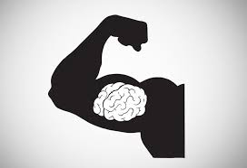

# Understanding Muscle Memory - Part 1

**Understanding Muscle Memory:**

**Part 1**

**Archie Dan Smith, MD**

**What is muscle memory and how do you develop it?**

**Muscle memory is what determines your strokes and makes your tennis
game what it is---for the good or for the bad. Developing muscle memory
means consolidating a specific motor task through repetition. Eventually
you can perform the task without conscious
effort.**

At a cellular level, motor learning occurs in the neurons of the motor
cortex. But it also happens on the muscle and skeletal level. You
\"memorize\" your strokes through these changes in the complex
interactions between your brain, nerves, and muscles.

This is not simply my opinion, it is a conclusion based on years of
research in many overlapping fields, something I have extensively
detailed in my book shown below.

**Muscle memory is created through permanent changes in the brain,
nerves, and muscles. Research shows that permanent change in muscle
memory occurs only through repetitions in a concentrated period of
time.**

**Muscle memory involves permanent changes in the brain, nerves, and
muscles.**

**[The path to making permanent improvements in your tennis is widely
misunderstood. In fact the normal sequence of events in most tennis
lessons often works against it.]** Real change requires high
numbers of repetitions of the same motion in a concentrated period of
time.

Trying to learn two patterns back to back may cause you to forget the
first. This is one reason why so many people find tennis lessons don't
result in real change.

You hit forehands for 15 minutes, then backhands for 15 minutes, then
serves, returns, volleys. You think you have covered a lot of ground and
had a productive lesson but the probability of real improvement in any
of your strokes is low.

**Concentrated Repetitions**

What do I mean by high repetitions? Something like 45 to 90 minutes 3 or
4 times a week for a 3 week period. Interestingly, 3 weeks is the usual
time period for inpatient rehabilitation after a significant stroke or
cerebral accident.

Repeatedly hitting high quality strokes is the only way to get results
that matter---the ones that make for a winning difference in your
matches. **[These strokes are the result of doing it over and over again
until permanent change occurs.]**

**[It's important to know that your old muscle memory patterns are not
erased.]** The regions and paths of the brain that control them
still remain. New motor skills involve creating new paths. These new
pathways are what you must create and then consolidate to create real
change.

**How many of the shots you hit are at the quality of your highest
level?**

**Paradigm Shift**

This type of change requires a paradigm shift in how you practice.
Let's say you decide to hit only crosscourt forehands in a lesson or
drill session, and you hit something like . 250 of these shots.

Probably 25 are hit poorly as you warm up, then the next 200 or so are
hit in a mediocre fashion. Then finally 25 or so are hit well because
you found the groove.

At that point players and pros tend to think \"you know what to
do\"---you have it down.\" Sounds like an excellent lesson for the
crosscourt forehand.

You are hitting it well and have improved. Now since you are hitting
\"well\" on the crosscourt forehand, you switch to the backhand, and
maybe repeat the same cycle, then on to the volleys, etc.

The drilling pattern I am describing is actually much more intensive
than most lessons or drill sessions I have observed. But even if you
follow it, what have you really done? What have you trained your muscle
memory to do?

Of the 250 balls, you have trained yourself to hit poor or mediocre
strokes about 90% of the time. Do the match---225 strokes poor to
mediocre, and 25 good.

Little wonder your game improves slowly if at all. Little wonder you end
up hitting like you always do when you play a match the next day and
wonder why your game is off because you were hitting so well yesterday
at the end of your practice session or lesson.

So how do your overcome this and take your game to a permanent higher
level? Go back to the end of the practice session when you were hitting
well. Now you must consolidate this so it becomes permanent.

**Modern ball machines like the Tennis Attack are a key component in the
training I advocate.**

**Consolidation**

This is where building real muscle memory starts. To accomplish the goal
of permanent improvement you must hit an additional 500 balls after you
start hitting well---all crosscourt forehands.

Simply put, the more repetitions of hitting well, the more likely that
permanent changes will keep you hitting well, especially when you need
it. You will play better during a match because most of your time in
practice is spent training your muscle memory to hit higher quality
forehands, literally laying down neural circuitry and motor pathways.

But this permanent change cannot occur in only one, or two or even three
sessions. Again, you will need to practice that one shot 45 to 90
minutes, 3 to 4 times a week for at least 3 consecutive weeks. That is
the period required for synapses to generate, for cellular chemical
factories and receptors to be up-regulated and down-regulated and for
nerve and motor endings to undergo structural change.

To do this I highly recommend using a ball machine. Today's machines,
like the Tennis Attack pictured, as well as others, can reproduce just
about any shot, spin, and speed. You can use the machine to test shots
on the edge of your ability and get an unlimited number of repetitions.
When you are working on shot how many can you execute well in a row? 5?
10? 20?

My personal program for working on a stroke is this. I take a 30 minute
lesson once a week from a pro focusing on just one shot, then hit
against the machine for 45-90 minutes 3 to 4 times a week for 3 weeks.

**Sleep?**

Another interesting component in the process is sleep. Sleep is critical
in improving muscle memory. The learning of a motor skill continues and
is enhanced after a practice has ended, but is only consolidated after
sleep. Waking periods of 4 up to even 12 hours between practices do not
allow for this consolidation to occur.

**Monica Seles would practice the same shot for weeks.**

|  | Archie Dan Smith, MD is a retired |
| --- | --- |
|  | physician living in Austin, Texas. Here is |
|  | how he describes his tennis journey, |
|  | leading to the creation of his work on |
|  | muscle memory: |
|  |  |
|  | \"I played for 2 years at my small town |
|  | high school. For the next 10 years I |
|  | played a dozen times a year with friends. |
|  | Then I did not play for decades. About 10 |
|  | years ago I began to play again. I was a |
|  | mid-level 3.5 player but I could tell over |
|  | time my game was slipping. |
|  |  |
|  | During this period I came up with and |
|  | started implementing my theories on muscle |
|  | memory. I started getting better. Two |
|  | years ago I won the 3.5 men's singles |
|  | division in the long running main City of |
|  | Austin tournament. I beat a 26 year old in |
|  | the finals. Now I am recruited by USTA |
|  | teams that have won regionals, and I play |
|  | #1 doubles for a team in the Austin Tennis |
|  | League. I conclude that there may be |
|  | something to my theory.\" |

