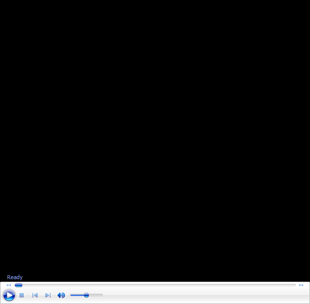

# Understanding Professional Forehand - Part 1

**Understanding Professional\
Forehands**

**Part 1**

**Dr. Brian Gordon**

{width="3.3333333333333335in"
height="2.4791666666666665in"}

The pillars of the Type III ATP forehand are defined by the forward
swing, independent of the backswing and followthrough.

My previous article described the Four Pillars of the Type III ATP
forehand. ([**[Click
Here]{.underline}**](https://www.tennisplayer.net/members/biomechanics/brian_gordon/four_pillars_atp_type_iii).)

These pillars are exclusively defined by attributes of the forward swing
-- that is, they are independent of the backswing and follow through.
The Four Pillars are:

**The Four Pillars**

1.  **Fractionation, or assigning racquet velocity sources to unique
    body rotations.**

2.  **Independent contribution of the hitting arm.**

3.  **Linearization of the hand path.**

4.  **Neuromuscular enhancement of vertical racquet head speed
    acquisition.**

The Type III forehand is an ATP forehand model based on biomechanical
research, neuromuscular theory and experimentation on the court. Models
explicitly filter individual outlier characteristics to arrive at a
technical composite indicating what optimal technique might look like
from a biomechanical perspective.

For this reason, it would be expected that few forehands would exactly
fulfill all the model attributes. At the same time, it would be expected
that most world-class forehands would fulfill at least some of the model
attributes. The interesting question is at what point is a forehand
close enough to the model to be classified as Type III? And if not Type
III, what?

This is the question I\'m most often subjected to regarding a myriad of
male and female professional players. The Type III forehand model was
created primarily as a template to teach the forehand to (my) developing
players but also to serve as an empirical baseline to analyze and
understand technique across a broad spectrum of forehands.

{width="3.3333333333333335in"
height="2.4791666666666665in"}

How do we assess the wide variety of forehands on both tours in the
context of the Type III attributes?

**Prerequisites: Backswing Types**

This two part article series will address a variety of forehand options
from both professional tours in the context of the Type III model
attributes. Toward that end it is necessary to review concepts not
explicitly linked to the Type III definition but important to the
discussion. Specifically, these concepts are the implications to the
forward swing of backswing types and different elbow angles.

The diversity of backswings in pro tennis is extensive. To discuss this
diversity as it relates to the forward swing requires a universal
definition of what separates the backswing from the forward swing. My
definition is this: the forward swing begins at the first instant the
hitting hand acquires BOTH forward and lateral (to the contact side)
velocity.

The similarity across backswing types is the preparation of the lower
limb and the torso for the forward swing. For a given stance this means
setting proper joint/segment angles and optimizing muscular contractile
conditions. Lower limb and torso preparation vary by stance but are not
fundamentally different based on backswing type for a given stance.

The diversity across backswing types is in the preparation of the
hitting arm segments and racquet throughout the backswing. In a macro
sense, the primary distinction is based on whether the hitting arm
backswing mechanics are primarily \"Positional\" for entry into the
forward swing or the mechanics are mostly \"Functional.\" Functional
means that the motion produced (primarily hand speed) is important to
the forward swing. Positional means not.

Press \'play\' to hear Brian discuss further discuss and demonstrate the
diversity of backswing types.

Positional oriented backswings are predominantly elbow driven. In an
elbow driven backswing the shoulder joint is stabilized. The motion of
the hitting hand is a function of extending or straightening the elbow.
The goal is to optimize the hitting arm position for entry into the
forward swing. This backswing type is most often seen for forward swings
with straighter elbows.

Functional oriented backswings are predominantly shoulder driven. In a
shoulder driven backswing the elbow joint may or may not extend. Either
way, the primary source of hand motion is derived from motion of the
shoulder joint. The goal is to build hand speed entering the forward
swing (and perhaps externally rotate the shoulder). This backswing type
is seen most often for forward swings with bent elbows.

{width="3.3333333333333335in"
height="2.4791666666666665in"}

Most forehands on both tours are hit with bent elbows.

**Elbow Angle**

In the article defining the four pillars of the Type III swing I stated
that a straight arm (or close to it) was an important requirement for
the forward swing. The reality is that most forehands on both
professional tours are hit with a bent elbow. The amount of bend is
diverse and has implications to forward swing mechanics.

**Horizontal Implications**

One implication of a bent elbow configuration relates to the process of
accelerating the hitting arm through the torso rotation (Pillar 2). A
bent elbow reduces the inertia of the arm plus racquet system.

The reduced inertia hampers the ability to produce the muscular benefits
and forces needed to independently accelerate the arm. This mechanical
concept applies to the initiation of hitting arm motion as well as to
the acceleration of the hitting arm through the torso.

The hitting arm acceleration consequence of the bent arm configurations
is the primary reason the associated backswing must be functional. That
is, these configurations must rely on hand speed built during the
backswing.

But the enhanced acceleration benefit of the straight arm allows the
backswing to be predominantly positional. That is, hand speed developed
during the backswing is not needed and probably is contraindicated.

Ultimately the goal of the independent arm motion (Pillar 2) is to
produce forward hand speed. A bent elbow is less efficient in this
regard. The hand speed produced by non-twisting shoulder rotation is a
function of the velocity of that joint rotation and the distance between
the shoulder and the hand\--a distance greater for a straighter arm.

Press \'play\' to see Brian further explain and demonstrate the bent
elbow forehand and how it complicates developing vertical racquet head
speed.

**Vertical Implications**

The Type III pillars article (Pillar 4) explained that a straight arm
enhanced the shoulder internal rotator pre-tension (stretch-shorten
mechanism) during the \"flip\" and optimized vertical racquet head speed
development from shoulder internal rotation in the \"roll\". This
implies a bent elbow complicates these mechanisms to some extent.

During the flip of a straight arm swing the arm segments (forearm and
upper arm) are aligned. This creates a direct link between the rotating
racquet and the shoulder (external rotation) with the forearm simply
being a transmission segment.

A bent elbow removes the direct link as the flip tends to rotate the
forearm independent of the upper arm. This forearm orientation
facilitates the inertia of the forearm and rotating racquet to cause
external shoulder rotation.

During the roll a bent elbow complicates the relationship between
internal rotation and vertical racquet head speed development. Internal
rotation with bent elbows (below 165 degrees) creates vertical racquet
head at the expense of forward hand speed (Pillar 1) and linearization
(Pillar 3). Very bent elbows (around 90 degrees) negate vertical
contribution from shoulder internal rotation completely.

So that\'s it for (most) of the hard core biomechanical theory. In the
second article, also in this issue, we will turn to the analysis of
specific players including Federer, Nadal, Djokovic, Sock, Dominic
Thiem, Garbine Mugurusa, and Simona Halep. ([**[Click
Here]{.underline}**](https://www.tennisplayer.net/members/biomechanics/brian_gordon/understanding_professional_forehands/part_02).)

+-------------------------------------------------------------------------------------------------------------------------------------------------------------------------------------------------+---------------------------------------------------------------+
| {width="1.9626870078740157in" | biomechanics of high level tennis technique. His              |
| height="2.525699912510936in"}                                                                                                                                                                   | Biomechanically Engineered Stroke Technique (BEST) is the     |
|                                                                                                                                                                                                 | only empirically based stroke mechanics system in the world,  |
|                                                                                                                                                                                                 | growing from three decades of both academic and applied on    |
|                                                                                                                                                                                                 | court research. He is a founder of the Tennis Center for      |
|                                                                                                                                                                                                 | Performance Research in Miami, Florida, which is creating a   |
|                                                                                                                                                                                                 | new paradigm for player development. The center has assembled |
|                                                                                                                                                                                                 | an unprecedented group of specialists with cutting edge       |
|                                                                                                                                                                                                 | knowledge across the entire range of tennis performance.      |
|                                                                                                                                                                                                 |                                                               |
|                                                                                                                                                                                                 | To visit his website, [**[Click                               |
|                                                                                                                                                                                                 | Here!]{.underline}**](https://tennisperformanceresearch.com/) |
|                                                                                                                                                                                                 |                                                               |
|                                                                                                                                                                                                 | Top contact him directly, [**[Click                           |
|                                                                                                                                                                                                 | Here!]{.underline}**](mailto:gamabrian@icloud.com)            |
+=================================================================================================================================================================================================+===============================================================+
