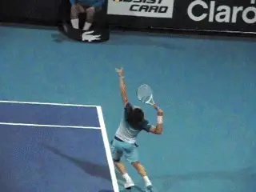

# Dominic Thiem's Second Serve

### **Dominic Thiem's Second Serve:**

### **A Perfect Model?**

### **Analyzed by John Yandell**

**The heavy kick 2nd Serve of Dominic Thiem.**

Last month we took a look at the technical serve motion of Alexander
Zverev ([link](https://www.tennisplayer.net/members/tour_strokes/john_yandell/alexander_zverev_serve))
and the missing element that I think is contributing to his second serve
problems and especially his double faults. Now let's look at the second
serve of the player who defeated Zverev to win the U.S. Open in 5
excruciating sets---Dominic Thiem.

I wrote that I thought Zverev's lack of torso rotation---first away
from the ball in the wind up and then forward back to the
contact\--forced him to rely too much on his hand and arm and helped to
create the nervousness and doubt that led to his wild inconsistency.

I compared Zverev's turn or lack of it to Roger Federer, but Thiem is
another awesome example. Besides the turn, I love almost everything else
about Thiem's motion, although there may be limitations on how it
applies to the rest of us. So let's take a detailed look.

**Platform!**

Let's start with his platform stance. It's very similar to Federer.
With a small adjustment at the start of the motion, he aligns the front
foot so that it is essentially parallel to baseline. The back foot is
also parallel to the baseline and offset behind the front foot with the
toes a little ahead of the heel of the front foot. The feet aren't
spread too wide, about shoulder width.

**Thiem's stance, body turn, and windup shape.**

That stance facilitates the body turn virtually automatically. As the
knees bend the shoulders turn onto a line that is basically parallel to
a line drawn across the toes of the feet. He probably turns the
shoulders away from the ball 45 up to 60 degrees.

Although we know you can use a variety of abbreviated windups and serve
very well, I really like his semi-pendulum motion, again similar to
Roger, keeping the arm straight from the shoulder and starting the bend
in the elbow only after the ball toss. I think it's the simplest
windup\--definitely the best model for players at all levels.

**Arm Action**

Dominic's arm action upward and outward is awesome. He goes from a full
drop with his racket falling along his right side up to the ball by
extending the elbow with the racket on edge until only a few frames
before contact.

Then the hand, arm, and racket rotation from the shoulder kicks
in---what is technically called internal shoulder rotation. This
rotation continues outward into the forward swing until the racket face
turns over and is perpendicular to the court.

That's 90 degrees or so of rotation after contact. It's often asked
why is this rotation important when obviously the ball is long gone off
the racket?

The answer is that it is the consequence of the acceleration of the
racket head going into contact. Think of it like the follow-through on a
groundstroke.

**Thiem's racket drop and upward and outward swing.**

You'd have to decelerate the racket radically going into contact to
stop that rotation from continuing. Like a groundstroke the continued
rotation, is the consequence of the racket speed.

It's interesting because a few years ago in Miami I was filming Dominic
in practice and ran into his coach at the time, Gunter Bresnick, who
developed Dominic from a young age and changed him to a one-handed
backhand. ([link](https://www.tennisplayer.net/members/famouscoach/gunther_bresnik/)
for the interview I did with Gunter on that a couple of years prior at
Indian Wells.)

I noticed, looking at the film, that Dominic wasn't fully rotating the
arm through contact on many serves. So I sat down and showed it to
Gunter. Gunter said he believed that this rotation was critical and that
he would work with Dominic on it.

**Why High Speed Video?**

Gunter said that without the high speed video it had been hard to tell
whether he was really making it all the way all the time. The next time
I filmed Dominic it looked like that work had been successful because
his motion looked exactly the way it does in this article.

**Arm Angle**

A disputed point about the upward swing on a kick serve is the angle of
the arm and racket to the baseline after contact as it moves out into
the followthrough. This angle is the indication of the racket path in
the upward swing.

**Dominic Thiem's serving arm angle crossing the baseline.**

I've heard it argued that the racket arm should be at a very small
angle on the second serve, approaching parallel to the baseline. That
isn't what the video shows.

In reality that angle is more like 45 degrees in the deuce court, and
usually slightly less in the ad. But it is still substantial and
critical. It's what creates the racket path and the combination of
speed and spin in a kick second serve.

It's not just Dominic. It's the same for two other great platform
stance servers: Roger Federer and Pete Sampras.

**Ball Toss**

All three of these players have predominantly kick second serves.
That's a function of the swing path we have been looking at, but the
prerequisite for the swing path is the placement of the ball toss. It's
critical.

Compared to the toss on the first serve, the second serve toss is
further to the left and also further behind. When we compare the three
players, Sampras and Thiem are slightly more extreme, Federer slightly
less.

Looking at Dominic from the rear view his ball toss at contact is about
over the center of his head. Pete appears to be about the same. Federer
is a little more to his right, maybe directly above his right ear.

**Theim and Sampras have a ball position at contact slightly more to the
left than Federer with finishes somewhat more to the right.**

Looking at it from the side though all three appear to make contact
somewhere over the top of their heads. So there is a small range there
in the left to right ball position at contact.

But the key point is that the position of the ball means that, compared
to the first serve, the motion is more directly upward. You can see this
in the contact point. The tip of the racket is angled to the players'
left. Maybe double the angle of the first serve.

Players sometimes think that there is such a thing as a \"first serve\"
and a different \"second serve.\" But it's the toss. In reality if the
ball placement is correct and the player hits upward and outward to the
extension of the motion the kick tends to happen naturally.

This upward and outward motion should include the full rotation of the
hand, arm, and racket so the face of the racket is perpendicular to the
court or close. After the extension point the arm just relaxes and falls
forward and down.

Because of the difference in the ball position, Thiem and Sampras tend
to finish more in the center of the body or on the right side, while
Federer tends to finish more across the body with the hand aligned with
the front leg.

**Criticism?**

There isn't much to criticize in Dominic's second serve---at least for
Dominic. But what this analysis shows is there are a few points for
lower level players in considering his motion as a model.

**Compare the head position at contact for Dominic, Roger and Pete.**

First that finish. A lot of analysis I've read says if you want to kick
the serve like Sampras or Thiem, just finish on the right side. That's
totally backwards.

If you have a more extreme ball position at contact, you may often
finish on the right side. Not the other way around.

It's very tough for the average player, however, to make that extreme
toss placement work. So I like the slightly less extreme Federer ball
position at contact. But I know that won't stop 3.5 NTRP players from
trying to be Sampras or Thiem.

The second point is head position. Dominic's head isn't up looking at
the ball at contact. That used to be considered an iron fundamental.
Until high speed film showed that great servers like Greg Rusedski and
Andy Roddick were also looking forward rather than up at the contact.

But for the vast majority of players I think it's better to keep the
head more up toward the---like Roger Federer and also Sampras.

I also think Federer, is a better second serve model than Dominic on
another point. This is the landing in the court and the body balance at
the landing.

**Dominic lands further in the court with his torso angled more forward
compared to Federer.**

Is it just Dominic's leg's explosiveness? Possibly. Whatever the
reason he comes down 2 feet or so inside the court. He has a huge back
leg kick back and lands with his torso leaning far forward from the
waist.

Federer typically lands with his heel just inside the baseline and with
his body more upright and balanced. That's a more realistic model for
the rest of us and makes for an easier recovery to ready position to
deal with the return.

This are just a few points in an unending debate. What do pro players do
and what should I try to do like them? Like I said Dominic has multiple
great elements, but some aren't ideal for most players. ([link](https://www.tennisplayer.net/members/teaching_systems/john_yandell/second_serve/)
for a detailed article on the second serve I did with Federer as the
model.)

So there you have it. The amazing second serve of Dominic Thiem and a
few comparison points that show what to copy and maybe not what to
copy---all courtesy of amazing Tennisplayer high speed video footage.
And guess what? You can study his second serve as well as his first in
that video this month in the High Speed Archives. ([link](https://www.tennisplayer.net/members/high_speed_archive/phantom/Dominic_Thiem/).)

John Yandell is widely acknowledged as one of the leading videographers
and students of the modern game of professional tennis. His high speed
filming for Advanced Tennis and Tennisplayer have provided new visual
resources that have changed the way the game is studied and understood
by both players and coaches. He has done personal video analysis for
hundreds of high level competitive players, including Justine
Henin-Hardenne, Taylor Dent and John McEnroe, among others.

In addition to his role as Editor of Tennisplayer he is the author of
the critically acclaimed book Visual Tennis. The John Yandell Tennis
School is located in San Francisco, California.
