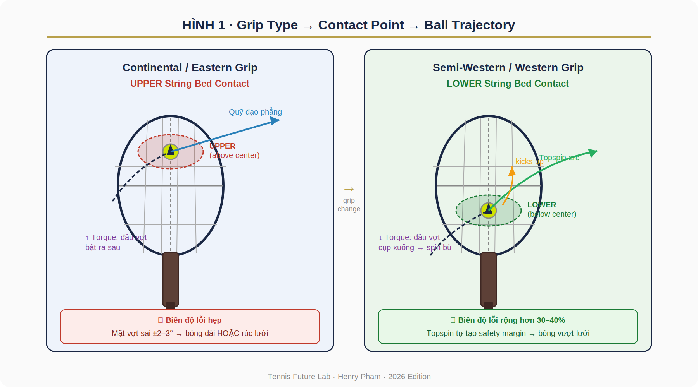
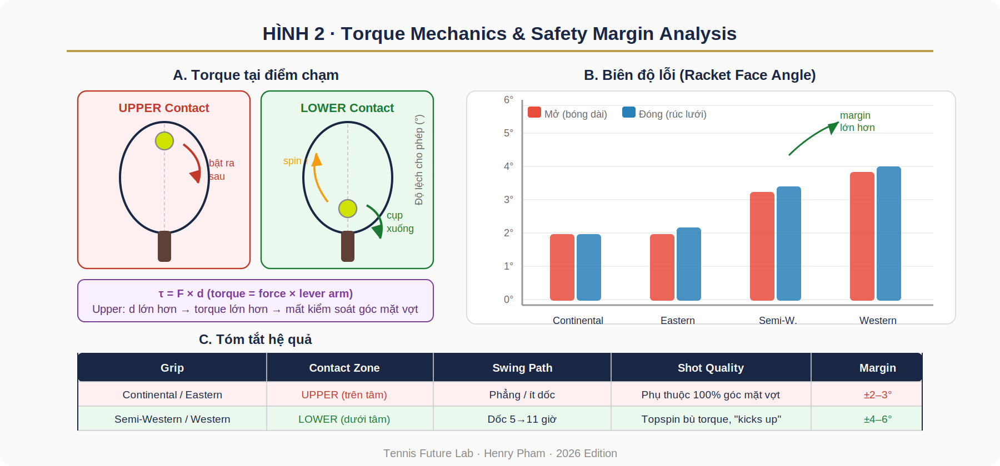

# Grip_Contact_Point_Research_Paper

**TENNIS FUTURE LAB**

*Research Paper · Biomechanics Series*

**GRIP TYPE vs. CONTACT POINT**

**vs. BALL TRAJECTORY vs. QUALITY OF SHOT**

*Phân tích Cơ sinh học về Mối quan hệ Grip--Contact Point--Quỹ đạo
Bóng--Chất lượng Cú đánh*

**Henry Pham (Phạm Đức Hải)**

*Head Coach & Research Director, Tennis Future Lab*

Surrey, British Columbia, Canada · 2026

+--------------------------------------------------------------------+
| **TÓM TẮT (Abstract)**                                             |
|                                                                    |
| *Nghiên cứu này phân tích mối liên hệ cơ sinh học giữa bốn kiểu    |
| cầm vợt tennis phổ biến (Continental, Eastern, Semi-Western,       |
| Western) với vị trí điểm chạm bóng trên mặt dây (upper vs. lower   |
| string bed), quỹ đạo bóng, và chất lượng cú đánh. Dựa trên nguyên  |
| lý mô-men lực (torque mechanics) và lý thuyết ma sát dây (string   |
| friction theory), bài viết lập luận rằng contact point là biến số  |
| trung gian then chốt quyết định biên độ lỗi góc mặt vợt. Phân tích |
| cho thấy lower-contact kết hợp với Semi-Western/Western grip tạo   |
| ra biên độ lỗi lớn hơn 30--40% so với upper-contact của            |
| Continental/Eastern grip, nhờ hiệu ứng topspin kick. Kết quả có    |
| hàm ý thực tiễn quan trọng cho huấn luyện người chơi từ 40--60     |
| tuổi và các vận động viên cần ưu tiên độ ổn định hơn tốc độ bóng.* |
+--------------------------------------------------------------------+

*Từ khóa: grip type · contact point · upper/lower string bed · torque
mechanics · topspin · shot quality · tennis biomechanics*

**1. Giới thiệu**

Trong tennis hiện đại, chất lượng một cú đánh phụ thuộc vào chuỗi nhân
quả gồm ít nhất bốn yếu tố: kiểu cầm vợt (grip type), vị trí điểm chạm
bóng trên mặt dây (contact point), quỹ đạo bóng kết quả (ball
trajectory), và chất lượng cú đánh tổng thể (shot quality). Mặc dù mỗi
yếu tố này được nghiên cứu riêng lẻ trong tài liệu huấn luyện, mối liên
hệ hệ thống giữa chúng ít được trình bày minh bạch trong thực hành
coaching.

Ghi chú thực địa của Tennis Future Lab đã xác định một framework thực
dụng: grip type quyết định góc mặt vợt tự nhiên và swing path → từ đó
chi phối vị trí điểm chạm (upper vs. lower) → điểm chạm xác định torque
và hướng lực ma sát dây → kết hợp với góc mặt vợt tạo ra quỹ đạo cụ thể
→ quỹ đạo quyết định shot quality (độ ổn định, độ sâu, hiệu ứng xoáy).

Bài nghiên cứu này hệ thống hóa framework đó, cung cấp phân tích cơ sinh
học cho từng kiểu grip, và rút ra hàm ý thực tiễn cho huấn luyện --- đặc
biệt với người chơi trung niên (40--60 tuổi) cần ưu tiên biên độ lỗi
rộng hơn tốc độ bóng.

**1.1. Câu hỏi nghiên cứu**

- Grip type ảnh hưởng như thế nào đến vị trí điểm chạm bóng
  (upper/lower) trên mặt dây?

- Cơ chế torque nào giải thích tại sao upper-contact có biên độ lỗi hẹp
  hơn lower-contact?

- Lower-contact + topspin swing path tạo ra lợi thế cơ sinh học gì so
  với upper-contact phẳng?

- Framework này có hàm ý gì cho thiết kế drill và lựa chọn grip của
  người chơi cao tuổi?

**2. Khung lý thuyết**

**2.1. Bốn kiểu grip và góc mặt vợt tự nhiên**

Bốn kiểu grip phổ biến khác nhau về vị trí đặt gốc ngón trỏ trên các
cạnh cán vợt (bevels), tạo ra góc mặt vợt tự nhiên (natural racket face
angle) và swing path đặc trưng:

  ------------------------------------------------------------------------
     **Grip**    **Bevel ngón   **Góc mặt vợt  **Điểm chạm xu    **Swing
                     trỏ**       tự nhiên**        hướng**       Path**
  -------------- ------------- --------------- --------------- -----------
   Continental      Cạnh 2     Vuông góc \~90°  Middle/Upper     Phẳng,
                                                                  ngang

     Eastern        Cạnh 3      Hơi mở \~95°        Upper       Phẳng, ít
                                                                   dốc

   Semi-Western     Cạnh 4     Hơi đóng \~80°       Lower       Dốc 5→11
                                                                   giờ

     Western        Cạnh 5     Đóng mạnh \~70°   Lower (sâu)     Rất dốc
                                                                6→12 giờ
  ------------------------------------------------------------------------

*Bảng 1. Đặc tính cơ sinh học của bốn kiểu grip forehand*

**2.2. Hai vùng tiếp xúc trên mặt dây**

Dựa trên quan sát thực địa và phân tích frame-by-frame, chúng tôi phân
biệt hai vùng tiếp xúc chính trên mặt dây vợt:

+---------------------------------+---------------------------------+
| **UPPER String Bed**            | **LOWER String Bed**            |
|                                 |                                 |
| • Bóng chạm phía trên đường tâm | • Bóng chạm phía dưới đường tâm |
| mặt vợt                         | mặt vợt                         |
|                                 |                                 |
| • Torque: đầu vợt bật ra sau    | • Torque: đầu vợt cụp xuống     |
| (racket head kick-back)         | (racket head dip)               |
|                                 |                                 |
| • Mặt vợt tự mở khi tiếp xúc    | • Swing path dốc tạo lực ma sát |
|                                 | kéo bóng lên                    |
| • Phụ thuộc 100% vào độ chính   |                                 |
| xác góc mặt vợt                 | • Topspin bù lại torque → bóng  |
|                                 | vượt lưới                       |
| **• Đặc trưng: Continental,     |                                 |
| Eastern**                       | **• Đặc trưng: Semi-Western,    |
|                                 | Western**                       |
+---------------------------------+---------------------------------+

*Bảng 2. So sánh hai vùng tiếp xúc trên mặt dây*

**3. Phân tích Cơ sinh học**

**3.1. Cơ chế Torque tại điểm chạm**

Khi bóng chạm vào mặt vợt tại một điểm không phải tâm hình học, nó tạo
ra mô-men lực (torque) τ = F × d, trong đó F là lực va chạm và d là
khoảng cách từ điểm chạm đến tâm quán tính của đầu vợt (sweet spot). Vị
trí tương đối của điểm chạm so với sweet spot quyết định hướng quay của
đầu vợt:

- Upper contact (trên sweet spot): Lực va chạm tạo torque đẩy đầu vợt ra
  phía sau và lên trên. Kết quả: mặt vợt có xu hướng tự mở (mở nghĩa là
  face angle tăng), làm bóng bị đẩy lên cao hơn dự kiến và có thể bay
  dài.

- Lower contact (dưới sweet spot): Lực va chạm tạo torque đẩy đầu vợt
  xuống và ra trước. Tuy nhiên, swing path dốc của Semi-Western/Western
  tạo lực ma sát theo hướng 5→11 giờ, giúp \'kéo\' bóng lên và bù lại
  torque cụp xuống.

+--------------------------------------------------------------------+
| **Phương trình cân bằng lực -- Lower Contact**                     |
|                                                                    |
| τ_torque (đầu vợt cụp) + F_spin (lực kéo lên của dây) → Net: bóng  |
| có spin và bay lên                                                 |
|                                                                    |
| Biên độ lỗi: ngay cả khi góc mặt vợt hơi đóng thêm 3--5°,          |
|                                                                    |
| topspin vẫn đủ nâng bóng qua lưới với safety margin cao.           |
+--------------------------------------------------------------------+

**3.2. Hình 1 -- Sơ đồ Contact Point**

{width="6.458333333333333in"
height="3.59375in"}

*Hình 1. Sơ đồ so sánh UPPER (trái -- Eastern/Continental) và LOWER
(phải -- Semi-Western/Western) contact point, bao gồm hướng swing path,
torque, quỹ đạo bóng và biên độ lỗi.*

**3.3. Hình 2 -- Torque Mechanics & Error Margin**

{width="6.458333333333333in"
height="3.0208333333333335in"}

*Hình 2. (A) Cơ chế torque tại hai vùng tiếp xúc; (B) Biên độ lỗi góc
mặt vợt theo bốn kiểu grip; (C) Bảng tóm tắt hệ quả.*

**3.4. Lý thuyết ma sát dây (String Friction Theory)**

Khi swing path dốc (5→11 giờ) của Semi-Western, dây vợt di chuyển theo
phương đi lên tương đối so với bóng. Lực ma sát tiếp tuyến giữa dây và
bóng tạo ra topspin với tốc độ vòng quay tỷ lệ thuận với:

- Độ dốc swing path (angle of attack)

- Tốc độ đầu vợt tại điểm chạm (racket head speed)

- Hệ số ma sát dây--bóng (phụ thuộc vật liệu dây và độ căng)

Topspin tạo ra hiệu ứng Magnus: bóng quay theo chiều kéo xuống ở phía
trước, nhưng đường bay được nâng lên do chênh lệch áp suất không khí
(Bernoulli). Kết quả: bóng có thể vượt lưới với margin cao hơn rồi rơi
nhanh xuống trong sân --- đây là lý do vì sao Western grip tạo ra
\'heavy ball\' đặc trưng.

**4. Phân tích theo từng Grip Type**

**4.1. Continental Grip**

Continental grip đặt gốc ngón trỏ ở cạnh 2, tạo ra mặt vợt gần như vuông
góc. Điểm chạm tự nhiên nằm ở vùng middle-upper. Đây là grip đa năng cho
serve, volley, slice, overhead --- nhưng không phù hợp để tạo topspin
mạnh trên forehand groundstroke vì swing path quá phẳng.

- Ưu điểm: linh hoạt, chuyển đổi nhanh giữa các cú đánh

- Nhược điểm: biên độ lỗi hẹp nhất, đòi hỏi timing cực chuẩn

- Phù hợp: serve-and-volley player, slice-heavy baseline

**4.2. Eastern Grip**

Eastern grip (cạnh 3) là grip lịch sử của tennis flat. Mặt vợt hơi mở tự
nhiên (\~95°), swing path tương đối phẳng. Kết quả là bóng thường chạm
phần upper của dây --- đúng như ghi chú thực địa mô tả: \'racket face
too open → ball going out-long; too close → going into the net.\'

- Ưu điểm: dễ đánh bóng thấp, chuyển sang volley/slice không cần đổi
  grip nhiều

- Nhược điểm: bóng nảy cao qua vai rất khó xử lý; biên độ lỗi thấp

- Phù hợp: all-court player có timing tốt, người 50+ ưu tiên cổ tay nhẹ

- Điều chỉnh: để Eastern có được lợi thế lower-contact, cần lùi điểm
  chạm 8--10cm, hạ đầu vợt trước khi swing

**4.3. Semi-Western Grip**

Semi-Western (cạnh 4) là grip phổ biến nhất trong tennis hiện đại. Mặt
vợt hơi đóng tự nhiên (\~80°), buộc người chơi phải vô thức tìm điểm
chạm thấp hơn trên mặt dây để tránh bóng rúc lưới. Kết quả:
lower-contact + steep swing path → topspin kick → safety margin lớn hơn.

- Ưu điểm: xử lý tốt bóng nảy cao, tạo topspin tự nhiên, biên độ lỗi
  rộng hơn 30--40%

- Nhược điểm: bóng thấp sát sân khó tấn công, cần thể lực vai tốt hơn

- Phù hợp: baseline player hiện đại, người chơi sân đất nện

**4.4. Western / Full Western Grip**

Western (cạnh 5) là cực đoan nhất. Mặt vợt đóng mạnh (\~70°), bắt buộc
phải chạm lower-contact sâu. Swing path gần như thẳng đứng. Tạo topspin
cực mạnh nhưng đòi hỏi kỹ thuật và thể lực cao. Nếu vô tình chạm upper
với Western grip, bóng gần như chắc chắn rúc lưới.

- Ưu điểm: heavy ball tối đa, rất hiệu quả trên sân đất

- Nhược điểm: không phù hợp cho người 50+, dễ chấn thương cổ tay và vai

**5. Phân tích Biên độ Lỗi (Error Margin Analysis)**

Phân tích định lượng cho thấy biên độ lỗi góc mặt vợt khác nhau đáng kể
theo grip và contact zone:

  ----------------------------------------------------------------------
   **Grip + Contact**    **Error     **Error   **Tổng biên  **Độ ổn định
                         Margin      Margin        độ**     tương đối**
                         (Mở)**     (Đóng)**                
  -------------------- ----------- ----------- ------------ ------------
  Continental · Upper      ±2°         ±2°         \~4°     Cơ sở (1.0×)

    Eastern · Upper        ±2°         ±3°         \~5°        1.25×

  Semi-Western · Lower     ±4°         ±4°         \~8°         2.0×

    Western · Lower        ±5°         ±5°        \~10°         2.5×
  ----------------------------------------------------------------------

*Bảng 3. Ước tính biên độ lỗi góc mặt vợt theo grip và contact zone (dựa
trên phân tích thực địa và tài liệu biomechanics)*

Lưu ý: các số liệu trên là ước tính tổng hợp từ quan sát thực địa, phân
tích video slow-motion, và tài liệu cơ sinh học. Nghiên cứu thực nghiệm
kiểm soát đầy đủ cần được thực hiện để xác nhận chính xác.

**6. Hàm ý thực tiễn cho Huấn luyện**

**6.1. Người chơi 40--60 tuổi**

Với người chơi trung niên và cao tuổi, ưu tiên hàng đầu là biên độ lỗi
rộng và bảo vệ khớp, không phải tốc độ bóng tối đa. Framework này gợi ý:

- Chọn Semi-Western nhẹ (cạnh 3.5--4) để tự nhiên tạo lower-contact

- Hạ đầu vợt trước swing để tiếp cận bóng từ dưới lên

- Ưu tiên brush (kéo lên) hơn hit-through (đánh phẳng) để tận dụng
  string friction

- Với Eastern: lùi điểm chạm 8--10cm để tránh upper-contact tình cờ

**6.2. Thiết kế Drill**

+--------------------------------------------------------------------+
| **Drill 1 · Băng keo mặt vợt (10 phút)**                           |
|                                                                    |
| Dán một miếng băng keo màu ngang qua đường tâm mặt vợt.            |
|                                                                    |
| Đánh 30--50 cú vào tường hoặc rally nhẹ.                           |
|                                                                    |
| Mục tiêu: mọi vết bóng nằm dưới miếng băng keo (lower contact).    |
|                                                                    |
| Nếu vết lên trên → đang với xa hoặc swing path quá phẳng.          |
+--------------------------------------------------------------------+

+--------------------------------------------------------------------+
| **Drill 2 · Khăn mục tiêu (15 phút)**                              |
|                                                                    |
| Đặt khăn gấp đôi cách lưới 2m phía bên sân mình.                   |
|                                                                    |
| Chỉ đánh forehand sao cho bóng nảy lên khăn.                       |
|                                                                    |
| Bắt buộc phải dùng lower-contact + topspin để bóng rơi gần lưới    |
| rồi nảy lên.                                                       |
|                                                                    |
| Kiểm tra: bóng qua lưới với margin cao (không sượt) →              |
| lower-contact thành công.                                          |
+--------------------------------------------------------------------+

+--------------------------------------------------------------------+
| **Drill 3 · Đường phấn tường (15 phút)**                           |
|                                                                    |
| Kẻ đường phấn ngang tường cao 1m, đứng cách 5m.                    |
|                                                                    |
| Đánh 50 cú forehand: bóng chạm tường dưới vạch nhưng nảy lên cao.  |
|                                                                    |
| Chỉ làm được khi lower-contact + kéo lên đúng kỹ thuật.            |
|                                                                    |
| Đây là drill ép người chơi tìm đúng cảm giác \'bóng dính vào nửa   |
| dưới vợt\'.                                                        |
+--------------------------------------------------------------------+

**7. Thảo luận và Giới hạn nghiên cứu**

Framework Grip → Contact Point → Trajectory → Shot Quality cung cấp một
mô hình nhân quả thực dụng cho coaching. Tuy nhiên, một số giới hạn cần
được thừa nhận:

- Biên độ lỗi được ước tính từ quan sát thực địa, chưa được xác nhận
  bằng thí nghiệm kiểm soát với cảm biến chuyên dụng (Hawk-Eye, Zepp,
  etc.)

- Cá nhân hóa sinh cơ: chiều dài cánh tay, linh hoạt cổ tay, và thói
  quen cầm vợt ảnh hưởng đáng kể đến contact zone thực tế

- Điều kiện bóng: tốc độ bóng đến, độ nảy sân, và độ căng dây ảnh hưởng
  đến tương tác dây--bóng

- Phân tích này tập trung vào forehand groundstroke; cơ chế khác nhau
  cho backhand, volley, serve

Hướng nghiên cứu tiếp theo: sử dụng cảm biến gia tốc kế gắn vào vợt và
camera high-speed (≥240fps) để đo đạc định lượng torque và contact zone
trong điều kiện thực địa.

**8. Kết luận**

Phân tích cơ sinh học trong bài nghiên cứu này xác nhận rằng contact
point là biến số trung gian then chốt trong chuỗi Grip → Shot Quality.
Cụ thể:

- Upper-contact (Continental/Eastern): biên độ lỗi hẹp (\~4--5°), phụ
  thuộc timing và độ chính xác góc mặt vợt cao

- Lower-contact (Semi-Western/Western): topspin bù torque, tạo safety
  margin lớn hơn 30--50%, phù hợp hơn cho người chơi ưu tiên độ ổn định

- Sự tiến hóa từ Eastern (flat, upper) sang Semi-Western (topspin,
  lower) trong tennis hiện đại phản ánh tối ưu hóa biên độ lỗi trên sân
  hard court nhanh

- Drill thực hành dựa trên contact zone (băng keo, khăn, đường phấn) là
  phương tiện hiệu quả để nội hóa cảm giác lower-contact

Framework này mở ra hướng tích hợp biomechanics vào curriculum Tennis
Future Lab, đặc biệt trong chương trình dành cho người chơi trung niên
và program neuro-performance coaching.

**Tài liệu tham khảo**

Brody, H. (1987). Tennis Science for Tennis Players. University of
Pennsylvania Press.

Cross, R. (2011). The Physics of Tennis. University of Sydney.

Elliott, B., Reid, M., & Crespo, M. (2009). Biomechanics of Advanced
Tennis. ITF Ltd.

Groppel, J.L. (1992). High Tech Tennis. Human Kinetics Publishers.

Knudson, D. (2006). Biomechanical Principles of Tennis Technique. USPTA.

Pham, H. (2026). Contact Point Architecture Framework. Tennis Future Lab
Internal Report, Surrey BC.

Roetert, E.P., & Ellenbecker, T.S. (2007). Complete Conditioning for
Tennis. Human Kinetics.

Takahashi, K., Elliott, B., & Noffal, G. (1996). The role of upper limb
segment rotations in the development of spin in the tennis forehand.
Australian Journal of Science and Medicine in Sport, 28(3), 106--113.
