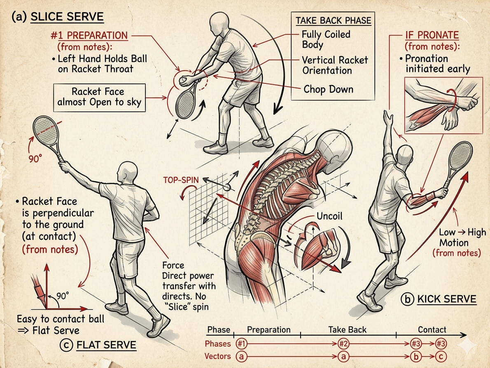

# ky-thuat-giao-bong

**TENNIS FUTURE LAB · SURREY, BC**

**Kỹ Thuật Giao Bóng Hoàn Chỉnh**

*Ba giai đoạn · Ba loại bóng · Một chuỗi động học thống nhất*

Henry Pham · Research Document · 2026

Giao bóng là cú đánh duy nhất trong tennis mà bạn kiểm soát hoàn toàn từ
đầu đến cuối --- không bị chi phối bởi đối thủ. Đây cũng là cú đánh dễ
tích sai thói quen nhất.

Tài liệu này dựa trên ghi chú thực địa, phân tích theo mô hình 8 giai
đoạn hiện đại, với tiêu điểm vào ba điểm chuyển tiếp cốt lõi: chuẩn bị,
xoắn thân, thả rơi vợt.

| **NGUYÊN TẮC NỀN** |
| --- |
|  |
| Không phải 'đánh mạnh' mà là 'thả đúng'. Lực đến từ chuỗi động |
| học thân --- hông trước, vai theo, tay chỉ là dây roi truyền lực. Cố |
| gắng gồng tay chỉ làm chậm và gây chấn thương. |

**Hình Minh Họa Kỹ Thuật**

Sơ đồ bên dưới mô tả ba loại giao bóng và các giai đoạn kỹ thuật, bao
gồm: chuẩn bị (Preparation), lấy đà (Take Back), và điểm chạm (Contact).
Phân tích chuỗi động học và vector lực được thể hiện qua ba biến thể:
Slice Serve, Kick Serve và Flat Serve.

*Hình 1. Ba loại giao bóng --- Biomechanics & Phase Analysis*

**#1 Chuẩn Bị** --- PREPARATION PHASE

**Hai điểm then chốt**

| **GHI CHÚ THỰC ĐỊA** |
| --- |
|  |
| *\"Left hand holds ball on racket throat --- racket face almost open |
| up to sky\"* |

Tay trái giữ cổ vợt --- không phải giữ cho chắc, mà để hai tay di chuyển
cùng lúc, ngăn vai phải mở sớm. Đây là điểm kiểm soát nhịp điệu của toàn
bộ cú đánh.

Mặt vợt ngửa nhẹ --- grip continental giữ cổ tay ở trạng thái trung
tính, mặt vợt hơi nghiêng lên. Nếu grip eastern hoặc mặt vợt đóng quá
sớm, bạn mất khả năng pronation sau này.

  -----------------------------------------------------------------------
  ⚠ Lỗi phổ biến: Mở mặt vợt quá nhiều → cổ tay cứng → mất pronation ở
  điểm chạm.

  -----------------------------------------------------------------------

**#2 Xoắn Thân** --- TAKE BACK · FULL BODY COIL

**Tích năng lượng --- Chuỗi động học**

| **GHI CHÚ THỰC ĐỊA** |
| --- |
|  |
| *\"Body is fully coiled\"* |

Đây là giai đoạn lưu trữ năng lượng. Vai và hông xoay ngược chiều nhau
tạo ra lực căng xoắn --- giống dây cung căng trước khi bắn. Nghiên cứu
biomechanics chỉ ra sự chênh lệch tốc độ đầu vợt ở cú serve phụ thuộc
trực tiếp vào góc xoắn vai--hông ở giai đoạn này.

Tung bóng lên đúng vị trí trong khi thân xoắn --- hai động tác phải đồng
bộ, không tuần tự. Bóng tung quá sớm hoặc quá muộn sẽ phá vỡ nhịp điệu.

  -----------------------------------------------------------------------
  ⚠ Lỗi phổ biến: Chỉ dùng tay phải kéo vợt ra sau mà không xoắn thân.
  Tốc độ vợt giảm 30--40% so với tiềm năng.

  -----------------------------------------------------------------------

**#3 Thả Rơi & Bung Lực** --- RACKET DROP · CHOP DOWN TO UNCOIL

**Racket Drop --- Điểm Bản Lề**

| **GHI CHÚ THỰC ĐỊA** |
| --- |
|  |
| *\"Racket tip pointing down to the ground --- Racket face |
| perpendicular to the ground --- Chop down to uncoil\"* |

Đây là điểm bản lề của toàn bộ cú đánh. Khi vợt rơi xuống, mặt vợt phải
vuông góc với mặt đất, đầu vợt chỉ xuống. Đây là lúc chuỗi động học được
'thả ra'.

Quan trọng: Chữ 'Chop' trong ghi chú không có nghĩa là chặt mạnh. Thực
tế là thả lỏng vai để trọng lực kéo đầu vợt rơi tự nhiên. Thân mình
uncoil theo thứ tự: hông → vai → cánh tay → cổ tay.

Pronation xảy ra sau khi thả rơi, không phải trước --- là kết quả tự
nhiên của cẳng tay duỗi lên khi vợt bung qua điểm chạm.

  -----------------------------------------------------------------------
  ⚠ Tuổi trên 50: Không 'chặt' mạnh --- cơ delta dễ căng. Nghĩ là 'thả
  rơi vợt', không phải 'ném vợt lên'.

  -----------------------------------------------------------------------

**Ba Loại Giao Bóng**

Cùng một grip continental · Chỉ thay đổi mặt vợt và đường swing

| **Flat Serve** | **Slice Serve** | **Kick Serve** |
| --- | --- | --- |
|  |  |  |
| PHẲNG | CẮT | XOÁY LÊN |
| **Mặt vợt:** Vuông | **Mặt vợt:** Đứng | **Mặt vợt:** Đóng |
| góc, tiếp xúc trực | dọc, nghiêng ngoài | nhẹ, quét từ dưới lên |
| diện |  |  |
|  | **Swing:** Từ ngoài | **Swing:** Thấp → |
| **Swing:** Thẳng từ | vào trong (7→1 giờ) | Cao + Pronation muộn |
| dưới lên |  |  |
|  | **Tung bóng:** Lệch | **Tung bóng:** Ra sau |
| **Tung bóng:** Hơi | phải 30cm | đầu, hơi trái |
| trước đầu, thẳng |  |  |
|  | **Kết quả:** Xoáy | **Kết quả:** Xoáy lên |
| **Kết quả:** Tốc độ | ngang, bóng trượt | mạnh, bóng nảy cao |
| cao, ít xoáy, quỹ đạo | thấp |  |
| thấp |  |  |

**Lộ Trình Tập Thực Địa**

| **Lộ Trình Tập Thực Địa** |
| --- |
|  |
| DÀNH CHO VẬN ĐỘNG VIÊN PHONG TRÀO · ƯU TIÊN BẢO VỆ VAI |

| **BƯỚC | **Soi gương không bóng** | 10 lần |
| --- | --- | --- |
| 01** |  | / buổi |
|  | Đứng trước gương: #1 → #2 → dừng ở trophy 2 giây → |  |
|  | thả vợt rơi đến vị trí đầu vợt chỉ đất. Kiểm tra |  |
|  | mặt vợt vuông góc. |  |
| **BƯỚC | **Drop + Pronation ngắn** | 15 lần |
| 02** |  | / buổi |
|  | Tung bóng thấp, chỉ tập từ vị trí drop lên đến |  |
|  | điểm chạm. Không cần nhảy. Mục tiêu: nghe tiếng |  |
|  | vút nhẹ. |  |
| **BƯỚC | **Phân biệt ba loại --- tung bóng khác nhau** | 5+5+5 |
| 03** |  | / loại |
|  | Flat: tung thẳng. Slice: tung lệch phải 30cm. |  |
|  | Kick: tung ra sau đầu, nghĩ low-to-high. |  |
| **ƯU | **Tuổi 50+ --- Cân bằng tải** | Slice |
| TIÊN** |  | 60% |
|  | Ưu tiên Slice 60% và Kick 30% để giảm tải vai và |  |
|  | khuỷu. Flat 10%. Kết thúc buổi bằng xoay vai và | Kick |
|  | kéo giãn cơ ngực. | 30% |
|  |  |  |
|  |  | Flat |
|  |  | 10% |

Henry Pham · Tennis Future Lab · Surrey, BC, Canada \| Applied
Biomechanics Research · Kỹ Thuật Giao Bóng · 2026
