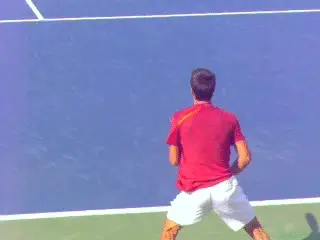
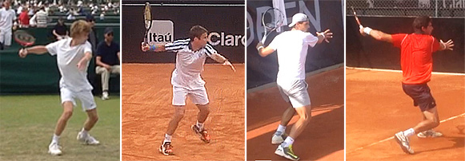
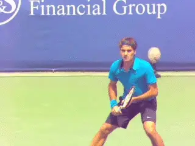
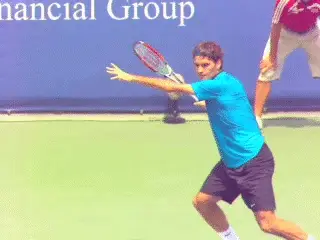
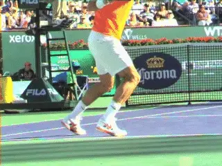
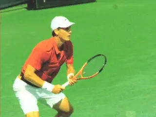
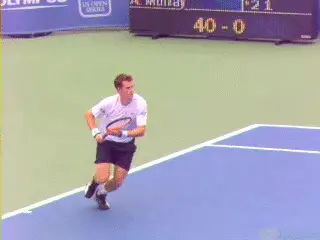

# 1-2 Rhythm - Forehand

### 1-2 Rhythm: Forehand

### Nick Wheatley

------------------------------------------------------------------------

**1-2 Rhythm: deliberate then explosive.**

This new series introduces a simple concept I call 1-2 Rhythm. What is
1-2 Rhythm?

**1-2 Rhythm breaks the timing of tennis strokes into two parts, or phases.**

Phase 1 is the setup phase, which is smooth and deliberate. Phase 2 is
the execution phase which is explosive and full of energy.

1-2 Rhythm can help players improve their timing and their energy
transfer into their shots. It applies across all strokes, and in this
first article we'll see how that works on the forehand.

A commonality among elite players is exceptional rhythm. I have found
that focusing on improving rhythm can work wonders for players of all
levels, even those who may have technically less efficient swings.

**Transition**

To develop 1-2 Rhythm the first key is understanding the sequence and
the transition from the first phase to the second. When does smooth and
deliberate end and explosive begin?

The second key is the positioning of the body at this critical
transition point. At this moment what are the key characteristics of the
arms, legs, torso and racket?

**Elite English junior players and the differences in position at the completion of Phase 1**

The exact positions and checkpoints can vary somewhat since even
high-level players have variations in their stroke patterns. But I have
found that identifying and focusing on your own transition checkpoints
often leads to better overall technique.

**Phase 1: Smooth and Deliberate**

So, let's identify the two phases in the forehand and the transition
point, when Phase 1 ends and Phase 2 begins.

**Phase 1: substantial backward racket movement with the racket head above the racket handle.**

Phase 1, the setup phase, begins with the start of the unit turn and the
release of the opposite hand from the racket. It continues through the
completion of the body turn, **with the opposite arm stretched across the baseline**. This smooth preparation helps to
**avoid the common mistake of rushing the racket back too early.**

In Phase 1, there is also substantial movement of the racket backwards
in the backswing. Commonly **the racket head will be positioned above the height of the racket handle.** The exact
position of the hitting arm and racket can vary, but typically the
racket and hitting arm won't quite reach the end of the backswing, or
the point where the racket has moved furthest backwards in the swing.

Depending on the ball, there are also variances in the exact position
and movement of the opposite arm. This can be personal style but it can
also be situational.

**The more time the player has, the longer the arm will stay parallel to the baseline. When players are on the run, it's likely the opposite arm will have rotated forwards further up to 30-45 degrees in relation to the baseline.Phase 2: Explosive**

**Phase 2: watch the rate of the acceleration increase.**

Phase 2 begins immediately at the completion of Phase 1. Even though we
are breaking the stroke into two parts for the sake of explanation,
**there is no pause and the transition should be seamless.**

The racket and hitting arm may not have fully reached the end of the
backswing at this stage. But the crucial point is that at the start of
Phase 2, the rate of acceleration of the arm and racket begins to
increase.

**This energized and explosive phase is fuelled by hip rotation**, **torso rotation and rapid acceleration of the hitting arm towards contact point.** This explosiveness is what generates and
transfers energy into the ball, creating power and spin.

**The explosiveness will reach its peak at contact point, but the playershould imagine that explosiveness continuing to build through contact and beyond**. **This will**promote excellent extension, and increase the effectiveness of the
shot**. The finish will then naturally allow the arm, and racket to decelerate and recover.Mastering 1-2 Rhythm is a matter of feeling.**
The feeling that the stroke is at first smooth and deliberate, then
explosive. The feeling that the key positions should not be forced. The
feeling that the stroke should be flowing.

**Phase 2: fueled in part by hip rotationExecution**

To execute the 1-2 Rhythm on the court, the player needs to simplify the
descriptions of each of the Phases into one key word for each, two words
total. The player can repeat theses key words out loud during practice,
and then learn to say the same key words to himself during match play.

Every player should find the words that work for him, but here are some
examples that I have found powerful and effective. **The first word is \"Smooth.\" The second word is \"Explode.\"Another combination is \"Slow\" then \"Fast.\" A third is simply \"1-2.\"** In all cases the first word is said slowly
and the second quickly corresponding to the timing and the feeling of
the actual movement.

If you count frames in the high-speed archive on TPA you can
get a direct feel for the timing and feeling of the phase. After the
split step, the length of Phase 1 is twice or three times the duration
of Phase 2.

Learning to count 1-2 Rhythm can give any player the same feeling about
the parts of the stroke that great players develop instinctively. I'm a
big believer in using shadow swings to generate this feel, and have my
students do shadow swings before hitting live balls.

**Phase 1 can last twice as long or more as Phase 2.**

As development progresses, it is very useful\--critical really\--to
video the forehand in high speed. The player needs to see actually see
himself in the set-up phase, the execution phase, and of course see what
is happening when part 1 ends and part 2 begins.

**Opposite HandA critical factor in the effectiveness of forehand 1-2 Rhythm, and the overall timing on the shotis the release of the opposite hand from the racket**. If this is
done too early, then it can disrupt the 1-2 Rhythm and affect the timing
of the whole shot.

**The best way to highlight the importance of the opposite arm is to watch pro players when they have a short ball. They never release the opposite hand early. Instead, they move into position with the opposite hand still on the racket.**

Why is this crucial? **Because when the opposite hand releases, the arm and racket move back independently. If the opposite hand releases too early, the arm and racket may slow or even stop at the time that the explosive phase is beginning and this in turn means that natural momentum is lost.Defensive Shots**

Using 1-2 Rhythm on defensive shots is more difficult. There is still a
clear 1-2 Rhythm but the timing and emphasis of the key words must be
adapted to the reality of the shot the player is trying to hit.

**Watch how Andy keeps his opposite hand on the frame to maintain 1-2 Rhythm.**

The count, for example, may be faster between the phases. In Phase 2 the
feeling of the explosive phase can be less, but can also be more
depending on the pace and spin the player is creating. The point is the
timing and feeling of the key phrases need to mesh with the feeling of
the actual shot.

**Indirect Benefits**

Working on 1-2 Rhythm encourages development of other key skills in a
top-class forehand, often without specifically focusing on them.

Trying to produce the explosive part 2 naturally helps players be a
little quicker getting positioned for their shot. Instinctively they
feel they will have more explosiveness when they are set up behind the
ball.

This also tends to increase racket acceleration and extension naturally.
The emphasis is on explosiveness through contact. The player however is
focused on the simple keys of the 1-2 Rhythm without artificially
attempting to create these benefits.

So that's it for 1-2 Rhythm part 1. Stay tuned as we turn next to the
backhand.

|  | His junior teams, the Hawker Jets, have won 44 |
|  | competitions since formation, and over the last 2 |
|  | years alone, his junior players have won 19 |
|  | singles tournaments between them at county level. |
|  |  |
|  | He has been ranked in the top 75 nationally in 35 |
|  | and over singles and in the top 5 in Surrey |
|  | county. Nick has done video analysis for numerous |
|  | players at all levels, including former British |
|  | Top 10 player Marcus Willis. |
|  |  |
|  | His unique teaching video series, covering every |
|  | aspect of the game, is available on his website |
|  | [www.nickwtennis.com](http://www.nickwtennis.com) |
|  |  |
|  | You can also |

------------------------------------------------------------------------
