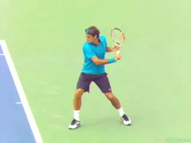
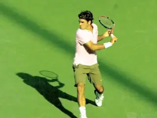
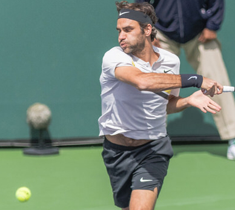
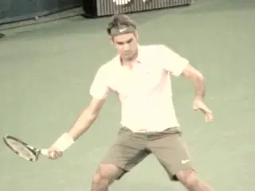
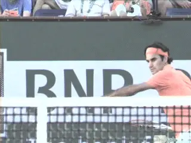
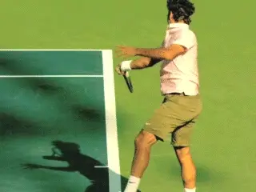
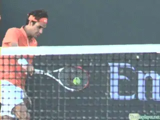
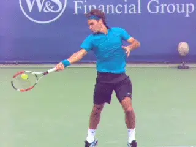

# Ball Watching - Part 3

### Paul Hamori, MD

I pondered all of the information I derived from my filming of Federer
and presented in the first two articles for weeks during my morning
workouts. ([link](Ball%20Watching%20-%20Part%201%20.docx) for
Part 1. [link](Ball%20Watching%20-%20Part%202.docx) for Part 2.)

Over the next eighteen months, I tested several different methodologies
to try to replicate what I saw in the photos. Ultimately, I came up with
the following four step summary to be executed as you approach contact.

### Four Step Summary

1.  **Turn your head towards your racket side.**

2.  **Focus (saccade or eye shift down) on the hand-racket complex.**

3.  **Narrow your eyes to cut out extraneous visual information.**

4.  **Resist the urge to follow your shot.**

While the downward saccade produces the perception of slowing or
stopping a moving object, narrowing the visual field cuts out extraneous
information and limits the vision to the hand and racket.

**What methodology would allow other players to replicate Roger's ball watching?Close Your Eyes**

In addition to this two-pronged approach to vision, closing your eyes
after you hear the contact allows the last visual information to be
transmitted to the visual cortex on a black background, making it more
prominent.

**Close your eyes after you hear contact.**

To demonstrate this, hold a tennis ball in your hand, stare at it
intently, and then close your eyes. For a brief period the image will
persist, as it is the last visual information in the pipeline to be
processed.

This same concept is used with MRIs and CT scans. After the scan, a
computer is able to remove background noise and increase the contrast to
create a higher resolution image.

**In summary, closing the eyes just after you hear the contact will send the image of the hand-racket-ball complex from the narrowed visual fields to your brain with no other incoming information to obscure it.Eye Motion from Start to Finish**

Now here's a summary of what your eyes should be doing as you prepare
to strike the ball.

**As the ball comes across the net, your eyes will track it in your frontal vision.** As you prepare to hit the ball,
your torso will begin to turn to prepare your racket. You continue to
track the ball over your front shoulder.

**When your torso starts to unwind, continue to watch the ball by turning your neck to the side of contact (toward your racket). This will minimize visual blackouts.**

**Just before contact shift your eyes to the hand and racket.Next, start to narrow the eyes to a slit in order to cut out extraneous information from your field of vision.**
This will allow for better focus on the internal reference points (i.e.
hand-racket complex and foot). It also puts the racket head directly in
the remaining lower field of vision, which has the best shape
resolution.

About one foot from contact, make a downward saccade (or eye shift) to
hand racket complex. This produces the perception of stopping/slowing a
moving object. You take your eye off the ball to put it back on the
ball.

**When you hear the ball hit the strings, you can either keep your eyes narrowed (and keep your head to the side) or even close the eyes briefly.This allows the last visual information in the pipeline to be transmitted to the visual cortex on a black background, which will make it seem more prominent.Take Your Eye Off the Ball**

You read that right. Approximately one foot before the ball reaches your
contact plane, purposefully take your eyes off the ball and move your
focus to your hand. Since your hand is moving more slowly than your
racket, it will be easier to track visually.

**Take your eyes off the ball when you turn your head toward the hitting side.Your proprioceptive senses will help you determine where your hand is in space and time, which in tum will allow you to find the racket head more quickly**. You will then be able to
perceive the racket head beyond your hand as it is touching the ball.

**To take your eyes off the ball, turn your head toward the hitting side and then saccade your eyes down to your hand**. **This will bring your internal reference points (foot and racket-hand complex) into your narrowed visual field.**

With this saccade you'll experience a very brief episode of blindness,
which you won't notice because your brain suppresses it. This episode
of blindness will seem to slow time in your mind, making it easier to
perceive contact.

Keep in mind that since contact lasts only four milliseconds, your
perception of the contact event will be extremely short, even if your
brain "slows down" time. You may perceive contact subliminally, or
just as a yellow flash.

I think we tend to imagine it being like us watching a slow-motion video
of our favorite pro, in which we can see the contact. But unfortunately,
contact in real time is too short to savor in this fashion.

**Don't Follow Your Shot**

I have heard a few teaching pros recommend that you don't watch your
shot as it heads hack to your opponent. It's a great idea in theory,
but very hard to do with your eyes open--you're just dying to see your
awesome shot.

**Instinctively, your head turns to follow the outgoing hall.This has to be consciously suppressed. Narrowing the eyes helps tremendously, closing them after you hear contact is absolutely effective.**

**Train yourself not to turn your head to follow the ball.When you don't follow your shot, you can focus on finishing the task at hand (i.e. your stroke), which leads to better contact, balance, and recovery.**

Surprisingly, not following the ball also helps to decrease anxiety
about what is happening with the hall and your opponent as Damien LaFont
has pointed out ([link](https://www.tennisplayer.net/members/classiclessons/mentalgame/damien_lafont/head_fixation/).)

**When your head turns to follow an outgoing hall, your body follows suit and can change the mechanics of the stroke.**
Like I said, this is easier said than done, as you want to see where
your ball lands. But there is one method that guarantees that you won't
follow your shot: closing your eyes briefly after contact.

**Once the shot is made, it is completely out of your control, and there is nothing you can do to change its trajectory.** However, your eyes should only close
briefly as you definitely need to see where your ball bounces, he aware
of your opponent's position (especially if they're at the net), and be
ever-cognizant of the shortened hitting cycle when you or your opponent
are at the net.

**Closing your eyes after your shot may not initially be practical in actual game play, but it is a great way to start training your brain to focus on the follow-through rather than worrying about where your shot is going.**

Take Federer's forehands as I noted in the last article, for example.
He almost never follows his shot. In fact, 82% of his forehands end in
narrowed or closed eyes. Even when his eyes remain fully open, he's
typically turned sideways and his eye line doesn't follow the shot.

**Because of the way your brain works you hear contact before you see it.The Brain**

To determine when you should close your eyes, let's revisit how the
brain processes contact. Contact happens in about 4 milliseconds.
Soundwaves take 3.6 ms to go from the racket to your ear. Then that
signal takes 50 ms to process. So the total time for sound is 53.6 ms.
That is compared to the 100 to 200 ms for vision.

In other words, you hear contact before you see it. By the time you're
hearing contact, it has already happened about 54 milliseconds ago.
Contact has already occurred, your shot has already been determined, and
it is therefore safe to (briefly) close your eyes at this point.

The ears, therefore, tell you exactly when it's safe to close your
eyes. If you close your eyes after you hear the contact, no further
visual input can interfere with the incoming visual information. This
may allow for contact to become more visually distinct in your mind's
eye.

When the eyes close after a shot, it is more a natural result of having
narrowed the eyes down to limit the visual field. After contact, closing
the eyes does not affect the shot at all. Plus, you have to blink
sometimes--better to do it after the shot than before or during the
shot.

Closing your eyes after contact doesn't hurt anything and is 100%
effective in preventing you from following your shot. But just as you
can follow-through in a wraparound fashion or a buggy whip fashion, you
may elect to narrow your eyes rather than closing them. In certain
circumstances it may even be best to keep your eyes open without
following the shot which is more difficult, but possible.

**When your follow-through comes across the body now look out at the court.**

A third follow-through that might be helpful for some players is that of
the head/neck turn. As your swing goes forward your head is turning
toward the contact side in the opposite direction of the outgoing ball.
If you allow the head to continue on this turn a little beyond contact
it will protect you from following the outgoing shot.

When your follow-through comes all the way across your body, your shot
should be completed and it's okay to look out at the court. On a
one-handed backhand concentrate on keeping your chest toward the side
fence and tuck your chin slightly toward your chest.

This will stop you from following the outgoing ball. These techniques
are particularly useful in situations where you are not going to close
your eyes after contact.

So that's it for my series! I welcome your comments and questions in
the Forum!

I began writing the book that is the basis for this article - [The Art
and Science of Ball
Watching](https://drpaulhamori.com/index.php/product/the-art-and-science-of-ball-watching/) -
in August of 2019 and finished it in January of 2021. In a sense,
though, I have been working on it since I started playing tennis
fifty-five years ago at the age of five. In high school I played four
years of varsity tennis in addition to sanctioned USTA junior
tournaments. I probably reached a 4.5-5.0 level. I considered playing
small college tennis, but by then I was burned out on the sport, and
knew that my pre-med studies wouldn't allow time for college tennis.

But tennis was in my blood, and I started playing again with a passion
after medical school. During this time, I really started to study the
technical aspects of the game.

My idea for the book started out with various technical ideas that I had
been kicking around by watching great players over several generations.
In the end I came to the conclusion that good racket to ball contact
depends on good ball watching. I wrote the book to teach myself how to
see racket to ball contact and my hope is it can help you do the same.
