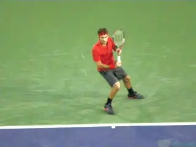
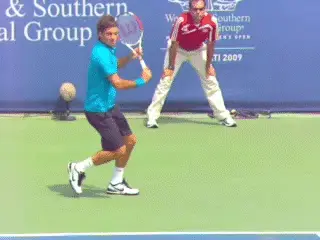
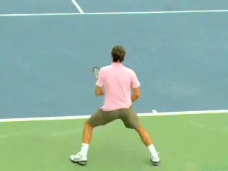
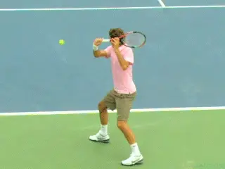
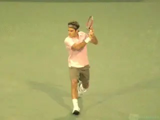

# 1-2 Rhythm - The Backhand Slice

### 1-2 Rhythm: The Backhand Slice

### Nick Wheatley

------------------------------------------------------------------------

**What are the keys in developing 1-2 Rhythm on the slice?**

Like all the groundstrokes, a well struck slice backhand slice has 1-2
Rhythm. However, there are real differences in the feeling of executing
1-2 Rhythm on the slice compared to the drive groundstrokes.

These differences are especially important to understand for players who
hit the one-handed backhand drive. ([link](1-2%20Rhythm%20-%20Forehand.docx) for 1-2 Rhythm on the forehand.
[link](1-2%20Rhythm%20on%20the%20Two%20Hander.docx) for the
two-hander. And [link](1-2%20Rhythm%20The%20Single-Handed%20Backhand.docx) for the one
handed backhand drive.)

**The differences in 1-2 Rhythm on the slice have to do in part with the shape of the swing. Butthe most important differences are in the relative role of the body and legs.**

There is some body rotation on the slice, but it is minimal compared to
the forehand or the two hander, and also appreciably less than the
one-handed drive. The same is true of the uncoiling of the legs. There
is noticeably less knee bend on most slices compared to the other
groundstrokes.

For these reasons, establishing 1-2 Rhythm on the slice means focusing
on the hand, arm and racket\--specifically the movement of the arm in
the shoulder in the forward swing. This is especially critical to
understand for one handers who go back and forth from the drive to the
slice.

**Note the differences between the slice and the drive in the knee bend and forward body rotation.**

Despite technical differences the same two distinct rhythm phases are
essential in the slice. As with the other strokes, Phase 1 is smooth and
deliberate, and Phase 2 has explosive energy.

So let's look at the physical positions of the body and the racket in
the two phases of the slice. Then let's see how to activate 1-2 Rhythm.
To do this, we'll analyze the greatest slice backhand in the modern
game\--the slice backhand of Roger Federer.

Like all high-level groundstrokes, the slice begins with a body turn.
When the shoulders have turned about 45 degrees to the net, the racket
hand is still positioned in line with the center of the torso.

The racket position for Federer is at this point virtually identical
with the drive, which facilitates disguise. But look what happens next.

Watch the continued path of the racket in the preparation and then the
path of the forward swing.

**Phase1: slow and deliberate with the racket wrapped behind the head.As the racket continues to go back it**actually wraps behind the
head**.** The face of the racket is slightly open and
the tip points behind Roger to the opposite sideline. The left hand is
positioned on the racket's throat.

It's important to note that the extent of this wrap can vary with the
player. It can also be less extreme when the player is returning serve.
As we will see, players at lower levels may also be more successful with
this less extreme preparation and also a flatter forward swing plane.

In any case, the execution of Phase 1 has the same feeling as Phase 1 on
all strokes. The technical position is different but the rhythm to get
there is smooth and deliberate.

**Phase 2 in the slice starts with the forward swing from the wrap position around the head. The hitting arm and racket accelerate along a high to low swing path towards the ball, with the hitting arm straightening out as it approaches contact.**

The explosiveness in Phase 2 is primarily in the movement of the arm and
racket. This is different from the other strokes where Phase 2 includes
significant energy from the uncoiling of the legs and the rotation of
torso. The driving force here is the shoulder, specifically, using the
shoulder muscles to drive the arm and racket down and through.

**Phase 2: Explosive acceleration forward and down.**

Watch how the opposite hand releases and stays behind the body to help
maintain balance, and also the sideways orientation of the body.

It's important to emphasize the energy explosion from the shoulder
because for too many players the slice is viewed as a passive shot. Many
players lose potential quality of shot because they poke, jab, or push
at the ball instead of hitting it with the force it warrants.

Studies have shown that the spin levels on a slice backhand at the pro
level can surpass that of the topspin groundstrokes, reaching over
5000rpm. ([link](https://www.tennisplayer.net/members/classiclessons/nick_wheatley/1-2_rhythm_backhand/).)
By thinking of the forward swing as very aggressive and full of energy,
players can get a lot more out of their slice backhand.

**A signature relationship in the pro slice is between the height of the hand and the racket head.** With this explosive
downward swing path, **the racket head can stay below the hand for the entire course of the follow-through with the racket tip actually pointing straight down at the court at some point in the swing.**

**The emphasis is on the shoulder driving the hand, racket and arm.**

But not all players\--or even most\--are dealing with pro level heavy
incoming balls much less replying with slices with 5000rpm of spin. This
means there can be a disconnect between the pro slice and the slice for
lower-level players. ([link](../../Stroke%20Analysis/Advanced%20Tennis/John%20Yandell-The%20Pro%20Slice-Stroke%20Components.docx).)

Players who blindly copy the extreme swing shapes of Federer's slice
may find they are leaving velocity on the table and hitting floating
balls that are not as effective or penetrating as they could be. In this
case the swing shape can be moderated.

The height and the wrap behind the head can be reduced. The downward
swing plane can be flatter and less sharp. One indication of a flatter
slice is that the racket head stays above the wrist in the
follow-through.

**Depending on the level, the positions associated with 1-2 Rhythm can be less extreme.**

The bottom line is that every player needs to find the level of
underspin and the corresponding swing plane that works for his game and
the incoming balls he faces. But learning the 1-2 Rhythm pattern will
maximize its efficiency and effectiveness. What are the keys for 1-2
Rhythm on the slice? Again, it is some combination of mental images and
words.

It can be a count of \"1\" then \"2\" corresponding with the speed of
the phases. The \"2\" should be associated with the acceleration of the
arm from the shoulder.

Another combination would be \"Smooth\" or \"Slow\" followed by
\"Extend!\" The second word again correlating with the downward and
outward movement of the hitting arm. If you develop a feeling for how it
works, you will likely come up with individual words or pictures of your
own.

So that's it for the concept of developing great rhythm on your
groundstroke\--in all varieties. What about the serve? Does 1-2 Rhythm
apply there as well? Yes! Stay tuned.

|  | His junior teams, the Hawker Jets, have won 44 |
|  | competitions since formation, and over the last 2 |
|  | years alone, his junior players have won 19 |
|  | singles tournaments between them at county level. |
|  |  |
|  | He has been ranked in the top 75 nationally in 35 |
|  | and over singles and in the top 5 in Surrey |
|  | county. Nick has done video analysis for numerous |
|  | players at all levels, including former British |
|  | Top 10 player Marcus Willis. |
|  |  |
|  | His unique teaching video series, covering every |
|  | aspect of the game, is available on his website |
|  | [www.nickwtennis.com](http://www.nickwtennis.com) |
|  |  |
|  | You can also |

------------------------------------------------------------------------
