# Building the Spanish Forehand-Stroke Shaping and Hand Feeding

**Building the Spanish Forehand:\ Stroke Shaping and Hand FeedingChris Lewit**

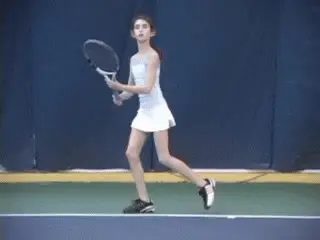

**Now let's start to look at the drills and exercises to build the Spanish forehand.**

In the first article in this series, I outlined the theoretical
framework I have developed for building the Spanish forehand, including
what I believe are the distinguishing technical characteristics of the
shot. ([**Click Here**](https://www.tennisplayer.net/members/classiclessons/chris_lewit/the_spanish_forehand/).)

These include: the shoulder turn and the coiling of the legs, extreme
body rotation through the forward swing, parabolic swing shapes, the
explosion into the air, and precise balance throughout, especially on
the landing.

Mastering these factors leads to the creation of maximum racket speed,
the holy grail of the Spanish forehand. Racket speed is what allows
players to produce a heavy ball combining velocity and spin in various
balances.

Now let's look at some of the drills and exercises I use with my
students. These are based on what I have learned in my studies with some
of the great Spanish coaches, taken from other famous coaches, and also,
what I have developed and evolved through my own teaching experience. In
this article we'll look at what I call Shaping Exercises and Hand Fed
Ball Drills. Then we'll move on to Racket Fed Drills and Power Building
Drills. We'll also address common problems that emerge when developing
the Spanish forehand at all levels.

**Manual Forearm Hinge**

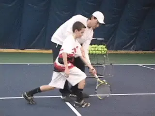

The Manual Forearm Hinge exercise is helpful for players who have
difficulty getting the feeling of the steep upward trajectory necessary
to achieve heavy spin. I'm a big believer in manual manipulation of the
body to help students learn particular technical movements. It can be
the difference in breaking through technical sticking points.

For players who have learned the classic linear forehand with a
relatively stiff forearm and wrist, this type of exercise and physical
manipulation can give them the feeling of the hinged, snapping forearm
action of the modern forehand.

**Forearm Hinge**

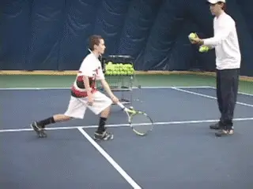

This second exercise is a progression from the first hinge drill, adding
a hand fed ball. The player takes the feeling of the shadow movement and
then incorporates it into generating topspin with the hinge movement. By
isolating the upper and lower arm with no legs or hip rotation, the
motion is simplified and the student is forced to hit the right
technical reference points if he wants to get the ball over the net. As
players get better at this movement, I will ask them to swing faster and
faster to achieve more speed and rpms.

**Extension Drill**

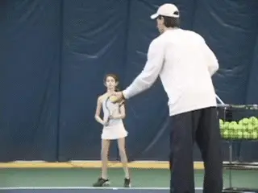

It is said that good coaches invent, great coaches steal. Here I'm
stealing from the work legendary Robert Lansdorp has done on
Tennisplayer. ([**Click Here**](https://www.tennisplayer.net/members/classiclessons/chris_lewit/building_the_spanish_forehand_exercises/famouscoach/robert_lansdorp/lansdorp_forehand_images/lansdorp_forehand.html) to
see Robert's article that includes his original version of this drill.)

The purpose of the drill is to force the player to extend through the
ball by holding the finish. But I've incorporated this extension with
more of a topspin focus and also use it with open and semi open stances.
Here I have one of my beginning tournament players get the feeling of
extending before taking the followthrough up and over the shoulder.
After she has developed a good feel for extending through the ball and
still hitting topspin, I can encourage her to try different finishes
such as to the side of the shoulder or low at the hip wraparound,
knowing that the extension component will be preserved.

**Parabola**

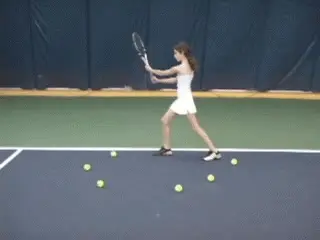

This shadow exercise gives players a visual of the Spanish swing shape.
It graphic demonstrates how this parabolic shape, differs from the more
traditional linear swing path. You can use balls to delineate the shape,
but chalk is equally good. One advantage of teaching on clay, the
traditional surface in Spain, is that the coach can draw the shape
directly into the court surface.

Following the parabola swing, the player first extends, and then
finishes across the body. After she reaches the extension point she
wipers right to left (from her viewpoint) with a low wraparound
followthrough. In this drill, the player can also work on driving from
the legs and staying on balance. In addition it helps the player feels
how full body rotation contributes to creating the swing shape.

**Circle Leg Drive and Landing**

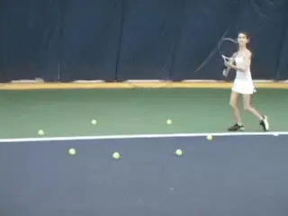

In this exercise, I'm breaking the old school rule by encouraging my
students to jump and rotate through the shot. I'm trying to develop
power and athleticism, coordination and balance. I'm trying to develop
the kinetic chain, starting with a great leg drive and transferring
energy up through the hips and core into the ball. This energy is then
harmoniously linked with tremendous arm speed. That's how you develop a
big, whipping forehand like Nadal or Verdasco.

I pay special attention the landing because that is how balance is
trained. Players have to land in the center of the circle and on perfect
balance. My player is making this look easy\--but try this
yourself\--and you will see that it is very difficult to load, explode,
and land with grace and balance, while maintaining body position in the
circle.

**Racket Speed Side Feed**

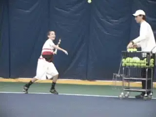

This is the all-time Spanish classic and I have seen many variation of
this drill in Spain. This exercise is hand fed from the side. It's the
number one drill that I use to develop power, racket speed, and
coordination of the different energy linkages.

This drill is generally for more advanced players who have the basic
swing shape and now need to develop coordination, timing, and huge whip.
Watch how the player is loading his legs, exploding upward, and
accelerating his arm at maximum speed. It's also a good first
progression for teaching kids how to hit a swinging volley, a very
important shot in the Spanish system.

I tend to do 3-5 sets of 10-20 repetitions in one lesson. You need to be
careful. You want to challenge the arm musculature to get a good
training effect but you don't want to overload the shoulders or
arm/wrist so much that the player is risking injury. So use common
sense, especially with players under 10 and with older adults, and ask
for feedback from the player as to arm fatigue.

If you are working with younger players who are just beginning to learn
that parabolic shape, you can let the ball bounce and work the racket
speed that way. Beginners will struggle to take the ball directly out of
the air at first, but can progress to that later.

All-in-all, this type of drill is the best way I know to build the
vicious arm speed and to get that heavy ball that typifies the modern
professional forehand. For those familiar with boxing, it's a bit like
working on the speed bag in the gym to train the fast twitch muscles.

**Racket Speed Front Feed**

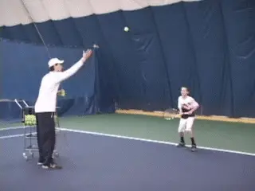

This racket speed drill is fed from the front, another variation of the
classic Spanish approach. The front feed also involves movement, so it
is more challenging. Players should develop proficiency with the side
feed first and then move to this drill next.

It's a great drill to simultaneously develop hand-eye, footwork and
positioning as well as the tremendous arm whip. The coach can vary the
toss direction and height to make the drill more difficult, depending on
the level. The same cautions about over use apply as with the side feed,
especially with players doing the drill for the first time or with adult
players.

**Defensive Heavy Ball**

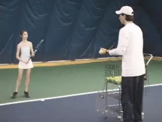

Here is a version of the classic Spanish defensive movement drill that I
have written about in a previous article for Tennisplayer. ([**Click Here**](https://www.tennisplayer.net/members/high_performance/chris_lewit/two_coaches_training_styles) to
see me doing this drill with an older, higher level player.)

The player retreats back to receive the ball, letting the height drop
between her hips and shoulders. Note she is using the characteristic
Spanish double-rhythm method of footwork to defend the court, as
discussed in the previous article.

She loads with an open stance and explodes upward into the ball. I'm
looking for smooth rhythmic movement along the defensive V, good
balance, and then huge leg drive and racket speed to create heavy spin.

This is a good all-around drill for developing defensive movement and
positioning and for introducing players to the tactical concept of
defense. Players should hit the ball on the fall on defense, so this
drill is key to help them get a feel for that concept. Players who
always take the ball on the rise or moving forward, need to practice
giving up court position and moving backwards. This is a classic Spanish
philosophy which has now become part of USTA Elite Player Development
curriculum, what Jose Higueras calls 360 degree movement.

**On the Rise**

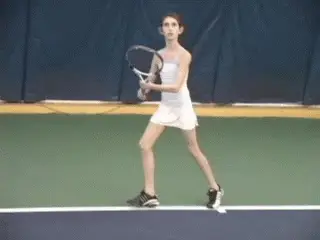

As I have written previously, I feel today's competitive juniors need a
complete game that combines defense and attack. I think it is equally
important to train them to take the ball on the rise, not just on the
fall. This is a basic drill that I do on regular basis to develop this.
I toss the ball quickly at the player's feet. The player must use a
whipping forearm action to pick up the ball on the rise. This is a
difficult drill, and the coach can vary the challenge by tossing faster
or slower. Although it is possible to hit the ball on the rise with an
open stance, I like to stress neutral stance here when developing the
concept of playing up and attacking the ball.

**Workshop Drill**

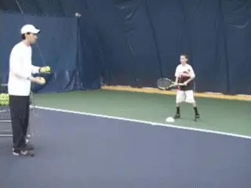

I call this my \"Workshop Drill,\" because this is the drill that I use
to build and rebuild technique and to work on proper lateral movement
and recovery. It can be paced very fast to challenge advanced students
or can be paced very slow to simply work on technical reference points.

When a coach is building technique, I believe that as much as possible,
the drills should incorporate movement, footwork and balance in
conjunction with teaching stroke mechanics. I only use stationary drills
only sparingly and when necessary, when a kid is really struggling with
a technical aspect.

I highly recommend this Workshop Drill as a basic structure when shaping
the mechanics of the Spanish forehand. In this drill, I pull the player
out wide towards the sideline. He must then execute a flawless technical
swing, and recover with the proper footwork back around the cone. It's
a simple drill, physically tiring, and a great way to build that
beautiful modern forehand shape.

I recommend multiple sets of 10 balls with young beginners, and 5
repetitions for really young players between 5-7 years old. I emphasize
perfect form, balance, and movement mechanics. For older and more
advanced players, you can push them by doing the exercise faster to
develop quickness, or make the drill even more demanding by increasing
the repetitions to 20 or more balls.

**Emergency Drill**

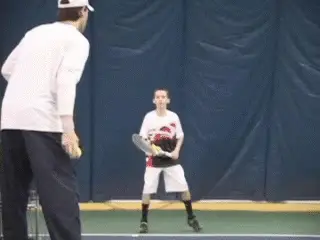

The Emergency Drill is great for developing quickness and adaptability
on the run when a player is in trouble. The animation shows a variation
of a drill that I stole from Luis Bruguera, the legendary Spanish coach,
and father of Sergi, with whom I have had the privilege to study.
Classically the Spanish defend a tough emergency shot with high topspin,
to save the rally and work back into the point.

Other more aggressive approaches would teach a go-for-broke on the run
style, but for slow clay court play, high spin is the right shot on the
run. I try to teach my students that it is okay to go for broke on the
run depending on the score, situation, and surface. I recommend teaching
students both a high spin shot for emergencies and a go for broke power
drive.

This exercise provides a natural opportunity for players to work on
developing their \"reverse forehand \" finish technique, a term
popularized by Robert Lansdorp. ([**Click Here**](https://www.tennisplayer.net/members/famouscoach/robert_lansdorp/lansdorp_reverse_forehand_revisited/lansdorp_reverse_forehand_revisited.html) to
see his latest article on that topic.)

Watch how my player demonstrates a nice reverse finish in this clip,
applying extra topspin and height to the ball to give him time to
recover and grind!

**Uncle Toni's Favorite**

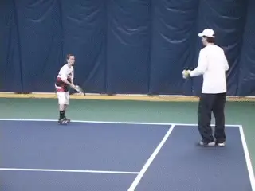

This drill is rumored to be a favorite of Rafa's coach, Uncle Toni. I
believe Jose Higueras is also using a variation of this drill now in the
curriculum for the USTA Elite Player Development. The idea is to push a
player forward and back developing his footwork, spin and whip, and ball
control.

I like using this drill with my advanced players. You can move the
player forward all the way to the net and then all the way back, or
change directions and move back and forth in the middle of the drill.
This drill also helps players develop natural feel for the reverse
finishes.

In this drill, I'm feeding the ball low and my player has to use his
forearm whip and hand speed to control the ball at his feet. Pato
Alvarez, a famous Spanish coach, also does a variation of this drill but
focusing more on the rhythm footwork and higher balls.

So that's it for shaping and hand feed drills. In the future I'll
present the racket fed drills I use, plus strengthening exercises, and
some of the common problems I see developing the Spanish style modern
forehand. See you then!

**Special thanks to my students Sean Mullins, Will Coad, and Lia Kiam for the doing the awesome demonstrations of the Spanish forehand that made this article possible.**

