# Constructing the Kick

### Chris Lewit

In my first article on the kick serve, I broke down the kick motion into
its important technical elements\--the \"building materials\" so to
speak. ([Click
Here](http://www.tennisplayer.net/members/classiclessons/chris_lewit/keys_to_the_kick/keys_to_the_kick_page1.html).)
Now comes the exciting part: the actual construction project! In this
second article, I will describe how to take the materials and engineer a
beautiful, mechanically sound kick serve\--like building a house\--step
by step.

Building a great kick is much harder than merely accurately describing
its working parts. In my experience, even with a good athlete, the
entire project can take 12-24 months. It simply takes time before the
serve is ready for the pressures of competition. Even after this initial
mastery is achieved, there is still the need for continued refinement
and maintenance.

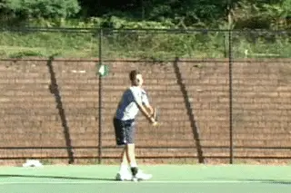

**Let's engineer a beautiful mechanically sound kick serve!**

Over the course of this process, the player should go through four
distinct stages. So pay close attention, hold on tight to your mouse,
and here we go.

|  |  |
|  |  |
|  | **Make sure you start with a strong continental grip and a good foundation stance.** |

+----------------------------------------------------------------------------------------------------------------------------------------------------------------------------+                                                                                                                                                                            |
|  |  |

Stage 1 is the foundation in which the player masters certain beginning
fundamentals. When a player first comes to me looking to learn a kick, I
make sure that he has a good starting stance and a strong continental
grip, as discussed in the first article.

### Stage 1: First 3 Months

**Laying the FoundationMastering Beginning Fundamentals**

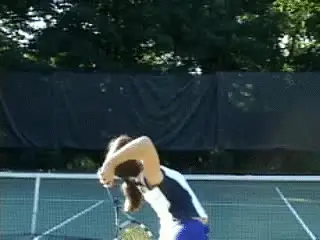

**The TED is the foundation drill for building the kick. Note the buttstratch and the high elbow position.**

### The TED

From that jumping off point, with rare exception, we will work for
several days up to several months on one fundamental exercise and its
variations\--the **Triceps Extension Drill or what I affectionately like to call TED. This is Exercise One!**

The purpose of the Triceps Extension Drill is manifold. Firstly, it
breaks the player away from his old serve motion and the bad habits
usually contained in that motion. I almost always find I need a clean
slate if the player is really to practice the key technical elements for
the kick. So this drill becomes the \"workshop\" for many of the most
important beginning fundamentals of the kick serve.

The other primary purpose of the TED drill is to work on strengthening
and coordinating the critical triceps snap upward to the ball. In my
opinion, most players fail to master the kick serve because of failures
in this critical phase of the motion. So I focus a majority of my time
with a student on this area. Lastly, this drill breaks down the
complicated full serve into a simpler motion. This is critical so that
the student has an easier time learning and practicing the fundamentals.

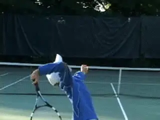

**As the player masters the TED move it back toward the baseline.**

### Steps to the TED

Here are the steps to execute the TED: **The racket must be positioned in the buttscratch position and the arm and racket held down all the way down. The elbow points to the sky. This is the axis point for the triceps extension.**

To create this position I like to physically manipulate the player,
forcing the racket down and the elbow up to help him or her feel the
depth of the buttscratch. I want the players to learn to serve from this
position. This is the essence of the TED and the first building block of
the kick. The player can start close to the net and, as coordination and
strength develops, can take the TED back to the baseline.

**Next I encourage my students to toss over the shoulder to 11 o clock. Now from the buttscratch position, they work on scraping up on the ball with the triceps and then the hand. The motion should have the shape of a fan, with a windshield wiper-like motion from left to right. During the toss, the racquet MUST stay down on the butt and the elbow MUST remain pointing to the sky until the last split second. Then the snap is executed as quickly as possible.**

A common problem when learning the TED is for the elbow to drop and the
racket to inch upward while the player is tossing. This ruins the
benefit of the drill. Dropping the elbow causes the player to shorten
the runway and practice the wrong trajectory on the upward swing.

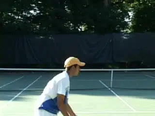

**In the TED I evaluate the status of the building blocks outlined in the first article.**

### Fundamental Elements

While I work on this drill with my students, I note whether they have
previously attained the various elements I outlined in the first
article. These elements include touching the chin with the tossing arm,
good tossing technique, keeping the head still, the back arch, the
shoulder tilt with hip into the court, the hip drag, the body extension,
and so on. (Again, [Click
Here](http://www.tennisplayer.net/members/classiclessons/chris_lewit/keys_to_the_kick/keys_to_the_kick_page1.html)
for the first article.)

If any of these critical elements are missing, I will work on them in a
series of variations in the Triceps Extension Drill. I make sure they
can master these elements in the TED first before we move on to Stage 2.

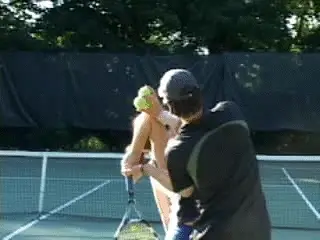

**Shadow Snaps with or without the help of the coach develop racket head speed.**

### Shadow Snaps

Shadow Triceps Extension: This drill reinforces the proper form in the
triceps extension. It also helps to tire out the triceps and therefore
strengthen the student's ability to really snap and create racket head
speed. To do the drill, the player does 5 to 10 Shadow Snaps, followed
by an actual serve. These sequences of shadow snaps followed by an
actual TED serve can be repeated multiple times as the student
progresses.

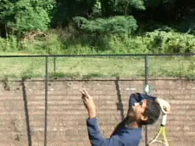

**In this drill the player learns to keep his head still throughout the swing.**

### Still Head

Since head position is critical in the service motion, and this is one
of the key factors I look for in the TED. If the player has problems
keeping his head up and eyes on the contact, I do the Head Still Drill
in which the player must keep the head still throughout the swing. The
player hits the ball but keeps the head in the same position as at
contact. This drill is very beneficial for any player who has a problem
dropping his head before contact, especially under match pressure.

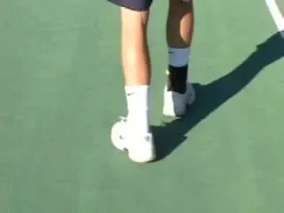

**The Tippy Toes Drill creates the feeling or reaching up and prepares the lower body for jumping.**

### Tippy Toes

The Tippy Toes Drill has two benefits. First it helps the player work on
his body extension. It creates the feeling of reaching upward to the
ball as fully as possible, extending the contact height. The second
benefit is that the drill begins to prime the lower body for leg
activation or jumping, which is a critical element in Phase 2. To do the
drill the player must work from the TED but hit the ball while standing
on the toes of both feet. The player then must maintain this position,
standing on Tippy Toes after the hit and until the follow-through is
complete - a great way to train balance.

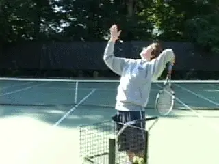

**Using the coaching cart helps players feel the torso angle at contact.**

### Hip Drag and Balance

The Hip Drag and Balance Drill helps players feel the proper angle of
the torso at contact on the kick. By keeping the feet stable it also
helps balance. As we saw in the first article, this is a critical point
as many servers open the body to the net too much too soon. By keeping
the right foot anchored, the player can feel how the concept of the hip
drag - or how the lower body stays behind at the contact.

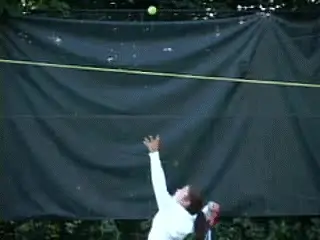

**The High String Treatment teaches players to use spin for net clearance and to drop the ball in.**

### High String Treatment

The High String Treatment is an additional, great supplemental drill for
Stage 1. I use the Airzone device because it is a helpful aid to
learning the kick serve. ([Click
Here.](http://www.oncourtoffcourt.com/p-123-airzone-system.aspx)) I have
no affiliation with the company, and I usually hate gimmicks, but this
tool works well as a visual aid for the player. I want my student
hitting kick serves that are clearing the net by at least 3 feet with
arcing topspin, and the Airzone demonstrates visually when they are able
to achieve this.

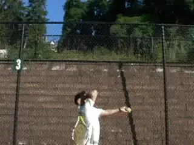

**Can you hit up on the ball enough to make it over the back fence?**

### The Back Fence

Over The Back Fence is a more extreme version of the High String
Treatment. Believe me, you really have to hit up on the ball to make
this work. The idea is to stand right by the back fence and hit up on
the ball with enough spin to get it up and over. Another less extreme
version of this is to try to serve on the court dividers on indoor
courts. Those are the curtains that usually hang between the courts.
Just be careful that you don't annoy the players on the next court!

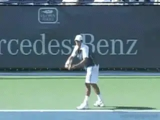

**The Triceps Strengthening Drill is a kick serve-specific drill.**

### Triceps Strengthening

The Triceps Strengthening Drill can be done with a light dumbbell, a
therapy band, or even a water bottle. This exercise strengthens the
muscles used in the serve motion with a sport-specific movement. By
building strength in this fashion, it also helps students with the
coordination and timing of the upward snap. Stay tuned for the next
article with more kick serve-specific strengthening exercises.

I want the student to do literally hundreds of reps, broken down into
sets that are appropriate according to age and/or current strength
level. The idea is to work the triceps until the muscles are very sore.
You can do it everyday with one or two days per week off.

**So Be It**

If all this takes several months, so be it. The time it takes to master
the fundamentals in the context of the TED depends on many variables:
talent, practice time per week, focus, severity of the prior bad habits,
etc. But with a good athlete without ingrained bad habits, initial
mastery sometimes happens in a period of mere days.

**All this work is to generate Zing on the kick like the best players.is usually slow and steady, not meteoric.**

But the timetable isn't the focus. Nor can the focus be on how good the
end product seems, or on where the serve goes. The focus must be on the
technical checkpoints. The key is understanding and trusting the system.
Some players give up in this stage because they think they are not
making progress. Players who focus on outcomes can get discouraged too
easily because the process is usually long and difficult. Progress is
usually slow and steady, not meteoric.

The holy grail of the Triceps Extension Drill is a serve that generates
a high pitched \"zip\" or \"zing\" caused by the racquet strings
brushing the ball for spin. The sound needs to be executed and the
resulting ball must travel in a steep arc over the net.

Once the player can execute the Triceps Extension Drill flawlessly,
hitting a high arcing topspin ball over the yellow string of the
Airzone, while maintaining all the critical technical elements mentioned
above, I move them to Stage 2.

### Stage 2: 3-12 months

**Completing the FrameworkLinking the Fundamentals**

You can start the Explosive Jump Drill from the TED, but then work it
into the entire motion.

### Leg Drive

The leg drive is the next critical technical element that should be
introduced. The key exercise here is what I call the Explosive Jump
Drill or EJD.

I recommend working on the leg drive from the TED rather than waiting
until the full motion is put together to work on the jump. The reason is
that many players have trouble coordinating their lower body for the
jump on the serve. The TED drill simplifies the motion, letting the
player focus on the jump mechanics.

I start off having the players do the jump without the ball. I focus on
the distance and height of the jump and proper balanced landing kicking
the right foot up and back. I want my players to \"stick\" the landing,
like in gymnastics, and this is a great way to train dynamic balance.

Oftentimes, players will jump only off the front leg, especially players
who step-up on the serve. Make sure the back (right) leg is driving in
synchrony with the left. Once they can make the jump and the landing
without the ball, they progress to the actual hit. The toss will have to
be placed higher and farther in front to accommodate the more explosive
leg drive.

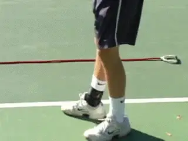

**You can start the Explosive Jump Drill from the TED, but then work it into the entire motion.**

I like players to practice the jump about times weekly, doing 3-5 sets
of 12 repetitions: They should alternate between shadow sets and sets
actually hitting the ball.

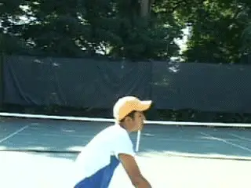

**The Windmill teaching fluidity and cohesive motion - by itself, or followed by a hit.**

### The Windmill

The next drill in Stage 2 is the Windmill, one of my favorite, classic
drills for developing the kick. The windmill teaches students rhythm,
fluidity, and continuous motion. It elegantly brings all the technical
elements together into one cohesive working motion

I like players to practice the Windmill daily with one to two days off
per week. I have my players do hundreds of repetitions until the arm and
related shoulder musculature are very tired. There are many variations.
For example, start with 10 shadow repetitions, then hit one serve. As
the player grows stronger and more coordinated, titrate down to 5
repetitions, 3 repetitions and finally only 1 shadow repetition before
the serve with ball.

Try to keep all the technical elements in check during this drill while
keeping the motion smooth, flowing, and continuous. There is no use
practicing this motion without hitting all the checkpoints.

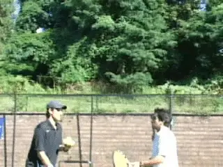

**The Racket Speed Drill forces players to swing faster on the kick.**

If the player cannot hit all the checkpoints in the Windmill, he must
spend more time in the TED to master the fundamentals. Common areas to
look for problems are the L shape in the serving arm and the elbow
position before triceps extension. Another problem to avoid is swinging
the racquet back parallel to the baseline rather than perpendicular to
the baseline.

### Racket Speed

During the later months of Stage 2 racquet speed becomes extremely
important to get more spin. The Racket Speed Drill is great to encourage
a student to swing as fast or FASTER on the second serve than the first.
Students must understand the second serve paradox: the faster they
swing, the SAFER the serve will be, if they are scraping the ball.

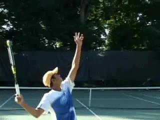

**The L Shape: The intermediate drill between the TED and the windmill.**

### The L Shape 

For players who are struggling to get the feel of the trophy position
during the Windmill, I will have them utilize the L shape drill. This is
a serve that starts from the trophy position.

The L shape is the intermediate drill between the TED and the Windmill,
using a half motion, which makes the technique easier to master than the
full Windmill. The player starts with the racquet up, making a 90 degree
angle between the upper and lower arm - the L shape or classic throwing
motion.

Then the player tosses, positions the elbow and snaps from the triceps
up to the ball. The key is to maintain continuity when working from the
L shape to maintain the elements in the TED. The racket should move
quickly and never pause in the buttscratch.

### Stage 3: 12-24 months

**Completing the Construction ProjectAchieving Mastery**

In Stage 3, I use a combination of exercises. This depends on my
assessment of a player's areas of weakness. Many combinations of the
Windmill, the TED, the EJD, or the other variations can be utilized as
needed. You need to have a good understanding of all the technical
elements and the intuition to feel what drills in what combination can
help you or your player to overcome specific problems in the motion.

In Stage 3 the player should use full topspin motions on BOTH first and
second serves. I STRONGLY recommend that players working on this serve
hit only kick serves for the next year or even two.

Hitting variations of the kick on both first and second serves will
incorporate the motion into mind and body.

In my opinion, one of the most common reasons players fail to learn the
kick motion is because they try to play with the flat, slice, and kick
all at once, rather than focusing on just the kick motion. The kick is
so difficult to learn\--there are so many technical areas to
master\--that rarely can a player practice a kick and then switch back
and forth successfully between the other variations during a practice
set, much less a match.

This is why it is so much easier and more effective for a player to use
the kick on both first and second serves for many months until the
motion and related mechanics are truly incorporated into the body and
the mind.

This kick-serve-only developmental rule helps my students permanently
assimilate the kick with little chance of reverting back to old habits.
Another added benefit of forcing players to hit only kicks: they will
have to learn to win with their groundstrokes rather than by banging big
first serves as so many young kids (especially in the US) try to do.

In the beginning, any topspin is good topspin. As the player gets more
advanced, the ability to change the type of topspin becomes important.
Again, I outlined the three variations in the first article. These are
what I call the Slice Topspin, the Twist, and the True Topspin. Learning
the hand and wrist nuances of the slice topspin, twist, and true topspin
serve is one of the final steps in truly developing the kick serve into
a versatile, flexible weapon. ([Click
Here](http://www.tennisplayer.net/members/biomechanics/brian_gordon/upward_swing_part_1/upward_swing_part_1.html)
to read about the differences in the upward swing to produce the
variations.)

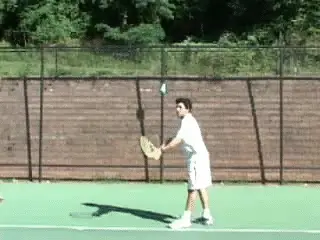

**Hitting variations of the kick on both first and second serves will incorporate the motion into mind and body.**

Related to this is using the different variations to hit in different
directions to different spots. These include pulling the opponent wide
in the ad court, but also placing the ball deep and away from the player
down the T in the deuce.

### Stage 4: 24 months - Whole Career

**Additions and MaintenanceNuances, Embellishments, and Touch-ups**

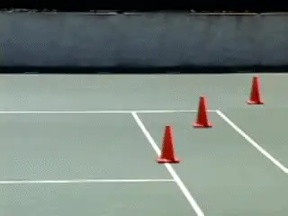

**A final step, mastering the three variations in the kick.**

As the player continues to develop he should always be working to
develop additional racket speed to get an even heavier, higher bouncing
kick.

**Strengthening and Flexibility**

I believe that all players who are learning a kick serve should be
developing core strength and flexibility. Well respected former German
National Coach, Richard Schonborn, has called this critical core area
the \"muscle corset.\" In the next article, I'll lay out the muscle
corset training program my students regularly follow, along with some
other important training/prehabilitation exercises that will help reduce
injuries on the kick and make the serve more powerful and explosive. But
suffice it to say for now: every young player should work with a
competent athletic training professional or coach to develop the
critical core strength and flexibility before or concurrent with
learning the kick

I have taught hundreds of beautiful kick serves by following this
system. Of course, it is impossible to fully describe every possible
drill variation, pitfall and error/correction in this article. But I
have tried to distill my system and clearly explain the guidelines and
essential exercises that have helped my students develop this difficult
serve. Building a world-class kick is a challenging project but by
following this system I believe just about anyone can teach or learn
this serve.

