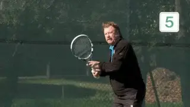
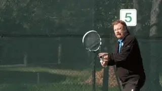
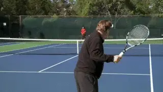
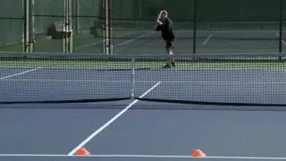
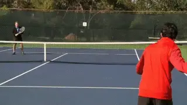
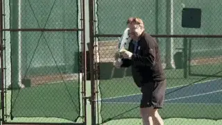

# Effective Practice

### Rob Heckelman

**What are the 4 steps to solidifying improvement in competition?**

In this series of articles, we are looking at adult tennis and the paths
to improve and enjoy the game the most. In the first part we looked at
the surprisingly wide range of opportunities to compete and even travel
internationally. ([link](On%20Your%20Mark,%20Get%20Set,%20Go%20Slow.docx).)

Now let's turn our attention to game improvement, and the critical role
of drill games. Although this article is directed to adults, the
approach I am outlining also applies across all ages.

**Make Practice A Pleasure**

One of the real pleasures of having tennis as an adult avocation is the
experience of learning and improving your skills. As young players we
sometimes practice because we are told to. As adults we practice because
that is what we desire. It something we choose to do with our precious
time.

But most players, however well intentioned, make a major mistake in how
they practice, and this prevents them from improving. They take a lesson
and then jump into a match and wonder why what seemed so simple and so
great with their instructor is now impossible to replicate.

Solidifying change is progressive. You can't go from a lesson to a
match. Intermediate competitive situations, or drill games, are
necessary to build your confidence under pressure. Without them you are
wasting your time and money if you are truly committed to raising your
level.

**Four Steps**

Research shows there are four steps in completing any technical or
tactical change. The steps are defined by both your level of competence
and your awareness of that level.

**To create non-cognizant competence you need drill games.**

You start by being non-cognizant incompetent. Next you become cognizant
incompetent. The third stage is cognizant competent. But the goal to
become non-cognizant competent.

The first three stages seem logical and can be reached in typical
lessons. But the last stage is the critical one, and the one most
players never reach. **Being non-cognizant competent means you are able to physically execute without having to think and process what you are doing verbally.**

Most players think they know what they need to do. But they never
actually change because they are always thinking about what they need to
do in match play.

**The correct process is to identify a phase of your game you would like to change and learn how to correctly perform that change.** But then you must combine add a
competitive dimension to your practice, through drill games such as the
ones outlined below. This competitive element is crucial in integrating
change. It is also what makes practice fun.

In this article I want to outline 4 tremendously effective practice
games, one for the groundstrokes, one for the volleys, one for the
serve, and then one for winning service and return games. When you are
able to execute in these drill games, you are ready to execute in match
play.

**Grounstrokes 21**

Playing groundstroke points to 21 is a classic practice game. But I like
to add an initial twist which makes it simulate match play more closely.

**How you start backcourt games is what makes them realistic and effective.**

In the typical version of this game, both players start at the baseline.
One person puts the ball in play, and from there you play out the point.
The first to win 21 points wins the game.

But if the ball is put in play down the middle, there is a tendency to
continue to hit the ball directly back and forth, exactly what you
don't want to do during match play. I refer to this as the \"Companion
Syndrome.\"

To correct this, I modify how the first ball is put in play. Either
player can start the point, but they must start it by hitting the ball
crosscourt.

This creates angles and strategy from the get-go. You can alternate the
start from one side to the other. Or play 5 points on one side and then
shift. Vary it to keep things fresh.

The point is to work on changes in your groundstrokes in the context of
competitive backcourt points without having to deal with an actual serve
or return. You'll get far more repetitions this way, as well as the
opportunity to win points based on sound geometric patterns.

**Solo Serving**

I actually came up with this game when I found myself at the courts with
no one in sight to play with. Solo serving is great for a couple of
reasons. First you don't need a partner. Secondly as you improve you
can increase the difficulty step by step. But I like it because, like
the other games in this article, it creates pressure to execute, but
less pressure than a club or league match.

**The imaginary defeat of great players through increased serving accuracy.**

In this game, I usually gave my invisible opponents names, like Pancho,
Rod or Jack. Today it might be Roger, Rafa, and Novak. As I improved at
the game, I seldom lost and of course felt very proud about beating some
of the top names in the sport.

Before your first serve, pick a target area, for instance, the backhand
corner of the deuce court. If your first serve misses, then on your
second serve you only have half of that area. Miss the second serve and
you lose the point. Continue this pattern and play an entire game.
Change the target areas to develop your mastery of the entire service
box.

The more advanced you become, the smaller you can make the target areas.
This type of practice is far more entertaining than just going out and
blasting practice serves.

The fun will result in longer practice sessions but also, tremendous
increases in serving accuracy. And the ability to place both serves
consistently under pressure. After all you have already done it
successfully against some of the greatest players in tennis history.

**5 Volley Game**

I came up with this drill to intensify the type of practice needed to
become a consistent volleyer. You can use the full court, or half of the
court.

**The half court volley game develops consistency and confidence.**

If you use half of the court, you can play this game down the line or
crosscourt. The baseline player puts the ball in play. The object is for
the volleyer to keep the ball in play for a minimum of five times.

If the net player can hit the ball five times in a row, he wins the
point. If the net player misses a volley before reaching five, the
baseline player gets the point. If the volleyer hits a winner, the two
players start back at zero, and no points are awarded.

Play to five, and then change positions. The amount of times the net
player has to keep the ball in play can be changed to accommodate the
level of the players.

To make the drill even more difficult for the net player, make it a rule
that the volley must land beyond the service squares. This drill is the
perfect first step for the aspiring attacking player.

It teaches the player that consistency is the key to commanding the net.
When you don't make errors at net, the baseline player is forced to
perform. Under pressure many opponents can't.

**Volleyball Scoring**

Volleyball Scoring is a drill game that puts an emphasis both on holding
serve and being able to break. Spin to find out who serves first.

**Volleyball Scoring: serving to score points and returning to gain scoring position.**

The rule difference is this: in volleyball scoring you can only win a
point when serving. To take over as the server you need to win two
consecutive points as the returner.

Instead of just winning 4 points to hold serve, the server must now win
11. The returner on the other hand sees the critical importance of
breaking serve. Without doing so, he is unable to score at all.

It's a great game and can be very dramatic. As you improve you can also
play to 21 points combining the basics of the game with endurance.

Master these 4 drill games and you can raise your game a full level or
more. A final point about practice partners. They don't all have to be
at your level of play, hopefully there will be a mix, and you can enjoy
playing these drill games against different levels and quality of balls.

In fact, that's recommended! So, take your time. Work on the changes
you need, practice correctly, and enjoy the experience of growing your
game!

                                                                                                                                                                             formerly the youngest head pro at the John
                                                                                                                                                                             Gardner Tennis Ranch in Scottsdale, Arizona,
                                                                                                                                                                             and has been ranked numerous times in Northern
                                                                                                                                                                             California seniors play. He is the author of a
                                                                                                                                                                             book on senior tennis, called "Playing Into the
                                                                                                                                                                             Sunset" as well as the "Business Handbook for
                                                                                                                                                                             Tennis Pros." In addition to his reputation as
                                                                                                                                                                             an outstanding teacher and coach, Rod speaks
                                                                                                                                                                             widely within the tennis industry on all
                                                                                                                                                                             aspects of instruction and club management.
  --------------------------------------------------------------------------------------------------------------------------------------------------------------------------------------------------------------------------
                                                                                                                                               California for the last 30 years. He was
  -------------------------------------------------------------------------------------------------------------------------------------------------------------------------- -----------------------------------------------

  --------------------------------------------------------------------------------------------------------------------------------------------------------------------------------------------------------------------------
