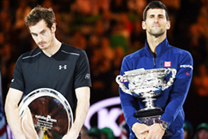
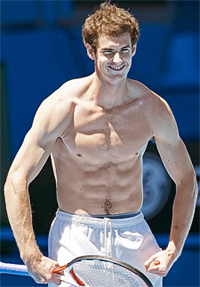
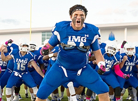
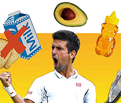
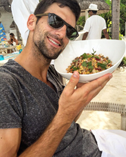
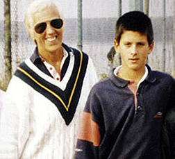

# Invisible Greatness: Fitness, Diet, and the Open Mind

### Nate Chura

------------------------------------------------------------------------

**Why does Novak dominate Andy?**

In part 1 of this series we heard from some of the smartest people in
tennis weighing in on some of invisible factors that make critical
contributions to greatness. [link](Invisible%20Greatness.docx)
Let's continue to explore the mystery in this second article looking at
elements including fitness, diet, classical music, and the role of an
open mind.

**What is Conditioning Really?**

When you look at the top-50 tennis players in the world, men and women,
they all look incredibly fit and strong. How can you tell which one is
\"stronger?\" Is superior conditioning an invisible element?

Why does Novak Djokovic beat Andy Murray? Does strength or conditioning
have something to do with it?

Murray is 29 years old, 6'3\" tall, and weighs 185 lbs. Djokovic is
also 29 years old, 6'2\" tall, and weighs 172 lbs. So Murray is an inch
taller, weighs 13 pounds more and to appearances seems significantly
more muscled. Could those physical differences actually make a
difference?

Emilio Sanchez explained in the first article that every player needs a
way to win 25 points in a set. How long can a player keep up those shots
or patterns? How does the extra weight/muscle affect Andy over the
duration of a match? Or does it?

**Are the muscles a positive?**

\"If I am very good and I can win my twenty-five points for half an
hour,\" says Emilio, \"that is not good enough to play Djokovic. I need
to be able to do it for three, four hours---like Novak himself. So, the
quantity of time that we need to do what we do well has today become so
important.\"

Emilio believes that there is more to superior physical conditioning
than power, speed, endurance. \"One of the qualities that we don't see
that is key,\" says Sanchez, \"is injury prevention,\" a dividing line
between Murray and Djokovic over the last couple years. Again, is
physical training an invisible factor in that?

**Super Compensation**

Sanchez also mentioned another strength conditioning concept that was
foreign to me, but that he believes is a critical factor in the game:
super compensation, \"to have your body ready to do more than it ever
has.\"

I spoke with Scott Gadeken, head of physical conditioning at IMG
Academy, in Bradenton, Florida, to give me a better understanding of
super compensation and how the best athletes in the world are
implementing it in their training.

\"**Super compensation**,\" says Gadeken,
\"**is a concept of really taking an athlete to the point, almost, where they're gonna over-train. You're taking them to the point where they need a break, then when you get that break, you come back refreshed and you see gains.**

**How do they train football players at IMG and does that relate to tennis?**

\"For example, with some of our athletes right now, our major league
baseball guys and some of our football guys, we're almost to the point
where they're beat down. They're dead tired. We take a little bit of a
break. We regenerate the legs. We rejuvenate the body.

\"They come back after that, and they see gains and they see
improvements even far beyond they had when they were actually training.
So, a lot of times you don't get bigger. You don't get stronger. You
don't get faster. When you train you see the improvements after you let
your body have time to recover and regenerate. That's where super
compensation comes from.\"

And here's where another important element of the invisible game comes
into play: a player's schedule. Capitalizing on good training habits
hinges on scheduling your practice, training, match play, sleep, meals,
etc. properly. The best tennis players in the world are not planning
their schedules two weeks in advance.

\"It's almost like you need to start back at the beginning of the year
and map it out,\" Gadeken says. \"Then we work backwards from there. And
that's how we base our training, based on what's going on on the
court. 'Cause if they're killing 'em on the court, we can't
necessarily kill 'em in the training room here. It's kind of like
finding those dates and then communicating so that everybody's on board
with the plan.\"

Then I asked Gadeken what he thought the single-most important factor in
sports performance was. I was shocked by his answer.

**Most junior players don't do enough of this.**

\"We've found the biggest contributors to success are rest and
recovery,\" he said. \"Sleep for one thing. Most kids don't get enough
sleep. Most of them are up too late texting, emailing, doing Facebook,
all that stuff.

\"It's not really about working harder. It's about working smarter.
Thinking of yourself as a twenty-four hour athlete, that's the concept.
You might be with us for only an hour, you might only be with the
coaches for two or three hours, but it's the other nineteen or twenty
hours out of the day that are going to dictate your performance.

\"Are you hydrating? Are you eating breakfast? Are you snacking between
meals? Are you taking care of your body? Are you resting? Are you
recovering? Are you taking some naps when you can get naps in? Are you
getting eight to ten hours of sleep every night? If you do those things,
you'll get the benefits out of your training. Somebody that gets four
hours of sleep can't burn the candle from both ends.\"

Most players at the height of the modern game subscribe to this
philosophy. From the 100th-ranked player in the world to Novak Djokovic,
tennis professionals are always looking for ways to get that extra
edge\--hopefully not with banned substances. But putting it all together
for an individual athlete? When we consider everything there are more
questions than certain answers about the invisible effects of all the
elements in conditioning.

**What role does diet play in Novak's dominance?No More Pizza**

Diet is definitely a factor Djokovic believes was critical to his
success. He wrote a book about it. ([link](https://www.amazon.com/Serve-Win-Gluten-Free-Physical-Excellence/dp/0345548981).)
Though it's pretty much common knowledge that Djokovic eats a
gluten-free diet, there was a very interesting and invisible component
in his decision to implement this change in his lifestyle.

In July of 2010, while at a tournament in Croatia, Djokovic was
approached by an eccentric doctor who said he thought he could explain
why the tennis star was breaking down at pivotal moments in his matches.
As Djokovic explained it, \"Dr. Cetojevic\" had him place a slice of
bread on his stomach while the doctor performed a series of odd
resistance tests.

At the end, the doctor concluded Novak was sensitive to gluten, the
protein in wheat, barley, rye, and other common breads. \"This seemed
like madness,\" wrote Djokovic in his book Serve to Win.

Djokovic speculates that because he relied on bread and dairy for most
of his life (his parents owned a pizza parlor), with age he became
increasingly intolerant to them.

\"When we're young,\" Djokovic explains, \"our bodies can work through
many of the challenges we present to them. When you're young and
strong, you can fight through the bad food, the stress, without
necessarily getting sick or fatigued. But as we get older, and we stick
to the same way of eating and living, we experience problems. We need to
make changes to the way we eat.\"

**It's what you eat but also when and how.**

Here's where it gets interesting.

\"I said at age six that I wanted to be number one in the world,\"
Djokovic recounts, \"and by some miracle, my first coach, Jelena Gencic,
took me seriously. She also believed that being the very best meant
studying much more than just tennis.

\"Listening to classical music, reading poetry, thinking intensely about
the human condition --- this was part of my early training, both at home
with my parents and on the courts with Jelena.

\"She not only opened my mind; she gave me the tools to keep it open. It
was in part because of her that I continued through my early life to
explore every kind of conditioning I could find, from tai chi to yoga,
and to seek out new expertise.

\"If I was going to be the best, I would leave no possibility
unexplored. So, when Dr. Cetojevic approached me with theories that to
many of us might sound far-fetched, I was ready to listen\...I was ready
to make some changes.\"

How is that for an invisible factor---muscle resistance testing? Would
it make a difference positive or negative for other players? And, would
Novak have made the dietary changes without the open mind Jelena taught
him?

Being open minded enabled Djokovic to attain newfound strength. Once he
dropped the gluten and changed his eating habits, his tennis game took
off. He had more physical stamina, patience, focus, and an overall
better attitude. But there's more to the story than just gluten. And
here comes yet another invisible part. Timing and attitude in dining.

Today, the staples of Djokovic's diet are meat, fish, eggs, chicken,
turkey; not that dissimilar from most professional tennis players. How
he consumes them perhaps is.

**The invisible effect of Novak's first coach Jelena Gencic: classical music and an open mind.\"How and when you eat are just as important as what you eat,\"** Djokovic believes. \"We live in a
fast-food culture, and fast food means fast eating. Is it a race? Rule
number one: Eat slowly and consciously. If I eat quickly, digestion
slows down. You also don't give your mouth the time it needs to do its
thing---namely, allow the enzymes in your saliva to break down the food
in your mouth so your stomach doesn't have to. Digestion begins in the
mouth.\"

Djokovic is also mindful about how and when he consumes carbohydrates
and proteins. Since the body processes them differently, he tries not to
mix them.

\"The vast majority of the calories I eat in the first half of the
day,\" Djokovic explains, \"up through lunch, are carbohydrates. At
night, I don't need energy. I'm exhausted, and I want a good night's
sleep. So at dinner, I will tell my body, 'I'll need you to repair the
mess I made. Please take this protein and do what needs to be done.'
This is when meat, chicken, and fish come heavily into play. By eating
this way, I'm making sure my body has the nutrients it needs, but I'm
also ensuring that it has the information it needs.\"

To go to this extreme, no doubt, takes tremendous discipline, but
apparently the sacrifice is worth it. Most of the players at the top of
the game today have cut out sweets, alcohol, caffeine, and other common
indulgences that most of civilized society calls \"living.\"

And so this story is truly about the wonders of the invisible world. We
can't clone Novak and bring him up again without Jelena and classical
music or his new diet and see if the outcome is the same, or less, or
greater. Is becoming a champion an art form in which the player paints
his own pictures of his own life? Which players paint which pictures and
what and how and are the real effect of those pictures? Stay tuned,
there are more elements still to ponder!

                                                                                                                                                                             Casino in Brooklyn, NY. He is a graduate of
                                                                                                                                                                             Emerson College in Boston, MA, a USPTA Elite
                                                                                                                                                                             certified tennis coach, and certified Dartfish
                                                                                                                                                                             technician. His first novel, The Man in the
                                                                                                                                                                             Barn: Digging Up Lincoln's Killer, was released
                                                                                                                                                                             on the 150th anniversary of John Wilkes Booth's
                                                                                                                                                                             death.
  ---------------------------------------------------------------------------------------------------------------------------------------------------------------------------------------------------------------------------
                                                                                                                                                           Club and head tennis professional at The Heights
  -------------------------------------------------------------------------------------------------------------------------------------------------------------------------- ------------------------------------------------

  ---------------------------------------------------------------------------------------------------------------------------------------------------------------------------------------------------------------------------
