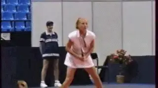
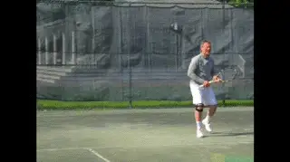
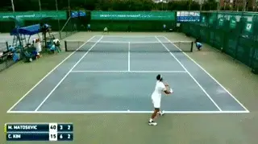
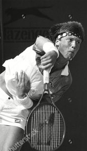
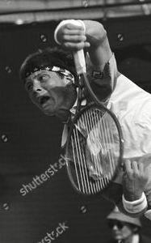
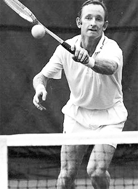

# Future Trends in Tennis - Part 2

**Future Trends in Tennis:\ Part 2Chris Lewit**

In the first article in this series I outlined some thoughts on the
possible evolution of players, playing styles, rackets and technique.
Let's continue now with some additional, more radical thoughts about the
possible further evolution of training and coaching, focusing on
laterality, ambidexterity and symmetry.

**Laterality Training**

**Are players with two forehands a viable future option?**

Laterality is the preference for one side of the body or the other, like
being right or left handed or right or left-footed. The study of
laterality also relates to the dominance of the left or right eye.

Coaches and trainers are currently exploring the effects laterality has
on motor performance and technical development. In tennis, Paul
Dorochenko has been a leader in this field of study. [[link](https://www.youtube.com/watch?v=AqvqWwaeSTg) to see
him training with a young Roger Federer.

Others like the Spanish coach Jofre Porta are using laterality to inform
their developmental work with players. ([[link](https://www.tennisplayer.net/members/classiclessons/chris_lewit/maverick_genius_of_mallorca/)
to see my previous profile of him on TPA.) Future coaches may
be able train and enhance eye dominance from a young age to improve
technical development and overall sports performance.

Understanding laterally may also be a key in understanding a player's
potential to play ambidextrous tennis. I believe it may be possible to
greatly enhance ambidextrous capabilities, unlocking new trends in
technique on groundstrokes, serves, and even volleys.

**Gene Mayer rose to third in the world playing with two hands on both sides.Double Handed Players**

Double handed players have always been part of the game, but with more
ambidextrous athletes, there will likely be more double-handed players
on the tour.

Double handed strokes will help create pace and also handle the pace of
the future game. They also have the capacity to create short court
angles, as both Gene Mayer and Monica Seles demonstrated so brilliantly
in their careers. Another advantage: less muscular imbalance in the
body, which can help prevent injuries.

It would be very interesting to test Gene for eye dominance and
laterality as he is still actively playing and teaching. And John
Yandell has offered to put us in touch. You can see more of his
two-handed game in the Archives by [[Clicking
Here](https://www.tennisplayer.net/members/high_speed_archive/phantom/Gene_Mayer_HD_HS/index.html?dir=Backhand/GM_BH_Wide&stroke=GM%20BH%20Wide%20ClosedStance%20Front3%20120fps.mp4&new=).

**Dual Forehand Players**

Another interesting possibility is that some ambiplayers will innovate
by choosing a two-forehand style, in the vein of Eugenia Koulikovskaya,
a former WTA pro, and one of the few professional players to ever play
with two single-arm forehands. She was ranked as high as 91 in the
world.

**Another example of symmetrical tennis, a top 500 men's player with two forehands.**

That could be another configuration that gains popularity in the next
century and beyond, especially if sport scientists can teach how to
enhance laterality and ambidexterity.

The animation shows a modern pro tour example of another ambidextrous
player whose technique and footwork is symmetrical with two forehands,
one on each side. His name is Cheong-Eui Kim, a Korean player who has
been in the top 500 in the world.

**Team Symmetry**

I want to train mirror image or close to mirror image technique on both
sides to maximize power and spin, with two forehands---and movement
efficiency with two open to semi open stances.

Currently I'm considering starting a special project------a group of
young players based in NYC who play symmetrically: Team Symmetry.

Luke Jensen could serve 130mph with either hand.

Players will have either have dual two handed forehands, or they will
have dual one handed forehands. That variation would also allow players
to attack the net with two forehand swinging volleys, one on each side.

In addition, I would like to train this group of players to be dual
handed servers, both lefty and righty. I call them Ambiservers. As we
discussed in the first article Luke Jensen proved how effective
ambiserving could be.

Nicknamed Dual Hand Luke, Jensen could serve 130mph with either hand. He
was a two time college All American. He won the French Open doubles
title in 1993 with his brother Murphy and reached his career-high
doubles ranking of World No. 6 in the same year.

I have believed for a long time now that symmetrical training could be a
major future trend in technical tennis coaching. There are a lot of
doubters, but I want to prove that symmetrical technique and movement
training can be a viable - if not a better - approach to building high
level players.

In my view, more power, spin, and better movement efficiency will come
from a symmetrical teaching approach, and the body will be healthier.
Forces and loads will be distributed more evenly across the muscles and
joints, especially helping to reduce overuse injuries, which are very
common in tennis.

**Could symmetrical training make the current game look as quaint as a continental grip?**

Players, parents, and coaches interested in discussing participation in
the Team Symmetry Project are welcome to get in touch with me directly.
([[chrislewit@gmail.com](mailto:chrislewit@gmail.com).)

These are radical ideas, but I believe they are viable. We simply
haven't explored this type of systematic training yet. Remember the
tennis establishment thought Bjorn Borg was a technical anomaly when he
was actually leading the development of the current modern game.

Once players demonstrate that symmetrical training is possible, the
current asymmetrical approach to building technique may be regarded as a
quaint period in tennis history, the way we now view classic continental
grip forehands from the 20th century.

While there will likely always be some athletes whose laterality
predisposes them to playing with one arm (forehand and one-handed
backhand), it is quite possible this stroke combination will become less
common on tour.

**Note**

The predictions in this article are meant to provoke thought and
discussion. I look forward to getting feedback and other ideas from the
TPA community at large. Please share your own predictions in
the Forum. ([[link](https://www.tennisplayer.net/bulletin/forum/tennisplayer/79288-future-trends-in-tennis-part-2?view=stream).)

