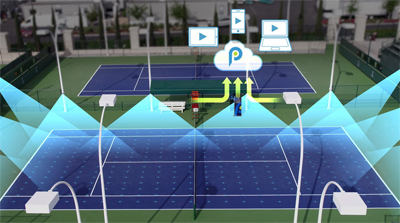
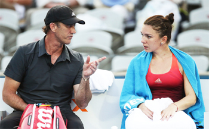
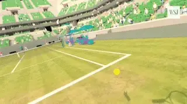

# Future Trends in Tennis - Part 3

**Future Trends in Tennis:\ Part 3Chris Lewit**

In the last article I looked at the concept of what I call
\"ambiplayers\" and what their strokes might look like now and in the
future. ([link](https://www.tennisplayer.net/members/classiclessons/chris_lewit/future_trends/part_2).)
Now let's turn to the issue of advances in technology in several areas,
starting with so-called smart courts.

**The End of Cheating?**

Due to the increased prevalence and the cost reduction in electronic
line calling systems such as Playsight and Hawkeye, cheating could
finally be eliminated from the game at all levels. This will be
especially important to the growth and popularity of the junior
competitive circuit, which currently has rampant cheating.

At all competitive levels, electronic and computer assisted line calling
could eventually replace all humans including umpires and lines judges.
First the line judges would go and then---later on---the umpires too.

**Will on court coaching become universal---and even become more advanced?**

Smart court systems could eliminate cheating for recreational players as
well. It could become rare to play on a non \"smart\" court, as most
courts everywhere could eventually be equipped with smart sensors and
cameras enabling better fairer match play. This is just part of the
larger trend known as the \"Internet of Things,\" a phenomenon where
common everyday devices are getting smarter and connected to allow data
connectivity.

**On Court Coaching**

On court coaching has been debated for years in the tennis community but
the debate will likely end as it becomes more and more accepted. On
court coaching is already becoming more prevalent at many levels of the
game, from the WTA Tour to new junior circuits like the Global Junior
Tour and the ITF Junior Circuit, which approved on court coaching for
the 2018 tournament schedule.

**Hyberbaric chambers are used by players such as Novak Djokovic to boost recovery.**

But could on court coaching become \"virtual\" by using technology as
simple as a cell phone on changeovers? The coach could communicate with
players even if he or she was watching remotely.

What about direct communication between players and coaches during
matches with players wired with earphones the way the NFL allows coaches
to speak directly to quarterbacks with ear phones in helmets?

Recovery

What about recovery technology?

Novak Djokovic is known for using a controversial hyperbaric chamber
called a CVAC to boost his recovery. A CVAC uses a computer-controlled
valve and a vacuum pump to simulate high altitude and compress the
muscles at rhythmic intervals.

The company claims that spending up to 20 minutes in the chamber three
times a week can improve athletic performance by improving circulation,
boosting oxygen rich red blood cells, removing lactic acid, and possibly
even stimulating stem cell production.

But is it fair that Djokovic can afford treatments in this \$75,000
device while others cannot? Will that be deemed an illegal advantage?

**Could prosthetics produce better performance than human limbs?Engineering**

Another issue. Generic engineering and advances in pharmacology and
machine enhancement of the human body could improve dramatically. These
would also raise many questions about what is fair play and what is
legal.

To take one example, if an amputee uses a prosthetic that gives him or
her better performance than the original limb, is it fair to allow that
player to compete with other non-enhanced players?

What happens when genetic engineering allows for customized enhancement
of athleticism traits pre-birth or post-birth? Is it fair to allow a
genetically modified athlete to compete against non-modified athletes?

**Video Technologies**

High-speed video analysis has transformed technical analysis and the
understanding of the game at all levels by allowing us to see key
moments in strokes that are literally invisible to the human eye. The
work of pioneers like John Yandell and Brian Gordon have busted myths
and heralded a new era in technical development. You can find extensive
articles on Tennisplayer from John ([link](https://www.tennisplayer.net/members/avancedtennis/)) and from
Brian ([link](https://www.tennisplayer.net/members/biomechanics/).)

These trends will continue unabated and coaches will become more
educated and knowledgeable about biomechanics and stroke design. For
example Brian is now beta testing a new 3D measurement system that may
give precise quantitative data without attaching markers to players,
making it possible to measure strokes in actual match play.

**High speed allows us to see key positions in strokes that are invisible to the naked eye.Tagging**

A lesser known trend is the use of video tagging technology, and
resulting statistical analysis to spot tactical patterns and to scout
and build profiles of players. There has been an explosion in the power
of big data collection and analysis and it is already a factor for top
competitors on the pro tours.

For example, at present some top players are rumored to be buying the
rights to their own statistical data on patterns and strategy for
six-figure sums. This is a brave new world on the tour and the power of
analytics will likely continue to shape the tour in unforeseen ways in
the future.

For coaches, analytics will be used more prominently in working with
players and helping them master their best patterns of play on the
practice court and at tournaments. Tennis Analytics under the direction
of Warren Pretorius is the leader in the field ([link](https://www.tennisanalytics.net/)), and I know John is planning a
series of future articles on Tennisplayer on how match tagging works and
its potential benefits.

But again it raises the issue of who can afford what and are analytics
creating unfair advantages?

**Virtual Reality**

Though video analysis and online instruction have exploded in the last
decade, the technology does not yet exist to make virtual coaching a
reality yet.

But as virtual reality technology improves, it is conceivable that many
coaches won't have to leave the home or office to work with players.
Coaches may not need a physical court or club, and may be not need to
travel as extensively on circuits as in the past.

**What are the potential training benefits for the future from the use of virtual reality?**

Virtual reality holds the potential to transform remote coaching,
perhaps in our lifetime, to the point where a coach and player could
have a lesson in a virtual world and it would be just as real and
effective as if they were hitting and speaking at the club. For coaches
who are grinding 30 weeks a year traveling the pro or junior tour, this
technology could allow them to give very close support to their player
without having to physically accompany them on the road.

Elite coaches would also be able to share their knowledge more
efficiently and effectively with more players around the world and at a
lower price point rather than being limited by geography and time.

The future of coach education is bright, for similar reasons. Coaches
will be able to access knowledge, share information, and collaborate in
unprecedented ways and this will raise the level of education around the
world and also raise the bar for what is expected of coaches regarding
continuing education and staying up to date on teaching trends around
the world.

Imagine being able to attend any conference in the world or study with
your favorite legendary coach or mentor all from your home office. It
could happen!

**Note**

The predictions in this article are meant to provoke thought and
discussion. I look forward to getting feedback and other ideas from the
Tennisplayer community at large. Please share your own predictions in
the Forum. ([[link](https://www.tennisplayer.net/bulletin/forum/tennisplayer/79288-future-trends-in-tennis-part-2?view=stream).)

