# Keys to the Kick

### Chris Lewit

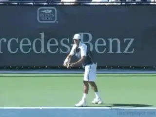

**The kick serve: one of the most difficult\--and effective\--shots in the game.**

Is there anything harder in tennis than learning a great kick serve? The
topspin serve is, in my opinion, the most difficult shot in the game and
arguably the hardest to teach. Students often struggle for years before
figuring out the proper mechanics\--sometimes only by luck or trial and
error. Other players give up and relegate themselves to hitting only
slice and flat serves.

A few talented players will pick this serve up easily, but for mere
mortals\--the less gifted 99 percent rest of us\--learning the topspin
serve comes as a tremendous challenge. I spent years in the juniors
hitting thousands of balls before finally mastering this serve in my
twenties. That was not until after college when I was competing on the
ITF pro futures tour.

For me, it happened because I found a new coach and former elite tour
player who shared with me the secrets of mastering the kick. I almost
want to cry when I think of all the hours I spent hitting buckets and
buckets of balls. **My coaches in the juniors were great guys, but they didn't provide me with the technical framework and the check points I needed to understand and master the shot. This is the same problem most players face. They are never exposed to right technical framework or training system.**

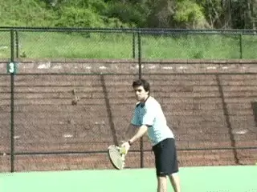

**Understanding the right technical framework is the key to mastering the kick.**

My goal in this first article is to present the technical elements and
check points that are critical to learning and teaching the kick. As you
will see, there are many components to master, and this is what makes
the serve so challenging. In a second article, I will share an
additional series of unique drills that I use every day with my students
to develop the kick.

Using this approach, I have taught hundreds of junior players to hit
great kick serves, from as young as 6 year old beginners to 16 year old
top national players. I have also taught the same serve to serious adult
players at many levels.

### The Three Kicks

For the sake of clarity in this article, I will use the terms
\"topspin\" and \"kick\" interchangeably. But in reality there are three
variations of the kick serve.

These three variations are what I call True Topspin, Slice Topspin, and
Twist. The differences are in the path of the ball through the air, the
path of the ball after the bounce, and most importantly to understand,
how the racket moves to the contact to produce these differences. Let me
define what I mean by each of these three serves.

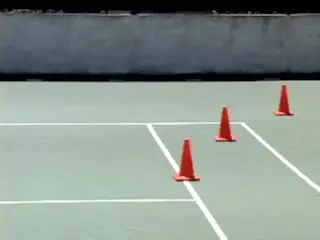

**The three kicks all bounce differently off the court.**

What I call True Topspin bounces high and straight ahead. This serve is
the most basic kick serve and most players will use it for the second
serve a large percentage of the time, especially on hard courts. When
well executed this serve is heavy and difficult to deal with because it
can bounce well above the returner's preferred contact height.

What I call SliceTopspin bounces high but (from the server's
perspective) also has a right-to-left movement after the bounce. Players
will use this serve less frequently than the True Topspin, typically
when hitting second serves down the T in the ad court, or into the body
or out wide in the deuce court. The advantage here compared to the True
Topspin, is that the ball fades or curves away from the returner (or in
the case of a body serve, jams the returner). This serve is a must to
hit effective second serves against left handers.

The third topspin variation is the Twist. What I call Twist bounces high
but actually moves from the server's left to his right. Typically it is
hit to the returner's backhand, especially in the ad court, where it
kicks high away from the player after the bounce.

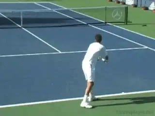

**Let's break the kick down, component by component.**

This serve is used to pull the returner out of position, force him to
take additional steps to the ball, and play a contact point at shoulder
level or even higher. It is used most often on clay, but can also be
extremely effective on hard courts\--especially gritty or high-rebound
hard courts\--when hit with the right combination of speed and spin.

So let's look at the checkpoints for all three kick serves. We'll look
at the elements they have in common and also the adjustments players
must make to hit each of the three variations.

### The Components

There are multiple technical components in the kick serve, and this
complexity is one thing that makes the serve difficult. Even though
there is a lot of information, it is important to understand each of the
components clearly, and then how to put them together in the complete
motion.

### These components are:

Triceps Extension

Extension

Hip and Shoulder Lines

Leg Drive

Wrist and Hand Action

Post-Contact Arm Actions

Finish

Grip

Foundation or Stance

Toss and Tossing Mechanics

Shoulder Tilt

Power Position

Buttscratch\--not Backscratch

Back Arch

No wonder players and coaches struggle with this motion. If even one
technical element is missing, the serve may not be effective. Let's go
over the components from start to finish starting with the grip.

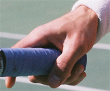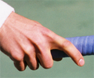

The Strong Continental with the index knuckle just off Bevel 1.

### Grip

The grip is critical to learning an effective topspin serve. Most
players who come to me do not demonstrate a strong enough grip to
effectively hit heavy spin. I call this grip a Strong Continental. The
problem is that most players try to hit the serve with a milder version
of the continental, or even with a grip rotated toward an eastern
forehand.

The frustrating thing about defining the right grip is that
coaches\--and especially coaches from different countries\--use
different terminology and also tend to have different opinions about the
position of the index knuckle.

I remember first working on my kick with my tour coach, a former top 100
ATP player and national coach from Israel. He showed me the grip that I
now teach. This grip is definitely more extreme than the typical
\"continental\" as defined by most coaches in the US.

Whatever you want to call it, I believe in this \"strong continental,\"
with the index knuckle very near bevel 1 (top bevel). This grip promotes
heavy spin without slowing down the ball too much, as a more extreme
backhand serve grip can do. I also believe players can hit the first
serve with this grip, rather than making a dramatic grip change between
first and second serves, which can hurt disguise.

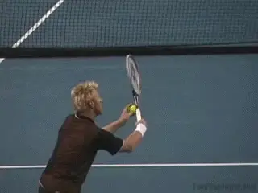

**Boris: a great player with an unorthodox grip for hitting kicks.**

Of course, some players are extremely talented with their wrists and
hands, and they can get away with a less extreme grip. But I believe
even these players are losing some rotation on the ball by not shifting
to a stronger grip; and it is my contention that these are the players
whose second serves tend to break down under pressure in high level
competition.

A tour example that comes to mind is Boris Becker, who was incredibly
talented, but used a serve grip more towards the eastern forehand.
Becker was known to lose control of his kick, particularly under
pressure, and sometimes his second serve became inconsistent. Although
Boris was obviously a great player, I believe that he didn't get the
maximum possible number of revolutions on his serve because of his
unorthodox grip.

There is also an alternate option to using one grip. Rather than using
the exact same grip for both serves, some players choose to make a
subtle shift of the palm position\--or even of the knuckle
position\--between the first and second serve. I would estimate that
this includes a quarter of the top players or slightly more, based on my
first hand observations.

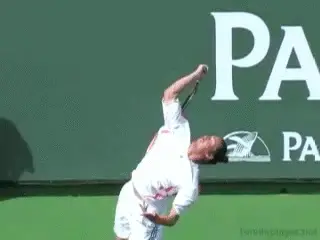

**Many players can use the Strong Continental for the kick\--and the other serves.**

Whether a player shifts grips for the second serve usually depends on
the philosophy his developmental coaches had when they were building his
game as a junior. Some players don't even realize that they make a
shift. They naturally adjust the heel of the palm slightly more toward
the top of the frame\--to maximize the brushing action upward to the
ball.

I believe that this is acceptable. However, the grip shift should not be
extreme and the shift should not be noticeable by the opponent. When
building a world-class serve, disguise with all the serves\--flat,
slice, and kick\--should be an important priority.

Many elite coaches insist on the single grip, but I allow for a subtle
change if it helps the player and does not hinder disguise. From a
developmental standpoint, encouraging this grip shift can help a player
break through a learning roadblock. As a player develops, the placement
of the hand can be moved toward one universal grip.

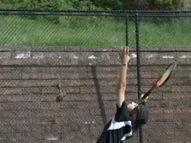**\ Junior players can master the grip if it is taught early.**

Having said all that, my preference is still the single grip, and if the
\"Strong Continental\" is taught early in the development cycle, I
believe most players should be able to get the hang of using one grip
for all serves.

### The Mid-Swing Switch

When a player is learning this strong grip, the coach must watch the
student very carefully in mid-swing. Many kids show me the right grip
before the kick serve and then, somewhere in the backswing, whether
consciously or unconsciously, they slip back to a weaker grip before
they hit the ball.

The coach must watch that hand like a hawk. The way to make sure the
grip is remaining the same is to check the grip at the end of the swing,
not at the beginning. Some crafty kids will try to fool you by shifting,
and then shifting back after the serve. The fact is that it's difficult
for them to switch out of their old comfort zone, even if they want to.
So you have to be strict if you are coaching and honest with yourself,
if you are a player.

### The Foundation

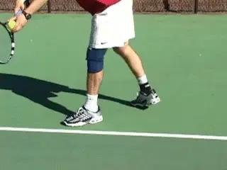

**The foundation should close the hips at the start of the motion.**

When I am building a kick serve, my preference is a foundation or stance
that really closes the hips at the start of the motion, with an angle of
about 130 degrees to the baseline. I believe that this maximizes
disguise, spin, control, and power. The feet should generally be about
shoulder width apart, unless the player has a step-up action, in which
case the feet can be a bit wider.

This closed hip position will promote a deep turn of the back and
shoulders during the tossing phase of the swing. I believe this closed
hip position helps players in the directional control of the serve,
especially in learning to angle the kick serve sharply out wide.

Many players do not have enough hip and shoulder turn on the kick and
this prevents them from getting enough action on the ball. They may be
able to hit a decent topspin serve with a less coiled hip and shoulder
position, but unable to hit a great twist.

With this foundation, the player will begin to get the feel for the
right sequence of the hip rotation\--something I call the hip drag, as
discussed in more detail below.

From this foundation, I also believe in (and tend to teach) the step-up
leg action, sometimes called the pinpoint or sliding stance. In my
opinion, it is more explosive. But obviously there are players with
great kicks who hit from the platform stance, keeping the feet in
position until they leave the court.

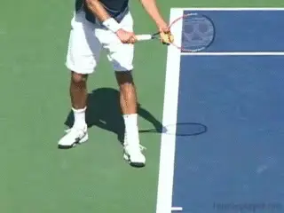

**In my experience the step-up leg action is more explosive.**

This is a debated topic in coaching circles. Research has not provided
any definitive answers, and there are some conflicting and confusing
studies. In my own experience, however, I found that the step-up stance
gave me more power. As a high school basketball player I always used the
step up footwork when I was trying for a dunk, because it allowed me to
jump higher, and I believe the analogy holds for the serve.

Regardless of the choice here, when building a world-class kick serve,
the body must be appropriately coiled. This is why I believe that an
alignment of about 130 degrees will yield better kick serves and
especially more twist action.

The foot position and stance for the second serve should be exactly the
same as on the first serve to maximize the disguise of the delivery. On
the first serve, I believe the 130 degree closed hip position will also
load up more energy, allowing the player to uncoil into the serve to get
more power. More twist on the second, more power on the first, and great
disguise. I don't think you can wrong with the deep hip position
created by this starting stance.

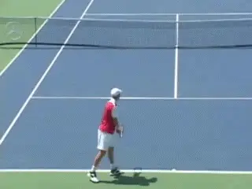

**The toss: how far to the left and how far in front?**

### Tossing Mechanics

Tossing is another debated topic, especially on the kick serve. How far
should the toss move to the server's left? Should the toss be more over
the shoulder at 11 o clock at contact, or is 12 o clock the correct
position?

How far forward or back should the second serve toss be? And a related
question, should the player coil the shoulders during or after the toss?

The toss position will determine your ability to hit the third most
extreme kick variation, the Twist. It may affect your ability to
disguise your serve as well. The different viewpoints here can be very
confusing.

**Tossing Debate**

The actual placement of the toss for the kick serve will depend on the
philosophy of the coach. There are two main schools, and here we find
the origin of the tossing debate. The first school of thought says that
the toss should be more centered above the body. These coaches will
argue that this gives the serve more disguise\--and that the first and
second serves cannot be differentiated easily. These coaches usually do
not value a back arch (which is directly related to how far the toss is
thrown to the left). In fact, they tend to discourage the back arch
altogether.

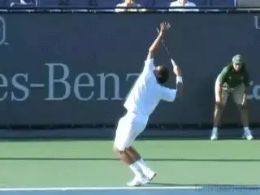

**Is the back arch a problem\--or an asset?**

Many of these coaches believe that tossing too far to the left and
arching the back can cause a breakdown of the lower back and injury down
the road. For this reason they encourage their players not to toss to
the extreme left. The trade off for this school of thought is less twist
action for more disguise and (presumably) less risk of injury.

But the issue is not only related to the perceived potential for injury.
It is also related to court surface and style of play. Disguise of the
serve tends to reward the player more on fast courts. Coaches and
players who subscribe to this school therefore tend to be from regions
with predominantly fast surfaces, surfaces like grass or fast indoor
courts or carpet. This tends to include coaches from the Scandinavian
countries, England, India, Australia, and many parts of the US.

The second school of thought says that the toss should be more over the
shoulder to the left of center. Coaches from this school believe in
getting maximum twist sidespin and aren't as concerned about the
potential for injury from arching the back. These coaches value the
twist serve as a means to really make the returner move and to pull the
returner off the court\--they want the extreme angle. This philosophy
will be more common in regions where clay court tennis is dominant, such
as South America, some parts of France, and in Spain.

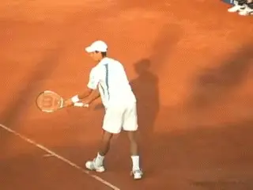

**A toss to the left and more back arch equals more angles.**

Coaches and players from these regions want angles, angles, angles! The
coaches want their players to open up the court and run their opponents
coast to coast. So the natural corollary to this philosophy is to
promote serve mechanics that maximize the angles, and these mechanics
are toss to the left and a more extreme back arch.

Most of these coaches would argue that the risks of arching the back can
be minimized with a good stretching and strengthening program. They
don't value disguising the kick serve as much, because, on clay,
disguising the serve does not provide the same benefits as on super fast
surfaces.

Clay is slow enough that the surprise factor is minimized and thus the
returner usually has time to make last minute adjustments, even on a
perfectly disguised serve. This school of thought will take the extreme
angle and heavy twist action over disguise any day. That's different
than on a grass court or a slick hard court where the ball shoots
through the bounce must faster. Here good disguise on the serve can mean
a lot of free points.

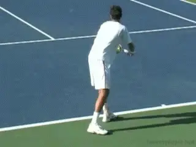

**How much twist you develop is related to surface and game style.**

The clash of these two serving schools is the main reason we have so
much debate and confusion about the kick serve mechanics today. You will
have to decide which side of the fence you want to call home. Do you
want disguise or do you want more twist action and angle for your serve
or your player's serve?

Do you anticipate that you or your player will be more of a slow court
grinder or likely to be more successful as a fast court attacking
player? These types of individual considerations are factors in
determining how you should develop the mechanics of the kick serve, and
the serve motion in general.

I would like to offer two points of personal opinion. I believe that the
risk of back injury with the twist serve has been exaggerated,
especially in American coaching circles and by overly conservative
doctors and physical therapists. If we take this ultra conservative
route, we will soon be afraid to teach our students anything stressful
on the body or anything that pushes them hard.

I firmly believe that a player can develop a serve with noticeable back
arch and use it effectively and safely for a career if the proper
stretching and strengthening programs are in place. The problem is that
many players do not have such a program and thus expose themselves to a
higher chance of injury.

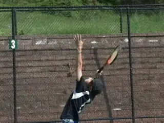

**I teach the back arch\--in conjunction with stretching\--early in a player's development.**

I believe the lower back should be sore after practicing a lot of kick
serves, especially the morning after. This is how the muscles in that
area grow stronger and become more supple. Most coaches are avoiding
teaching this serve out of fear, and in this litigious society, you can
understand why. One prominent coach now actually makes his students sign
a legal release before agreeing to teach them the kick.

One problem is that the back arch and stretching/strengthening programs
are not being taught to players at a young enough age. Coaches wait
until players are13, 14, or 15 to teach kick serve mechanics. There is
this idea that at a later age, the player will be more physically
developed and thus less likely to get injured.

I believe the opposite. I think players are more likely to get injured
if the kick serve is introduced later. I think the motion should be
introduced at 7, 8, and 9\--before puberty, when the body is more
supple, just as gymnastic moves are taught to the very young. I think
the kick serve and a good stretching/strengthening program should be
introduced very early on to take advantage of this developmental window.

In an ideal world, why not develop a player who can have a great twist
serve (with more back arch and toss to the left) during clay court
tournament segments and, during the fast court season, slightly adjust
the toss to provide the benefits of more disguise?

Here the player has it both ways. It allows the player to adjust his
mechanics depending on the tactical plan. If the opponent is slow
laterally; the player can adjust his toss somewhat and get more angle.
There are many tour players today that make these adjustments, depending
on the opponent and season, either subconsciously, or with the help of a
coach.

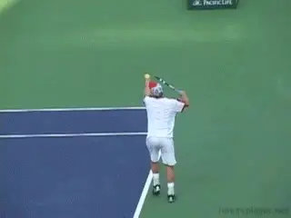

**The toss is forward into the court with the player moving up and under.**

### Toss Placement

For a twist service, the player should place the toss toward 11 o clock,
over the left shoulder. For a disguised topspin service, the player
should toss to 12 o clock directly above the body. In both cases, the
toss should be 1 to 1.5 feet forward, or inside the baseline. (This
second serve toss will be less forward than the first serve toss, which
should be 2 to 2.5 feet forward.)

To clarify, this forward toss is initially in front of the body, but
then the body coils under the ball and explodes upward as the weight
transfers forward. So in the end, the body is relatively under the ball,
even with a forward toss and contact around the front edge of the body.

But the key is to first get the kick serve toss in front of the body. I
cannot stress the importance of this point enough. I often tell my
students to toss \"toward the front shoulder\" as a reminder to toss
forward into the court. A common mistake is for the player to toss
straight upward above the baseline toward the back shoulder, or worse,
behind the plane of the baseline. This will move the contact point too
far back. It will limit pace and depth and is also more stressful on the
shoulder joint, a factor that will actually increase the likelihood of
injury.

### Toss Mechanics

I see many students that have erratic tosses and the reason is almost
always mechanical. Here are the technical checkpoints that I look for on
the toss.

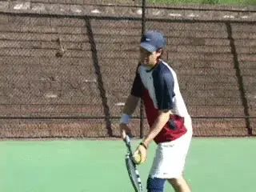

**The tossing arm should stay aligned with the left leg.**

The wrist should be firm. The player should not flick the wrist. The
toss motion should be executed from the shoulder joint. The ball should
be held in the fingertips, with all fingers touching the ball, not near
the palm. Some players toss with the palm or just with two or three
fingers, which hurts control.

Ideally the tossing arm should drop so that it is aligned with the left
leg. The player should release the ball first, and then coil the body to
130 degrees or more. I do not recommend fully coiling during the toss
(where the tossing arm is in line with the baseline rather than the left
leg) as this will cause inconsistencies with the tossing arm.

The fingers should create a star shape on release, similar to a flower
blossoming. There should be little spin on the ball. High speed studies
of top players show the ball coming out of the hand with virtually no
spin. This is why I like to see minimal wrist action, because it
translates into less spin on the ball.

The tossing arm should extend up, the shoulder should touch the chin,
and the hand should point more or less to the ball. This helps create a
good shoulder tilt and promotes the correct upward racquet path, a
prerequisite for spin generation.

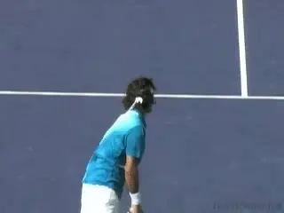

**The fingers open into a star shape, like a flower blossoming.**

### Shoulder Tilt

The shoulder tilt is an important key to getting the racket on the
upward swing path to create an arcing flight path of the ball. Often,
players are told to hit up on the ball. But the line of the shoulders is
critical in achieving this. Pushing the right shoulder down toward the
ground and stretching the left arm up to the ball is what prepares the
body to thrust upward in the next phase of the swing.

Another key point here is the left hip. It is very important that the
left hip go somewhat forward into the court. This hip action works in
concert with the shoulder tilt to create the optimum position to thrust
upward into the toss.

Players who do not thrust the hip forward or get enough shoulder tilt
are often frustrated that they cannot get enough spin and arc on the
serve. Their serves tend to have a low trajectory over the net.

### Power Position

The shoulder tilt is part of the trophy or power position that every
player must achieve. The power position is critical to every serve, not
just the kick, and is the foundation for achieving maximum racket speed.

No matter how the student gets to the power position, he must get there!
Some players bring the arms down-together up-together for rhythm, some
delay the racket arm for more acceleration. Some take the racquet
straight up. But regardless of the style of motion, every great serve
gets to this trophy position.

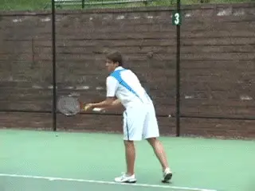

**The shoulder tilt, the extension of the arm, and the forward hip thrust.**

Here are the check points. The left shoulder is stretched upward with
chin tucked into the shoulder. The left hand is pointing towards ball
with arm reaching upwards at an angle of 90 degrees or more. The eyes
are locked on the ball\--where they stay through contact. The racket arm
is in the \"L shape\" or 90 degree throwing position.

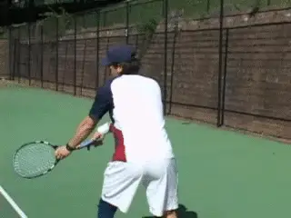

**The Power Position: the arm reaching upwards and the racket arm in the \"L Shape.\"**

Additionally, the elbow position is very important. The elbow should be
as high as possible and held away from the ribs, ideally even with the
line across the shoulders. Many players drop the elbow toward the ribs
and this will ruin a kick serve. **The elbow must be high and away from the body to promote the proper racket drop.**

In addition, the elbow of the hitting arm should be stretched back
behind the body. This position is sometimes overlooked, but it creates
the optimal hitting position for a kick, and particularly a twist serve.

The shoulder coil helps to place the elbow behind the body**. If the elbow drifts to the right\--as often happens if the hips and shoulder are too open\--the serve will slice rather than kick or twist.**
Often, if a player cannot get the requisite twist, the root cause is the
poor position of the elbow at the power position and during the upward
triceps extension.

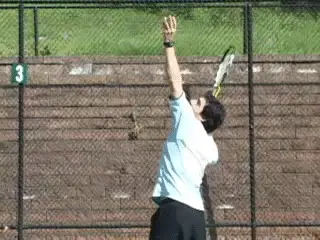

**I call the full racket drop for the kick the \"buttscratch.\"**

### Buttscratch not Backscratch!

I know the idea of a \"Buttscratch\" may sound funny, but players very
commonly do not reach down the backside far enough with the racket.
\"Backscratch\" is really a misnomer and should be eliminated from the
teaching nomenclature.

Players should really buttscratch instead. They should reach down so
deep that the racquet drops below the waist to the butt level. When kids
are told to backscratch, they dutifully follow that advice, but often
they do not reach deep down enough, causing a reduction in racquet
speed. In addition, they will often swing upward to the ball at the
wrong angle, hitting the right or back edge of the ball more than the
underside\--the wrong racket path required to hit a kick serve.
Oftentimes, a short backscratch results in a \"hook\" serve, causing a
low trajectory slice rather than good arcing topspin.

In my experience, the buttscratch phase of the kick serve is the most
commonly misunderstood component. **Indeed, mastering this deep racket drop was one of the most important changes in mastering my own kick delivery.**

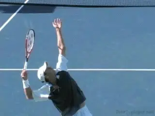

**Without the buttscratch, it's impossible to hit a great kick.**

The buttscratch occurs quite quickly and is thus difficult to check with
the naked eye (most likely why it is often overlooked). But it must be
diligently developed when learning the kick. Video can be a tremendous
aid here, but with practice, a coach can also train himself to see the
quick elbow drop with the eye. Lack of a good, deep buttscratch is a
very common stroke flaw that prevents full racket acceleration and
maximum topspin generation.

### Elbow Bend

The key to creating this deep buttscratch is to bend the elbow to the
extreme. The player must have good flexibility in the arm and shoulder.
If the player does not have good flexibility, the coach should manually
stretch the arm to help the player feel the depth of the bend
required\--and then make sure the player gets on a focused stretching
program.

The length of the buttscratch creates the runway for the \"takeoff\" of
the racquet upward to the ball. The longer the runway, the more
potential racket speed. This is a very important concept.

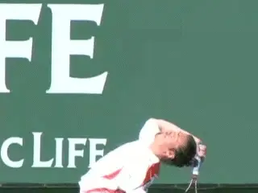

**The elbow bends deeply and points to the sky.**

The further a player drops the racket down, the more \"runway\" on the
way up to the ball, and thus the more racket speed potential.
Buttscratch to the extreme and watch your topspin production increase
dramatically.

From the trophy position, the elbow rises and points up to the sky
during both the buttscratch and triceps extension portions of the swing.
**The racket needs to accelerate up the runway and there should be no pause or hitch from the buttscratch phase to contact. Players who have breakdowns in rhythm during this phase will lose pace and spin on the serve.**

### Back Arch

As compared to the other two kick variations, the back arch is critical
to imparting twist. If you are a coach who does not believe in back
arch, you can develop a decent true topspin and topspin slice, but not a
great twist action.

I personally believe in teaching the back arch at a very young age to
strengthen the core and maximize the flexibility of my students. I want
my students to be able to hit all three second serves effectively
including the twist.

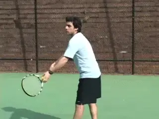

**The convex shape is the indication that the player is arching the back.One additional benefit of back arch\--for all kick serves, not just twist\--is that it helps lower the racket even deeper into the buttscratch, creating more runway and thus more potential racket speed. I also believe that the activation of the core muscles and the snapping of the arched back add a small amount of extra energy to the motion.**

Look for the convex shape of the back if you are teaching or learning
the twist. The back arch also helps to get the hand and racket further
behind the body, which allows for a more extreme left-to-right swing
path. This puts the racket in the right position for the upward swing
and is critical in generating the twist sidespin.

### Triceps Extension

The triceps extension is equally important for racquet speed. The arm
must snap upward as fast as humanly possible, and this is especially
true on the kick. I tell my players to \"swing faster on the second
serve than the first serve.\"

The movement is from a deep buttscratch to a full triceps extension.
Imagine the movement as a 100 yard dash. The racket must sprint upward
from start to finish as fast as possible.

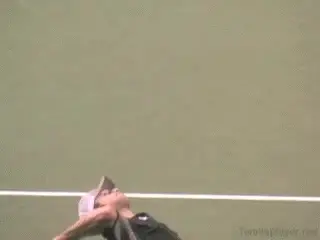

**The triceps snap should be a sprint.**

If the player has a slow triceps snap, this technical movement should be
practiced extensively until it is mastered. The elbow should remain
pointed upward at the sky during the triceps extension. This is the axis
point that allows good extension to take place. A still elbow also
promotes good alignment of the racket on its upward path to the ball.

### Wrist and Hand Actions at Contact

And now for the most difficult part in actually producing the spins.
This is how the player addresses the ball with the wrist and hand. As
the triceps extension reaches its apogee (high point), the wrist should
loosen and violently snap up-and-out to accelerate the racket.

The wrist needs to remain sufficiently loose to accentuate this
up-and-out snapping action. But this optimum looseness of the wrist is
difficult to describe in words. What is \"loose\" for one player may not
feel \"loose\" to another.

The wrist can actually be too loose, which can make the movement
imprecise and cause miss-hits. That said most players tend to be too
tight. Players should experiment until they are able to keep the wrist
loose but still control the racket head.

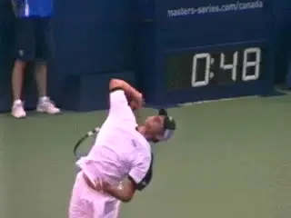

**The wrist should be loose\--but not too loose.**

### 3 Variations

The next technical point is how the hand \"closes\" to set the racket on
edge at the start of the movement upward to the ball.

As the racket moves up to the ball, the knuckles of the hand should
point basically toward the sky, and the palm should face partially
downward toward the court. This is critical to develop spin. Many
students swing upward toward the ball with the palm facing upwards,
which makes it impossible to create the spin you need to hit a kick.

From this position the racket moves upward and, in the last few
microseconds before the contact, snaps forward and out to the right.
Slight differences in the path of the racket and the angle of the racket
head are what create the three different spin variations.

In learning the differences in how to hit the variations, it is
important to distinguish between tennis science and the art of tennis
coaching. The differences in the exact angle of the racket at contact
are relatively slight. In high speed video, for example, the racket head
may appear to be tilted slightly more to the left for the twist, as
compared to the pure topspin. But even this is difficult to see.

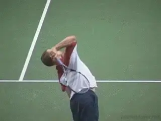

**The knuckles point toward the sky with the palm downward toward the court.**

But the images we use to create these differences in the swings are more
extreme. By visualizing the different racket paths, the player learns to
vary the spin. Different images allow the player to master the three
variations \--and go back and forth between them with confidence in
match play. We can also see the differences by observing the angle of
the arm to baseline after the contact.

### True Topspin

To hit True Topspin, the player should imagine that the racket is
traveling directly up the back of the ball\--from 6 to 12
o'clock\--brushing the back of the ball and generating straight forward
spin. The racket may not actually be in this actual position at contact,
but it will go through this position in the last fractions of a second
before reaching the ball.

On the true topspin, the elbow is also more centered under the ball
during the triceps extension. As the hand and racket go upward and
forward through the contact the racket arm will reach an angle of about
45 degrees to the baseline. The result, as we saw in the video of the
bounce, is the ball will kick up straight off the court.

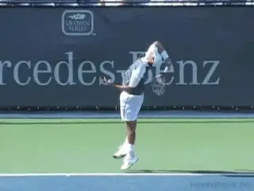

**True Topspin: visualize swinging 6 to 12.**

### Slice Topspin

To hit the Slice Topspin, visualize that the hand scrapes the bottom
right edge of the ball and that the racket travels from 5 o'clock to 1
o'clock. So the player is actually imagining making contact on the right
side of the ball. This image, whether an accurate description of what
happens or not, is very effective, and will impart the correct
combination of sidespin and topspin.

As in the true topspin serve, the elbow is more centered under the ball
on the slice topspin. But the arm will travel more straight forward
after contact. As it extends it will reach an angle to the baseline that
is more like 60 degrees. I call this serve the slice topspin because it
not only bounces up, it also curves to the server's left and therefore
away from the opponent as we saw in the ball bounce video.

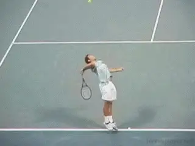

**Slice Topspin: the image of the swing is 5 to 1.**

### Twist

The twist is, as we saw, the most extreme variation of the three kicks.
This means the image that you want to visualize is also more extreme. To
hit the twist, visualize the racket hitting the ball at 7 o clock and
then traveling upward and across the ball to 2 o clock. So now the
player is imagining making contact on the left side of the ball\--the
opposite side from the slice topspin. (With the true topspin in the
middle between the two.)

On the twist, the elbow should also be pulled back more to the left of
the ball than on the other two variations to get this 7 to 2 brushing
feel. The arm will also travel much more to the player's right,
finishing at an angle that can approach 30 degrees to the baseline. When
you think about the images of the different swing paths, the angle of
the arm to the baseline is consistent with each of the three variations.

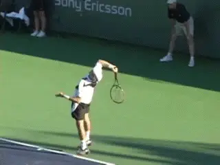

**The image for the Twist is swinging from 7 o'clock and 2 o'clock.**

### Hip and Shoulder Lines at Contact

All great kick serves have what I call a hip and shoulder drag. This
means that the hips and shoulders do not rotate as much into the contact
point as on a flat or slice serve.

At contact, the hip and shoulder line on the kick should be
approximately 30 to 45 degrees to the baseline. If you look at all the
great kicks in the pro game, the difference in this angle is clear. This
is why it's so important to coil in the beginning of the motion. The
body will only partially uncoil before the contact, so it's important
to get the most uncoiling \"runway\" here.

Dragging or delaying the hip and shoulder rotation can be difficult to
learn. Players are often accustomed to rotating their hips into the flat
serve to get maximum power**. In learning the kick serve, you have to aggressively hold back the right side of the body and \"stay more closed.\"**

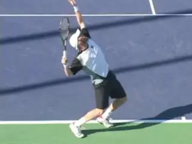

**Drag the hips so the angle is 30 to 45 degrees to the baseline at contact.If the hips and shoulders open too soon, the serve will lose twist**. But at the same time there are subtle differences in
the amount of hip drag depending on placement. If the player is trying
to hit a slice topspin, for example, the hips and shoulders will open
slightly more.

### The Leg Drive

The leg drive is a big deal on the kick, and on any serve for that
matter. Players need to explosively squat and drive up to the ball.

I am looking for about 70 degrees of flex at the knees before the
explosive extension of the legs. Some students can get stuck in the
squat, especially if they try to go down further than are really
capable. Care should be taken to squat and explode quickly so as not to
lose any potential energy. There should be no delay.

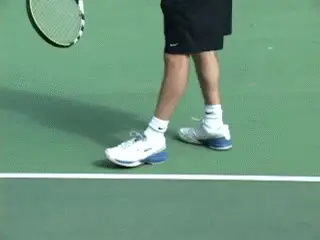

**Leg drive\--a big deal on the kick, and every serve.**

The leg drive should be forward and up, propelling the body off the
ground, but also forward into the court. The body should land between 1
and 1.5 feet into the court. If a player is not landing this far into
the court, then the leg drive is insufficient and needs to be increased.
The landing should be on the left foot with the shoulders basically
square to the net. The right foot should kick backward and upward for
counterbalance.

### The Extension

**Extension at contact includes more than the triceps and arm. The whole body should be extended as much as possible at contact. This means a straight line could be drawn from the toes all the way up the fingers.**

Full extension of the entire body means a maximization of height and
leverage. The player has got to \"get tall.\" Many younger players tend
to bend forward and/or to the side at contact.

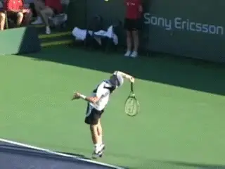

**Extending at contact means a straight line from the toes to the fingers. Post-Contact Arm Actions**

The arm and wrist should continue to move outward and forward (crossing
the plane of the baseline) in an arc to the right of the body on all
three kick serves. The turning of the hand and racket will also continue
as a consequence of this acceleration to the contact, what is sometimes
called the pronation effect. This, however, is a consequence of the
movement of the racket to the ball rather than something players should
try to consciously produce.

As this movement continues the wrist will eventually release further
with the tip of the racket starting to point downward. The tip of the
racket should now lead the arm downward towards the finish. The tossing
arm should also release down, preferably into the chest, or
alternatively to a point near the left rib cage.

### The Finish

The racket should now travel back to the left side of the body, and the
hand should finish near the left pocket. Some pros will abbreviate the
finish or follow-through to the right side only. This technique can be
acceptable, but can also be stressful on the shoulder joint.

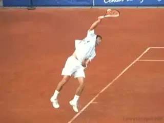

**The tip of the racket points downward and leads the arm to the finish.**

Young players often exaggerate this finish and this can cause technical
problems. For example, players will not throw the elbow and arm forward
into the court far enough because they visualize finishing on the right
side of the body. For technical and physiological reasons, I believe it
is always better\--after the arcing of the swing out to the right\--to
release the arm and racquet back to the left side.

### Summary

So there you have it. As you can see, on the kick serve there is a
massive amount of information to absorb and myriad technical elements to
master. This is why I have always contended that the kick is the hardest
shot to learn in tennis, and this is why so many players struggle to
master it.

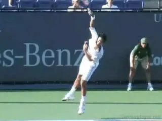

**The hand should travel back to the player's left and finish near the left pocket.**

Practicing and perfecting these technical elements is easier said than
done. But if you can break the mechanical moving parts down and practice
each element individually, you will slowly gain mastery of the kick.
Practice each component until the movement is perfected; then link the
movements together. The result will be a beautiful and effective kick
serve that you'll own for life.

In a follow-up training article, I'll explain the developmental
timeline and stages for teaching and learning the kick and share some
unique exercises that I use to help my students master each of these
mechanical elements. This article describes all the necessary
ingredients; the follow-up will give you the step-by-step recipe for
building a truly world-class kick.

**Special Thanks** to Michael Logarzo, Zach Niklaus, and Andrew Catania
for a great job demonstrating how to hit a great kick serve.

