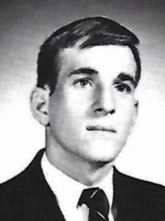
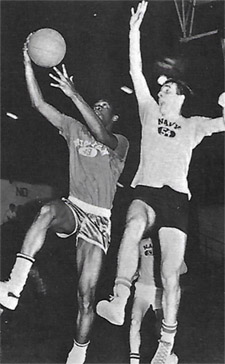
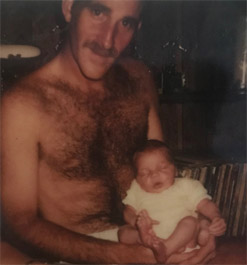
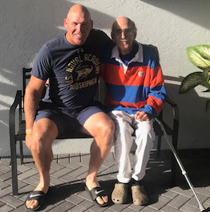

# My Mentor

### My Mentor 

### Kyle LaCroix

------------------------------------------------------------------------

**My mentor as a high school senior.**

There will always be impactful people in our lives. But sometimes it is
left up to us to extract their guidance and wisdom.

My career as a tennis teaching professional has been guided by lessons
that a special man provided me. He never told me what they were. He just
lived them every day.

My mentor was one of the most gifted athletes I ever saw. He was 6'1\"
and weighed 185lbs. He was a wonderful basketball player when he was
younger with a silky smooth arsenal developed on the streets and gyms of
the Philadelphia suburbs where he grew up.

He was a star quarterback on his high school football team who broke
down opposing defenses with a live arm and laser like accuracy and tight
spirals. He was also a baseball pitcher, possessing a knack for
delivering the perfect pitch based on the count time and time again.

My mentor had no real impact on my tennis game. He never spoke of
enjoying tennis and never showed an interest in my own pursuit of the
game. Not once.

But I did play with him once. He grabbed an old racket out of my bag
with worn strings and a disintegrating grip. I had no idea he could even
hit a tennis ball. Yet here he was hitting forceful forehand drives,
vicious backhand slices and crisp volleys.

**The Real Impact**

His real impact was on my philosophy of business. This came from
observing the habits and unspoken beliefs that guided him everyday.

My mentor never followed the crowd. Starting with a corporate culinary
career, he went on to own and operate two successful restaurants. When
everyone told him to play it safe and stick with the corporate gig, he
ignored them and worked even harder to make his dream a reality. He
created a dining culture unlike all the others, one his customers
desired.

**My mentor (right) was a gifted athlete in multiple sports.**

My mentor encouraged me to find my own way and to think differently than
my peers. He emphasized the importance of independence and being an
original.

He was always willing to support any idea or ambition I had in sports,
travel and life. He always hoped I forged vivid memories and experiences
that would make my future.

What I learned was this. Don't compare yourself to the competition.
Change the paradigm and make your business a model for others to follow.
Instead of asking \"What are they doing?\" ask \"What can I be doing?\"

**The Value of Hard Work**

My mentor always stressed working full days. He led by example. That's
all he knew how to do. Never did I hear of him calling in sick, getting
in late or leaving early. Nor did I hear him complain about the long
hours, physical labor or issues with customers.

And when he worked, he did it with a focus and intensity that was
amazing\--measured, precise, organized, purposeful. He never had a bad
word spoken about him by his staff, his friends or any customers. He was
reliable and his word was his bond.

The work ethic he displayed over the decades won people over, helped
business grow, and made many people comfortable sums of money to live
off of.

But the person that benefitted the most from it all was himself. The
pride of a job well done was his greatest thrill, not for medals,
trophies or prominence, just for knowing that he did it and did it right
no matter how many hours it took.

I learned from my mentor that there are many things you can't control in
life, but the one that you can control is your own personal effort. It's
a reflection of you as an employee, a person, and a leader.

**One of the two restaurants owned by my mentor.**

The smile of satisfaction when you lay your head down on that pillow
signifies mission accomplished, and it instills motivation and
discipline for you to do something bigger the next day. I learned from
my mentor that putting out the best product or service should not be a
chore, it should be a habit.

Never being one to accept mediocrity, my mentor was merciless when it
came to \"making it nice.\" Whether he was hosting an event for 50
people or 500, his never failed to pay attention to detail and always
had the willingness to go above and beyond.

He was obsessed with perfection with what he could control and his staff
knew if he got his hands on it, he would turn it into something special.
His infatuation with \"making it nice\" came from self-pride and the
general principle that the product says more about the philosophy,
culture and quality of the business than anything else.

The customer has one shot to like what you do and should feel blown
away. If there was ever something he had even the slimmest doubt about,
He would scrape it and start from scratch.

He built a culture of excellence not from dictating, instilling fear, or
mountains of cash. He built it from upholding his own standards.

As a tennis teacher, I learned from my mentor to impress my students and
customer base by providing memorable experiences. Students recognize the
difference and will make your lessons, programs and club a routine part
of their life and their own culture of excellence.

I learned to raise the standard of how tennis should be taught so
students share with you their two most precious commodities, time and
money.

**Who Was He?**

The mentor I speak about happened to be my father. Oddly enough, our
relationship was never that strong and at times was tumultuous. It
lacked closeness. There was never any real verbal guidance. But the
lessons were there.

**The first and last pictures ever taken with me and my father.**

Charles LaCroix lost his battle with cancer on January 24th 2019. I
never got a chance to sit down, thank him, or discuss with him the
lessons I learned from his life. I wish I had done so to learn more and
make myself even better.

If you get the chance, reach out to your mentor, whomever he may be.
Find out more about what guided him. Add to the lessons you learn and,
if you are a tennis teacher, the lessons you teach.

Kyle LaCroix is a USPTA and PTR Certified Professional as well as
receiving his United States Center For Coaching Excellence (USCCE)
Certification. He has been a featured speaking at numerous Industry
Conferences.

Kyle has experience working with ATP/WTA and NCAA collegiate players at
each level of their competitive careers and at every stage of their
professional and personal development. He is recognized throughout the
industry as a reliable, hardworking, genuine presence. Kyle utilizes
great people skills and is an exceptional communicator. He understands
the important roles and responsibilities that federations, coaches and
players carry with them on a daily basis.

He holds an MBA from the University of Michigan and a M.Ed in
Educational Leadership from Stanford University

To find out more please visit
[setsconsult.org](https://setsconsult.org/) 
