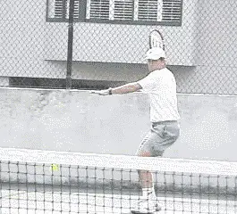
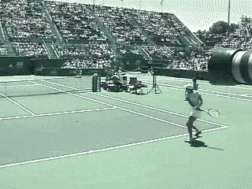
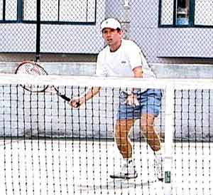
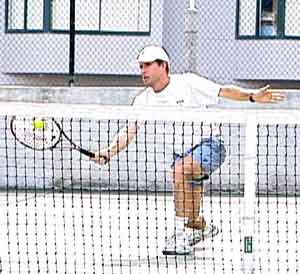

# Neutral Tennis - The Key to Offense and Defense

# By Kerry Mitchell

------------------------------------------------------------------------

In tennis so much is made of playing style. Are you an attacking player
or a defensive player? Why can't a player do both well? The greatest
players achieve this balance.

Making the transition from defense to offense is the key to having a
balanced style. This requires the ability to play Neutral Tennis and it
may be the single most overlooked point in competitive strategy. And it
applies from the club level all the way to the highest levels of the
tour.

                                                               
                 **A neutral reply, well struck and deep down the middle allows me to stay in the point and be ready to go on offense or to respond better in a defensive situation.**
  ----------------------------------------------------------------------------------------------------------------------------------------------------------------------------------------------------
  ----------------------------------------------------------------------------------------------------------------------------------------------------------------------------------------------------

  ----------------------------------------------------------------------------------------------------------------------------------------------------------------------------------------------------

**Defense to Offense**

The first key to developing this balance is to learn how Neutral Tennis
can take you from defense to offense. Transitioning from defense to
offense requires the ability to hit what are called neutral replies - a
ball hit solidly, deeply, and most importantly, down the middle of the
court. Neutral replies are neither offensive nor defensive in nature. A
neutral reply is a well struck, well placed shot that allows you to be
ready to go on offense or to respond better in a defensive situation.
Once you have established this kind of shot in your game it will become
your greatest asset. Here I will describe each of these situations -
offense, defense, and neutral - and then connect them in a way that
every player can use to improve their point playing skills. (See [Rhythm
and Rally Speed](Rhythm%20and%20Rally%20Speed.docx) to learn more about
incorporating this shot into your game.)

Offensive or aggressive tennis includes many styles of play. **An aggressive player can be a serve and volley player (i.e. Rafter), an aggressive baseliner (i.e. Agassi), or a combination of both (i.e. Sampras).** All incorporate an aggressive playing
style and seem to always be on the attack. Would you think of these
players as some of the best defensive players in the world? I do.
**What is often misunderstood about the top players is how well they use great defense to set up great offense.**

\"Defensive tennis\" is often viewed as a baseline style in which the
player gets to every ball and manages to throw it back, making their
opponent hit an extra shot time and time again (i.e. Chang). We have all
played the so-called \"pushers\" of the world. No one would think of
this style of play as offensive, but in a real sense it is. **This is because this type of player creates pressure to come up with great shots over and over againmaking an opponent feel he is being** [**attacked relentlessly.Neutral Tennis**

In today's game too many players try to make something happen by
hitting hard to a corner, thinking that is the way to play offensive
tennis. This is particularly true against the pusher. But I think that
is the wrong way to go about winning points on a consistent basis. Being
patient and staying in a neutral rally will gain you more than enough
opportunities to go on the offensive during the match. This means
learning to center the ball on the court.

When you watch the pros (especially the women) you will see a definite
pattern of playing the middle two-thirds of the court. **Rather than trying to open the court diagonally, they use the depth of their shots to generate short replies. At this point, they go on the attack by striking the ball slightly harder into one of the corners.**

  ----------------------------------------------------------------------------------------------------------------------------------------------------------------------------------------------------
  
  ----------------------------------------------------------------------------------------------------------------------------------------------------------------------------------------------------
  **Here Lindsay shows patience by centering the ball, the same tactics she used when crushing Serena Williams at this year's US Open.**

  ----------------------------------------------------------------------------------------------------------------------------------------------------------------------------------------------------

**This is important factor in my neutral tennis theory. Depth of shot creates far more weak replies than playing angled shots.Obviously the stronger the opponent the longer the neutral rallies must be to gain a short response**. **But once you have gained the advantage, striking the ball just 10% harder to a corner will force your opponent either to err by \"going for it\", or to give you the weak reply you have been waiting for. Now you are in position to put the ball away.An important key to Neutral Tennis is to be prepared to start over.**

Many players are better on defense than on offense and will sometimes be
able to neutralize your first attacking shot. When this occurs, it is
time to start over by re-establishing the neutral rally. **You may have to start over many times in one point when you are playing a great defensive player.The goal is to be patient and stick with the plan.Too often players get on the offensive and don't know when to pull back and start again, causing them to hit the ball harder and harder, eventually resulting in an error.The Transition GameThe final component in playing Neutral Tennis is to learn how to transition to offense when you yourself are on the defensive.** Too often players try to play incredible shots
from defensive positions in the hope that they will get lucky and win
the point. You see them make errors as they try to go from defense to
offense in one ball. Over the course of a match, this is a losing
strategy. Even the pros are unable to hit enough great shots to win from
clearly defensive positions.

  

**When your opponent plays a good low ball at your feet, play back a good neutral volley or half-volley deep down the center. Don't feel you have to put every volley away. Sampras is a master of this shot.Here is the secret to making this critical transition, and it can turn around the outcome of many competitive matches. Again, the answer is the neutral ball.The idea is to go from a defensive position to a neutral position, then maybe to the offense.The key to getting out of the defensive position in the rally is to hit a neutral ball at your rally speed deep into the center of your opponent's court.Centering the ball will cut down on your errors, and also, make it harder for your opponent to create an angle and keep you on the run. Length is the key.All too often players learn to hit angled shots, but never learn what it takes to hit a good deep ball under the pressure of a defensive position. Time and time again I see players trying to make incredible winners from the most extreme places in the court.The depth of your neutral shot will often fool your opponent and he will make a lot of errors overhitting in an effort to stay on the offensive.Don't fool yourself into thinking since you made it back to the neutral position the very next ball is your opportunity to go on the attack, even if you get a short reply.Once you have gained the neutral position again be patient and wait for your opportunity to go on the offensive.** You may be out of breath and not able to concentrate well
enough to make a good aggressive shot. **You might want to hit another neutral shot allowing you time to gain your composure and your wind before trying to attack.Playing neutral tennis works no matter what style you play. A serve-volley type player can make good use of this theory.**

When your opponent plays a good low ball at your feet as you approach
the net, play back a good neutral volley or half-volley deep down the
center. Sampras is a master of this shot. Don't feel you have to put
every volley away. If you are good at this style let your athleticism
and quickness intimidate your opponent into making an error. Again, by
playing a good neutral volley your opponent will be fooled into thinking
he/she is in control and this may cause him to \"go for it\" on the next
shot. In many cases your opponent will make an error or give you an easy
volley to put away.

**When playing a serve-volley type player, your neutral shot is that good low ball in the center of the court dipping low to your opponent's feet.Force your opponent into errors by making him to play difficult volleys. After hitting this shot don't fall victim to your own delusions of glory and overhit the next shot. Realize you are on offense but make your pass only 10% harder emphasizing placement over power. Don't be afraid to start over if your opponent makes a good neutralizing shot of his own. Again, center the ball trying to get it at his/her feet. Another option in this situation is a high defensive lob. Don't panic and overhit.Neutral tennis keeps you from feeling rushed when playing the serve-volley player by giving you a focus and a plan.**

Neutral tennis will improve your point playing skills tremendously. You
can analyze each point and grade yourself on how well you make those
crucial transitions. You will soon know which shot to hit in advance,
making concentration on the technique of that shot more efficient. As
always, have fun and enjoy the process of learning.

|  | numerous ranked junior players and coached |
|  | a series of championship high school teams. |
|  | He was highly ranked both sectionally and |
|  | nationally in men's 30 and 35 singles. |
|  |  |
|  | After 15 years as the Head Teaching Pro at |
|  | the John Yandell Tennis School in San |
|  | Francisco, California Kerry and his partner |
|  | are now splitting time between homes in |
|  | Merida, Mexico and Toronto, Canada. He has |
|  | continued to coach and to have great |
|  | competitive success winning Canadian |
|  | National seniors titles---not to mention |
|  | continuing to write articles for |
|  | TPA from his unique perspective. |

