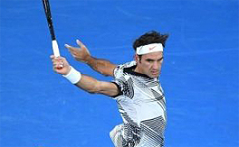
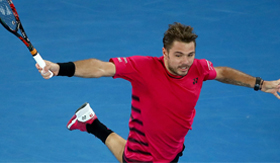
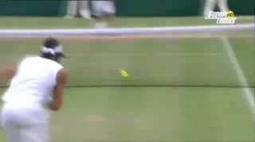
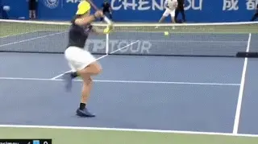
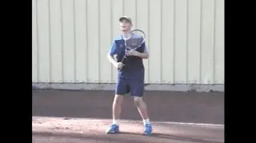
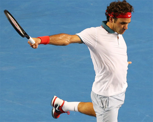
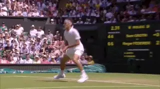
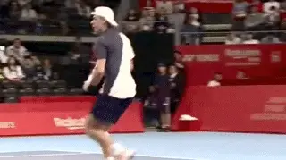
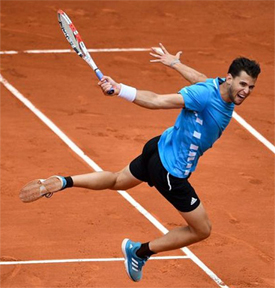

# One Hand Backhand

**One Hand Backhand\ Swing VolleyChris Lewit**

 

**Federer and Wawrinka - two players who first popularized the one hand backhand swing volley.**

The one-handed backhand is still alive on the pro tour and at all levels
of recreational play. While I believe in the technical supremacy of the
modern two-handed backhand, the one hander remains a beautiful,
graceful, and flowing shot that captures attention. It's still viable
in the modern high speed game.

The one-handed backhand swing volley is a "rara avis,\" or a rare bird,
indeed. While legends like Roger Federer and Stan Wawrinka have
popularized the shot to some extent---and make it look easy\--all the
great one-handed backhand players on the pro tour have the ability to
rip the ball out of the air.

**Federer uses the one hand backswing swing volley as a counterattack and passing shot.**

In this article, I will explore some variations that I see on tour with
this singular shot and highlight the key technical and tactical aspects
that I teach to my students. My goal is to help parents, coaches and
players understand the nuances and help players add the swing volley to
their arsenal.

Federer, Tsitsipas, Wawrinka, Shapovalov, etc. You name the
single-handed player. They are all willing and able to take the ball out
of the air. Federer is particularly adept at the shot and uses the swing
backhand volley from the midcourt---not only to attack---but also as a
counterattacking passing shot.

**Classic and Jumping**

The classic one handed swing volley is hit on the ground without
jumping. But it's also common for players to elevate the body to
achieve a better contact point. When the ball is floating high and
players are moving forwards, players frequently jump up to attack the
ball.

Denis Shapovalov and Dominic Thiem have upgraded the one handed swinging
volley adding panache and new technical elements. In particular, they
often execute the shot with a powerful jump both for regular
groundstrokes and swinging volleys. We can all learn from these
innovations.

**Shapovalov can hit backhands and backhand swing volleys with a powerful jump.Technical Points**

In terms of the swing itself, the one hand backhand swing volley is
similar or identical to the one hand topspin groundstroke. So the player
must have that.

But here are the technical points that I prioritize with my one handed
backhand students when working on taking balls out of the air. I always
teach the classic grounded swing volley first and then progress to the
jumping variations.

The base of support, as they say in Spain, is critical for this shot.
Players need to run forwards and setup sideways.

I prefer an extreme closed stance for the base of support on a one
handed backhand and the same on the swing volley. Most players set up
too neutral with their feet.

It's critical for the player to turn extremely sideways in the setup to
maximize hip and trunk rotation. This can be challenging because most
players find it awkward to turn sideways after running forward to take
the ball out of the air.

**I teach the grounded swinging volley first before progressing to jumping variations.**

A good way to check the stance is to look for the back leg staggered
relative to the front, rather than neutral. You should be able to roll a
tennis ball through the space in the feet in the staggered setup.

**Spacing**

As I discuss in the other swinging volley articles in this series,
distance management can be challenging for players learning this shot.
([**link**](https://www.tennisplayer.net/members/classiclessons/chris_lewit/forehand_swing_volley) for
forehand swinging volley. [**link**](https://www.tennisplayer.net/members/classiclessons/chris_lewit/backhand_swing_volley) for
two hand backhand swing volley.)

Mistakes in spacing are common when moving forwards because players
often misjudge the location and speed of the incoming ball in
relationship to their own position moving forwards. In addition, if a
forward jump is added to the shot this can easily corrupt the ideal
spacing with the ball.

It's important to leave extra room to extend the arm and create lift
and topspin on the shot. A cramped arm at impact will often cause
inaccuracy and will reduce power and RPMs. Good spacing allows the arm
to flow freely and is one of the keys to developing a graceful,
effortless looking one handed shot.

**Hold the gaze on the swing volley---Federer is a great example.The Eyes and the Finish**

I'm a big believer in holding the gaze of the eyes and holding the
finish on the one-hander, like so many pros do---especially on the
swinging volley. Federer is probably the best example of this technique.

Roger achieves optimum position with his feet and then keeps his eyes on
the impact point slightly after the ball is hit. This perfects his
balance and helps reduce framed shots. Too frequently, players will look
up early on a swing volley, distracted by the rival's movements or to
see where their shot is going to go. That's a very common mistake that
occurs due to the bold and thrilling nature of the shot.

As the player is holding the gaze, he should be stretching the hitting
arm to its final point in the arc of the swing and
holding---pausing---momentarily at the finish.

The combination of this pause and the holding of the eyes together help
calm the player and organize the shot with balance and control. In
practice, I will have all my students hold both the eyes and finish in
an exaggerated way. In a match, they will hold the eyes and finish a
little less than in practice---but it's a great habit to ingrain to
improve the rhythm, accuracy and balance of the shot.

**The back toe can be an anchor---and/or swing around to square up the stance.Footwork**

Sometimes players will hit the swing volley and hold the back toe. The
back foot will serve as an anchor. Typically this happens on swing
volleys where the intent is not to attack the net.

Another variation in footwork is the pivot where the back foot will
swing around after the swing volley to square up the stance. This is
also typically used when maintaining a neutral court position and not
looking to move forward after the swing volley.

If there is a tactical intention to move forward to finish at the net,
some players will hit their backhand and use a classic, carioca footwork
pattern---a backwards crossover. I like this method of moving forward
while maintaining a fairly sideways hip position. It's a controlled way
to move forward without over-rotating.

More commonly in the modern game, players will jump forwards into the
floating shot to attack the net. As in the other swing volley articles,
there are two types of jumping styles that I teach.

**The more advanced back knee up jumping technique.Jumping**

The two types of jumping styles are, first, from a closed stance with a
front foot hop, and second, the knee-up style.

The front foot hop is the classic and most simple way to leap into the
ball. We saw how this works in the two hand backhand swing volley
article. ([**link**](https://www.tennisplayer.net/members/classiclessons/chris_lewit/backhand_swing_volley).)
The player sets up a closed stance base of support as if for a regular
grounded swing, but then explodes upwards and forwards, landing on the
front leg with a rear leg kick back for balance. This aids the
transition to the net. You can move in more quickly and cover more
ground to the net with this method.

The more difficult method of jumping to attack the ball out of the air
is the knee up technique. Shapovalov has made this shot look easy, but
it's very hard to time and learn. In this method, the player jumps only
off the front leg while lifting up the back knee as a counterbalance and
counterweight---to provide control during hip and trunk rotation in the
shot.

I recommend teaching the former style of jumping as the simplest and
most efficient form of swinging volley attack. Advanced players can
experiment with the Shapo style jump once they have mastered the simple
version.

**Tactical Priorities**

**You want air superiority - the ability to punish high balls.**

I stress to my students that, just as in the military, if you have air
superiority, you will likely win the ground war. In tennis, the ability
to punish high balls aimed at your backhand is a huge asset. Especially
for one handed players, they are often attacked with topspin heavy balls
and moon balls to that side. If those players learn a good swing volley,
they can protect themselves and turn uncomfortable defensive backhand
situations into aggressive attack situations.

If a one-handed player can master the swing volley, they can mitigate
one of the most common tactical plays used against them in
competition---high balls. This is a huge advantage for one handed
players.

Federer understands this principle more than any other one-handed pro.
He is very adept at sensing when he can take time away, and he is very
quick to use the swing volley technique to steal his rival's time. As
mentioned earlier, Federer sometimes even hits one handed passing shots
out of the air, all in an effort to steal time.

The swing volley is a tremendous entry technique to move quickly to the
net. It's perfect for transition. I like to encourage my students to
look for any floating ball as a transitional opportunity to go to net.
Once again, Roger Federer is the king of this strategy.

**Conclusion**

If you have a one handed backhand yourself, you should review my
articles on building the technical fundamentals of the stroke.
([**link**](https://www.tennisplayer.net/members/classiclessons) to
find that series.)

Federer is the best at taking time away with the swing volley.

I hope you will consider adding the swing volley to your one-handed
game. John Yandell for one believes that the swing volley could be the
next level in attacking tennis. ([**link**](https://www.tennisplayer.net/members/strategy/john_yandell/swinging_volley).)

If you are a parent or coach, these same resources will help you
understand the nuances and fundamentals that are important for your
players who have onehanded backhands. Then, once those fundamentals are
locked in, you can take the stroke to the next level by adding the swing
volley. In the modern game one handers need this shot to be complete
attacking players.

Good luck and have fun with this gorgeous shot!
