# Personality and Playing Style

# By Kerry Mitchell

------------------------------------------------------------------------

**How do tennis personality types affect playing style?**

My strengths as a coach and instructor are usually analyzing stroke
technique, seeing patterns, and helping players translate those things
into a winning game. The psychology of the game I usually leave to the
experts, meaning my fellow Tennisplayer contributors, who are among the
most esteemed students of the mental game in the world. ([link](../Mental%20game/Mental%20game%20TOC.docx)).

But in this article I want to verge into that field by addressing the
issue of tennis personality types. As in other aspects of life, in
tennis we handle things on the tennis court based on our personality
type. When a person is playing a match his or her personality determines
the reaction to all situations. It doesn't matter whether those
situations are stressful or successful. These reactions often determine
what kind of choices we make, and those choices can determine a win or a
loss.

 

**Federer and Nadal both blend elements of the opposite into their dominant type.Two Basic Types**

The two obvious personality types that I will discuss are the aggressive
personality (hitter or shotmaker) and defensive personality (grinder or
pusher). I want to address how this basic distinction determines our
success on the court. But more importantly I want to address also how
you as a player can adjust your training to produce better results - by
incorporating some elements from the other style, while still staying
within your basic type. I will also talk about how sometimes appearances
can be deceiving in terms of determining your own personality type.

The personality that a person is born with basically determines what
kind of player you will become, but that doesn't mean that a player
can't make relatively small changes to his or her game that result big
leaps in competitive success. So the first step is to actually what type
of personality player you are. What is interesting to me in all of this
is that appearances can be deceiving at times. The key to recognizing
your personality type is to see where, how, and when errors occur.

For example, a tour player whose basic personality type has been
misunderstood is Andy Roddick. Most people think that with his big
serve, big forehand and his hyper personality, he must be an aggressive
personality type player. But I think the opposite.

**The use of the slice is a sign of Andy's true personality type.**

If you really look at his game, other than his serve, he struggles with
being aggressive. This can be explained by understanding his
development. Until late in his junior career, when he grew physically
and the serve began to develop, Roddick was a smaller than average, very
determined player who depended on his consistency to win matches. This
often meant looping his forehand under pressure instead of trying to hit
aggressive shots.

And today he still struggles with staying aggressive under pressure with
his forehand. His use of the slice backhand to rally is another sign of
his true personality type.

Brad Gilbert, who coached Roddick all the way to number one in the
world, always had the same mantra for Roddick's game, and that was that
he had to hit his forehand (flatten it out) and stay aggressive in the
points. The point to understand is that this more aggressive approach
was an addition or an adaptation, something that often went against
Andy's natural inclinations.

So, whether you are Andy Roddick or a 3.0 club player, the basic idea
here is simple. Your goal should be to understand your own personality
type, to control the extreme tendencies in your type, and at the same
time incorporate some of the opposite personality type into your game.

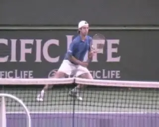

**The aggressive personality type likes to hit his way out of trouble.Melting Types**

The reality is that the best players in the world often are a melting of
the two personality types. You can't find any two better examples than
Rafael Nadal and Roger Federer. Federer has always prided himself on his
ability to play defense. And Nadal's ability to hit more and more
aggressive shots, especially under pressure, has been the key to his
ascendancy.

But for many players, this melting process is often a real struggle.
This is because your dominant personality type wants to control how you
react, so things often occur \"automatically\" because of this. The
challenge is to recognize that this happens, understand your natural
tendencies, and then make changes both mentally and physically that will
bring about this melting process.

**Aggressive Personality Type**

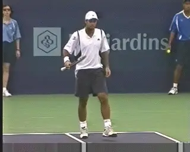

**Fits of rage are often characteristic for the aggressive personality.**

I define the aggressive personality type as a player who would rather
hit his way out of trouble than pull back and play more conservatively.
This type of player attacks either by moving forward or by hitting very
aggressively from the baseline, even when on the run. Risk taking in
stressful situations is much more prevalent.

Results in tournaments tend to be inconsistent for this type of player.
The word \"streaky\" is often used by their opponents to describe
aggressive players. For this type of player errors come more often from
over hitting than what I call \"under hitting,\" something I will
describe in more detail below.

Being overly emotional on the court is another quality of this
personality type. Fits of rage and fits of exuberance can come from one
point to the next. Some examples of players on the tour that fit this
type of personality are Novak Djokovic, Fernando Gonzalez, Richard
Gasquet and Marat Safin. In my experience this type of player is less
inclined to technical instruction. He or she responds more often to a
type of coaching that inspires them emotionally.

                                                       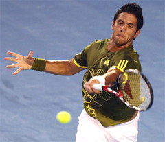
                                                    **Verdasco moderated his personality type all the way to the Australian semi**.
  -----------------------------------------------------------------------------------------------------------------------------------------------------------------------------------
  -----------------------------------------------------------------------------------------------------------------------------------------------------------------------------------

  -----------------------------------------------------------------------------------------------------------------------------------------------------------------------------------

**Mental Changes**

What does the aggressive personality type player need to change to
become more competitive and consistent on the court? Those changes
include mental, tactical, technical and physical. The main mental change
that needs to occur is developing a calmer outlook. Often an aggressive
personality type will be emotionally explosive, and the explosion can be
either super negative or super exuberant. Finding a middle ground
emotionally is very important.

Federer in the juniors and early in his professional career was very
much like this. He had big emotional swings not only between games but
between points, and this created inconsistent results. Everyone saw his
talent, but it wasn't until he was able to get his emotional game under
control that things started to go his way in a dramatic fashion. He
added a mental patience to his game that wasn't there before.

Another obvious recent example is Fernando Verdasco. His success at the
Australian Open came from emotional and mental changes, changes in his
willingness to stay in tough points, to fight, and to stay positive as
his matches swayed back and forth.

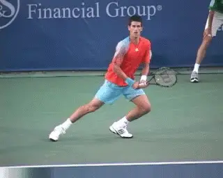

**Reactive thinking can lead to emotional upsets that effect performance.**

If you can develop this same new-found calmness and emotional evenness,
it will help make the decision making process clearer, especially at
critical points in matches. The difficult thing about achieving this
mental calmness is that the player has to start thinking more in
general.

He has to think about where he is in a match and how that situation
should affect decisions technically and tactically. This is very
difficult sometimes for aggressive players because their best
performances often come when they react and don't think too much.

But some of their worst performances occur because of this reactive,
non-thinking process as well. Learning to mentally analyze situations
goes a long way in helping to develop the mental calmness that is
necessary for more consistent outings.

Often aggressive type personality players feel that too much analysis
can lessen their intensity and create a poor performance. And initially
it can. But if they are open to the process, they find that every
situation they face doesn't warrant a strong emotional response and the
corresponding ups and downs. Cultivating this skill simply gives the
aggressive player more options when stressful situations arise in a
match.

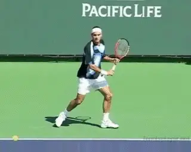

**Early in his career Federer made technical improvements with his backhand.Technical Changes**

So, what does this mean technically? The aggressive personality type
player needs to start to understand his own technical capabilities more
clearly. If a player better understands how to hit a high technical
quality attacking forehand, they may execute that forehand better, more
often. This will mean higher shot percentages that will their attacking
game even more formidable.

We can see this in Federer's development on his backhand. You could see
from the beginning of his rise that he had a very clear sense of his
forehand and how to use it to his advantage, but his backhand was
another story. I believe this is what his former coach Peter Lundgren
(who initially took him to #1) was able to do for him.

They worked on the technique and Federer himself really put his mind to
understanding his own backhand better and how it worked. This technical
improvement was a key in his rise to number one. Again, this type of
technical training requires more thought and analysis than an aggressive
personality type usually finds comfortable. As I mentioned before, this
type of player likes his training to be more supportive emotionally and
less about technique.

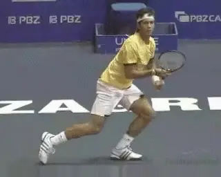

**Becoming less erratic under pressure - key for the aggressive player.**

The areas of technical training that need to occur the most are on those
attacking shots that make your game more successful - serve, forehand,
overhead, volleys, etc. That includes all areas of technique:
preparation, footwork and the swing. A player may have an awesome
forehand when it lands in but tends to be erratic under pressure
especially when facing his nemesis player, the \"pusher.\" A little more
clarity on the physical execution of the shots can make the difference
between winning and losing.

Tennis is about numbers and percentages. If technically improvements in
an attacking shot increase the number that land in even by a small
percentage, that can go a long way toward winning a close match. The
quality of a player's technique has a direct bearing on shot velocity.
The better the technique the harder it can be hit with success. I call
this the \"speed limit\". This concept is crucial for the aggressive
personality type player to understand. This kind technical training can
be difficult, but the results will be worth it.

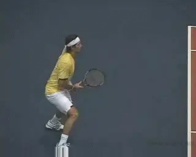

**Aggressive players often must train to use slice and other defensive shots.Tactical Changes**

Learning to be better defensively and creating better tactical patterns
are the next steps in making the aggressive personality type player more
successful. On the defensive, this type of player will often \"pull the
trigger\", going for a big shot. The instinct is just to blast his way
out of trouble.

This type of player is less likely to throw up a lob or slice a low ball
back at an incoming player. The glory of the one big shot often becomes
like a drug. When a player makes it, it gives him/her that moment of
extreme exuberance which keeps him emotionally involved in the match.
But if he misses it, it leads to an emotional fall which can take him
out of the next few points. It can even lead to total collapse if these
shots are missed too often.

Even when a player like this does try to play defense, he often lacks
the same skill level in lobbing or slicing, compared to his aggressive
shots. So, this creates even more resistance to using them.

**Small Space Big Space**

To improve his defensive shot making, the first thing an aggressive
player has to learn is a different concept of shot targeting. Often the
problem in playing better defense is more one of placement rather than
velocity or style of shot. The principle is what I call \"small space,
big space\". Too often the aggressive personality type player will aim a
defensive shot to a small section of the court - as if it were going for
a winner. This means that even when he thinks he is playing defense, he
tries to hit an extreme angle (very small space) or go down the line
with the intent of landing it on the line (even smaller space).

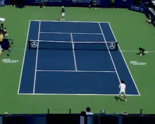

**Deep down the middle is a great defensive play.**

A change in thinking is required to choose the larger parts of the court
on defense. This obviously will raise the percentage of shots that
actually land in.

As I've written in previous articles, players should often use the deep
center of the court as a target area for defensive shots. This is also a
great play on first serve returns ([link](The%20Forehand%20Return.docx).) The advantage is that the deep
center ball does not create an angle for the opponent. And it gives the
opponent a chance to make an error out of frustration, if the center
ball neutralizes his previous advantage.

Again, percentages matter. A handful of points separate the winner and
loser in a close match. If the aggressive player can stay in a higher
number of points with a few defensive shots, the number of points he
wins will likely go up as well, possibly swinging the balance in the
match.

Another viable option is to go deep cross court with a heavy, looping
defensive shot. This can often push the opponent back, forcing him or
her to play a neutral instead of an attacking shot.

I feel this shot can a bit more risky because if it is not hit quite
deep enough and the player is well off the court, the opponent may be
able to hit a winner. But it makes especially good sense when the
crosscourt is aimed to the opponent's weaker side. The further out of
position you are, however, the more important it is to put the ball
higher and deeper to give you recovery time.

The second key to better defense for the aggressive player is usually
technical. This means getting more proficient at the execution of shots
that the player may look down upon as weaker or inferior. These include
especially the slice, and the lob. These shots may be used quite
infrequently, but if the player can execute them well when he really
needs them, they can be the difference between winning and losing.

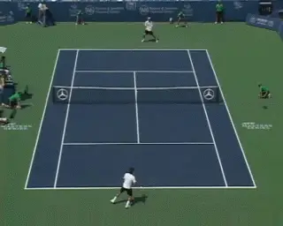

**Playing key patterns like the forehand inside out and inside in is critical.Patterns**

Often aggressive style players, particularly at the lower level, have
poor attacking patterns to begin with or none at all. They rely on just
hitting the ball as hard as possible without much thought to where, and
just hope it doesn't come back.

The basic pattern of going cross court until the player receives a short
reply is where to start. Another basic pattern that isn't utilized
enough at the club level is the forehand hit inside out, then inside in.

The question to ask about all patterns, is whether there is too much
impatience. When hitting inside out forehands does the player pull the
trigger too soon with the inside in? Does he try to hit the final shot
into too small a space because he has not opened the court sufficiently?
Working on requires practice, but to do it successfully also takes that
same mental calmness I described above.

One last training aspect for this type of personality is physical
stamina training. Players who play aggressive may fear adding more shots
and longer points, because win or lose their matches don't tend to test
their condition. Doing more stamina type training and building aerobic
capacity (longer sessions on the bike or the treadmill at the gym) will
go a long way in calming the mind and body when on the court. The
willingness to stay in points longer will be there because the player
knows he/she can go the distance.

|  |
|  |
|  |
| **Defensive players: steadier point to point and match to match.** |

**Defensive Personality Type**

Compared to the aggressive player, the defensive personality type player
tends to be more steady not only from point to point but from match to
match. This type of player may not have as many great wins, but
definitely tends to have fewer bad losses.

There is a tendency to play the ball back without too much risk, often
hitting high over the net, or with slice. The ball speed tends to vary
more, but tend to stay mainly in the slower speed zones, regardless of
level.

Variety of shot and consistency are the trade marks of this type of
player. Defensive players tend to be quicker and speedier around the
court. They also tend to naturally resist moving forward into the court
into a more attacking position.

Opponents often describe these players in derogatory fashion as
\"pushers\". But at the same time they fear competing against them
because of their natural tenacity and their high percentage style - both
of which makes them very difficult to defeat.

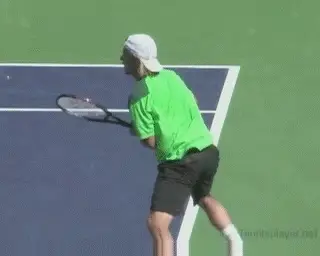

**A defensive tendency - to become more defensive under pressure.**

But there are definite limitations to the defensive style. These are the
limitations that defensive players need to overcome to get to the next
level. The first limitation is to become even more defensive under
pressure. This can result in punching or guiding the ball. This is what
I call \"under hitting.\"

Under extreme pressure blocking alone predominates in their game, and
their compact strokes can contract to the point of non-existence. This
lack of a swing and a follow through can cause control errors and result
in unexpected and uncharacteristic control errors. Often defensive
players with these tendencies will have unexpected breakdowns and loses
to players they would usually wear down.

**Technical Changes**

This type of player tends to like to learn new things technically. But
often they won't use a new technique in match play because it
represents what they see as an unnecessary risk. The aggressive
personality type player has to force him/herself to hold back and play
safer. Conversely, the defensive personality player has to force
him/herself to take a chance and go for that big shot, at least on
occasion.

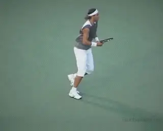

**Defensive players can incorporate offense by coming forward.**

On the whole this type of player tends to be more successful at his or
her own level than aggressive player. They win the matches they are
supposed to win. But defensive players are often frustrated when trying
to move to the next level. The changes required to move up are a big
risk for this type of player and are often resisted.

Professional players who fit this personality type are Michael Chang,
Lleyton Hewitt and, of course, Rafael Nadal. On the tour these types of
players often have a shorter life span at the top of the game. They have
to grind out every match. The total amount of balls they have to play to
win can become more difficult over a long career. Without weapons to end
points quickly they can see a quick decline in their success with only
small loses in their movement, or their determination and effort level.

**Mental Changes**

Now let's take a look at the mental and physical changes that have to
occur to make this personality type player even more successful. Just as
with the aggressive type player, the mental changes can be the toughest.

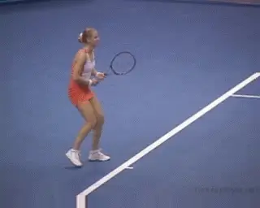

**The mental dynamic of taking opportunities is key for defensive players.**

The first mental hurdle is the willingness to try new techniques in
matches. These can be practiced in matches of no consequence, especially
practice matches, or by even moving down a level where losing becomes
less likely. Mistakes by \"going for it\" should be viewed as a
positive.

The next mental hurdle is to become more relaxed on the court so that
free swinging and the technical changes can occur more often. Mentally
these players have to understand and accept how their mistakes under
pressure can come from \"under hitting.\"

Moving forward into the court is another related mental hurdle to
overcome. Often these players actually volley well. It's not the
physical dynamic that prevents them from moving forward, but the mental
one. So again, these players have to practice and learn to take the risk
of coming in. This is best accomplished in practice or low pressure
competitive matches. The defensive player, however, has to overcome the
natural resistance to try this.

**Technical Changes**

One important thing in becoming more aggressive is to learn better
footwork inside the baseline. Being aggressive with the feet can mean
gaining court position on shorter balls, and this can translate into
being more aggressive in the mental dimension. So smaller quicker steps
can turn a normal shot into a winner.

Learning to develop at least one bigger shot, is another critical
change. But often defensive types trying to play more aggressively try
to change too many things at once.

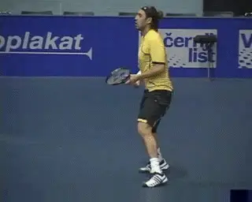

**A player with a good forehand can add aggression playing riskier down the line shots for winners.**

In my opinion this was the mistake Michael Chang made when he tried to
take his game to the highest level. He tried to make every shot bigger -
forehand, backhand and serve. His first serve percentage dropped from
the 70% range down to 40% range.

Being consistent has to remain the core element. Hitting bigger but
being less consistent will not win more matches. The best thing to do is
to isolate very specific situations where more aggressive shot making
can pay off.

I can site an example from my experience coaching a lower-level touring
pro who had the defensive personality type. His forehand was his best
shot and at times a weapon, but he only used it effectively when hitting
into the big spaces on the court. This was mainly going crosscourt and
inside out.

I helped him develop the ability to use his forehand to hit winners down
the line - using a much smaller and therefore riskier space. At first,
he resisted the idea, and struggled with his consistency, but after a
few weeks it became a standard in his game, and part of some big wins in
local pro tournaments.

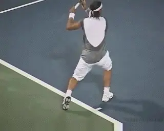

**Nadal has improved every dimension of his aggressive game.**

Again, this type of player shouldn't move away from their own
personality type too much. If you have a consistent second serve, try to
improve the velocity and accuracy of your first serve, but never lose
sight of serving with consistency and good percentages. If you have the
world's best crosscourt forehand, work on a down the line penetrating
forehand to use at an opportune moment to turn the tide in your favor.

Obviously, the biggest example of this type of change at the highest
level is Rafael Nadal. He has maintained or even improved his incredible
court coverage but added more aggressive shot making in many dimensions.

He has improved his serve (without losing his great percentages) and he
has been able to flatten out his forehand which he uses at key times.
And the same or even more so is true on his backhand.

In addition, he is not afraid to go to the net and has come up with
winning volleys at critical times. Because of this I believe Nadal may
be around at the top of the game a lot longer than previous defensive
personality type players.

**Tactical Changes**

The defensive type of player tends to be tactically stronger than the
aggressive type of player. But at the same time there is a tendency to
remain in defensive positions when there are opportunities to attack.
This strategy may be fine at lower levels, but if you really want to
move up, you have to diversify with aggressive tactical elements.

Again, it's not a complete turn around. It means taking a few more
risks to transit from defense to offense when there are opportunities.
For example, on a big point taking a short ball and coming in and
forcing the opponent to hit a pass. Or being more aggressive going down
the line when in trouble, hitting flatter and with more velocity instead
of hitting the safer moon ball.

Or another example, if the opponent comes to net, playing an aggressive
topspin ball at the feet of the net rusher and then moving forward
inside the baseline, looking for a short reply, and trying to hit a
winner, instead of playing a slice or a lob.

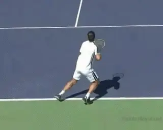

**Guillermo Canas, another defensive player who can come forward at key moments.**

The last and most important tactical change is learning to move forward
when the opportunity presents itself. This is the most important thing
because at higher levels this is where the game is often won. Yes, I
have described Chang, Hewitt, and Nadal as defensive players, but they
are not afraid to move into the short court when necessary to gain an
advantage.

Guillermo Canas is another example - when he returned to the tour, he
retained his incredible tenacity but came up with some big wins in part
because of adding well timed opportunity attacks. The frequency or
percentages may not be as high as naturally aggressive players, but the
fact that they can do it keeps their opponents off balance.

**As a player learns about his/her game, patterns will start to present themselves. Knowing what personality type of player category you fall under will give you a better understanding of why success and failure occur.** Again, the goal is to incorporate
a few aspects of the other type into your game. The effort is to meld
changes into your game without taking you out of your personality
comfort zone. These changes are personal, not based on some theoretical
formula. They changes can be physical, mental or tactical. They may
include one or all of these aspects discussed, but I have no doubt that
understanding basic personality distinction and what it means has huge
implications for any player or coach who takes it seriously.

|  | numerous ranked junior players and coached |
|  | a series of championship high school teams. |
|  | He was highly ranked both sectionally and |
|  | nationally in men's 30 and 35 singles. |
|  |  |
|  | After 15 years as the Head Teaching Pro at |
|  | the John Yandell Tennis School in San |
|  | Francisco, California Kerry and his partner |
|  | are now splitting time between homes in |
|  | Merida, Mexico and Toronto, Canada. He has |
|  | continued to coach and to have great |
|  | competitive success winning Canadian |
|  | National seniors titles---not to mention |
|  | continuing to write articles for |
|  | Tennisplayer from his unique perspective. |

------------------------------------------------------------------------
