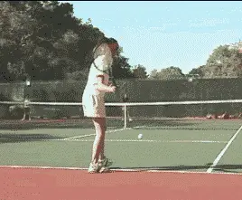
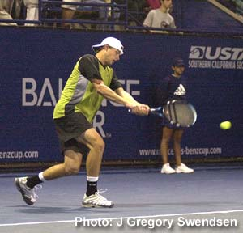
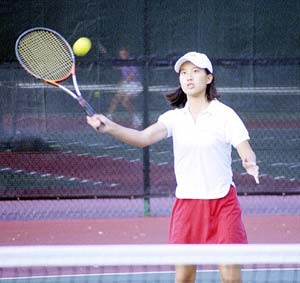

# Private Lessons: Practice, Practice, and Practice

# By Kerry Mitchell

------------------------------------------------------------------------

We have all heard the term \"practice makes perfect.\" We think we
understand what it means. According to the dictionary \"practice\" is
defined as \"repeated exercise\" or \"habitual action.\" In terms of
tennis we have all been told we have to practice to get better, but very
few times are we told how to practice, or the amount of practice needed
to reach the goals we set for ourselves.

What are the various ways a player can practice? A player can compete,
do controlled drills involving one or more strokes, work on movement
drills to improve speed and stamina, or concentrate on the mental side
of the game. All of these are important aspects in making improvements,
but in what combination? How much of each type of training is necessary
to get the greatest potential out of your game and on what schedule?

                                                        
                                  **Crosscourt rally drill - try hitting 5 balls in a row keeping each shot deeper than the opponent's service line.**
  -------------------------------------------------------------------------------------------------------------------------------------------------------------------------------------
  -------------------------------------------------------------------------------------------------------------------------------------------------------------------------------------

  -------------------------------------------------------------------------------------------------------------------------------------------------------------------------------------

First, let me talk about competition. There are numerous ways to
compete. Most players think \"competition\" means league or tournament
play, or at least that weekly match at the club you are so desperate to
win. Players don't equate \"practice\" with competition. In reality,
there are many other forms of competition that should be used when
practicing.

Competitive practice situations are actually a prerequisite to achieving
your potential in match play, but very few players know about them, much
less use them systematically. They are essential to becoming the best
player possible.

A lot of the blame for this phenomenon of failing to practice properly
has to be placed on the growing popularity of league competition. League
play has players competing in matches far too often. A related problem
is that in league matches, the competitive level is often very low.

Too often, even practices for league teams involve playing sets or
challenge matches where the focus is on winning and not on improving or
at least practicing good technique. That's not what I mean by
competitive practice. The pressure to win is always on. This slows down
improvement or stagnates it all together. Stagnation and lack of
improvement are especially common in the lower level leagues, 4.0 and
below.

Don't get me wrong I think league play is great. It gives players at
all levels a structured framework for regular play. It's a key to the
growth and health of recreational tennis.

League play is also good because it creates team camaraderie. Dealing
with competitive pressures as a team can also be a positive experience,
one that is completely different from dealing with the pressures in
individual competition. However, to make improvement possible, practices
need to be less competitive amongst teammates. Players need to save that
competitive energy for the team's opponents.

Rather than only playing challenge matches, players must learn to
\"practice\" competition by doing competitive drills involving point
sequences that are outside of a match format. These competitive drills
create some pressure, but far less than actual match play.

The key to improvement is, obviously, making changes in one's game. But
that is extremely difficult to do when every time a player steps on the
court winning a match is the only goal. With change, mistakes occur, at
least initially. Making those changes in lower-level competitive
situations allows a player to make mistakes with little consequence and,
in the long term, with numerous repetitions, build confidence in the
newly learned skill.

Mistakes trying new strokes or tactics in matches can cause panic. Ego
then takes over and the player reverts to his/her old form to try to win
the match. The cycle repeats itself every time a player steps on the
court in a match situation, making improvement difficult if not
impossible.

                                                 
                         **Pros like Roddick spend hours drilling down the line backhands in competitive situations so it's there when needed.**
  -----------------------------------------------------------------------------------------------------------------------------------------------------------------------
  -----------------------------------------------------------------------------------------------------------------------------------------------------------------------

  -----------------------------------------------------------------------------------------------------------------------------------------------------------------------

**How to Practice**

If one decides to try a different approach, the question naturally
arises; how do I practice? Structured repetition is the key. Making a
successful shot in a league or tournament match at the crucial moment
comes with having confidence, and confidence is gained by making the
shot over and over again.

Playing a lot of matches where you may only get a few opportunities to
attempt a particular shot does not yield enough repetitions to gain the
confidence necessary to make it under the ultimate pressure of a league
or tournament match. For example, if you need to make good consistent
approach shots to win a match, then the only way to achieve this is to
hit as many as you can in a controlled setting. In this way the mental
and physical process can be grooved sufficiently so that nerves play
less of a part of actual play.

To do this you must start by repetitive drilling with a partner, coach,
or ball machine. Thereafter you can progress to competitive practice
games.

The most basic competitive practice game to work on these changes is to
play rally games (no serve) to seven or eleven. In this way the players
can focus on technique or the execution of pattern play.

For example, a player working on attacking takes every opportunity to
hit approach shots and go in, regardless of the consequences. Initially
he may end up losing more points than he wins. If he continues, however,
he will eventually make better approaches and start to win far more
points.

                                                
                               **Most club players' weaknesses include volleys. Specific practice games can be created to practice this.**
  -----------------------------------------------------------------------------------------------------------------------------------------------------------------------
  -----------------------------------------------------------------------------------------------------------------------------------------------------------------------

  -----------------------------------------------------------------------------------------------------------------------------------------------------------------------

The game can be structured to work on any pattern that needs
improvement, for example, hitting consistent crosscourt backhands and
trying to hit 5 balls in a row keeping each shot deeper than the
opponent's service line, etc, etc.

These competitive practice games can be expanded to involve the serve,
which is rarely practiced sufficiently to see improvement in matches.
Again, this is because most players' ideas of practice is to play
matches. The warm-up may last 15-20 minutes most of which is spent
hitting groundstrokes.

In many cases, the serve is never really warmed up, with players opting
to play \"first ball in.\" When serving in the match, the main concern
becomes getting the ball in, reducing the chances the player will
practice the good technique learned in a prior lesson.

In practice games, a player working on a heavier spin on his serve can
now hit out, even if it means a few double faults. Over time, going for
the right technique will result in the confidence to hit the same spins
in a match. Besides the serve, most club players' weaknesses include
movement, volleys, and overheads. Specific practice games can be created
for all of these.

|  | numerous ranked junior players and coached |
|  | a series of championship high school teams. |
|  | He was highly ranked both sectionally and |
|  | nationally in men's 30 and 35 singles. |
|  |  |
|  | After 15 years as the Head Teaching Pro at |
|  | the John Yandell Tennis School in San |
|  | Francisco, California Kerry and his partner |
|  | are now splitting time between homes in |
|  | Merida, Mexico and Toronto, Canada. He has |
|  | continued to coach and to have great |
|  | competitive success winning Canadian |
|  | National seniors titles---not to mention |
|  | continuing to write articles for |
|  | TPA from his unique perspective. |

------------------------------------------------------------------------
