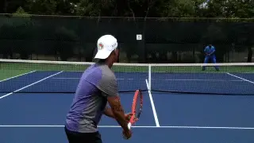
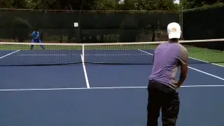
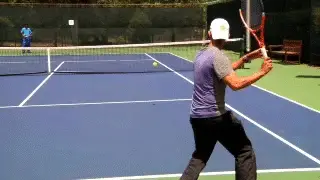

# Rapid, Enduro, and Zig Zag: 3 Conditioning Drill Games

### Rob Heckelman

**Rapid Tennis: conditioning by reducing recovery time rather than running sprints.**

If you've played enough competitive tennis, you've experienced the
times when your opponents have stalled their way through a match, or
maybe you have stalled to catch a breath. But maybe doing sprints or
other on-court conditioning drills isn't your thing.

So here are three ways to work on your conditioning and footwork in the
context of the kind of drill games we've been presenting in this
series. ([Click Here](Classic%20Lessons%20TOC.docx) to read more
articles.)

Drill games not only keep things more interesting by adding a
competitive element, they are also realistic because they are based on
actual on court hitting of the tennis ball.

**Rapid Tennis**

In Rapid Tennis, neither player is allowed to take a rest between points
or when changing sides. In fact, the goal is to hurry to the next point
or game as quickly as possible.

The purpose is to challenge your conditioning. You and your opponent are
required to run to pick up the balls and get in position playing the
next point. And to run on the changeovers to the other side. Any
hesitation will not be tolerated!

Both players must push themselves to play every point as soon as
possible. This doesn't mean, however, hurrying the actual playing of
the point, just everything in between.

This game will tell you quickly whether or not you are in condition to
play a tough singles match. Try playing the best 3 out of 5 games or
work up to a Rapid Tennis set!

**Winning a long point isn't enough to win a point in Enduro.Enduro**

Enduro is an even tougher drill game to test and develop your endurance
and stamina. The point can begin with either player putting the ball in
play from the baseline or with each player serving five points in a row.
Play is to six points.But the only way to score a point is by winning
four points in a row. Therefore it can take an entire afternoon to
finish the game.

If six points seems like to much to start, you are welcome to change the
number of points in the game to 5 or 4 or even 3 to fit your needs. But
don't get too crazy. The sun will set or the club will turn off the
lights eventually.

**Zig Zag**

Many players find that their footwork deteriorates markedly when they
are tired. I found this to be one of my own biggest problems in
tournament matches.

Not only was I taking fewer steps and covering less ground, but my foot
work began to get sloppy and my positioning on the ball was suffering.
This often led to a poor stroke.

I kept telling myself, \"Move your feet, move your feet.\" Maybe it's
because the feet are the furthest point from the brain, but the message
just wasn't getting there. I wanted to critique my footwork, but I
found there wasn't any to critique.

**Working hard on your positioning in Zig Zag will improvement your stamina, but also your footwork.**

I needed a game that would address this, so I came up with the following
game called \"ZigZag.\"

There's no way for anyone to work on your footwork when you are tired
unless a rally can be maintained. So, this game has two parts. The
players have to complete a four-ball exchange with a specific pattern,
and only then does the point start.

Both players start at the baseline with either player starting the
point. One player hits cross-court while the other hits the ball back
down the line. After the fourth hit-two cross-courts and two down the
lines\--the point begins.

After the fourth hit, a player can come to net, hit an aggressive
groundstroke, or do whatever they wish to win the point. You will notice
that if your footwork is sloppy, by the time that fifth hit comes
around, it will be difficult to play the rest of the point with control.

Play to 21 points, or again, adjust the game down to 11 or 7 points and
then work up. After ever game switch who is hitting crosscourt and down
the line.

Zig Zag is also a great game for working on your shot accuracy. To make
it even more difficult in this regard, you can increase the number of
crosscourt and down the lines the players must hit before the point
starts.

                                                                                                                                                                                                              formerly the youngest head pro at the John
                                                                                                                                                                                                              Gardner Tennis Ranch in Scottsdale, Arizona,
                                                                                                                                                                                                              and has been ranked numerous times in Northern
                                                                                                                                                                                                              California seniors play. He is the author of a
                                                                                                                                                                                                              book on senior tennis, called "Playing Into the
                                                                                                                                                                                                              Sunset" as well as the "Business Handbook for
                                                                                                                                                                                                              Tennis Pros." In addition to his reputation as
                                                                                                                                                                                                              an outstanding teacher and coach, Rod speaks
                                                                                                                                                                                                              widely within the tennis industry on all
                                                                                                                                                                                                              aspects of instruction and club management.
  -----------------------------------------------------------------------------------------------------------------------------------------------------------------------------------------------------------------------------------------------------------
                                                                                                                                                                                California for the last 30 years. He was
  ----------------------------------------------------------------------------------------------------------------------------------------------------------------------------------------------------------- -----------------------------------------------

  -----------------------------------------------------------------------------------------------------------------------------------------------------------------------------------------------------------------------------------------------------------
