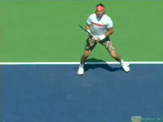
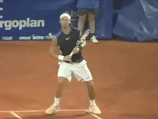
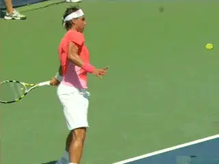
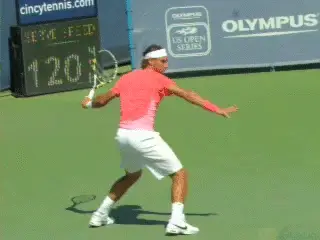
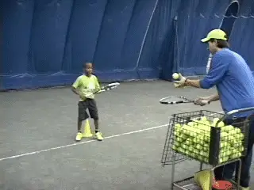
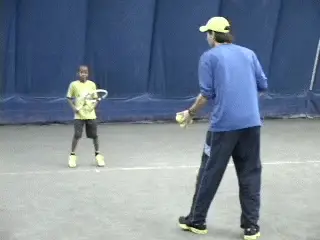
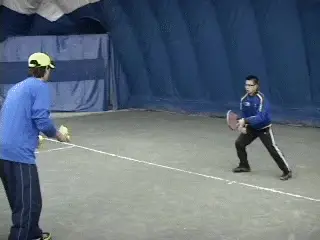
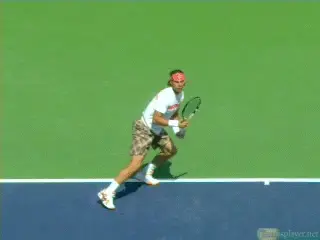

# Secrets of Spanish Footwork

**Secrets of Spanish FootworkChris Lewit**

**Footwork and balance: a Spanish obsession.**

The Secrets of Spanish Tennis are the common, core elements that I have
observed being taught across the country by different leading academies
and coaches. I have tried to harmonize the varied approaches that can be
found across the country into simple elements that all coaches, parents,
and players around the world can learn and assimilate into their own
training systems.

I've often remarked that the Spanish way is like the Buddhism religion,
which historically spread rapidly throughout Asia and the rest of the
world due to its ease of assimilation and adaptability to other
religions. So in the next articles let's look at some of these
adaptable secrets, starting with footwork and balance.

**Footwork and Balance**

Footwork and balance are an obsession for Spanish coaches. The great
Spanish coach Lluis Bruguera has said, \"Without balance, a player
cannot be consistent and will lose confidence .\"

The top academies and coaches relentlessly drill their players to move
quickly, fluidly, and to get in position. Why has footwork become such
an obsession in Spanish coaching circles?

**Spanish tennis celebrates red clay, a second teacher.**

Two thoughts. First, it probably has something to do with a European
culture that tends to focus on playing with the feet more than the hands
due to the popularity of soccer, compared to baseball and football in
the states.

Second, it is related to the values of the Spanish tennis culture which
celebrates running and triumphing on the red clay, where footwork is
essential to winning. The clay surface itself is like a second teacher,
helping to train the movement and balance even without the coach's
input or drills.

**Balance**

To begin to explain the secrets of Spanish footwork, I would like to
start by explaining what Spanish coaches look for when a player moves.
Spanish coaches are trained to look for imbalances when the player is on
the move, during the shot, and on the recovery.

A player needs to move fluidly with dynamic balance and good posture.
Posture is very important to the Spanish coach. Controlling the center
of gravity is also very important.

Sometimes a player must shift his or her center of gravity, in order to
move quickly to a shot (for example, when sprinting to a ball out wide),
but more often than not, and especially during the actual shot itself,
the body should be centered. Rotation should take place around a central
axis.

**Rotation of the body around a central axis with contact between hip and shoulder.**

Spanish coaches look for the contact point to be at the right height. In
Spain, the most frequent directive to describe this is: \"hit the ball
between your hip and shoulder.\"

In other words, don't let the ball drop below your hips or bounce over
your shoulders where it's out of the strike zone (to borrow an American
baseball term). Thus the height of the struck ball should be between the
hip and the shoulder for the majority of shots.

Secondly, the distance from the body of the contact point should be such
that there is no crowding and the arms do not get jammed too close to
the body. The body should be positioned such that the ball is played
early and out in front. This relates prominently to the technical goal
of good extension in the forward swing.

One of the most commonly used footwork teaching phrases in Spain is
probably: \"get behind the ball.\" The phrase is used by Spanish coaches
to instruct their players to get into position with their bodies so that
the ball can be played out in front.

When these three criteria are met, the Spanish coach is happy because
the body has a better chance to be on balance during the delivery of the
shot if the contact point is correct. However, if the contact point is
not correct, if even one criterion is missing, the player will most
likely lose control of his center of gravity and be off balance for the
shot.

**Contact in front: a critical component intertwined with balance and footwork.**

Therefore, there is a critical connection between the contact point, the
balance, and the footwork; they are intertwined, strung together.
Ultimately, the positioning of the player's feet determines whether the
contact point is good, and thus whether the shot will be in balance or
not. Spanish coaches become obsessed with the positioning because,
without it, there is often a bad contact point and usually poor balance.

**Court Positioning**

Positioning in Spain classically means getting to the ball and getting
the feet in a good stance, the proper distance from the ball so as to
allow for a balanced body during the swing.

But positioning can also mean court position, such as whether a player
is playing deep in the backcourt or close to the baseline. In this case,
Spanish coaches guide players to be in the right position to attack or
defend, depending on the situation and the type of a ball hit by the
opponent.

The positioning, as per the first definition, can be thought of as the
footwork used to \"receive the ball\" a commonly used phrase in Spanish
tennis teaching. Receiving the ball means getting the feet into the
right position to allow a good, balanced reception of the incoming
flight of the ball, like an outfielder getting back behind a fly ball.
So in Spain there is this obsession with getting the footwork right
during the flight of the incoming ball, to learn how to receive the ball
properly, in good position, and then to send the ball with balance.

In my experience studying tennis systems in the United States, I
sincerely believe that our coaching curriculums do not spend nearly
enough time working on footwork and especially this critical element of
positioning.

**In Spain\--believe it or not\--the foundational hitting stance is neutral.Neutral Stance**

What stance should players use as they get into position? In Spain,
believe it or not, many academies still stress the basic neutral stance.

Bruguera Top Team and SanchezCasal are major proponents of this
classical approach, for example. They still teach neutral stance and
stepping in to the ball as the foundational footwork skill.

That being said, it is clear that most Spanish players evolve to use
semi-open and open stances, and they use these heavily at the top junior
and professional levels. Open stance allows more body rotation and thus
more racquet speed, power, and spin as players advance in level. But no
matter what the stance, the positioning must be there, and the balance
must be maintained through the shot.

**Reading**

Great positioning, in the Spanish system, is linked with what Spanish
coaches like Lluis Bruguera and others call \"Reading.\" Reading is
using the eyes to see the tactical situation unfolding on the other side
of the net and observing the flight of the incoming ball.

Spanish coaches generally work on the reading skills together with the
footwork skills, because without good reading the player cannot position
his or her body effectively and efficiently. As legendary Spanish coach
Jose Higueras said, \"We must train the eyes and the feet together.\"
Thus reading and positioning-the eyes and the feet in the Spanish
approach, are inextricably linked.

**Spanish style training: the same movements over and over with precision.Stamina**

In Spain, the quickness of the movement is important, but I would say
that stamina\--the ability to make movements over and over again with
precision\--is the more fundamental style of footwork training. The
footwork teaching that I have observed of a classical, \"older-school\"
Spanish coach like Pato Alvarez, tended to emphasize long sets of
rhythmic movements rather than short bursts.

Some younger, more modern coaches like Jofre Porta, Carlos Moya's
junior and professional coach, emphasize short bursts of work training
quickness more than stamina. Porta works in the repetition range of 4-8
balls generally when he is training footwork, so there is some variation
depending on the individual coach.

But in my experience traveling to some of the most well-known academies
in Spain, most Spanish movement training is still more stamina based,
with long sets of 10 up to even 60 balls of repetitions.

Pato Alvarez works this way. But Lluis Bruguera's system works a
combination of both, with more emphasis on balance and positioning than
pure quickness, although he has some drills that are shorter duration
for quickness.

Don't get me wrong, the Spanish coach wants quick, sharp, adroit
footwork movements, but , just don't believe most Spanish coaches are
systematically and regularly training for physical speed improvement,
although some speed improvement is expected from any technical
efficiencies gained.

**Balance and positioning are trained rhythmically and aerobically.**

In my opinion, when drills hit the repetition range above 10 balls, the
player begins to work sub-maximum and aerobically rather than at a
maximum and anaerobically, which is where physical speed improvement
comes from, at full sprint.

Thus in the classic Spanish footwork system, the quickness of the
footwork is often left to the physical trainer to improve, while some
select Spanish coaches seem to be emphasizing on-court quickness work as
a regular training diet.

In the classic Spanish footwork system, the coach is training balance
and positioning rhythmically and aerobically, rather than anaerobically.
Think sets of 10 to 30 or more balls at medium intensity rather than
4-10 balls at highest intensity.

In this way, stamina is clearly trained at the same time as movement and
balance. The player must have great endurance to perform the movements
over and over again with good footwork technique and balance. Of course,
the extra stamina training comes in handy when the player is facing a
tough third or fifth set at Roland Garros.

**Anticipation and Reaction**

Anticipation and reaction are two facets of movement and footwork that
are trained quite frequently in Spain, and they both contribute to
overall quickness. Spanish coaches like to train the eyes to read the
situation, picking up the ball early-anticipation\--and they like to
train the neuromuscular connection, the signal from the eyes to the
brain to the feet reaction.

**Hand feeds train anticipation and reaction.**

According to Lluis Bruguera, \"If before the ball is hit, you can't
anticipate; if you open angles and you don't cover the court, your
opponent has the advantage.\" \"If you are in good position to hit your
shot, the results are completely different. To arrive in that position
you need to learn two things: read (with the eyes) and go!\"

To train the anticipation and the reaction, coaches will hand toss feeds
in quick, random patterns and will try to disguise the tosses so as to
surprise the player. The player is forced to use his eyes to read the
coach's hands and to anticipate the next feed. Jofre Porta is a master
of this type of footwork training. So is Bruguera.

All differences aside, in Spain, hand feeding of footwork drills seems
to be universally accepted as the best way to develop footwork and
balance. The coach has more control of the speed and timing of the feed,
can communicate better with the player, and can see the technique of the
movements more clearly by being close to the player when hand feeding.

**360 Degree Movements**

In Spain, footwork is taught in 360 degree movements, rather than just
laterally and forward. In Spain, the coaches seem to be obsessed with
defensive movement, which means retreating off the baseline to hit a
shot.

**Spanish training is obsessed with 360 degree movement, including retreating off the baseline.**

In my experience, most American coaches teach 180 degree
movement-lateral and forward-to attack. Rafa Nadal is the prototypical
Spanish runner, with great speed, anticipation, footwork and
positioning, stamina, and willingness to chase down any ball. Great
defense is one of the hallmarks of Spanish tennis. Spanish coaches
understand that defense starts with great footwork and a willingness to
give up ground and move back deeper into the court, away from the
baseline.

Spanish coaches also spend a lot of time working on the transitions
forward and backward from a defensive position to offensive position, or
from offensive to defensive. Spanish players learn to move fluidly, not
only side to side but forward and back, which aids in their transitional
skills.

Said Fernando Luna, \"I think the most important system in Spanish
tennis is first the footwork, to move with more anticipation when the
ball is coming, to be in perfect position for more acceleration and more
control.\"

