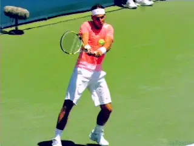
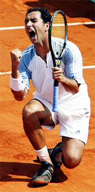
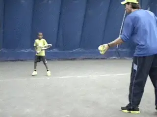
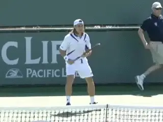
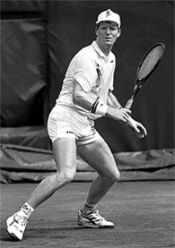
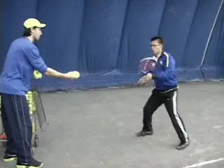
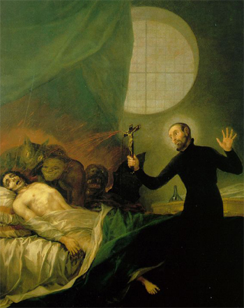

# Secrets of Spanish Tennis-Suffering

**Secrets of Spanish Tennis:\ SufferingChris Lewit**

**Nadal: a paragon of mental strength and the ability to suffer.**

After visiting academy after academy, and interviewing coach after
coach, I was astounded at how one after another stressed the same
principle: suffering. Suffering to the Spanish means mental toughness,
perseverance, and a fighting spirit. It is part of the tennis culture
and every young Spanish player is expected to learn to fight and suffer
on the red clay-to never give up.

Rafael Nadal demonstrates this mental strength perhaps better than any
other professional player. Sometimes it seems Nadal likes to suffer!

But all Spanish professionals are taught to be fighters who never give
up on the court. If a Spanish guy is your opponent, you may be bigger or
stronger, but you know you are in for a dogfight and that the Spaniard
will not tank or give in.

Whether in practice or in a match, the same willingness to suffer is
demanded by Spanish coaches of their players. Said Albert Costa, \"What
I'm trying to do is make them think that everyday they have to do
something else. If they go to the edge one day, the next day they have
to go a bit farther. Every day they have to go farther.\"

**Albert Costa: A player who knew how to go to the edge.**

\"When I was a player, I was a fighter. I know I had good quality
tennis, but when I was practicing I was always going to the edge. Every
day that you step up in the court, you have to do something else, or try
to improve something.\"

Spanish players are taught to be fighters but also to be humble
sportsmen. There is beauty in the toughness yet humility and integrity
that typifies the Spanish mentality.

Jose Higueras, who was himself a true fighter on the court, believes
that the willingness to suffer and fight is one of the key elements
missing in American juniors. In fact, the USTA has been sending squads
of elite American players over to Barcelona Total Tennis (a leading
Spanish academy) to learn how to train, and more importantly, suffer the
Spanish way.

**Seriously?**

When Spanish coaches said to me quite earnestly, \"We teach the players
how to suffer,\" I first wondered if they were serious. But the Spanish
are very serious about training hard and setting up exercises to
challenge a player's courage and fighting spirit.

Lluis Bruguera's philosophy is this: \"If a player isn't willing to
suffer, to sacrifice, it's impossible to win.\" When I asked him how he
goes about achieving this with in his players at his Top Team Academy,
he told me, \"We force them.\"

**The Spanish approach to drills: more, more, and more.**

Bruguera suggested spending 4-5 hours daily with your players (pushing
them physically and mentally). He recommended a lot of drills: \"More,
more, more. That's more difficult for the coach and player, but the
result at the end is better.\"

The long, classic Spanish drills, with repetitions of 20-60 balls or
more-nonstop-are one of the classic ways that Spanish coaches force
players to learn discipline and to never give up. There is nothing like
hitting your 30th ball-legs burning, lungs on fire, only to realize that
you still have 30 more shots left to go in the exercise! That teaches
suffering better than any other drill I know.

Although some coaches can make drills tough with just 5-10 balls, it is
the suffering that comes from stamina drilling of 20 or more that
creates the mental toughness the Spanish coaches are looking for.

In Spain, of course, running and conditioning are another important way
of teaching players to learn how to suffer. Distance running and hill
running are two ways to really simulate the pain and suffering that
occurs in a five-set match at the French Open.

**David Ferrer has shown that fast and fit can win.Tennis Players Or Athletes?**

Spanish players and coaches have figured out that the modern tennis game
is a physical game where generally the strongest, fastest, fittest, and
most powerful athlete wins. The Spanish understand that if they build
superior athletes who are more agile, quicker, can run longer without
getting tired, and stay injury free, they can develop those athletes
into world-class tennis players.

In many other countries, including the United States, building tennis
players seems to be the main focus-not building athletes. By building
athletes first and tennis players second, Spain has figured out the
formula for maximizing the performance of the talent pool they have in
their tennis system.

In the 1980s, legendary Spanish coaches like Lluis Bruguera and Pato
Alvarez anticipated the trend towards serious physical training for
tennis at a time when most tennis players just played sets and practiced
with very little in the way an of an off-court conditioning regimen.
([**Click Here**](https://www.tennisplayer.net/members/famouscoach/famouscoach.html) to
read a series of interviews with Luis. [**Click Here**](https://www.tennisplayer.net/members/high_performance/chris_lewit/two_coaches_two_styles/) to
learn more about Pato.)

**Jim Courier: In the vanguard of serious conditioning, with a Spanish coach.**

Players like Ivan Lendl and Jim Courier (who had a Spanish coach for
many years, Jose Higueras) who were on the vanguard of the trend toward
serious physical conditioning, taught the world about how important
getting fit was to high performance on the tennis court, but the Spanish
were well on their way towards recognizing this trend at about the same
time, and they systematized this philosophy much earlier than other
countries did.

When Sergi Bruguera burst on the scene in the early 1990's, he was
known as being one of the fittest guys on the tour; he could run all day
long like a deer without getting tired. This became the new Spanish
paragon.

Pato and Lluis made serious off-court physical training an important
component of their new training systems and the repercussions can still
be seen today in the methodologies at modern Spanish academies.

**50/50**

Spanish academies are the only training centers I know that essentially
split each training day almost 50/50 into fitness sessions and on-court
tennis. It is not uncommon for players to log up to three hours of
fitness and 2-3 hours of tennis during a heavy conditioning-periodized
schedule or even more fitness during preseason training, which is
usually 6-8 weeks in November or December.

Typically, Spanish academies only train 3-3.5 hours on the tennis court
and 2-2.5 hours in the gym, running, working agility, stretching and
performing injury prevention, etc.

**50 percent of Spanish training is on court, like this drill to build racket speed.**

From the youngest years, players are taught, through drills and physical
conditioning-and through the matches they play on the slow, red
clay-that a tennis match is a fight to the death, and that they must
never give up, and always embrace suffering. Suffering then becomes a
way of life for Spanish players, and they have this tremendous grit that
they can tap into during long, arduous matches.

I wondered if suffering came from the Spanish culture itself. I asked
many coaches how Spanish tennis became associated with suffering. Emilio
Sanchez pointedly mentioned that the whole country suffered for decades
under totalitarian rule, so maybe there is a connection there.

The theme of suffering is also a core part of the dominant Catholic
religion in Spain. Most coaches pointed out that the clay courts teach a
player that suffering is necessary to win. A friend referenced the
artwork of the Spanish painter Goya, who depicted suffering as a
constant theme in his work-perhaps there was some cultural connection,
some historical underpinning to this masochistic philosophy?

I do not know the complete answer. But suffering is the simplest term to
explain how Spanish players aspire to be the most mentally tough
fighters in the tournament.

**A Spanish cultural heritage: the redeeming value of suffering.**

When I asked Pedro Rico, former coach of rising Spanish player Carlos
Boluda, about Spanish players being more willing to suffer, he said,
\"No, they are not willing to suffer. They love to suffer.\"

\"If they come out of the court with clay on their shoes, their socks,
even if they fell-it's even better. They're happy.\"

Coaches, parents, and players can learn from the Spanish way of teaching
players to suffer. Most importantly, understanding that stamina
training, whether on court or off, has tremendous value, and should be
used to develop mental toughness and concentration, not just for the
more obvious physical benefits.

Endurance-type training has become out of style in recent years with
trainers continuing to stress more short sprint work to mimic the ratio
of rest/work in a typical tennis match. Trainers argue that too much
endurance work may make players slower-actually developing more slow
twitch fibers in the muscles.

But years of successful Spanish training has proven that this fear is
overdone, and that long duration drilling and distance running are still
a valuable means for training players, both for the physical and
especially for the mental benefits.

Coaches, parents, and players can work to develop a strong values
system, emphasizing the key psychological components of the Spanish
method.

**Key Components:SufferingFighting SpiritPain toleranceRespect for OthersTeamworkDisciplinePerseveranceConcentrationSportsmanshipHumility**

