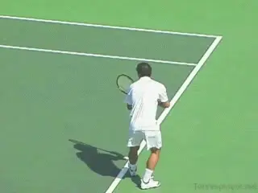
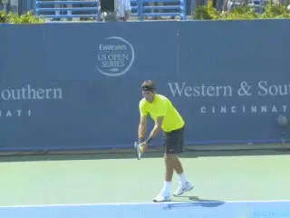
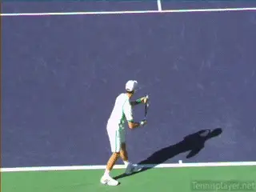
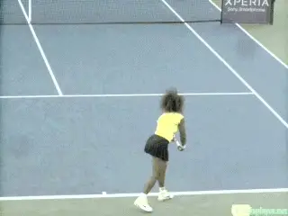
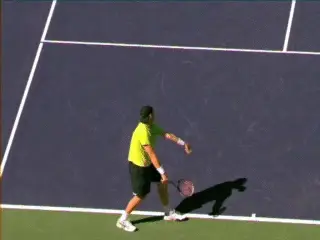
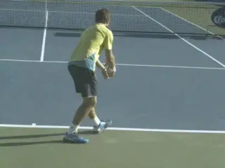
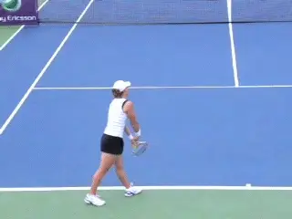
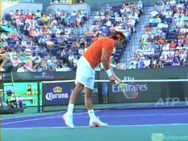

# Serving Rhythm and serving stance

### Serving Rhythm and Serving Stances 

### Nick Wheatley

------------------------------------------------------------------------

**Did Pete Sampras and Justine Henin have it right about serving stance?**

In the last article on serving rhythm we saw how the serve\--as with the
other strokes\-- could be divided into two phases. The first is a slower
more deliberate Phase 1, followed by an explosive Phase 2.

The transition point between the phases is with the tossing arm extended
and the legs coiled, the point at which the player is ready to launch
outward and upward to the ball. ([Click
Here.](1-2%20Rhythm%20-%20The%20Serve.docx))

In this article, let's take our analysis a step further. Let's see how
the development of 1-2 Rhythm is related to the two major types of
serving stances\--the pinpoint and the platform.

My view is that a platform stance makes it easier for players to move
through Phase 1. I also believe the platform stance can add to the
overall explosiveness of Phase 2 because it facilitates greater body
turn.

**Definitions**

Stance is one of the most debated issues in coaching, teaching, and
playing. Obviously, there are great servers using both pinpoint and
platform stances. So, let's start by clarifying what we mean by each
and also identifying some of the variations.

**Pinpoint variations: starting stance, amount and timing of foot slide, and timing of trophy position.**

To put it most simply: In Phase 1, pinpoint players slide the rear foot
forward and to their right. Platform players keep the rear foot in place
until the uncoiling of the legs starts in Phase 2.

But there are variations in both types. Pinpoint players vary widely in
starting stance. They vary in the length and timing of the back foot
slide. And they vary in the timing of the slide in relation to coiling
of the legs, the extension of the tossing arm and the time the player
reaches the trophy position.

Juan Martin DelPotro for example has a fairly narrow stance and a
moderate amount of slide. At the end of Phase 1, with his tossing arm
extended and his legs fully coiled, his racket reaches the classic
trophy position.

**Somewhat less variation in the platform leg positions, but the same variable in the timing of the windup.**

John Isner is at the other end of the spectrum. He has an extremely wide
stance and slides his back foot substantially further than DelPotro. At
the completion of Phase 1, his racket is lagging and is still to his
side, substantially short of the trophy position checkpoints.

For platform servers the variations are probably less extreme. The
positioning of the feet in the starting stance can be wider or narrower,
and the angle of the backfoot to the baseline can also vary. Like the
pinpoint players, the timing of the tossing arm extension and the
coiling of the legs can also vary in relation to the trophy position.
Roger Federer starts with a slightly narrower stance than Novak
Djokovic. He is also closer to the trophy position with his arm and
racket than Novak who, like Isner has substantial lag.

Andy Roddick starts with the feet much closer together than either
Federer or Djokovic. Of the three he is also the latest to the trophy
position.

**Results**

Does any of this make a difference? Let's look at how the stances
correlate with results at the pro level. On the men's tour, a larger
percentage of the top hundred players use the pinpoint, but a high
percentage of the most successful players use platform. Looking at Grand
Slam champions in the men's game over the last 13 years, half of all
those players used platform. If we remove the French Open where the
serve has the least impact, the percentage goes up to over 60%.

**Serena's heels line up in a moderate pinpoint.**

And let's also note that two of the greatest servers in the history of
the game from the previous era, Pete Sampras and John McEnroe, both used
platform stances. Between them they won 20 Slam titles.

On the women's side the overwhelming majority of all top players serve
with a pinpoint stance. Many use very extreme versions, actually sliding
the back foot past the front at the completion of the loading.

But Serena Williams, arguably the greatest women's server of all time,
uses a stance with less foot movement than the majority of women pros,
reaching the transition point with her feet basically in line. And
interestingly Justine Henin who had a great serve despite her size,
served with a platform that she modelled on video of Pete Sampras.
([Click
Here](http://www.tennisplayer.net/bulletin/showthread.php?t=3193) to see
her serve in the Interactive Forum.)

**Timing**

So what are the implications of the stance differences in terms of
developing rhythm? One the most interesting findings in the first
article was the duration of the two phases.

**Isner's legs and shoulders appear to be moving in opposite directions.**

The duration of Phase 1 was longer but could vary substantially from
player to player, from a little less than a half to a little less than a
full second. The duration of Phase 2 was shorter, but did not
significantly vary.

It was virtually identical from player to player at a little more than a
third of a second. As Brian Gordon and John Yandell have demonstrated,
the overwhelming majority of the racket speed is generated in this
second phase. ([Click
Here](https://www.tennisplayer.net/members/avancedtennis/john_yandell/sampras_serve/sampras_serve_racket_head_speed/sampras_serve_racket_head_speed.html).)

I think the timing of the Phases says something. I believe that the
simpler platform stances are more conducive to having a smooth and
deliberate rhythm during the longer Phase 1. The additional moving parts
and additional motion for player's using a pinpoint make Phase 1 more
complex and difficult to coordinate.

This is because with the pinpoint stances, the back foot is moving up to
several feet during Phase 1. But the back foot affects the movement of
the hips and shoulders as well. And this adds additional complexity.

As the back foot moves to the players right the back hip naturally moves
in that direction as well. Now if the player tries to turn his shoulders
away from the court for more body coil, that shoulder movement is in the
opposite direction of the movement of the back foot and back hip.

**With the pinpoint, top players have more leg motion but less body turn.**

The body to some extent appears to be working against itself. All this
makes it more difficult to develop the feeling of being relaxed,
deliberate and smooth.

Watch this conflicting motion when John Isner turns his shoulders away
from the ball. Obviously it's hard to argue with the resulting delivery
when it comes to Isner.

But the difficulty of mastering the complexity of these movements, when
trying to build rhythm, may explain why the pinpoint servers typically
have far less body rotation. Even at the world class level, many fail to
turn their shoulders past perpendicular to the net.

Obviously it's hard to criticize Isner's serve, but his motion is
complex and in my opinion a very difficult model for the huge majority
of players. You have to wonder how fearsome his delivery would actually
be with a platform stance similar to Federer or Pete Sampras.

In my view, for pinpoint servers the less distance the back foot travels
the better. If you look at Samantha Stosur, for example, technically she
has a pinpoint stance since the back foot moves.

**Sam slides her foot\--into a classic platform position.**

But look where it stops. In a position typical of the great platform
servers. [Click
Here](http://www.tennisplayer.net/bulletin/showthread.php?t=2050) for
more video of here serve in the Interactive Forum.

**ConclusionsI've always believed platform stances to be the better option for players of all levels, due to the ease of attaining deliberate smoothness during the set up phase and building 1-2 rhythm. This makes possible a more reliable serve.**

Currently there are 5 platform servers and 5 pinpoint servers in the top
10. A look at their career serving percentages is suggestive. The
platform players are averaging over 63% as a group, with Novak Djokovic
leading the way at 67%. The pinpoint servers are averaging 61%, but two,
Stan Wawrinka and Tomas Berdych, are hovering at about 55%.

The highest percentage server in the top 10 is Nadal who has a pinpoint.
Not known for using the serve as a weapon, his first serve percentage is
over 70%. Take him out of the average and the pinpoint servers as a
group drop to 59%.

**Federer demonstrating the phases with effortlessly grace.The platform stance is by far the simplest and most stable stance for the set-up phase of the serve. With neither foot adjusting position during the set-up phase, it becomes easier and more natural to reach the critical transition point between the phases.**

For most players, a slightly narrower less extreme platform stance than
Roger or Novak is a great place to start. You can experiment with more
extreme variations from there. Check out one version of how to do this
in John Yandell's article on stance in his new serve series. ([Click
Here](https://www.tennisplayer.net/members/teaching_systems/john_yandell/legs/).)

**A platform stance also naturally facilitates body turn. In the windup the body naturally turns away from the ball along a line across the toes, with the hips and shoulders moving in the same direction.**

You can see and actually feel this when you watch Roger Federer. The
motion looks tremendously smooth in Phase 1 and highly explosive in
Phase 2. And effortless throughout. It's is a gorgeous example of 1-2
serving rhythm.

|  | His junior teams, the Hawker Jets, have won 44 |
|  | competitions since formation, and over the last 2 |
|  | years alone, his junior players have won 19 |
|  | singles tournaments between them at county level. |
|  |  |
|  | He has been ranked in the top 75 nationally in 35 |
|  | and over singles and in the top 5 in Surrey |
|  | county. Nick has done video analysis for numerous |
|  | players at all levels, including former British |
|  | Top 10 player Marcus Willis. |
|  |  |
|  | His unique teaching video series, covering every |
|  | aspect of the game, is available on his website |
|  | [www.nickwtennis.com](http://www.nickwtennis.com) |
|  |  |
|  | You can also |

------------------------------------------------------------------------
