# Shot to Shot Readiness

### Shot to Shot Readiness

### Scott Murphy

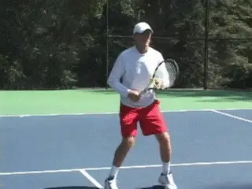

In my day to day work with my students, or when I observe club players,
all too often **I see a fundamental problem having nothing to do with their actual strokes. This is their lack of shot-to-shot readiness.Most club players tend to place the bulk of their attention on their technical strokes. What they fail to understand is that good shot making can not be separated from what goes on before and after they actually swing the racket.** Although you don't hear enough
talk about it, today's premier players are exceptional in this aspect.
But at all levels, shot to shot readiness is vital. It's the difference
between being able to play to ability and not. If you don't believe me,
maybe you will after you understand the actual interval you have between
shots.

### The Critical Interval

**After you hit the ball in club tennis, it takes about a second and a half for the ball to reach your opponent's racket. After your opponent strikes it, it takes another second and a half before you again make contact. So**every time the ball leaves your
racket**,you have about 3 seconds to recover, move to the next ball, prepare, and make the next shot.**

Research also shows that during this 3 second interval, players must
cover an average distance of about 9 feet, defined as the distance both
to recover and also move to the next ball. When you stop to think about
it, that is a very brief interval in which to execute two movement
pattern totaling up to several yards, to prepare, and then to execute
the stroke itself.

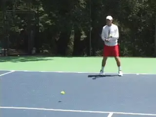

**Do you wait until the ball bounces on the court to get ready?Understood in this fashion, every split second is critical.** But it is very common to see club
players still standing in the ready position when the ball bounces on
their side of the court. Think about how devastating that is.
Effectively, they have wasted two thirds or more of the time between
shots. **There is simply no way to recover from that mistake, and some of the obvious consequences are incomplete preparation, poor balance, late contact, rushed timing, and of course, the complete inability to reach difficult balls.**

As I see it then, the fundamental problem is often not the strokes. The
fundamental problem is the lack of readiness. This is what makes
consistency impossible for so many club players.

As I said, players obsess on technique, but are completely unaware
**that the lack of shot-to-shot readiness causes a large percentage of their errors and precludes them from exploiting opportunities to attack and/or hit winners.**

So in the next two articles, let's look at everything that goes into
shot to shot readiness. In this first article, we'll look at the
components and the timing of preparation, movement, and recovery. Some
of the information I'll present repeats or is synthesized from what
other great writers have already contributed on Tennisplayer, but it is
more than worth looking at again in the context of the readiness
concept.

In the second article, we'll look at a series of on court conditioning
and movement drills designed to help you build the quickness and the
stamina to stay ready shot to shot over the course of your matches. I
feel this type of on court work is essential to maintain your level of
play over the course of a match where you may hit literally hundreds of
balls, each stroke being executed within that same 3 second interval.
One thing for sure, if you improve your readiness you'll need these
drills, because you'll be playing longer points and covering a lot more
court!

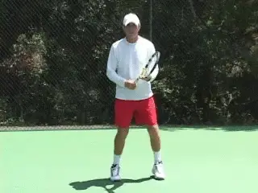

**Start your warm up bouncing from one foot to the other.**

### 

### A State of Mind

**Shot to shot readiness begins with a state of mind. You have to be mentally prepared to move**. For this reason, I
advocate that all my students **start their warm up by getting lighter on their feet. The way to do this is to bounce from one foot to the other between shots.**

Watch the pros or any well-trained player when they warm up, and you'll
often see them do this. You also see players do it before hitting
returns. Some pros will even do it before stepping up to serve.

It doesn't happen much in pro matches during points because the
exchanges are so fast, but on the occasion when they have extra time,
you see great movers like Andy Murray or Lleyton Hewitt do the same
thing during actual play.

When I feed balls in lessons, I do it as well. After I hit, I get up on
the balls of my feet and bounce. It sets a tone and an example for the
player, and I feel it promotes better overall responsiveness for both of
us.

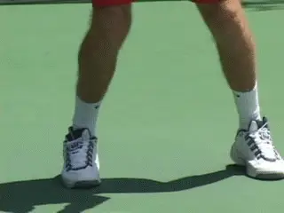

**The ready hop to a wide, athletic base with the muscles coiled.The next key is to respond immediately to the ball as it comes off your opponent's racket.** To do this it's
imperative after your own hit to track the ball back to the opponent's
racket, and then to read the ball as it comes off the strings. **With practice, you can learn to sense the speed, spin, location and depth of your opponent's shots almost instantaneously, and this give you the information you need to begin to respond.**

### The Nucleus

**The nucleus of all movement on a tennis court is the split step, or what I sometimes call the ready hop.** The ready
hop is the first physical response, no matter where on the court you end
up hitting the ball.

Performing the split step correctly and at the right time is an absolute
must if you want to move consistently well from ball to ball. It should
be performed before the return of serve, between ground strokes, and
before volleys when approaching the net.

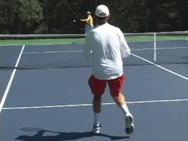

**The start of the split step, at the start of the opponent's forward swing.To do the split, you hop an inch or so off the ground onto the balls of your feet, with your feet about shoulder width apart. Simultaneously, your hips will drop, your knees will bend slightly and your back will remain straight creating what my fellow contributor Pat Dougherty calls a strong \"athletic foundation.\"** (**link**(https://www.tennisplayer.net/members/footwork/pat_dougherty/the_athletic_foundation/the_athletic_foundation.html).)
**As you split, you will land in a wider base, about one and a half times shoulder width. Your legs become coiled springs as their muscles contract. From there you push off the court and explode to the ball.To explode properly you need to correctly time your split step, and I've found this is the most misunderstood and therefore discouraging part of the process for the uninitiated. The split step actually starts before your opponent hits the ball, at about the moment you see him or her start his forward swing.Timed properly, you'll be in the air when the ball comes off the opponent's racket. This means you actually have the opportunity to see the direction of his shot before you land.**

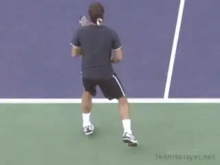

**Top players sometimes start to turn the outside foot as they land the split step.**

### Advanced Split

Most players at the club level should first learn to land the split with
both feet making contact with the court simultaneously. **However, as your skills improve, you may find yourself actually turning the outside foot, or the foot closest to the ball, in the direction in which you are going to move.** You see this on a percentage of
split steps in the pros, particularly with they are pressed for time,
for example, when they are moving wide, or on a return of serve, or on a
split step at the net.

This more advanced split is a function of the player's ability to
instantly read the shot, combined with a superb natural feel for the
start of the preparation movement that I will talk about next. My advice
is to try to get a feel for the basic split, then see if this blending
of the split and the preparation happens naturally for you. As you
progress, you can also consciously experiment with starting the motion
to the ball with the outside foot sooner. For a great presentation of
this advanced motion, see Bob Hansen's article on footwork on the
volley. (**link**(https://www.tennisplayer.net/members/footwork/bob_hansen/Hansen_Court_Movement_Volleys/Hansen_Court_Movement_Volleys.html).)

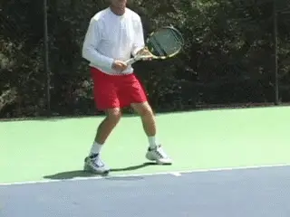

**The double split gives you the feeling of having more time in actual play.**

### Double Split

Most players understand the worth of the split step, but if they've
been playing tennis for some time without using it, as a teacher I
sometimes feel I need a cattle prod to make it happen for them
consistently.

Joe Dinoffer, the renowned master professional and international
clinician, has a great suggestion to help these players transition to
split stepping. (**link**(https://www.tennisplayer.net/members/teaching_systems/teaching_systems.html) for
Joe's articles on Tennisplayer.) **Instead of doing one split step, you do two. Bounce once, then bounce twice.This simple exercise creates a \"feel\" for making an immediate split step that will carry over into your practice and play. After a series of shots hit with two split steps, your perception will be that you have much more time to execute your shot. Try it and see if you don't agree!**

### Body Turn

**After the split, you should immediately begin your preparation with a body turn. This includes both the feet and the torso. On the forehand, you complete the turn by stretching the left arm across the base line and, at the same time, loading the weight on the right or outside foot.**

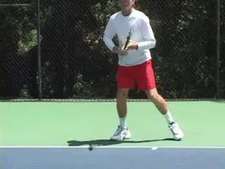

**Preparation means a body turn, with left arm stretched and weight loaded on the outside foot.**

Whether you hit your backhand with one hand or two, the basic principle
is the same in the preparation. The feet and torso turn sideways, taking
the racket along for the ride. From this fully turned position it's
possible to hit from any possible stance variation on either the
forehand or backhand side.

This is very different from the idea of the arm and racket somehow
moving back independently of the body. Any Tennisplayer subscriber knows
that the old idea of \"getting your racket back\" rarely leads to a full
turn. (**link**(http://www.tennisplayer.net/members/avancedtennis/john_yandell/your_forehand_and_the_modern_forehand/preparation/your_forehand_and_the_modern_forehand_preparation.html) to
read John Yandell's recent article.)

But the problem is still at epidemic proportions out there in the larger
uninformed world of club tennis. Go to any club and you can get
depressed very quickly looking at how poorly the players prepare.
Personally, I feel this is directly related to the readiness factor. If
you wait until the ball bounces to initiate the preparation, you'll
never make it, even if you have the right idea about how you want to
turn.

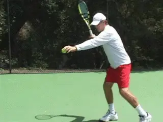

**The hitting zone is an arm's length to your side and slightly in front.**

### The Hitting Zone

The next technical element is the hitting zone. **When you move to the ball it's imperative to understand where your hitting zone is. This is defined as the spacing between you and the ball at contact.** When it's correct, you'll feel
balanced, you'll have the opportunity to make a controlled and powerful
swing, and your recovery for the next shot will be natural.
Understanding your hitting zone makes the path to positioning feel
natural.

To determine your hitting zone, set up on the outside foot in an open
stance. **The ideal distance to the contact is about the length of your fully extended non-racket arm.** Watch in the
animation how this works when I drop the ball out of my left hand.
Notice also that the ball is dropping slightly in front of my torso.
This means the contact will also be in front, although the exact
distance in front of your body may vary depending on the shot. The
spacing is similar if you wind up taking a step forward with the front
foot into a neutral or square stance.

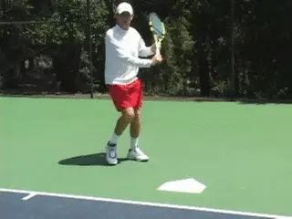

**From a neutral stance visualize contact over the center of the plate.**

### Home Plate

To determine the spacing for the contact on the one-handed backhand, I
like Welby Van Horn's use of the baseball home plate. (**link**(https://www.tennisplayer.net/members/teaching_systems/teaching_systems.html) to
see Welby's articles on Tennisplayer!) In baseball, when you stand at
the correct distance from the plate and the pitch is over the middle,
you get the \"fat\" part of the bat on the ball. As with baseball, for
most backhands club players should strive for a neutral stance in which
they step more or less directly forward into the shot. I find that this
image of hitting over the center of the plate helps players feel the
right alignment and keeps them from crowding or reaching for the ball.

You can practice this with a feed off a ball machine. You can also do
self feeds as with the forehand. Hold the racket at the throat with your
left hand, then drop the ball on home plate (real or imagined) with your
right hand, put your hand back on your right hand and take the swing.
Repeat this (with either the ball machine or the hand feed, or both)
until you can consistently establish a comfortable distance from the
ball. Now save this as a mental image.

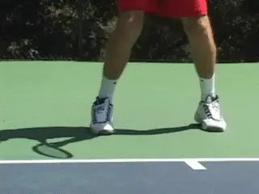

**Basic recovery: a push with the outside foot and shuffle steps.**

### Open Stance Recovery

**Once you've hit the ball, the focus switches to recovering for the next shot.From a footwork standpoint there's a definite advantage to using the open stance. This is because you can immediately push off with your outside foot to initiate the recovery.The simplest recovery footwork when you don't have a great distance to go is to use slide steps. This pattern is somewhat more typical when you hit crosscourt. But if you have trouble with your footwork, or getting ready for the next ball, this is the pattern you should master first.Initiate the recovery with a push off your outside foot onto your inside foot.Now take one or more shuffle steps until you reach the middle of your opponent's two widest angles\--or until he starts the forward swing for his next shot, whichever comes first. Split as his swing starts, and initiate the turn as described above!**

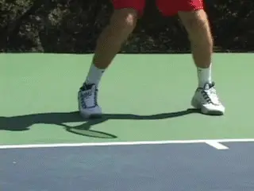

**When you have further to go, start with a crossover recovery step.**

### Cross Over

**If you have further distance to recover\--typically when you hit the ball down the line\--you can start your recovery with a cross-over step. After you push off the outside foot keep going and take one step across, back in the direction of the center. Now follow that with one or more shuffle steps. The same thing would apply to a two-hander using an open stance**. **The crossover is definitely more explosive when time is of the essence.**

Although I advocate the neutral backhand stance for most club players in
most situations, players will definitely use the closed stance at times,
particularly when pulled wide. Now the recovery pattern is different.
After the hit the player steps around with the back foot. Essentially
you are now in the same position described above for the forehand.
Depending on the amount of court the player has to cover, he'll either
push back to the inside foot or cross over. By the way, this same
pattern also applies to recovering from a square stance forehand.

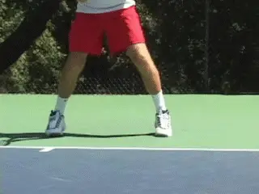

**With a closed backhand stance, the outside foot comes around to start recovery.**

As the ball leaves your racket you have to be careful not to over
evaluate or dwell on just happened. This means that you have to assume
that your shot and your opponent's next shot will be good. Don't spend
any time thinking things like, \"Wow, I really ripped that one\--no way
he'll get that back.\" Or, \"There's no way that ball I hit is going
in.\" Assume that you will hit another ball until it is proven
otherwise.

### The 3 Second Drill

Now that we've seen the whole pattern from the ready hop to the
recovery, let's put it all together in something I call the \"3 Second
Drill.\" Remember that's the true interval you have so let's put
everything together in a real time drill! Using a ball machine, set the
interval between feeds to about 3 seconds. Start in the ready position.
Now cycle through every aspect of shot readiness over the course of 10
or more balls. The timing of the feed allows you to replicate the timing
of actual club match play. It also build stamina.

This is very different than the feeding in many lessons, where the pro
feeds one ball, you both stop, and this is then followed by an extended
analysis. As you progress set the machine to throw the ball wider, or
cut down the interval slightly to simulate higher levels of play.

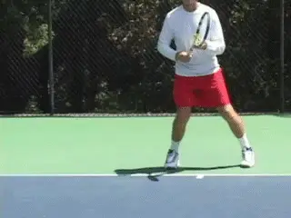

**Set the interval on the ball machine to recreate the interval of actual play.**

### Serve Recovery

**Recovery is no different on the serve. You should always assume your serve will be in and immediately move to establish a strong athletic foundation as soon as the stroke is completed. You can't just serve and stand around, hoping the ball doesn't come back. But as with the groundstrokes, too many players serve and then wait until the ball is bouncing on their side of the court to react.**

Here is the pattern that all good servers follow. The server uncoils
upwards into the air at contact. He then lands inside the court on the
left foot, with the back leg kicking back-roughly with the right foot
pointing backwards at the back fence.

The kick back with the right leg is essential to power, balance, and
posture, but after the landing it should come slightly around and
forward into the court. From this position the player pushes back in a
kind of reverse ready hop, establishing the ready position.

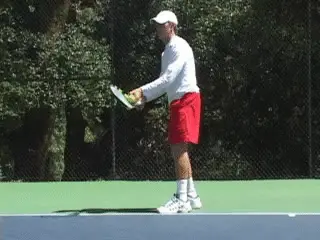

**Left foot landing, right foot around, reverse ready hop-all in a second!The timing of this recovery is critical, because as we saw, you want to be able to split as your opponent starts the forward swing. For the average club player this means completing the shift from the landing to the ready position in a second or less.**

A great way to practice this is to have someone toss a ball at you from
your side of the court the moment you finish your serve. Your job is to
split, be ready and hit a ground stroke. This drill has the same effect
as the double split step described above. By forcing you to react in a
shorter time frame, you increase your ability and confidence to execute
the motion in real time in match play.

### Ready at the Net

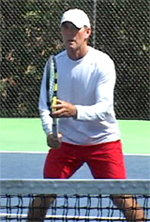

**The ready position at the net. Racket head below eye level and above hand, elbows in front, volley grip.**

To be ready at the net you have to start by positioning the racket
correctly. It should be more or less equidistant between the forehand
and backhand sides. The racket head should be cradled in the non racket
hand and held below eye level but above your hitting hand. Your elbows
should be comfortably in front of your hips because this facilitates a
smaller backswing. Obviously waiting with a volley grip is also key.

I have to admit, I am sometimes stunned when I see the way club players
position the racket at the net. The still photos give some examples of
my favorites. The problem of course is that they all require that you
make additional movement with the racket to get to the true ready
position and start the stroke.A lot of club players never make it, but
again they blame swing technique without looking at how the lack of
readiness made what they wanted to do impossible.

As you see the opponent's racket move toward the ball you make your
split step and move to the volley. The actual motion begins with a body
turn, and there is little independent arm movement. From the correct
ready position this turn will swing your racket into the correct
position naturally and automatically. (For a detailed description of
volley mechanics, see John Yandell recent articles, **link**(http://www.tennisplayer.net/members/avancedtennis/advtennis.html).)

After the volley, you need to immediately resume the ready position and
shadow the ball. This will generally be no more than one full slide
step. This process continues for the duration of the point. You have a
very brief interval before the next shot. There is no time to stand and
admire your shot. But once again, you see club players waste this
precious time.

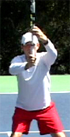 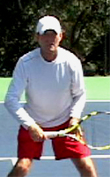 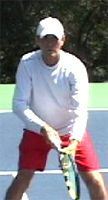

**Recognize some of these ready positions from volleyers at your club?**

### 

### The Ghost of Stefan Edberg

Being ready at the net is more difficult than in the backcourt for the
obvious reason that you have less time. But how many of us have learned
this lesson on the court with a Grand Slam champion?

Aleco Preovolous, a friend and colleague who's the head pro at the
Harbor Point Racquet Club in Mill Valley, California, described an
experience that left an indelible impression on him with when he had the
opportunity to play the great Stefan Edberg.

When Aleco was playing the pro tour he played a practice match with
Edberg on the stadium court at one of the pro events. During one of the
points, Edberg came in behind a serve\--as usual\--and hit a sharply
angled backhand volley crosscourt that had all the makings of a winner.

Aleco took off running, determined to show Edberg what he was made of.
As he neared the ball he realized he wouldn't be able to use his usual
two-handed backhand so he let go with a one handed flick that appeared
to be a winner down the line.

As soon as the ball left his racket, he had to jump over a sideline
chair and wound up in the first row of seats. But no chance. Edberg had
shadowed his first volley and, aware that Aleco had only one possible
place to go, had smothered the line. From this position, Edberg hit a
forehand volley crosscourt, back into the open court.

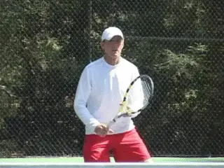

**Ultimate readiness at the net\--being ready even if you've just hit a winner.**

But what really blew Aleco away was what happened next. Despite the fact
that Aleco was now in the first row of seats, Edberg quickly moved to
re-established his ready position, and cover the volley he'd just
hit\--even though it was a clear winner\--as if Aleco might somehow beam
himself to the other side of the court and try another pass. Now that is
the ultimate example of shot-to-shot readiness, and let it be an
inspiration to you, as it was to Aleco\--as well as myself\--when he
told me the story.

### Overhead

**A final situation where readiness is overlooked is after an overhead. It's the same exact problem we've seen on the other strokes. A player goes back for the ball, and hits a good overhead. Then he stands frozen until the opponent hits the next shot. If you take charge with an overhead, you should use the opportunity to improve your court position!After the overhead, bring the right foot around similar to the serve. Now explode forward one or more steps! Make sure you split into that athletic foundation and get ready for the next shot. Just like Stefan Edberg, assume the next ball is always coming back!**

### Balance and Angles

There are a couple of final, related points that pertain to shot to shot
readiness everywhere on the court. The first has to do with balance.
Club players love to try to blast winners. This often leads to errors,
but even when they make a shot, they often throw themselves so far off
balance that they are unable to recover in time for the next shot. So my
rule is never attempt a shot that is going to make it impossible to
recover your balance in time for the next ball.

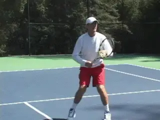

**Don't stand after the overhead-improve your court position!The other point has to do with angles and shot placement. If you are pulled off the court, be careful about hitting into the down the line opening. If you think your opponent can't cover your shot, go for it. But if your opponent is in position, or dictating the point, give yourself time to recover by playing the safer deep crosscourt diagonal. If you are in trouble a deep looping crosscourt shot buys the time to get ready and stay in the point.If you develop a feeling of what it's like to be really ready shot-to-shot, your shot selection is bound to improve, because instinctively you'll sense the time and distance you need to recover and adjust.**

You can reinforce all the points in this article in a simple, powerful
way when you watch pro tennis. It's normal to just watch the incredible
shotmaking, but now, armed with this information, try looking more
closely at what goes on before and after those shots. You'll further
improve your understand of it really takes to be ready to play your best
tennis, shot by shot.

**Scott Murphy** is from Marin County, California where he started
playing tennis at age 5 in a family of tennis nuts. Both of his parents
were major influences in his development. He also took lessons from
Marin legend Hal Wagner and former top 10, Harry Roach. Scott is a
graduate of the University of California at Berkeley where he played
baseball and football but continued to work on his tennis game with
renowned coach Chet Murphy. He was the head pro at San Domenico/Sleepy
Hollow Tennis Club for over 20 years. He also directed the Nike Tahoe
Tennis Camp at the Granlibakken Resort for 10 years. Scott now teaches
privately in Ross, Marin County and in the summer he directs the Tuscan
Tennis Academy which he founded in Quarrata, Italy.

Check out Scott's website
at **scottmurphytennis.net**(http://www.scottmurphytennis.net/)

You can contact Scott directly
at: **scottmrph@yahoo.com**(mailto:scottmrph@yahoo.com)
