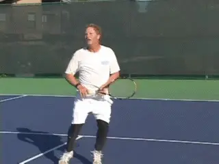
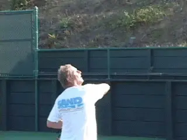
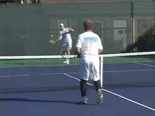
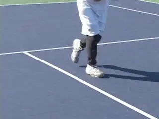
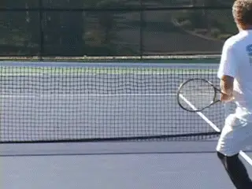
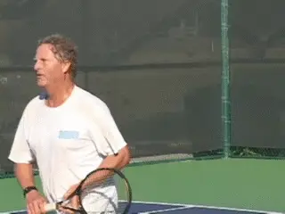

# The Backhand Overhead

### By Geoff Williams

------------------------------------------------------------------------

**An aggressive backhand overhead is a matter of technique.**

The backhand overhead is generally thought to be the most difficult shot
in tennis. But, like any other shot, mastering it is only a matter of
the right technique.

**I believe the backhand overhead should be an aggressive shot hit for winners in exactly the same way as the regular overhead. The key to learning to do this is the right contact point.The problem most players have on the backhand overhead is late contact. They hit the shot at the edge of their dominant shoulder. This forces them to abbreviate the swing and robs the shot of power.I believe the contact point should be much further in front.The ideal contact point is not at the edge of the body, but about a shoulder width in front of the edge of the body.This allows you to swing with much more force.**

Think of your forehand or your regular overhead. Where do you hit these
shots in relation to your shoulders? In both cases, the contact is about
even with your non dominant shoulder.

**The key is contact a shoulder's width in front of your front shoulder.**

You point to the ball with your left hand and swing to the spot where
you are pointing. If you were to hit the regular overhead as late as
most people hit their backhand overhead, you would be making contact
even with your back right shoulder!

You would be forced to abbreviate the swing and hit mostly angled shots
with little to no power. Instead of a potential clean winner, the
overhead would become a touch shot, the way most backhand overheads are
hit today.

In my own experience I am able to routinely put the backhand overhead
away. Not to brag excessively, but I have bounced a backhand overhead
over the back fence in a tournament match on more than one occasion. In
addition to winning you a point, that has a psychological effect on your
opponent.

**Whether you play with one hand or two, I believe that all players should develop the one-handed backhand overhead. Do you see anybody hitting their regular overhead with two hands?No. And why is that? The range of motion would be limited trying to hit a ball above your head with two hands. The second hand on the racket would make a full follow through impossible.**

**The speed of your read is a prerequisite for the backhand overhead.**

So let's go over the steps to develop this misunderstood and
under-utilized shot into a weapon.

**THE FIRST STEP: READ**

Want I want to show you is how to put this ball away. Doing this makes
an immediate read of the ball imperative. It's almost a math equation:
the speed of the read plus the speed of your reaction is equal to the
quality of your shot.

**So, the first step is to read your opponent's lob and realize it is going to your backhand side.** We are all taught to
lob to the backhand side if possible. How many times have you hit a
volley at the net, only to see the lob headed over you on that side?

Your opponent is asking you a question. Can you hurt me if I hit my lobs
to your backhand side? Answer in the affirmative with your backhand
overhead! To do this you need to have a sense of great urgency and
focus.

**THE SECOND STEP: REACTION**

The second step is the pattern of your movement. You need to have the
right footwork to prepare correctly and execute. Here is the sequence.

**From the ready position, your right leg crosses over to the front of your body or your left side and makes a heavy plant step.** It then immediately pushes off driving your
body backwards. This starts the movement, but it also gets your hips
closed off and parallel to the doubles alley sidelines.

This hip turn is critical because it creates a good body coil from the
very start. This is a prerequisite for accelerating the racket on the
proper swing path to the right contact point. From this point you can
backpedal with one or more side steps backwards.

If there is time, you then make a hard rear plant with your back, left
leg. You now step into the shot with your right leg (again assuming you
have time and space) and rotate your weight into the shot.

**The front foot plants, then pushes off. Then the rear foot plants and pushes forward.THE THIRD STEP: RACKET PREPARATION**

**The shoulder turn with racket preparation. Note how loosely I hold the stick.**

The third component is racket preparation. **This starts with the body, but the key is the full racket drop, a drop not dissimilar to the serve or to the regular overhead. It's just that it's on the other side of your body.Make sure your shoulders and hips are turned fully sideways to the net.Meanwhile, you move your arm upward and backward from the shoulder, with the elbow bent. Your left hand holds the stick loosely, thumb at the throat.At the completion of the preparation, the butt of the stick is pointing upwards at the sky. The tip of the racket falls until it points on an angle downward at the court.Your right elbow points upward at the sky as well. This arm position is what allows you to create fierce racket acceleration.THE FOURTH STEP: THE SHOTThe shot is generated from the rotation of both the hitting arm and body**. **The entire hitting arm and racket rotate forward and upward from the shoulder joint.At the same time,**the hips and shoulders are rotating forward and
around.**The result is that the racket moves with great acceleration toward the contact point.**

**Acceleration through the contact, which is slightly lower than a regular overhead.The contact is actually somewhat lower than on a regular overhead. But the key is that it is a full shoulder width in front of your right shoulder.** This is the payoff for the immediate
reaction and correct technical preparation.

**After the contact the racket continues and follows through all the way across the body.The follow through isviciously fast,with afull weight transfer from the rear plant foot to the front step foot.**

The result is fluid natural power. When you develop the feel for this
contact point, you develop confidence that you can hit the ball away.

The basic principles of the backhand overhead are the same as any other
aggressive stroke. No coil, no power. No weight transfer, no power.
Wrong contact point, no power, no control. As with any shot, slight
differences in the angle of the racket at the contact point will
determine the direction of the shot trajectory.

You may have never considered developing this shot. You may have been
told it is too difficult. But no shot is too difficult with the right
technique. Read, react, prepare. Plant, accelerate, make the right
contact point. Work to master these elements and your backhand overhead
will yield devastating results.

                                                                                                                                                                               the years he went on to become a fixture on the
                                                                                                                                                                               Northern California NTRP tournament scene,
                                                                                                                                                                               winning numerous titles at both the 4.5 and 5.0
                                                                                                                                                                               levels. He accomplished this with a self-taught
                                                                                                                                                                               style, shunning lessons. His recent return to
                                                                                                                                                                               glory was inspired in part by his intensive study
                                                                                                                                                                               of Tennisplayer.net. He claims with a straight
                                                                                                                                                                               face to have read literally every article on the
                                                                                                                                                                               site. An electrical contractor by profession,
                                                                                                                                                                               Geoff lives in the East Bay with his wife Ronda.
                                                                                                                                                                               Want to swap stories with Geoff or talk Gear Head
                                                                                                                                                                               talk? Email him: <bestelectrician@sbcglobal.net>
  ------------------------------------------------------------------------------------------------------------------------------------------------------------------------------------------------------------------------------
                                                                                                                                                            first and only junior tournament at age 11. Over
  ---------------------------------------------------------------------------------------------------------------------------------------------------------------------------- -------------------------------------------------

  ------------------------------------------------------------------------------------------------------------------------------------------------------------------------------------------------------------------------------

------------------------------------------------------------------------
