# The Classic Backhand - Karsten Popp

### The Classic Backhand:

### Karsten Popp

### Scott Murphy

In the first article in this series about the \"traditional" game we
looked at the forehand of my friend and practice partner Karsten Popp.
([link](The%20Traditional%20Forehand%20-%20A%20Living%20Model.docx).)
Playing Karsten made me take a new look at classic swing patterns, in
the effort to understand his incredibly aggressive and consistent style.

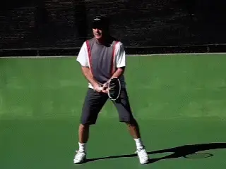

**In this article let's turn to Karsten's classic backhand.**

Karsten was an elite junior player who had a brief pro career derailed
by illness. He had been away from the game for 20 years and stepped on
to my court from a tennis time warp. Since I had made the decision to
\"modernize" my game years ago, the contrast in the ways we
played\--from grips to stances to swing shapes\--was fascinating.

As the fantastic Forum discussion showed after the first article ([link](http://www.tennisplayer.net/bulletin/showthread.php?t=2183&page=2)),
Karsten's forehand is rightly considered classical, but is also built on
fundamentals that transcend the differences between so-called
traditional and modern styles.

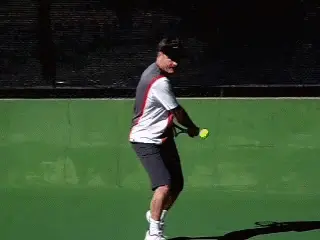

**Karsten hits a flat variation with minimal topspin.Turning to the Backhand**

Now in this second article, let's turn to Karsten's backhand. Is the
conclusion the same or different?

Not surprisingly for a player who learned in the 1960's, Karsten hits
his backhand with one hand. Like his forehand, many elements are
\"traditional" compared to current pro tennis. But again, the
differences and the similarities with the modern game are fascinating.

In the current game, one handed backhands are often played with extreme
grips and heavy spin by players like Richard Gasquet and Stan Wawrinka
or Justine Henin. These players rotate the grip to the very top or even
behind the handle, and drive the ball with amazing levels of spin. Then,
when they slice, they adjust the grip rotating it back to the side of
the handle. (For more on modern backhand grips [link](../../Stroke%20Analysis/Advanced%20Tennis/The%20One%20Handed%20Topspin%20Backhand-Introduction.docx).)

Karsten, on the other hand, uses one grip for all his backhands, a grip
I would describe as a continental. The palm of his hand is mostly on top
of the handle, and his index knuckle is on next bevel down from the top,
or possibly just on the edge between the two.

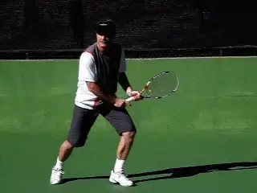

**Most of Karsten's backhands are penetrating slice drives.**

This grip is far less extreme than the modern topspinners and even
slightly less extreme than the \"classical" one-handers like Roger
Federer and Pete Sampras. So how does this affect his ball?

Karsten hits basically three backhand variations, and not surprisingly,
none with heavy topspin. He hits a flat drive with very moderate
topspin. But the majority of his backhands are hard slices, underspin
drives on the model of players like Ken Rosewall. (For a great
additional explanation of the slice drive, [link](https://www.tennisplayer.net/members/classiclessons/classiclessons/trey_waltke/the_slice_backhand/the_slice_backhand.html)
to read Trey Waltke's article.)

As John Yandell has shown, in the modern pro game the swing patterns on
the slice backhand are much more radically high to low than in previous
generations. This is due to the velocity, heavy topspin, and shoulder
high contact heights that players must deal with in the oncoming ball.
([link](https://www.tennisplayer.net/members/avancedtennis/john_yandell/modern_pro_slice_2/).)

John's research suggests that the radical downward swings are necessary
for dealing with these balls, and that these swing shapes also account
for the significantly slower speeds of the slice in contrast to the
topspin drives in the modern game.

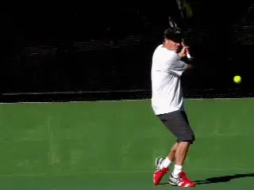

**Compare the downward angle of the swing on Karsten's slice that of Federer.**

In contrast, Karsten's swing\--while definitely moving downward to the
contact\--is significantly flatter. Compare Karstens lowest racket tip
point in the animation to Federer's!

Federer's racquet tip literally points directly down to the ground.
Karsten's on the other hand remains at around wrist level.

Whether Karsten could maintain that same swing shape hitting against
Nadal's forehand or would have to adapt to a more \"modern" swing, we
may never know. However, I have seen him more than hold his own on the
backhand with challenger level pro players.

Playing him myself, I can assure you his slice drive is a weapon that
can do real damage at a high level. His forehand may have more absolute
velocity, but Karsten can effectively penetrate the court off his
backhand side.

This is in part a function of his court position and timing. Similar to
his forehand, Karsten stands in close to the baseline line and plays the
ball early.

This keeps the contact height comfortable for his grip at around waist
level or slightly higher or lower. It also takes time away from his
opponent. Early timing, a relatively flat arc and good velocity\--these
factors turn his backhand into a weapon.

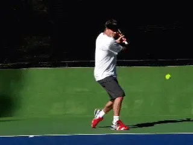

**As with his forehand, early contact close to the baseline and a low trajectory forces opponents on time.But there is one other factor. His incredible consistency. The mechanics of the stroke are so simple that Karsten rarely misses. This is unlike many \"modern" players who believe that have \"weapons," weapons that often never find the court on a given day.Inside OutKarsten also hits an additional slice variation that is unusual in the modern game. This is an inside out underspin drive that has a vicious side spin component.This is a very aggressive shot that is difficult for any opponent to deal with. If you leave the ball too close to the middle in a crosscourt rally, he'll use the inside out slice to hit the ball down the line to your forehand corner.Because of the sidespin component, it has a nasty curve so that the ball moves the away from you to your right and also has a very low bounce.Even if you manage to reach his shot and return it, the rest of your court is now wide open.**

Overall, how good is his backhand? The first time Karsten hit with the
famous French player Pierre Barthes, Pierre caught the ball in the
middle of a rally and told him that if they played a match, he would
never hit to his backhand. If you don't know, Pierre was one of the 10
or 20 best players in the world in his generation.

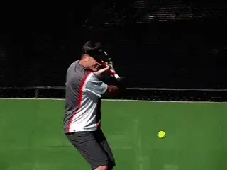

**If you hit too close to the middle, Karsten hits a nasty, curving inside out slice to your forehand corner.**

So let's take a close look at Karsten's mechanics as recorded in high
speed video, and see what makes this shot so simple and formidable.

**Preparation**

In the first article we saw that a core similarity between Karsten's
forehand and so-called modern forehands was the body turn in the
preparation. The same is definitely true on the backhand.

**Karsten initiates the turn with the movement of the feet and the torso on all his backhand variations.His feet and body turn sideways, which automatically moves the racket as well. But watch how little independent hand, arm and racket motion there is in this initial phase.His backswing motion is very compact. Watch how his racket hand stays low and close to the left hip pocket on the take back. This is similar for all three of his variations and it makes him very difficult to predict.**

Now watch how at the bottom of the loop, as he's about to draw the
racquet forward, his arm locks out or straightens.

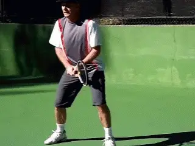

**Compact, simple preparation and an early hitting arm position.**

I believe these factors are critical for players at the club level to
imitate, especially the early timing in creating the hitting arm
position. Although all top one-handers straighten the arm before
contact, some, like Federer are much later establishing this position.

That works just fine for Roger. For the average player, however, it
increases the chance of developing the deadly \"elbow lead." The
simplicity of Karsten's motion make him a great model.

**As I mentioned, even for an experienced player, Karsten's backhand variations are very difficult to anticipate. It's really only in the last fractions of a second as the forward swing starts that there is a noticeable difference between his drive and his slice.On his drive, the racquet face squares with the court just as it starts to move forward, and then stays perpendicular at contact and in the followthrough.This allows Karsten to hit the ball almost flat and also with moderate topspin. As with his forehand drive, the arc of the ball in flight is also relatively low over the net.Stances**

Karsten tends to use neutral stances when he is close to the middle but
closed stances when he is wider in the cour. This is actually the same
pattern used by so-called modern one-handers.

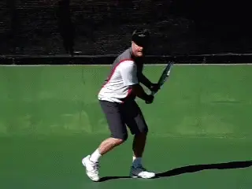

**Karsten naturally adjusts between neutral and closed stances.**

As John Yandell has shown, the closed stance naturally increases the
shoulder turn, and is common for Federer and other one handers at the
top level. ([link](https://www.tennisplayer.net/members/avancedtennis/john_yandell/one_handed_backhand/hitting_stances/hitting_stances.html).)

What is so interesting is that Karsten moves back and forth between the
stances naturally. Again we can see that certain elements of modern
tennis aren't really as innovative as many people feel and are in fact
fundamental to good technique in any era.

**Another key is the opposite arm. Karsten moves his left arm backwards toward the fence to counter balance the motion and to stay sideways. Also note how his head is sideways at and also after contact, again a characteristic associated with Federer.Karsten's finishes are long and out towards the target**. **On both his slice and his drive, the wrist reaches about eye level with the hitting arm still straight and only slightly past perpendicular to the net.Karsten's contact point is forward of his front foot, though not as far in front as the player's with more extreme grips.** As we noted, **he takes the ball early so the height of the contact is usually around waist level, a perfect strike zone for his grip.**

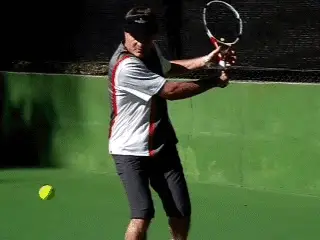

**The left arm moves backwards and the head stays sideways through the contact.The cumulative effect of masterfully combining these components is effortless power and fantastic control**. I can't
even count the number of balls I have ripped at Karsten that I thought
would be his undoing. Instead, they came back with interest.

When John Yandell came to my private court to film Karsten for this
article, afterwards, the three of us took some time to hit. We did two
on ones and had some of the same kinds of great baselines exchanges
Karsten and I enjoyed.

This is what John had to say afterwards:

\"Hitting with Karsten reminded me of what it was like the few times I
hit with John McEnroe. It was like he was living in a different space
time continuum.

\"It felt like hitting with me was in slow motion for him. Nothing I
could do seemed to rush him. You had the sense he was hitting the ball
way too soon for you to feel safe."

\"I had the uncomfortable and annoying feeling that nothing I could do
could penetrate that early contact point and that with any given ball he
could choose to push me around and eventually into to some untenable
position," John concluded.

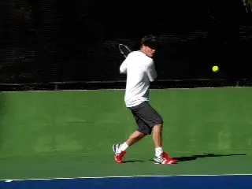

**Long finishes, high and at about eye level.**

That pretty much sums it up Karsten's baseline game. And again, as with
the forehand, it raises several legitimate questions for the club
player.

**What type of backhand do you need to succeed at your level? If Ken Rosewall could win a Grand Slam without ever coming over a backhand, how important is heavy topspin at the club level?Players succeed at all levels with a wide variety of styles. And probably every one-hander should develop a drive with at least some topspin---much easier in this day and age given the racquets and especially the strings.But is it possible that a hard slice drive might actually be more effective for you on some great percentage of balls, especially in backhand rallies?** When you hit with Karsten you
realize that is a legitimate question that bears experimentation---and
could, potentially, make a huge difference in your backhand
effectiveness.

Stay tuned! Next we'll look at Karsten's volleys, and also his attacking
net game, including his unique \"old style" serve and volley footwork!

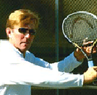

**Scott Murphy** is from Marin County, California where he started
playing tennis at age 5 in a family of tennis nuts. Both of his parents
were major influences in his development. He also took lessons from
Marin legend Hal Wagner and former top 10, Harry Roach. Scott is a
graduate of the University of California at Berkeley where he played
baseball and football but continued to work on his tennis game with
renowned coach Chet Murphy. He was the head pro at San Domenico/Sleepy
Hollow Tennis Club for over 20 years. He also directed the Nike Tahoe
Tennis Camp at the Granlibakken Resort for 10 years. Scott now teaches
privately in Ross, Marin County and in the summer he directs the Tuscan
Tennis Academy which he founded in Quarrata, Italy.

Check out Scott's website at
[scottmurphytennis.net](http://www.scottmurphytennis.net)

You can contact Scott directly at: <scottmrph@yahoo.com>
