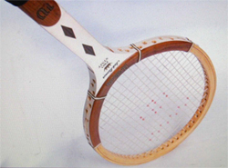
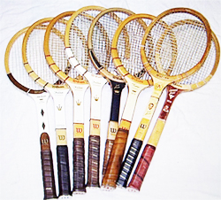
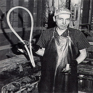
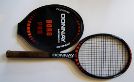
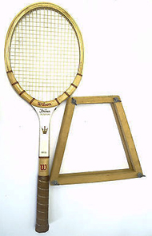

# The Jack Kramer Autograph: A Tale of Hope

### By Geoff Williams

**A diamond throat Kramer - the prize for my first tournament title.**

The first tournament I won, a city of Richmond California open
tournament, I won at the age of 11 years, against an 18 year old named
Brian Taylor. Brian thought he had won the match, but on match point I
called his shot out.

He did not hear me, and he celebrated too early. I began to cry, and the
tournament director asked Brian to play the point over. Technically it
was my point. But it seemed fair to play the point over to me. You
wouldn't see that kind of compromise today.

I ended up winning the match by coming back and grinding it out, much to
Brian's dismay. But he was a good sport. The girls all loved him for
his easy-going nature, and curly hair.

To win that tournament I used a Value Village, 50 cent Bancroft fiber
glass/steel reinforced frame, strung with piano wire, that was warped,
even though I kept it pressed. The tournament prize was a Jack Kramer
Autograph frame, diamond insert. The holy grail for a young player in
that era.

That Jack Kramer stood for hope for me back in 1967. The diamond insert
frame that I won stood for hope that someday I would become a great
player.

**A wide range of Kramer autographs over a quarter of a century.**

More important than love, or health, or joy, or most anything to tennis
players is hope. Hope we can improve. Hope we can add a shot to our
repertoire. Hope we can lose weight. Hope we can beat someone who has
our number.

Hope that a new frame, a new string, a new technique is the answer. I
still get excited when I string up a new hybrid I have not yet tried. I
have hope that the latest experiment will be the holy grail of
feel/power/touch.

The manufacturers know this. That is why they pay players to say they
are using frames that the players are not really using, frames that are
really no more than a paint job.

This is because confidence for tennis players is a very touchy thing. It
takes years of practicing with the same frame, the same string, the same
tension, to develop confidence.

That is why so many top pros use the same frames they did when they were
juniors, no matter how far the technology has improved things. Look at
Nadal or Murray.

Manufacturers bank on hope. They spread the paint jobs around.

**10 million Kramers, all made by hand.**

Even playing with that work of art, the Kramer, it still took me two
more years before I ever beat my father, a hacker who sliced all his
shots back short and with no pace.

A nightmare! A pusher father who gloated at my ineffective attempts to
beat him. He even played out balls to give me a better chance of getting
close, and to keep alive the hope that someday I would win.

That Kramer diamond insert I won was among the very last versions of the
longest running athletic endorsement of all time. Kramer received
endorsement money for 27 years, a feat unmatched by any other pro
athlete in history!

Wilson made over 10 million Kramer frames, with many versions. They were
hand made. There were 42 steps followed by a single craftsman. ([Click
Here](https://www.tennisplayer.net/members/classiclessons/geoff_williams/the_jack_kramer_autograph/steps.html)
to see all 42 of them described in the first person by the craftsman
himself.)

Then compare that to fascinating video how Wilson designs and molds
completely new prototypes in days. ([Click
Here](http://www.youtube.com/watch?v=QbA39s0dznQ)) We all owe a debt of
gratitude to racquet manufacturers, who often don't make much money,
for their exacting work. It's their work which provides us hope.

**Borg's Donnay: over 14 ounces strung at 80 pounds.**

Many experts say that any frame from any era counts for about 70% of the
playing feel/power/spin/touch/comfort. They say the string component
makes up about 30%.

Exceptions occur with very good stringers, who are able to match the
frame/string combination to fit the unique player's style and ability
exactly. In these cases, the string can make up 50% of the equation. But
many stringers can't even string wooden frames anymore, as their
machines won't allow it.

Those Kramer frames were made longer than any other frame in history.
Any one lucky enough to hit and play with one felt the quality. These
were wooden works of art.

When strung with victor imperial, the powerful blue spiral gut, they
rivaled current frames for power and control, albeit with a smaller
sweet spot, and a tighter string pattern, which favored flatter strokes
over spin.

**Rackets had to be kept in wooden presses - and still warped.**

The stringing pattern was often 18 x 20, even in a 55- 65 sq. in. frame.
The frame could weigh close to 400 grams, strung, gripped, and balanced.
(Around 14.2 oz.) All top players used a full gut string job.

Many pro players of the wood racket era customized the frames to exact
weights and balances. Borg: 410g, strung at 80lbs with full gut, by
Lennart Bergelin, his coach, stringer, hitting partner, masseuse, and
psychologist rolled into one.

The frames would warp if not pressed and warped anyway when exposed to
humidity. They just don't make them like that anymore. The woodies
bent, flexed, and vibrated at a much lower and more forgiving frequency
than the modern frames do, so they were easier on the elbow.

There were many other manufacturers, such as Slazenger, Spalding,
Donnay, Bancroft, Davis, etc., and hundreds of frames were available,
just as they are today. No frame made today, matches the best of the
woodies in control and feel, due to the tighter string patterns, flexier
lay ups, and natural gut string.

But for the modern game those frames would be too heavy, their sweet
spots too small. The tight string patterns could never produce enough
spin, and the wooden frames would break.

For all of us who started with woodies, and remember that first feeling
of hope, we are brothers of a small community. A player is nothing
without hope and faith.

My motto in those days was fight with your mind first and your Jack
Kramer autograph second. Today I keep that spark alive that flamed up so
long ago by trying out new frames, new string, and new stringing
hybrids. Just another son taught by a hacker father with a woodie.

                                                                                                                                                                                                  the years he went on to become a fixture on the
                                                                                                                                                                                                  Northern California NTRP tournament scene,
                                                                                                                                                                                                  winning numerous titles at both the 4.5 and 5.0
                                                                                                                                                                                                  levels. He accomplished this with a self-taught
                                                                                                                                                                                                  style, shunning lessons. His recent return to
                                                                                                                                                                                                  glory was inspired in part by his intensive study
                                                                                                                                                                                                  of Tennisplayer.net. He claims with a straight
                                                                                                                                                                                                  face to have read literally every article on the
                                                                                                                                                                                                  site. An electrical contractor by profession,
                                                                                                                                                                                                  Geoff lives in the East Bay with his wife Ronda.
                                                                                                                                                                                                  Want to swap stories with Geoff or talk Gear Head
                                                                                                                                                                                                  talk? Email him: <bestelectrician@sbcglobal.net>
  -------------------------------------------------------------------------------------------------------------------------------------------------------------------------------------------------------------------------------------------------
                                                                                                                                                                               first and only junior tournament at age 11. Over
  ----------------------------------------------------------------------------------------------------------------------------------------------------------------------------------------------- -------------------------------------------------

  -------------------------------------------------------------------------------------------------------------------------------------------------------------------------------------------------------------------------------------------------

------------------------------------------------------------------------
