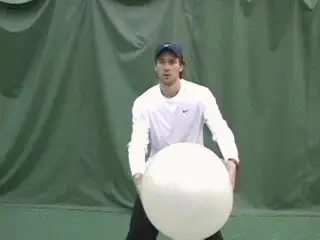
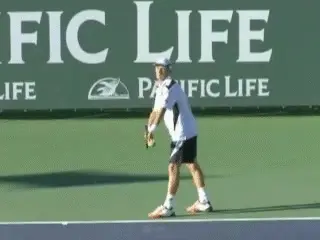

# The Kick Serve: Part 4: Prehabilitation

### Chris Lewit

**Prehabilitation means regular flexibility and strength training.**

In the first article on the kick serve, I presented the technical
reference points ([Click Here](Keys%20to%20the%20Kick%20Serve.docx)) for
developing the motion. The second article covered drill progressions for
all the variations. [Click Here](Constructing%20the%20Kick.docx) Then
in the third article we discussed the various controversies regarding
teaching and hitting the kick and detailed 5 common errors I see in
trying to develop the motion. ([Click
Here](The%20Kick%20Serve-Part%203-Phylosophic%20Issues-Common%20Mistakes.docx).)

Now in this final article, I want to present the last critical component
in my system. This what I call my prehabilitation program, something I
use with my students everyday at my academy. Prehabilitation has two
parts: flexibility training and strength training.

In my opinion a dual training program of this type is critical for
keeping the back and shoulders healthy and strong for high performance
players - or any player - who wants to develop the kick as part of the
offensive repertoire of a complete server.

So this article presents over 20 exercises drawn from a wide range of
disciplines and training methodologies synthesized into a original
training program that I believe will produce awesome results for any
player.

I truly believe that we have become so conservative and cautious in
teaching the kick serve that our players are often disadvantaged
technically and tactically when they get to the world-stage. American
players often don't develop sufficient serving heaviness and/or angled
placements. At the highest levels of competition, these seemingly subtle
technical and tactical differences can separate a top 100 player from
top 10.

**The kick serve adds subtle strategic advantages that can make a competitive difference.**

I remain cautiously optimistic that with more sport science study, the
myth of the dangerous kick serve will be debunked, and American coaches
will start teaching this serve to our young future champions. So let's
get into the nitty-gritty of the prehabilitation program I have created
for my students.

### Schedule

The prehabilitation exercises increase both flexibility and strength in
the critical areas of the body for the kick. Some do both
simultaneously. They are part of a larger, full-body stretching and
workout program that my students regularly perform---something I
recommend for all competitive players.

I like to see my students stretching working on these exercises
daily---but a minimum of 3 times a week. Every player and coach can
integrate them how they see fit in their own training. But as a starting
point I'd recommend picking 10 exercises and doing one set of multiple
reps. Then over time, increase the number of exercises, the number of
sets, and the number repetitions.

I believe that the students in my kick serve system are on the road to
learning world-class kick serves, but more importantly, the stretching
and strengthening part of the system is the insurance policy to protect
them from any potential injury. Sometimes injuries are unavoidable,
especially out on the rigorous junior or professional circuit. But my
players tend to be more resilient because of the extra attention we pay
to prehabilitation rather than rehabilitation; they recover faster from
injuries and have fewer missed tournaments. I hope you get a chance to
experiment with incorporating some of what I have presented into your
own training regimes, and let me know what you think.

**Note: Special thanks to my wife Kimberleigh Weiss-Lewit, and my student Hannah Shteyn for their great help in doing the demonstrations!Flexibility and Strengthening Exercises**

| Upward Facing Dog | Boat |
| --- | --- |
|  |  |
|  |  |
|  |  |
| This yoga stretch opens up rib cage and increases the flexibility of back. Also increases core strength. | This is another yoga core strengthener. |
| Wheel | Swimming |
|  |  |
|  |  |
|  |  |
| This yoga exercise stretches the back stretch and opens the shoulders. | This is a pilates exercise that strengthens the lower back and the abdominals. |
| Bridge | Ball Crunches |
|  |  |
|  |  |
|  |  |
| The stretch opens the chest and stretches the back. | Ball crunches strengthen the abdominals. |
|  |  |
| Advanced Bridge | The Hundreds |
|  |  |
|  |  |
|  |  |
| The Advanced Bridge gives an even deeper stretch of the chest and the back. | This is a pilates core strengthener. |
| The Full Wheel | Medicine Ball Overhead Throws |
|  |  |
|  |  |
|  |  |
| The full wheel is a complete back and shoulder stretch. | This pullover movement strengthen the arms, chest, and core. A great exercise to build explosiveness in upper body. |
| Forward Bend to Plow | Medicine Ball Tosses |
|  |  |
|  |  |
|  |  |
| Another yoga exercise that stretches the spine and opens the back. | Medicine ball tosses evelop explosiveness in the arms and core for groundstrokes and serve. |
| Cat Pose | Medicine Ball Rotation |
|  |  |
|  |  |
|  |  |
| This a yoga shoulder stretch. | This exercise develops core strength and stability. |
| Beginner Back Stretch | Standing Rows |
|  |  |
|  |  |
|  |  |
| Use this to stretch the back before or after serving. | This exercise trengthens the upper back muscles which decelerate the arm in the serve motion. |
| Beginner Chest and Arm Stretch | Lifting the Trophy |
|  |  |
|  |  |
|  |  |
| This is a great basic exercise to stretch the chest and arms. | An important exercise that strengthens the shoulders. |
| Shoulder Stretches | **Rotator Cuff Internal/External Rotation** |
|  |  |
|  |  |
|  |  |
| This stretch increases the range of motion of the buttscratch\--the key position in developing the kick. | This combination exercise strengthens rotator cuff, a commonly injured area in the shoulder. |
| Beach Ball Stretch | Sampras Stretch |
|  |  |
|  |  |
|  |  |
| This stretch is a great way to prepare the back and shoulders for serving. | This stretches the arms and upper back. Sampras could touch his elbows together! |
| Dumbbell Triceps Extension | Manual Buttscratch Stretch/\ |
|  | Resistance Exercise |
|  | confidence](media_the-kick-serve-part-4-prehabilitation/media/image25.webp) |
| This strengthens the triceps and to a lesser extent the shoulder, thereby reinforcing proper kick serve technique. |  |
|  | This increases the range of motion in the shoulder to create a deeper buttscratch. Can also be transformed into a strengthening exercise for the triceps by resisting against the upward |
|  | snap. |

#  

