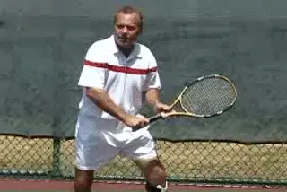
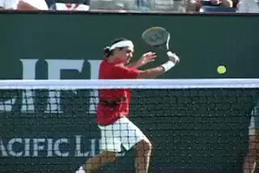
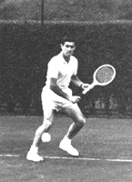
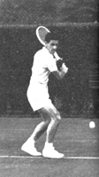
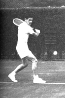
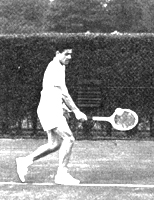
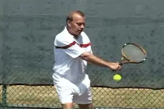
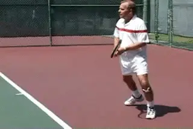
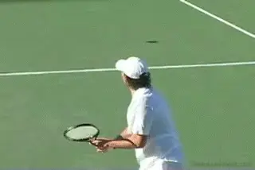
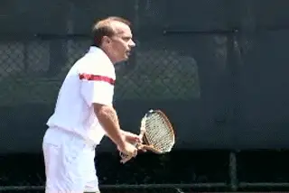

# The Backhand Slice Drive

### Trey Waltke

**The slice drive is a great offensive shot at all levels.**

When I watch players today, they seem to treat the slice backhand as a
second-class citizen. I've always thought of the slice as a versatile
shot that can be used for either offensive or defensive. Now I rarely
see the players use it in an offensive manner.

I think the emphasis when kids are young on hitting topspin from both
sides, and hitting backhands with two-hands, has resulting in a loss of
understanding learning about the value of the slice. I think that it's
a shot which you need to have in your arsenal. Maybe it's not as
important now as when players used wood rackets, but it's important.

Even when I watch the players like Roger Federer who do hit the slice,
it looks to me like they're taking that word \"slice\" way too
literally. They have a very open racket face at the start of the swing
and they're hitting way too much high to low. When you swing downward
so much, you're taking the pace off the ball to an extreme degree. Also
notice how far Federer finishes around and to his side. Again, this
reduces pace because the racket pace travel along the line of the shot
for a shorter period.

**Most pro players finish the slice lower and further across the body.**

I think there are other options that can be very effective. I think you
can hit through the ball a little flatter, more like you're sweeping
off the top of a table with the racket face. If you do this you can hit
the ball with slice and generate pace and keep the point neutral. You
can use the slice for depth and for placement. That's different than
what I see with a lot of pro players. It's like they are almost
admitting they're in trouble and resorting to the slice hoping to get a
chance to start the point over.

I think the slice could be more effective in the pro game. But that's
even more true for the other 99.9% of all tennis players on the planet.
I see a lot of recreational players who think they have killer topspin
backhands, but the ball lands short all the time. Slice is the easiest
way to hit the ball deep. If you can have a good \"flat\" slice, as I
like to call it, you can keep the ball deep consistently. If you can do
hit the ball deep, you're going to win a lot of tennis matches.

     ![A person playing tennis                                                                                                          
  -----------------------------------------------------------------------------------------------------------------------------------------------------------------------------------------------------------------------------------------------------------------------------------------------------------------------------------------------------------------------------------------------------------------------------------------------------------------------------------------------------------------
  -- ----------------------------------------------------------------------------------------------------------------------------------------------------------- ------------------------------------------------------------------------------------------------------------------------------------------------------------------------ -------------------------------------------------------------------------------------------------------------------------------------------------------------------------

  -----------------------------------------------------------------------------------------------------------------------------------------------------------------------------------------------------------------------------------------------------------------------------------------------------------------------------------------------------------------------------------------------------------------------------------------------------------------------------------------------------------------

  ---------------------------------------------------------------------------------------------------------------------------------------------------------------------------------------------------------------------------------------------------------------------------------------------------------------------------------------------------------------------------------------------------------------------------------------------------------------------------------------------------------------------------------
  ![A tennis player is swinging his racket with low                                                                                      
  ------------------------------------------------------------------------------------------------------------------------------------------------------------------------- ------------------------------------------------------------------------------------------------------------------------------------------------------------------------- -- --------------------------------------------------------------------------------------------------------------------------------------------------------------------------

  ---------------------------------------------------------------------------------------------------------------------------------------------------------------------------------------------------------------------------------------------------------------------------------------------------------------------------------------------------------------------------------------------------------------------------------------------------------------------------------------------------------------------------------

|   |
| **The legendary slice drive of Ken Rosewall. My thought was: why not copy the best?** |  |  |  |

I developed my slice by modeling it on Ken Rosewall. My dad gave me a
tennis book with a photo sequence of Rosewall hitting his backhand. At
that time in the mid 1960s many people considered Rosewall the best
player in the world. So I figured, why not copy the best?

**The high finishes means that the racket face accelerates through the contact.**

So, I studied that sequence frame by frame. Then I stood in front of the
mirror, and I put my own body in the same exact positions. I realized
that by doing that I could feel what he was feeling.

At that point, I realized that I was a visual learner and I still
believe in that. After taking tons of lessons and hearing pros bark at
me my backhand improved the most by studying and mimicking the best
player. It was a very confident looking shot. I liked the way that felt.

One thing I loved about Rosewall's backhand was that he finished high.
**I really believe in the high finish on the slice. I think it makes you accelerate through the ball.** Today you see so
many players hitting so much from high to low that the racquet clips the
ground. And I'm always shocked at that. I wonder if that actually
decelerates the racket.

**I always tried to go through the ball and finish high, because that creates depth and allows you to use the slice as an offensive shot.You can create more pressure going through and hitting the ball on a flatter line and you also get a lot more control.**

**Hit the slice drive on the rise to create depth and pace.A really important part of hitting an offensive slice is not letting the ball drop from its apex. It's very difficult to hit a good offensive slice if the ball drops. I actually try to hit it while the ball is still on the rise and make contact just as it's about to reach its apex.This allows you to stand in closer to the baseline. It's a real advantage compared to a topspin backhand. It's easier to hit a flat slice on the rise, so it's easier to play aggressively from the baseline.**

You don't see it in the pros, but it's also a great shot to use to
pass. It worked for Ken Rosewall for about 40 years. He never hit a
topspin passing shot. **With the slice drive you can hit the passing shot on the rise, hit it with plenty of pace and keep the ball low going either way, and/or play the ball well at the volleyer's feet.**

**Mark Philippoussis hits through the slice and finishes higher than most pro players.**

One of my favorite backhands of the modern era is Mark Philippoussis. He
may not be ranked number one in the world. But when he approaches a
backhand, whether it's flat, or a topspin backhand, or a slice, he
makes sure to have a big finish on it. It's not a negative shot. He
lets his opponents know that he's not afraid to hit an assertive
looking slice. And that is a great thing to have.

In addition to the high follow-through another important point is the
position of the body. **Ithink in order to really achieve the cleanest hit on your backhand and the most depth and power you must have a big turn. But you must also keep turned through the swing. You don't want to open up too fast. You want to trust your swing and stay sideways through the hit.**

The front foot is another key to this. Rosewall is stepping across and
into the shot. His foot is right there at the edge of the contact zone.
He has most of his weight planted on the front foot and it stays that
way. Even in the last frame it's still solidly on the court and the
heel is just starting to come up.

|  |  |  |
| **Three key frames I copied from Rosewall: the turn, the contact, and the finish.** |  |  |

After the hit you move through the ball, especially if you are going to
the net. You don't necessarily want to come to a complete stop when you
hit. But a lot of players may get the wrong idea observing with the
naked eye, and rotate through the shot with the feet too soon.

If you look at the Rosewall sequence, you'll see that at the time he
reaches that high finish, his back foot is still behind the front foot,
and his shoulders are still almost all the way sideways to the net.

You also want to note **how Ken's arm forms an \"L\".at the start of the backswing. He keeps that shape until he starts the forward swing. The arm straightens out as he moves to the contact and that provides a lot of the zip on the shot.But it's really important to note that even though the elbow is bent on the backswing, it does straighten out fully before the contact.** If you don't really look at the stroke
frame by frame you might miss that.

**For players at most levels the slice drive can often be a more effective weapon than hitting with topspin.**

That's a problem you see with a lot of club players. They bend the arm
on the backswing but they never get it straightened out and end up
leading the shot with the elbow. Look at how long Rosewall keeps that
arm straight all the way through to that high finish that's the
hallmark of the flat slice drive.

It may not be trendy and it may not be used in the pro game as much as
some people (including myself) think it could be. But I can guarantee
you that this is a great shot that will work in almost any situation for
most players. It can give you an edge that a lot of your opponent's
probably haven't even thought of developing. (Note for example of a
club player who changed his high to low slice to a slice drive, **Click Here**(http://www.tennisplayer.net/members/your_strokes/carl_sutherland_slice_bh_11_01_05/carl_sutherland_slice_bh_11_01_05.html).)

|  | career on the professional tour, reaching a ranking |
|  | as high as #40 in the world. Known for his |
|  | graceful, attacking style and classic slice |
|  | backhand drive, Trey had wins over most of the |
|  | great players of his generation, including John |
|  | McEnroe, Jimmy Connors, Stan Smith, and Illie |
|  | Nastase. With partner Billie Jean King, he also won |
|  | World Team Tennis Mixed Doubles Championship. |
|  |  |
|  | Trey is currently the general manager at the Los |
|  | Angeles Tennis Club, the legendary training ground |
|  | of some of the great players in the history of |
|  | tennis from Bill Tilden, to Jack Kramer, Bobby |
|  | Riggs, and Pancho Gonzales. |

