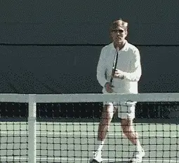
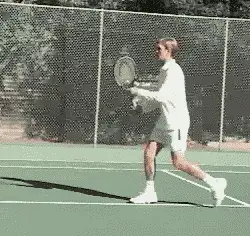
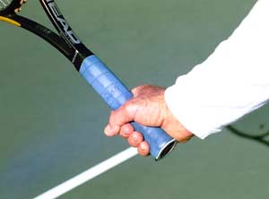
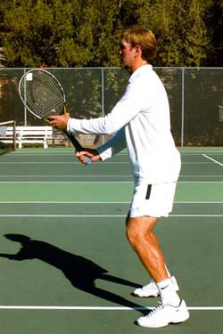
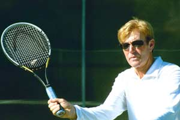
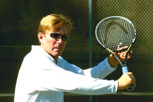
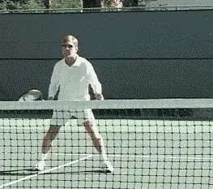
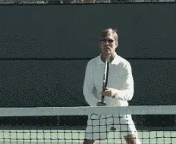
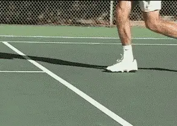

# The Volley Part 1 - Are You Really Ready

### The Volley Part 1: Are You Really Ready? 

### Scott Murphy

**The essence of volleying: moving on balance and controlling the racquet face.**

At my junior and adult camps at the Nike Tahoe Tennis Camp, the first
thing I do is evaluate all the campers so as to get them into groups of
commensurate ability. Time and time again I'm amazed at the number of
players, experienced or not, who are basically clueless when it comes to
volleying. As they get closer to the net, it's as if they enter a
\"twilight zone\" and become remarkably less proficient.

Why is that? Well, let's face it, things tend to happen more quickly at
the net, and, for a lot of people, that creates a feeling of uneasiness
or outright fear of being hit by the ball. The upshot is they spend the
majority of their time at or near the baseline where things are
\"safer.\" Naturally, a player who spends little time at the net is
unlikely to become a technically adept volleyer.

But there are many players who spend plenty of time at the net who also
struggle with their volleys-doubles players. So practice alone is
obviously not the issue.

It's too bad because any player who lacks the ability to volley
confidently, regardless of level or experience, is missing out on an
essential and highly enjoyable part of the game. In this series of 3
articles, I hope to shed some light on what makes for better volleying
whatever your current proficiency.

**If you are truly ready, you'll become a successful volleyer.**

### The Essence of Volleying

### Let's start with a definition. \"The essence of volleying\":

1.  The ability to move to the ball

2.  To be on balance

3.  To take a minimal backswing

4.  To control the racquet face at impact

The first and most important priority in accomplishing all this is
readiness. Unfortunately, this is often completely overlooked.

**Speed, versatility, confidence-the advantages of the continental grip.**

With practice, a player who is truly ready will unquestionably become a
successful volleyer. There are several facets involved in being ready to
volley.

Let's start with the grip. In terms of saving time, most pros,
including myself, agree volleying is better accomplished using the
continental grip because there is little, if any grip change involved. I
say little change because some players will slightly shift the heel of
the hand to the inside of the handle on the backhand volley.

For a beginner or anyone breaking ground at the net, changing back and
forth between the eastern forehand and the eastern backhand grip
generally means more control, but as the action gets faster
(particularly in close exchanges during doubles), that sense of control
will likely dissipate.

If you're one of those players who somehow manages to change grips
without sacrificing speed for control, more power to you. Speed aside
however, the continental grip will ultimately provide more versatility
in the type of shots you can hit, and the confidence you'll gain from
not having to change grips will encourage you to spend more time at the
net.

Note: two handed backhand volleyers shouldn't have to change grips
either, but should be careful not to use western grips that would overly
close the racquet face.

**The critical components in being ready: good posture, slight knee flex, elbows in front.**

### The Ready Position

After the grip, your next priorities are your posture, arm position, and
racquet position. Keep your shoulders and back relatively straight and
your knees slightly flexed. If you crouch way down like an infielder
you'll waste time by having to put yourself upright again. Keep your
elbows bent and comfortably in front of your hips. This is very
important!

The idea is to keep the racquet in front of you, or within your
peripheral vision, but when you wait with your elbows close into the
body you're basically forced to rotate your upper arm outward. This can
result in a backswing that can cause you to be late.

There are times, when the ball is coming at you too slowly, a backswing
or even a swinging volley will help you add pace. But, otherwise
minimize your backswing.

The racquet should be held so that it is below eye level but above wrist
level. This will facilitate lining up the racquet face with the incoming
ball. The non-hitting hand should support the racquet at the throat.

Additionally, to minimize reaction time, keep the racquet pretty much
equidistant between the forehand and backhand side. I always marvel at
the number of players who assume (or maybe just pray) that they're
never going to get a backhand volley.

This player will typically wait with the racquet well to the forehand
side and sometimes with just one hand on the racquet. When the backhand
does come they will try what amounts to a \"reverse face\" forehand
volley, actually turning the racquet upside down as they reach across to
volley. It's not a big surprise that this usually results in an error.

 

**The \"minimal\" backswing on both sides.**

Then there's the player who waits with the racquet well to the backhand
side to protect his weak backhand volley, but this only weakens his
stronger forehand volley since the reaction time is now increased to
that side.

**Poor ready position leads to the \"reverse face\" volley - not the way to go!**

### The Ideal Volley Position

**Positioning yourself relative to the ball is also part of being ready. Ideal volley position is midway between the net and the service line.** If you find that your opponent lobs well
and often you can back up a step or two. **The idea is not to get so close that you invite the lob, or to stand so far back that you allow the ball to be easily hit at your feet. Always look to move forward.**

Unless your opponent is hitting from the center of the court you should
shift left or right of center to the extent that you cover his shortest
angle (For more on this see Allen Fox's great article, [Winning at the
Net](../Strategy/Winning%20Matches%20-%20Winning%20at%20the%20Net.docx)),
**most of the time, this is no more than one full slide step, unless the ball on the other side is quite wide**. **Be sure and face your opponent as you shift so as to stay balanced and ready to move comfortably in any direction.The final two aspects, the use of your eyes and the split step (or ready hop) are of tremendous importance.A player who consistently tries to guess where his opponent will hit the ball is in for trouble. Think about it. How often do you \"sort of\" see the ball off the racquet in your rush to know where the ball might go? Are you really seeing the ball or is it more of a guess?**

**A great ready position allows you to handle quick exchanges.**

If you're like most non-pros you probably guess a lot. Instead, do
this. Watch the ball through the entire process of your opponent's
hitting motion. Time your split step accordingly. Now flow to the ball.
Watching the ball off your opponent's racquet will heighten your
awareness at that critical moment when you pick up the direction of his
shot.

### The Split Step

**The timing of the split step is critical. It should occur just before the ball is hit.** This applies to wherever
you are prior to volleying. If you're working your way forward you
don't want to sacrifice balance or the ability to read the ball in an
effort to get as close to the net as possible.

**The split step shouldn't be excessive, just enough to slightly lower your center of gravity and set the leg muscles prior to moving to the ball.The intent is to bounce out of the split step the moment the feet touch back down.**

**The split step: arguably the most important aspect of good footwork.**

Before and after the split step, your feet should be approximately
shoulder width apart. If it's done too early, you'll respond from a
static position. If it's done too late you'll likely be volleying
while in the air, making for poor balance.

I see too many players who virtually never split step either because
they didn't practice it enough to time it correctly, or because they
thought it was too much work.

Bad excuses both! Unless you actually have a physical impediment, a
split step just isn't that demanding and arguably, it's the most
important aspect of good footwork.

That's the volley readiness package. Stay tuned for what to do next!

**Scott Murphy** is from Marin County, California where he started
playing tennis at age 5 in a family of tennis nuts. Both of his parents
were major influences in his development. He also took lessons from
Marin legend Hal Wagner and former top 10, Harry Roach. Scott is a
graduate of the University of California at Berkeley where he played
baseball and football but continued to work on his tennis game with
renowned coach Chet Murphy. He was the head pro at San Domenico/Sleepy
Hollow Tennis Club for over 20 years. He also directed the Nike Tahoe
Tennis Camp at the Granlibakken Resort for 10 years. Scott now teaches
privately in Ross, Marin County and in the summer he directs the Tuscan
Tennis Academy which he founded in Quarrata, Italy.

Check out Scott's website at
[scottmurphytennis.net](http://www.scottmurphytennis.net)

You can contact Scott directly at: <scottmrph@yahoo.com>
