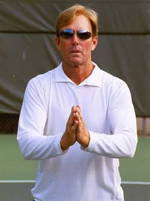
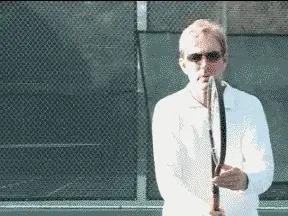
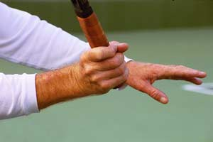
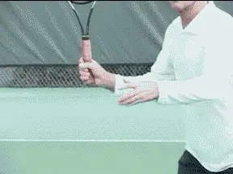
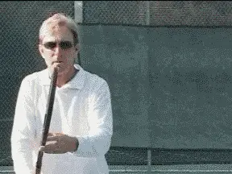
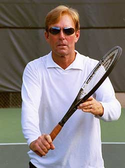
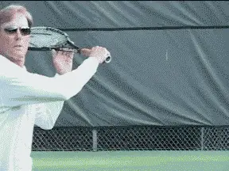
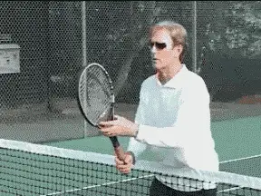
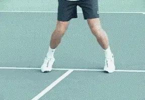
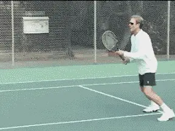

# The Volley Part 2 - Private lessons

### Private Lessons

### The Volley: Part 2

### Scott Murphy

Part one of this article dealt with what a successful volleyer needs to
do prior to the ball being hit towards him. In a nutshell: be really
ready! But now that the ball is on its way, what comes next? Obviously,
there are mechanical and tactical considerations that are determined in
great part by the variables of the ball you're dealing with, and where
your opponent is subsequent to making his shot. But in this second
article, let's start with the mechanics of the basic forehand and
backhand volleys.

**Are you just \"praying\" on your volleys? Better to establish the right arm framework instead!**

### The Arm Frameworks

Probably the most misunderstood part of volley mechanics is what I call,
\"the arm frameworks.\" **The arm framework positions your racquet in relation to your body and also to the oncoming ball. Unless the ball is exceptionally high, low, or wide, the key to the framework for both the forehand and backhand volleys is the position of your hands, and your elbows in the ready position.**

Remember that **the ready position entails having the**elbows
comfortably in front of your hips**withthe racquet head below eye level and above wrist level.** Your elbows should always be bent and your
hitting wrist should be \"back against itself,\" or at a slight angle to
the forearm. Another way to familiarize yourself with this position is
to put your palms together as if praying and note the wrist angle
relative to the forearm.

**The shoulder turn basically moves the ready position to the side.**

### Forehand Volley

**During a forehand volley, the bent and locked positions of the wrist and elbow should be maintained as much as possible because they drive and stabilize the shot.Once the framework is established, the opposite shoulder initiates a slight turn so that the racquet stays more or less within your peripheral vision.As you turn, you're basically just moving your ready position over.**

Note that the racquet head is in a 3/4 turn position, or in other words,
midway between 12 o'clock and 3 o'clock (or 9 o'clock depending on
the side). Whenever possible, this 3/4 position is what you strive for.

Neophytes tend to either \"hammer\" the ball from straight over the
shoulder, or try what amounts to a mini-groundstroke from hip level.

**The correct, laid back wrist position for a forehand volley.At the end of the turn (backswing), the edges of the racquet should be lined up more or less evenly. At this point, the wrist is back against itself and the racquet face is slightly open.**

This position is critical because it paves the way for correct forward
hitting motion. **This movement of the racquet forward to the ball is driven by the heel of the racquet hand and the butt of the racquet handle.This \"heel-hand\" combination pushes the racquet face to the ball and keeps it firm through impact.**

Without this position, there's a strong likelihood the back of the hand
will initiate the forward swing, creating a wristy, flipping motion and
loss of control. This, by the way, is almost always the result on a
\"hammer\" volley.

**The forward motion, driven by the \"heel-hand\" combination.**

For added stability, squeeze the bottom three fingers of the hitting
hand just before striking the ball. Now follow through as if volleying
through a line of three balls. This will keep the racquet head firm and
on line with the intended target.

Be careful to avoid a condition known as \"dishing.\" This occurs when a
player literally tries to roll the racquet face under and around the
ball to get more underspin.

Sometimes when watching an accomplished volleyer it appears this is
taking place but, in fact, it is more a reaction to the impact, not a
purposeful movement.

Keep the wrist firm! If you rotate the racquet face before impact
you'll take the steam out of your volley.

The non-hitting arm shouldn't be taken for granted. For purposes of
synchronization and balance it should neither move across the body,
stunting the shot, nor move wildly away from the body, causing a loss of
control.

**The turn move is equally important on the backhand side.**

The position of the non-hitting arm will vary depending on the ball
you're dealing with, but for the most part, think of it as moving a
little to the left (right-hander) from where it supports the racquet in
the ready position.

### Backhand Volley

With the backhand volley, I find that a number of players are lazy with
regard to the backswing. If the wrist isn't cocked sufficiently the
tendency to use too much wrist and or spray the ball wide is far
greater. As you initiate the turn with the opposite shoulder it is
equally important to get the edges even so the racquet face is slightly
open.

If you're having difficulty with this you can cheat a bit by
pre-positioning to the backhand side in the ready position.

**You can adjust the basic, equidistant position of the racquet if you have trouble with the backhand turn.**

To acquire this, start with your racquet in the equidistant ready
position and then with your hitting hand, push the handle a bit forward
and to the right. The palm will now face down instead of to the side and
the racquet will list a bit to the backhand side. As the shoulders turn
(to prepare the racquet) the correct position of the racquet face is
virtually automatic.

Pete Sampras and Tim Henman are two very noteworthy volleyers who
prepare this way. For most players this usually won't have an ill
effect on the forehand volley, but if it does, then you just need to
work harder at the backhand preparation from the equidistant ready
position described in Part 1.

Unlike the forehand, where the heel of the hand is an integral part in
initiating the forward swing, on the backhand it is the leading edge or
side of the hand. By this I mean the part of the hand that sits
immediately above the butt of the handle (not the back of the hand).

Another physiological difference of note between the backhand and
forehand volleys is the hitting and non-hitting arm positions at
contact. Whereas on the forehand you try to avoid fully extending the
hitting arm, on the backhand the arm should be extended at contact.

**The side of the hand immediately above the butt of the racquet drives the backhand volley.**

If the arm remains bent on the backhand, the contact will be late and
the racquet face too open.

Simultaneous with the forward swing, the non-racquet arm moves back and
away, to a lesser degree on faster balls, and to a greater degree on the
slow ones. As on the slice backhand groundstroke, this keeps the
shoulders perpendicular for the sake of control.

Many volleyers, whether they do it consciously or not, take an oversized
backswing in an effort to create power. It's not that this never works,
but by following the check points above you should be able to achieve
all the power you'll ever need with a minimal forward swing.

To prove this to yourself, lean up against the net in the ready
position. Your racquet and your elbows should be on the opponent's side
of the net. Have someone toss relatively slow balls to either side
without making you move.

**Prove to yourself how well the minimal volley motions generate power and control.**

Volley the ball while using the correct models, making sure not to let
your backswing exceed the net and notice how much power you're able to
generate even without weight transfer.

**The reality however, is that more often than not, it's not sheer power, but the ability to volley deep or at an angle that wins the point. Better placement and a more compact swing go hand in hand.**

### Footwork

**No matter how solid your racquet work is, as always, it has to go hand in hand with good footwork.** The importance
of the ready hop has been discussed; and sometimes that's all you'll
have time to do, especially in the fast exchanges encountered in
doubles.

**The volley footwork: a ready hop and a step to the top of the imaginary triangle.However, whenever possible you should try and step into the volley.The momentum you gain from stepping in helps insure your volley stroke will remain compact. Flat feet practically guarantee you'll overswing to compensate for the lack of weight transfer.It's important to note that this step starts before the racquet begins its forward motion to the ball.**

Picture standing on the base of an equidistant triangle, making a ready
hop and then stepping to the top of the triangle before ready hopping
back to the base. Practice this at fairly close range with a partner and
it will be a continuous sequence of: ready hop-step and volley, ready
hop-step, and volley and so on.

**When closing, prepare the racquet and let your feet take it to the ball.**

When one of the players is at the baseline there's usually a little
more down time for the volleyer consequently the sequence changes to:
ready hop-step and volley, ready hop-move (bounce on your toes or cover
the angle), ready hop-step and volley, ready hop-move, and so on.

Of course, there will be plenty of occasions where taking more than one
step will be necessary. On a ball that's short and or floating be sure
to \"close.\" This means to move forward, taking however many steps are
required to put you in an offensive volley position.

One last thought about your movement at the net. **As the ball approaches think to prepare your racquet first and let your feet move accordingly. If you don't line the racquet up early enough, you risk being out of position and unprepared to volley in time.**

Stay tuned for part three where amongst other things I'll discuss how
to play a variety of volleys and the best way to practice

**Scott Murphy** is from Marin County, California where he started
playing tennis at age 5 in a family of tennis nuts. Both of his parents
were major influences in his development. He also took lessons from
Marin legend Hal Wagner and former top 10, Harry Roach. Scott is a
graduate of the University of California at Berkeley where he played
baseball and football but continued to work on his tennis game with
renowned coach Chet Murphy. He was the head pro at San Domenico/Sleepy
Hollow Tennis Club for over 20 years. He also directed the Nike Tahoe
Tennis Camp at the Granlibakken Resort for 10 years. Scott now teaches
privately in Ross, Marin County and in the summer he directs the Tuscan
Tennis Academy which he founded in Quarrata, Italy.

Check out Scott's website at
[scottmurphytennis.net](http://www.scottmurphytennis.net)

You can contact Scott directly at: <scottmrph@yahoo.com>
