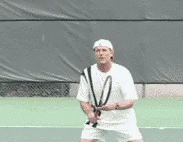
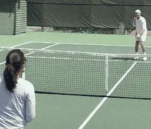
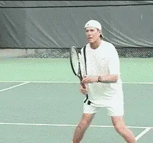
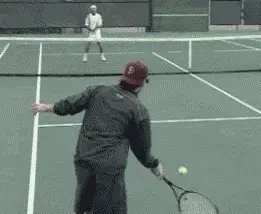
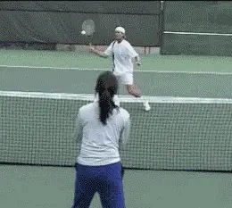
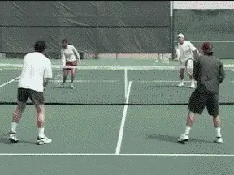
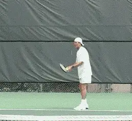

# The Volley Part 4 - Drills and more drills

### The Volley: Part 4

### Drills and More drills

### Scott Murphy

A player who wants to be a force at the net has to put in quality
practice time. When you're learning the mechanics, static practice is
fine to a point. However, if all you do is basically stand in one spot
and volley a perfectly fed ball, you're kidding yourself. Dynamic
practice involves match like situations, such as; moving in, split
stepping, playing a low volley deep, recovering, and then closing in on
a floater and putting it away.

Here are few drills I use that may help you get started:

**The \"Rapid Fire Drill\" emphasizes readiness, simplicity, ball focus and recovery.**

### Rapid Fire

The \"Rapid Fire Drill\" accentuates readiness and simplicity. I'll
feed four balls in rapid succession, sometimes uniformly, sometimes not.
I feed the first ball with a bounce but the subsequent balls out of the
air. There should be just enough time for the volleyer to ready hop,
step and volley, and repeat that four times. If the ready hop is ill
timed and/or the swings are too big, the sequence will break down.

As players become more adept I mix up the feeds to accentuate watching
the ball off the racket. This is also a good drill for practicing wide
volleys. Emphasize watching the ball off the racket and recovery.

**In the \"Shoot Out\" close to ideal volley position and see who can keep the ball in play longest.**

### Shootout

A corollary of the \"Rapid Fire Drill\" is what I call the \"Shootout
Volley Drill.\"

This drill finds two players on opposite sides of the net, both at the
\" T.\" One player starts a ball to either the forehand or the backhand
of the other player, both players close to ideal volley position while
firing volleys at one another.

No winners are attempted. It's simply a matter of who can last the
longest without making an error.

**\"Catch and Volley\" develops touch and feel often lacking in the modern game.**

### Catch and Volley

The first part of the \"Catch and Volley\" drill helps develop touch for
drop volleys, while also providing a \"self fed\" second ball to volley.

As the animation shows, the first ball is caught, bumped up, and then
volleyed out. Once you're comfortable \"catching\" the ball you can hit
drop volleys over the net on the initial feed.

Practice having the ball bounce anywhere between three and five times
before it leaves the opposite service box. Later on you can practice the
drop volley in a more dynamic drill of your making.

**In the \"Half Court Pass,\" the reduced court size promotes consistency and precision.**

### Half Court Pass

One player is at the baseline and there's a net player who starts at
the service line. The boundaries are the centerline (extended to the
baseline), the doubles alley sideline, and the baseline.

The baseline player begins the point with a bounce feed so the net
player can better time his ready hop. The initial feed should be varied
from low at the feet, to wide (on either side), high, at the body, etc.
The volleyer puts the ball in play, closes to ideal volley position, and
the baseliner tries to pass him.

You can play to a predetermined amount of points. It SHOULD be very
difficult for the baseliner to hit a clean winner. Of course you can
come up with all kinds of variations. For instance, the volleyer's
shots have to land over the service line, or put the possibility of a
lob in so he doesn't get unrealistically close to the net, etc. In
another variation of this drill, both players start at the baseline and
practice moving in with appropriate split steps on the way to ideal
volley position where they have a shoot out.

**The \"Figure X Drill\" helps players learn changes in ball direction.**

### Figure X

In the \"Figure X\" drill two players do just that, volley back and
forth in an X pattern.

The sequence is forehand to forehand, forehand to backhand, backhand to
backhand, backhand to forehand, forehand to forehand, etc.

This drill is geared primarily toward ball direction change.

**\"Two on Two drill\" - When the first player misses, play out the point with the remaining ball.**

### Two On Two

This is a volley drill I like that involves four people, two on each
side of the net in ideal volley position, one in the deuce court, one in
the ad court.

Players volley one on one; either straight ahead or crosscourt until one
pair makes an error. At that point the remaining ball is in play for all
four and they play the point out.

This is obviously a doubles oriented drill that helps create court
awareness.

**\"Serve and Volley\" - Let's state the obvious. To improve your serve and volley, you have to actually try it in matches.**

**Scott Murphy** is from Marin County, California where he started
playing tennis at age 5 in a family of tennis nuts. Both of his parents
were major influences in his development. He also took lessons from
Marin legend Hal Wagner and former top 10, Harry Roach. Scott is a
graduate of the University of California at Berkeley where he played
baseball and football but continued to work on his tennis game with
renowned coach Chet Murphy. He was the head pro at San Domenico/Sleepy
Hollow Tennis Club for over 20 years. He also directed the Nike Tahoe
Tennis Camp at the Granlibakken Resort for 10 years. Scott now teaches
privately in Ross, Marin County and in the summer he directs the Tuscan
Tennis Academy which he founded in Quarrata, Italy.

Check out Scott's website at
[scottmurphytennis.net](http://www.scottmurphytennis.net)

You can contact Scott directly at: <scottmrph@yahoo.com>
