# Timing and the Feel of the Racket Head

### Don Brosseau

------------------------------------------------------------------------

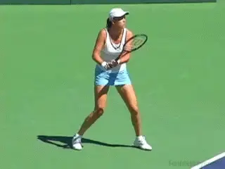

**Timing and ball striking\--essential skills to reach the top.**

Timing is a fascinating but curious subject. Compared to such topics as
the open stance forehand, almost nothing has been written about it. But
timing is an absolutely essential skill to reaching the upper echelons
of the game. And for maximizing your potential at any level.

A top player may not necessarily have great foot speed, be the best
athlete or have a huge serve. However, all great players can time their
swings to generate effective shots off the tremendously challenging
balls they receive in top flight tennis.

Take a player like Lindsey Davenport. She has been one of the top
players in the world for years not withstanding the fact that players
ranked hundreds of spots below her cover the court better. But Lindsey
is a ball striker par excellence and great timing is at the heart of
those ball-striking skills.

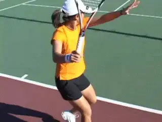

**The racket head and only the racket head strikes the tennis ball.**

You might acknowledge the importance of timing but argue that you are
either born with good timing or you are not. But this view is too
simplistic.

You can draw an analogy between movement and timing. Genetic factors do
place an ultimate ceiling on your speed, but training techniques to
improve footwork and maximize your physical ability can greatly improve
a player's court coverage.

Similarly, I have found that if players become aware of the racket head
and practice various key skills, they can substantially improve their
timing. These two articles will cover some of these exercises and drills
that can help take your timing to a higher level.

The techniques are organized around two fundamental principles. **The first principle\--covered in the first article\--is to know\--and I mean really \"know\"\--where your racket head is at all times.The second principle\--coming up in the second upcoming installment\--is to learn how to release the racket head at different times depending upon the kind of ball you are receiving, including all the potential variations in speed, spin, angle, depth, and location.**

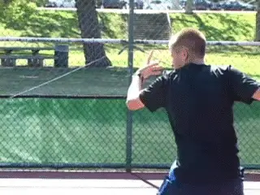

**Are you connected to the pocket?The Racket Head and the Pocket**

In his 1950 book How to Play Better Tennis, Bill Tilden wrote that the
head of the racket, and only the head of the racket, returns a ball.

Much has changed in tennis since that time, but that simple fact has
not. Speed and pace are controlled completely by the manner in which the
racket head is swung against the ball.

In a recent television commentator appearance, Andre Agassi stated that
what set Roger Federer apart was his phenomenal ability to control the
racket head. **Delivering it to the contact point at just the right time for the just the right shot is what timing is all about.In my opinion, great players have an innate sense of the racket head. In particular, they feel the weight of the racket head both as they prepare the racket and then swing it forward.**

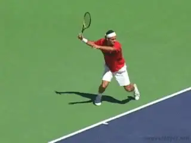

**Why do top players hit the ball with their hitting arms so relaxed?There is a \"pocket\" in the strings in the middle of the racket head. This is what ideally strikes the ball.** When
a player really feels the weight of the racket head he becomes
\"connected\" to that pocket.

**So, it's very important to distinguish between simply swinging the racket, and having a feel for the racket head and the pocket.The Exercises**

So assuming you are part of the 99.9% of the population us who are not
born with an innate world class feel for where the racket head is at all
times, how can you improve this skill? You may not have ever thought of
the racket head separately from the racket itself, or ever really felt
what it is like to connect with the pocket time after time. Through
these exercises you can.

Some of the exercises I will share here may seem incredibly basic, but
if you practice them I can assure you will improve your timing
tremendously. Or make the point another way: if you cannot execute these
basic exercises successfully, it demonstrates that you don't currently
have the feel you need to realize the potential of your strokes.

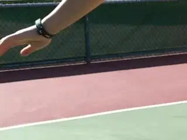

**At the contact point, do you feel the forearm\--or the racket head?**

Most players are far too rigid in their arms, and particularly, the
forearm. **When your forearm is tense you feel the weight of the forearm itself, rather the weight of the racket head.The tense player becomes \"disconnected\" to the shot because he can no longer feel the critical elements in the forward swing.**

Have you noticed how much better you stroke the ball when your arms are
relaxed? Why is this? **A primary reason is that when your racket arm is relaxed you have a much better kinesthetic sense of the location and weight of the racket head.**

Feeling the weight of the forearm rather than the weight of the racket
head is a problem I have encountered with practically every student who
has ever walked onto my teaching court, from beginners to highly ranked
tournament players.

When I suspect that the student has this issue, I ask him or her to take
a practice \"shadow\" swing on the forehand but to freeze the swing at
the contact point. I then ask where the pupil feels the weight \-- to
help I take the wrist of the hitting arm and hold it between my fingers.

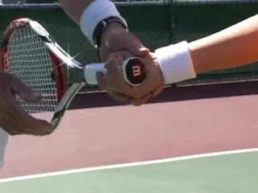

**Shifting the pressure points from the finger and thumb to the palm of the hand.**

At this point the student usually realizes that the weight they are
feeling is mostly the weight of the forearm and not the weight of the
racket head itself. I then explain that this makes it very difficult to
time the oncoming ball. The center of the strings is actually about 20
inches away from what the player is actually feeling. This is the same
problem that arises when a player tightens up on a difficult shot and/or
under pressure.

**How can this problem be corrected? The solution is to change the \"pressure points\" in how the player grips the racket. Most players with this problem hold the racket too tightly (i.e., squeezing) with their thumb and index finger. This tightens the hand too much and the weight is felt in the forearm.I change this by telling my students to hold the racket more deeply in the palm of the racket hand.The feeling should be \"snug\" but not tight. By moving the pressure point into the palm they are more easily able to feel and properly control the momentum of the racket head.**

If you hold the racket too tightly, you severely limit your ability to
hit with power. You have to control your racket to make the swing, but
that control should come from an educated, tactile sense in the palm of
the hand, not from squeezing the thumb and index finger.

A very helpful basic exercise to impart the feeling of how to hold the
racket is to practice rolling a tennis ball around the edge of the
racket frame. Practice rolling the ball both clockwise and
counter-clockwise keeping it in contact with the frame of the racket
head.

Notice that if you tighten your thumb and index finger, you diminish
your ability to roll the ball on the strings. You can not control the
ball as well and you are not able to roll it as fast.

I highly recommend that you do this drill regularly \-- it will really
help you develop more feel for the racket head. It may seem simple, but
it's amazing how many players can't do it successfully. I use it even
with nationally junior players, when they complain that their timing is
off.

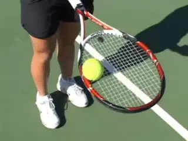

**Can you roll the ball around the racket head? From one side to the other?**

Another variation is to roll the ball from one side of the racket face
to the other side without losing touch with the frame. The trick here is
to get the ball rolling up the face and then pull the racket under the
ball as the ball reaches the point of inertia.

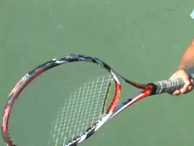

**In slow motion the quarter stays put until well after contact.**

Another very effective drill is to try swinging in slow motion with a
quarter balanced on the edge of the middle of the racket head. This is a
little artificial as the head in reality closes somewhat on the
backswing, and sometimes slightly on the forward swing as well. But this
drill will definitely increase your awareness and sensitivity. The
quarter should stay in position on the racket until well after contact.

**Tossing Drills**

Here is a series of ball tossing drills that work on your feel in
slightly different ways. In the first drill, your teacher or practice
partner tosses the ball to you from a short distance and you literally
catch the ball on the racket face. Start by using your non-racket hand
to trap the ball on the strings. But practice until you can catch the
ball on the racket face without the aid of the additional hand.

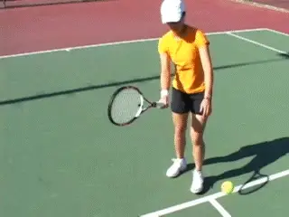

**A progression of catching exercises puts your attention on the racket head.**

For advanced players, the drill can be made more difficult by increasing
the distance between the person tossing and the player catching the ball
on the strings. If the catcher can handle it, the person tossing can go
to the opposite side of the net. The most advanced variation is for the
person tossing the ball to toss it away from the player \-- the player
then has to move to the ball and catch it on the strings.

Regardless of which variation of the drill is used, there are two
critical questions I ask my students. The first is \"Were you more
careful positioning the racket head when you tried to catch the ball or
when you were actually hitting?\" Invariably, the pupil will answer that
they were more careful when they were trying to catch the ball.

The second question is: \"Which is more difficult, catching the ball or
hitting it to a target?\" Because students have spent countless hours
hitting tennis balls, they will usually answer catching the ball.

The reality is catching the ball is far easier\--if you spent an equal
amount of time practicing both. Learning to catch the ball requires the
player to develop heightened sensitivity to the location of the racket
head. The point I make is that every player should apply this same
heightened awareness to actual play.

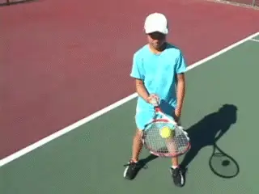

**Hitting with the ball starting on the racket face produces a natural, compact loop.Hitting Off the Racket Face**

Another terrific tossing drill is one I learned from the late Jerry
Alleyne. Jerry was a great New York teaching pro from whom I learned the
principles that form the basis of my teaching today.

Start the drill by balancing a ball on the racket face. Stand inside the
service line, pick a target in the middle of the service box on the
other side of the net. The goal is to hit the ball to the target, but
without pushing the ball up into the air before you contact it. This
means you have very little time to accomplish the task.

The only way to do it is with a continuous looping motion. If you stop
the racket during the backswing the ball will hit the ground before your
racket can get to the contact point. Most students will naturally adopt
a small looping motion when performing the drill.

The drill gives a great feel for developing a compact circular backswing
motion in the actual stroke. It also gives the player the sense of
throwing the weight of the racket towards the target and this is exactly
the feeling you want when you stroke the ball. You can vary the drill by
hitting to targets in different parts of the court, including targets
deep into the court. One note: This drill will work with any forehand
grip between from a semi-western to a continental. But it will not work
with a full western grip.

**The Real Deal**

Now let's apply some of these basic principles to hitting actual
forehands. I divide the forward swing into two phases. The first phase
is the unit turn. The second phase includes the racket drop or loop, and
the forward swing. Let's see how the awareness of the racket comes into
play, especially in the second phase.

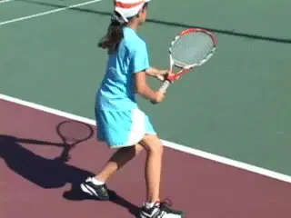

**A slight pause at the completion of the turn.**

When initially teaching the forehand swing, I will have the student make
a small pause after the completion of the unit turn.

The unit turn starts the preparation of the body and the racket. At the
completion of the unit turn on the forehand, the racket shaft is
pointing upward and toward the back of the court. The right elbow is
just off the right hip and the racket head is just past the right
shoulder.

The racket face is somewhere between vertical and closed, as there are a
range of backswings shapes that can be effective. The exact height and
position of the head will also vary between players and also according
to the characteristics of the oncoming ball.

When you make the unit turn you want to feel \"connected\" to the ball.
You want to establish a relationship between the incoming ball and your
racket head as you make the unit turn. Think back to the ball catching
drill. **In order to catch the ball on the strings you need to \"connect\" the incoming ball to the racket head.**
You want that same kind of connection in the unit turn. This connection
should be continuously developing as you move to and read more
information about the oncoming ball:

**You need to feel the speed, spin, height, angle, etc. of the oncoming shot. Based on this information, you will adjust the position of the racket head for the shot you are about to hit.In this way, the unit turn is actually slightly different for every ball. Great players have this subtle, continuous feeling and that helps make tough shots look easy.Most recreational players don't, and this is why they can make easy shots look hard.**

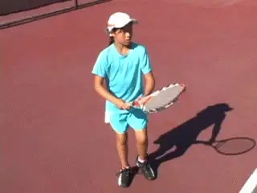

**After the turn the motion continues with the \"gravity drop.\"Phase 2**

You set up the swing with the unit turn and now in phase 2, you let it
go. There is a pause at the completion of the unit turn. But in phase 2,
the motion is continuous. This is where the awareness of the racket head
becomes critical. I call the start of this phase the \"gravity drop.\"
The racket drops to bottom of the backswing and then accelerates forward
to the ball.

The proper grip pressure, the relaxed arm, and the feeling for
connecting the ball with the pocket, all come together in these critical
instants of the forward swing.

**Many players stop the racket at the bottom of the backswing loop. But in doing so they lose the benefit of the \"gravity drop.\" In addition, they also impair their ability to disguise the shot and whether they will hit a lob, slice or a topspin drive.Most importantly, by stopping at the bottom of the loop, they make the whole motion too deliberate and mechanical. This type of motion will have the tendency to break down a lot more under pressure than an automatic, continuous motion**.

**OrientationSimply knowing the location of the racket head in phase 2 is not enough; you have to actually feel its orientation in space.You should close your eyes and do practice swings to better develop this sense.Feel the weight of the racket head as you drop it in the loop and then feel the momentum of the racket head on the forward swing as the racket head goes out towards your intended target. You have to feel how the face closes in the backswing. You have to feel how that changes to perpendicular or possibly slightly closed as the racket moves onto the intended path of the shot and then through the hitting zone.You must also develop the feeling of keeping the racket head on this path as long as possible.**

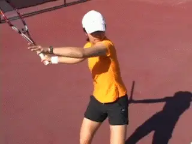

**Feel the weight and the orientation of the racket head throughout phase 2.**

Eventually, you may find yourself melding the two phases so there is no
break between the parts of the swing. Roger Federer and many other pros
do this with the result that the racket is in continuous motion from the
moment the swing starts until it is finished.

This probably results in even more feeling for where the racket head is.
But in my experience, most players are better off at least initially if
there is slight pause at the completion of the unit turn.

**Weighted Racket**

Here is a final exercise using a teaching tool I created that has
greatly helped my students. This is a customized racket with lead wire
wrapped around the racket head. Make sure to wrap the wire evenly around
the racket head and add about 5 to 6 ounces to the head weight (for
lower-level kids or smaller adult players you can add less weight).
Using this racket is not intended to make you stronger. Rather, it is
intended to give you the kinesthetic sense of the weight of the racket
head, and also, to feel the increased momentum of the racket head as it
flows through the hitting zone towards the target.

To start, the player hits a simple shot down the line off of a gentle
feed with the non-weighted racket. Try to feel the racket head and where
the momentum is directed in terms of the line of flight of the ball.
Disciplined monitoring of the follow-through will tell you what is
really happening. Players will often swing across the ball too soon
instead of continuing the racket head along the intended down the line
shot path.

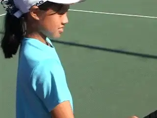

**Weighting an old racket increases feel for the swing trajectory along the line of the shot.**

Now, the player hits a second tossed ball down the line with the
weighted racket. Due to the extra weight, the player has no choice but
to swing further along the line toward the target, because it is much
harder to manipulate the heavy racket. The additional weight enables the
player to feel the momentum of the racket head. The end result is that
the players learn to let racket head do more of the \"work.\"

If the player still has trouble getting the feel of it, the player
should hold the weighted racket with only the thumb and middle finger on
the racket. Now the player has no choice but to let the momentum of the
racket work for him. This drill is also great for working on the volley.

So that's it for Part 1. In the next article let's see how the timing
of the release of the racket changes given the specific ball the player
is receiving and trying to hit himself. Stay tuned!

**Note:** Special thanks to TPA Contributing Editor Ed
Weiss for working closely with Don in developing this article! And extra
special thanks to Danielle Lao, Angela Kulikov, and Daniel Weingarten
for the fantastic job demonstrating the strokes and the exercises.

                                                                                                                                                                                                 teaching pros in the Southern California area,
                                                                                                                                                                                                 based at Griffith Park in Los Angeles. A
                                                                                                                                                                                                 former All American college player, Don played
                                                                                                                                                                                                 on the pro tour and was ranked in the top 300
                                                                                                                                                                                                 in the world in both singles and doubles. He
                                                                                                                                                                                                 has taught throughout the United States and
                                                                                                                                                                                                 coached dozens of sectionally and nationally
                                                                                                                                                                                                 ranked junior players, as well as pro players
                                                                                                                                                                                                 Justin Gimelstob and Paul Annacone. With an
                                                                                                                                                                                                 engineering degree and a doctorate in
                                                                                                                                                                                                 chiropractic, Don has developed a unique
                                                                                                                                                                                                 perspective on tennis and a reputation as an
                                                                                                                                                                                                 innovator in the world coaching community.
  ---------------------------------------------------------------------------------------------------------------------------------------------------------------------------------------------------------------------------------------------
                                                                                                                                                                   Yeh (right), is one of the leading independent
  ---------------------------------------------------------------------------------------------------------------------------------------------------------------------------------------------- ----------------------------------------------

  ---------------------------------------------------------------------------------------------------------------------------------------------------------------------------------------------------------------------------------------------
