# Timing and the Release of the Swing

### Don Brosseau

------------------------------------------------------------------------

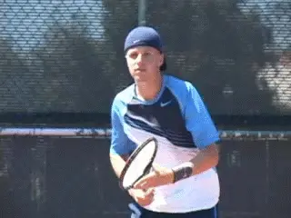

**What's the difference between hitting with rhythm and hitting with timing?**

As a player do you understand the difference between rhythm and timing?
Most players don't, yet learning to play with timing is critical to
taking your game to the next level.

In my first article ([link](Timing%20and%20the%20Feel%20of%20the%20Racket%20Head.docx)) we
looked at the first principle of good timing: \"knowing\" where your
racket head is in relation to the ball\--most importantly at contact.
The second principle is knowing when to release your forward swing. This
means knowing how to time the release at slightly different moments to
find the contact point on the wide variety of balls competitively
players actually face.

The majority of all players don't play with \"timing\" in this sense.
Instead, they play with \"rhythm.\" They release their swings at the
same time on every ball, usually about the time of the ball bounce on
the court. This is why most players do much better when they play
against opponents who hit the ball at an even speed\--or when they hit
with teaching pros.

But the quality of balls players must deal with in matches vary over a
huge range. There are harder, faster balls, slower balls, deeper balls,
shorter balls, balls with different depths, arcs, spins and angles.
Unfortunately, most players are unaware of the subtle differences in the
release of the swing that are required to time all these variations.
Because of this they never work specifically on timing in practice.

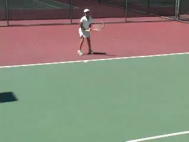

**Compare the timing of the release of the swing by looking at the position of the arms at the bounce on a shorter ball versus a deeper ball.**

This may also be due to the erroneous belief that timing is an innate
talent that cannot be improved. While it is true that a lucky few are
born with natural timing, it is also true that the rest of the tennis
population can substantially improve timing skills by understanding and
then practicing timing techniques.

This article will help you learn the difference between rhythm and
timing. It will help you develop the critical differences in the timing
of your release. We'll do this through a series of original drills I
have created for my high level junior players. But these drills can make
a tremendous difference for players at all levels.

Working hard at these drills will help you take your timing to a much
higher level. The result will be a major improvement in your
consistency, and especially, in the quality of the ball you produce.

**Basic Principles**

As we saw in the first article, I divide the swing into two phases, the
unit turn and then the release. The release includes completing the
remainder of the backswing, allowing the racket head to drop, and the
forward swing. The question is, after you have made your unit turn, when
do you \"pull the trigger\" and complete the swing?

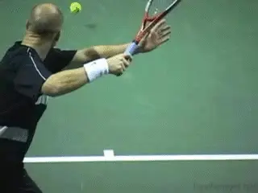

**On routine balls, the top players release the swing at the time of the bounce.Most players will reach the unit turn at about the time of the ball bounce and then begin the release.** In fact you
frequently see the pros in this same position. **As the ball bounces, the left arm is fully stretched across the body and the racket is at about the top of the backswing.** You can see this
for yourself if you look through the rear views in the Stroke Archive on
balls around the center of the court, or balls that do not force the
player on time.

**This timing will work on balls at a certain depth and speed. But if the ball is faster, heavier and/or deeper, the release must start earlier.Conversely if the ball is shorter and slower, the release must be slightly delayed.**

On a fast deep ball, waiting to release your swing will make your
contact consistently late. It can result in a hurried and tense swing
that will rob you of precision and power. It may force you to play a
faster, riskier shot. Now your opponent is dictating your response
rather than the other way around.

The problem is exactly the same on slower and/or shorter balls. In this
case you want to release your swing after the ball bounces. The timing
of every shot in tennis is different, but most players swing as if they
are all the same.

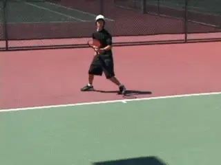

**Notice the delay in the release on the shorter slower ball.**

The point may seem obvious. The deeper/faster ball will arrive sooner
than the slower/shorter ball, so of course you should release your swing
earlier. But the reality is that most players never adjust their swing
to the pace and depth of the ball. They continue to release the racket
at the same time regardless of how fast or how slow the ball is
approaching them.

**Accomplished players make slight adjustments on almost every ball.** Watch Federer's release in the animation
on these two hard, difficult balls. In both cases the release is well
before the bounce. On the second ball, which is even faster and deeper
than the first, the release is clearly sooner. You can see this by
looking at where the arms and racket are positioned at the moment of the
bounce.

By timing these balls differently, Federer can reach the contact point
on two very difficult shots.

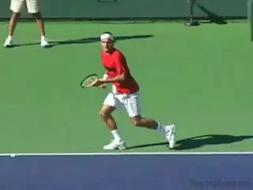

**Watch how Federer's release changes on these two deep, fast balls. The precision of his timing is based on the characteristics of each individual ball.**

How do players develop their ability to time the release in this way?
**By using their eyes to track the ball and gage the incoming ball's various characteristics\--speed, spin, depth, direction, height, placement, then using that information to dictate when they release their swing.By focusing on the flight of the ball, top players develop the relationship between the incoming ball and the racket head.This in turn allows them to line up their swing specifically for the exact shot they are hitting.**

I can not stress enough the importance of using your eyes to track the
ball using the information obtained to determine when to pull the
trigger. The drills outlined below are designed to help you improve your
tracking ability and base your timing on the actual characteristics of
the individual ball you are about to hit.

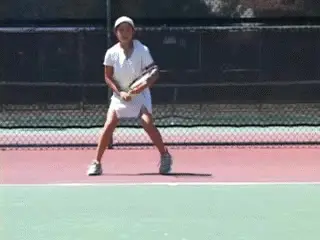

**Develop the timing of the release by hitting different balls back at the same speed.The Drills**

Simply understanding the importance of releasing your swing at different
times may help you to better time your shots. But to really master your
timing, you will need to work specifically on the skill. To do this I
have created several drills that I use with my students to improve this
all-important element in great ball striking.

In the first drill, I tell my students that no matter what kind of ball
I feed to them, they must hit the ball back at the same speed. I then
hit them balls of varying speed and depth. The only way to successfully
perform this drill is to time the release of your swing to the type of
ball you are receiving.

Here is how it works. Assume I ask you to hit all of your shots at 35
miles per hour. The first ball I feed you is a medium-paced ball that
lands just a few feet past the service line and you hit it back at 35
miles per hour. On the second feed, I hit you a ball with a similar
speed but bouncing much deeper in your court. If you time the ball
properly by releasing your swing earlier than you did on the first ball,
you will be able to swing your racket smoothly at the proper speed to
produce another shot at 35 miles per hour.

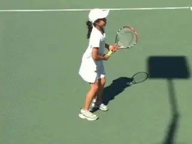

**Hitting out of the air from behind the service line helps players feel the two parts of the swing\--and then make a continuous transition.**

But if you wait too long to release your shot, you will have to quicken
up the racket at the last moment before contact. The result is that your
shot will be faster. This drill takes intense focus, but it's the most
basic drill for teaching players how to release their swings at
different times depending upon the incoming ball. It really makes you
feel the differences in the timing.

**Out of the Air**

I use two other drills in which the player hits the ball out of the air.
These are particularly effective breaking the habit of releasing the
swing only when the ball bounces.

To help my players learn the feeling of releasing the swing earlier on
fast balls, I start by bringing them up just behind the service line and
feeding them balls that they must contact in the air between their waist
and knees. The student has to hit the balls out of the air with a normal
groundstroke swing. But the contact point is lower than a swinging
volley.

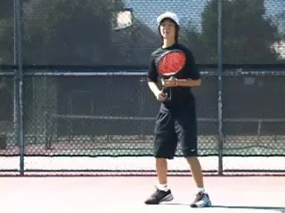

**Now move back behind the baseline and again practice taking the ball out of the air between the knees and the chest.**

In a real match I wouldn't want them to hit this shot off a ball that
is that low, but doing so in this drill has real value in helping them
learn how to release their swing earlier. Players will find it easiest
to perform this drill with their forehands, but you can do the same
drill with the two handed backhand.

Because the pupil is so much closer to the net and is hitting the ball
out of the air, he or she must release the swing earlier to hit the ball
at all. To do this the player must pick up the ball much earlier off the
feed. So the intensity of the player's focus is naturally increased.

Again, as we saw in the first article, the swing can be divided into two
parts: the unit turn and the release and forward swing. The better the
player, the smoother the transition, a transition which becomes
virtually seemless at higher levels. But knowing when to make this
transition is the key to matching up the racket head with the ball, what
we called \"connecting to the pocket\" in the first article.

This drill really helps the player feel the two parts of the swing. They
learn to make an immediate unit turn, and then to release the swing and
come forward to the ball. I generally encourage them to do the swing in
the two parts at first, pausing slightly after the unit turn. The feel
for the racket head is naturally increased because making contact in
front is much more difficult with less time.

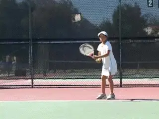

**Using a constant, slower speed on the return ball is especially effective.**

In the second variation of this drill, I move the player back behind the
baseline and have him or her do the same thing\--hit the ball out of the
air before it bounces using a normal groundstoke swing. The feeder
should hit a deep ball but with only a little arc. Again, this creates a
contact point somewhere between the knees and the chest.

Obviously, the feed is \"unrealistic\" because the ball would bounce
well past the baseline. But since the ball is coming quite fast, the
player is again forced to use his or her eyes to track the ball more
closely. To deal with the extra pace of the ball, making contact at the
right time in front of the body becomes critical. The result is a big
improvement in the player's ability to time the swing to the pace of
the oncoming ball.

I find this second drill is particularly effective when I have the
player hit the ball back out of the air but ask them to maintain a
constant, slower speed on their return shots. Hitting at a slower speed
shot forces the player to start the swing even earlier because, the
player must start forward sooner to hit the ball in front.

As in other areas of the game, high speed shots can sometimes disguise
the truth\--players don't really feel what they are doing. Performing
this drill at a slower speed really helps the player develop the feel of
the racket head and a very precise release.

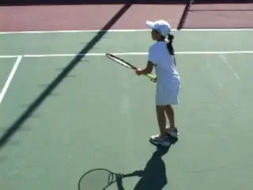

**Now take some balls out of the air and others on the bounce.**

A further progression in this drill is to then feed the student a
mixture of balls, some in the air and some that bounce - with the
student again striving to maintain the same pace on all shots. Remember,
the feeder is maintaining a constant pace on the feeds, so it is the
swing of the player that will determine the speed of the return.

This looks easy when executed by someone who has developed their timing
but not for players who haven't. Think of the teaching pro who
routinely returns the student's balls at a constant speed and height
despite the inconsistency of the balls the pupil is hitting to them. Or
think of Andre Agassi making it look so easy when he consistently takes
deep, hard balls on the rise.

The next progression of this drill is for the feeder to vary both the
depth and speed of the feed and then ask the player to do the same. To
do this the coach calls out the speed or depth that the player should
use on the return after while the fed ball is in the air. To execute
this drill, the player must truly have good feel for preparing the
racket head for the shot and the ability to time the ball based on its
incoming characteristics as opposed to just hitting off the bounce.

Finally, have both players move into no man's land and try to play full
swinging strokes without being rushed. Be sure to focus on hitting balls
different speeds, depths and directions. It's even better if your
partner yells out the shot you must hit as his ball crosses the net to
you. Remember to emphasize the delineation between the unit turn or
preparation and the actual swing.

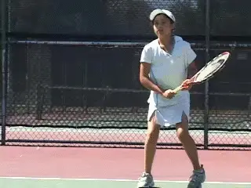

**The rapid feed in \"Angela's Asteroids\" forces players to eliminate extraneous motion to find the contact.Angela's Asteroids**

A final great drill is what I call \"Angela's Asteroids.\" I actually
devised it to help one of my players, Angela Kulikov, reduce the size of
her backswing and the use of her wrist on her forehand, both common
mistakes for younger players who have to deal with high balls. Why call
it Angela's Asteroids? You guessed it, from the classic video game in
which asteroids come at you faster and faster.

Angela starts by hitting forehands in her normal strike zone at a normal
pace. Then we accelerate the feed, firing the second ball just as the
first ball bounces on her side. I do this using a special dual tower
ball machine, but a good feeder can do it manually as well.

This drill immediately forces the player to dispense with any extraneous
motion. Doing this drill you sometimes see a world class forehand emerge
before your eyes.

I now use it with all my players. Once a little proficiency is achieved,
you can take the speed of the feed up and make it even faster. This
drill creates tremendous focus. It forces players to connect the racket
head to the oncoming ball. After the Asteroid Drill, finding the pocket
on balls hit at regular intervals usually becomes much easier and more
consistent.

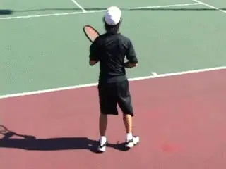

**On a high, deep ball hit inside out or inside in, the shoulder turn is further with the back turning more to the net.Preparation**

So far, we have seen how speed, spin, depth, and height are critical to
the timing of the release. But what do they mean for your preparation?
What if your opponent hits a heavier ball that bounces higher and forces
you to play the ball at your shoulders or above? What if you are forced
to or want to try to play the ball on the rise? Different types of balls
can affect your preparation as well as your release.

For example, on the high, heavier ball, you have to turn further,
sometimes with your back turned far more to the net. This allows you to
get further inside of the flight path of the ball. The most pronounced
example is when you are hitting your forehand inside out.

Why is this important? As the contact point goes up it becomes more
difficult to swing the racket through the ball towards the target. To do
this you need to turn your body so that your shoulders are aligned more
with the direction of the shot.

With less turn, as the arm goes higher it will tend to wrap around the
body too soon, moving away from the intended target line. If you want to
hit that high ball with some sting, you have to recognize it early and
then get to the inside of the flight path with more turn.

**On the Rise**

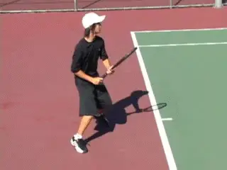

**When hitting on the rise, the racket is only slightly below the ball and the arc is flatter.**

If you are hitting the ball on the rise, the ball will have lift as it
rises off the court and this reduces the amount of lift you have to
impart to the ball with your swing. When you hit on the rise, you will
therefore swing with a slightly flatter arc compared to a higher ball
that is at its peak or dropping.

Great players do this intuitively. But most of us need more awareness of
what we are trying to do to develop the same skill. I help players feel
the difference by doing a drill in that combines two very different
balls. This first ball is deeper and faster. This is followed by a
second shorter slower ball. The second ball forces players to come
forward and hit the ball earlier to prevent it from taking a second
bounce. The lower trajectory on the second shot keeps the player from
dropping the racket too far below the ball and keeps the arc of the
swing plane relatively flat.

Again, the pattern of the drill forces the player to feel what the
differences in the shots are actually like. This in turn can translate
into actual play when the conscious decision is to hit the ball on the
way up.

So that's it for our second timing article. The point of all the drills
is to help you feel how certain concepts actually work on the court. But
once you have developed some feeling in the drills, you need to get out
of your own way, focus on the ball, and let the shots happen
automatically. Good tennis strokes are just too complicated for us to do
\"on purpose\" or \"deliberately.\" The one thing you can do
deliberately is recognize when your opponent's strokes lack some or all
of these elements we've explored\--and attack accordingly.

I hope you will try these drills out and use them to help develop your
own sense of the racket head and timing. Go out and have some fun with
it! And please let me know in the Forum ([link](http://www.tennisplayer.net/bulletin/forumdisplay.php?f=1)) what
you think of the drills and how you made out.

**Note:** Special thanks to TPA Contributing Editor Ed
Weiss for working closely with Don in developing these articles! And
extra special thanks to Angela Kulikov, Lestter Yeh, and Daniel
Weingarten for the fantastic job demonstrating the drills.

                                                                                                                                                                                              teaching pros in the Southern California area,
                                                                                                                                                                                              based at Griffith Park in Los Angeles. A
                                                                                                                                                                                              former All American college player, Don played
                                                                                                                                                                                              on the pro tour and was ranked in the top 300
                                                                                                                                                                                              in the world in both singles and doubles. He
                                                                                                                                                                                              has taught throughout the United States and
                                                                                                                                                                                              coached dozens of sectionally and nationally
                                                                                                                                                                                              ranked junior players, as well as pro players
                                                                                                                                                                                              Justin Gimelstob and Paul Annacone. With an
                                                                                                                                                                                              engineering degree and a doctorate in
                                                                                                                                                                                              chiropractic, Don has developed a unique
                                                                                                                                                                                              perspective on tennis and a reputation as an
                                                                                                                                                                                              innovator in the world coaching community.
  ------------------------------------------------------------------------------------------------------------------------------------------------------------------------------------------------------------------------------------------
                                                                                                                                                                Yeh (right), is one of the leading independent
  ------------------------------------------------------------------------------------------------------------------------------------------------------------------------------------------- ----------------------------------------------

  ------------------------------------------------------------------------------------------------------------------------------------------------------------------------------------------------------------------------------------------
