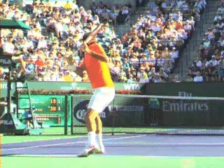
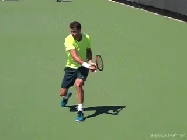
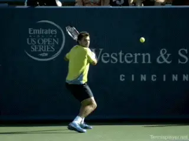
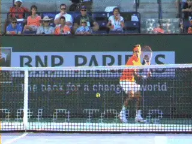
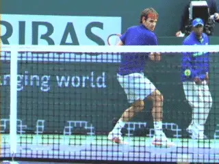
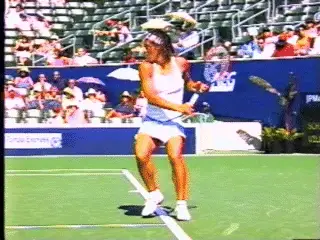
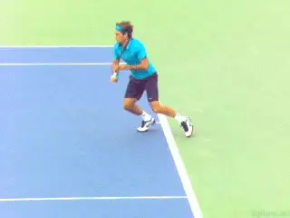

# True Alignment: The One Handed Backhand

# By Kerry Mitchell

------------------------------------------------------------------------

**On the one-hander the hips are closely aligned with the shot line.**

When it comes to true alignment on the one-handed backhand, the
principles are structurally similar to the two-hander. If anything, the
alignment of the hips is even more important. ([Click
Here](True%20Alignment%20The%20Two%20Handed%20Backhand.docx) for True
Alignment on the Two-Hander.)

**There is much less body rotation in the forward swing on the one hander. So the hips and shoulders stay more sideways, anywhere from completely perpendicular to the net to opening a small amount.**

In general, this means the hips are aligned with the target line or
close at contact and also out into the followthrough, although with more
extreme grips the body rotation can be somewhat more.

**Like two-handers one-handers hit open, neutral, and closed.**

As with the two-hander, top players hit from all three major stance
variations, open, neutral and closed although the open stance is much
less common with one-hand.

Most players are taught to \"step into the ball\" without any attention
to how should happens. This leads to poor set ups, inconsistent distance
to the ball, swiveling through the shot, and swings that move across the
body too soon.

**Even though fewer balls are hit open stance, the open stance set up is the foundation for true alignment with the one-hander, same as with the two. Setting up in open stance teaches players to create the right spacing and coils the back leg.**

These are critical factors in a good one hander regardless of stance.
**At this point the weight is on the back foot with the knee bent and typically the player is on the toe of the front foot.**

In open stance hitting we see the same concept of \"Slamming the Door\"
as in the two-hander. By this I mean the legs scissor in opposite
directions. The front leg kicks forward and the back leg kicks behind.

**Watch the legs scissor Slamming the Door.**

This is for the same reason as on the two-hander. **Slamming the Door is what controls the hips and keeps them sideways, so they stay aligned close to the target line.**

For most one-handers, I believe in hitting neutral stance with a line
across the toes perpendicular to the net. This is the \"old fashion\"
stepping in with the front foot.

The key here is that the step into the ball comes off the proper set up
with the back leg.

**The other key elements is that the rear foot stays grounded or more commonly lifts off the ground and moves back behind the player until the swing is almost complete.**

This is important because if the rear foot moves too early towards the
outside or the net, power and control are lost because the racket is no
longer traveling in the most linear path toward the intended target.

It will pass through the ball going across the body away from the
target.

**Players keep true alignment in neutral stance by moving the back foot backwards behind them.**

This is the problem with teaching the recovery step as part of the
stroke. It causes over rotation of the body and reduces power by making
the swing line much less linear.

As John Yandell's research shows, at the pro level, most one-handers,
as with two handers are hit with closed stances. ([Click
Here](../../Stroke%20Analysis/Advanced%20Tennis/The%20myth%20of%20the%20Recovery%20Step%20-%20Backhand.docx).)
Closed stance allows a bit more body turn in the set up.

This is advanced hitting and not what I recommend for club players. It
takes great core strength and balance.

**The counter movement of the back foot is probably even more important in closed stance.**

This is why in the closed stance the role of the back leg is as
important and probably more important than in neutral stance hitting.
The danger is with the wider stance for the hips to over rotate and for
the back leg to whip around the body as part of the swing.

The challenge in the closed stance is maintaining True Alignment.
**This is created by the rear leg again moving or kick back behind the player before the recovery. It keeps the hips from moving too much too soon.**

It's a huge key for power and proper swing line in the pro game. Look
at the perfect alignment of Roger's hips to the shot line in the
animation.

**The Hop**

**The hop forward on to the front foot with the back leg moving back behind the player.**

Another more advanced use of True Alignment is on what David Bailey
calls the Front Foot Hop. ([Click
Here](https://www.tennisplayer.net/members/footwork/david_bailey/golden_moves/second_golden_move/).)

**The hop on the front foot is forward towards the net more than simply up in the air. This pushes the body through the ball with more force, creating more power. It also allows the player to move forward through the shot without losing the correct path of the racket through the ball.Here the rear leg will be pressed backwards to achieve maximum extension through the shot towards the intended target.**

This is most often used on balls where players are moving forward into
the court or taking a higher ball on the rise. This action keeps the
hips in the traditional alignment for maximum power and control.

**Karaoke Step**

The next variation in true alignment comes on very low, short balls.
Here the approach to the ball is led by the rear foot, placing it close
to the ball so the next transitional steps can take place while still
moving forward.

The front foot will come forward much like a step-in transition to true
alignment, but since the ball is extremely low it requires a little more
foot work to maintain the alignment through the contact.

After an initial step with the front foot the back foot passes ahead of
the front foot with a Karaoke Step towards the intended target.

**The Karaoke Step helps maintain true alignment on short balls.This type of movement is often used on approach shots when the ball is low and close to the net. This is important for balance and well as control through the shot.**

On the one-handed backhand it is crucial for the good execution of the
upper body and the swing path. This type of foot work is the most
difficult to get right for most recreational players because it requires
trust in not seeing your target as they swing.

This is why sometimes even at the pro level, making a good approach shot
is hard to produce with consistency. This is something where your coach
can really help focus on the proper execution of coming into true
alignment.

That concluded my discussion of True Alignment on the groundstrokes.
Stay tuned and we will look next at the serve and the volleys.

|  | numerous ranked junior players and coached |
|  | a series of championship high school teams. |
|  | He was highly ranked both sectionally and |
|  | nationally in men's 30 and 35 singles. |
|  |  |
|  | After 15 years as the Head Teaching Pro at |
|  | the John Yandell Tennis School in San |
|  | Francisco, California Kerry and his partner |
|  | are now splitting time between homes in |
|  | Merida, Mexico and Toronto, Canada. He has |
|  | continued to coach and to have great |
|  | competitive success winning Canadian |
|  | National seniors titles---not to mention |
|  | continuing to write articles for |
|  | Tennisplayer from his unique perspective. |

