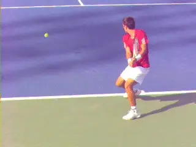
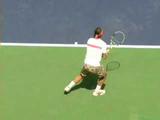
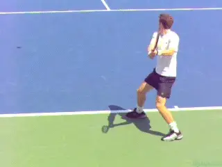
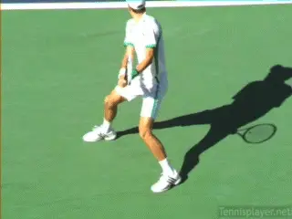
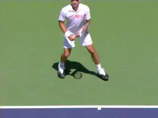
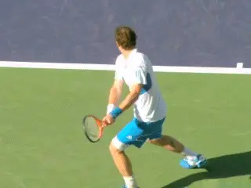
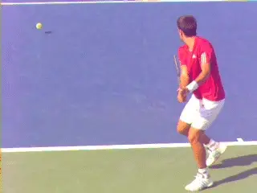
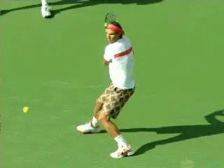

# True Alignment: The Two Handed Backhand

# By Kerry Mitchell

------------------------------------------------------------------------

**The movement of the legs to create true alignment on the two-handed backhand is critical but not widely understood.**

The concept of true alignment refers to the angles between the legs and
the hips in relation to the line of the shot. In a previous article I
looked at True Alignment on the forehand. ([link](True%20Alignment.docx).) Now let's do the same for the two-handed
backhand.

The combinations of movements that creates true alignment has changed my
whole approach to playing and teaching the game. It applies as well to
the one-handed backhand, the serve, approach shots, and the
volleys---something I will detail in future articles.

**Top players use open, neutral and closed stances.Stances**

We know that on the two-hander top players set up mainly in semi open
stances. They can then hit from the existing open stance, or step into a
neutral stance, or step across into a closed stance.

Regardless of stance, we know they push off the ground with the back
foot. We also know that the hips and shoulders rotate in conjunction
with this push. But what exactly happens to the legs after the initial
push, and how does that affect the timing of the rotation of the body?

True alignment describes what I feel are those critical relationships.
The hips in all cases rotate less than the shoulders. They remain
significantly more closed at contact, rotating at most 30 degrees and
are often parallel to the target line or close to parallel at contact.

**The hips rotate far less than the shoulders often staying close to the target line at contact.How?**

This alignment of the hips has a profound effect on the players'
ability to generate racket speed, ball speed, and spin. How is it
created? The alignment of the hips is controlled by the back leg. This
is the least understood component in true alignment\--although it is
clearly visible in TPA high speed video. So what happens to the
back leg in the moments around the contact?

Many teaching pros teach swinging the back legs around as part of the
actual stroke---instead of a recovery step that happens after the
forward swing is complete. The reality is that instead of going around,
the back leg either stays in place or in most cases actually moves in
the opposite direction, backwards behind the player. Why is this
important?

**Because of its impact on the rotation of the hips. Yes, the hips rotate. But if the hips rotate too much too soon, they reduce the transfer of power and cause the arms and racket to come across the body too far and too soon.**

**Watch the backward movement of the rear leg control the timing and amount of rotation of the hips.The movement of the back foot controls the timing of this rotationand the correct timing of this rotation naturally and automatically maximizes the acceleration of the hitting arms and racket.**

Let's look at what happens in open stance first. Then we will look at
neutral, and then finally closed. Closed stance is much more advanced
and not something I teach initially. It's something players can add if
they reach higher levels than the majority of players.

**How It Starts**

To understand true alignment, you have to start the footwork because it
makes everything else possible. How a player initiates the movement to
the ball is crucial. This is one of the main reasons I teach my
recreational players to hit more balls open stance. A lot of the players
that come to me have been taught to step in on all shots.

Unfortunately, this creates bad tracking to the ball\--being too close
or too far from the ball. This makes it difficult for the recreational
players to create the proper hitting zone consistently. This leads to
bad swing patterns.

Trying to step-in on all backhands is one of the main reasons the
recreational player never reaches his or her potential. It's why most
one-handed backhand recreational players find it difficult to drive the
ball with topspin with any kind of consistency.

On the two-handed player, bad tracking to the ball tends to create a
weak shot with little directional control. Overall, tracking the ball
poorly sets up the bad habit of rotating open with the hips to much too
soon, making it hard to reach true alignment at contact.

**The movement initiates with the outside foot with the set up in semi-open stance.**

A lot of teaching pros teach neutral stance hitting first to create good
turning habits, then move to the open stance. I do the reverse. **I start with proper positioning of the back foot by working on open stance hitting then move to more neutral stance hitting.The backhand movement is initiated by the rear or outside foot. This is important because the final step into the setup is on the same foot.This final step is often called the \"load step\". It's called that because a player is loading his weight on that foot to achieve maximum leg drive into the shot.**

The load step should land behind the ball in alignment with the
player's intended target. This alignment is crucial when the player
initiates the closing of the hips. Watch the back leg push but then
watch how it then moves back behind the player. This is what controls
the position of the hips and the creation of power.

With open stance what happens to the front foot and leg is as important
as what happens to the back. It's clear in the high-speed videos, but
again isn't much recognized or discussed in teaching.

**Andy Murray slams the door with the front foot as the rear foot goes back---watch how that keeps the hips from over-rotating.**

Watch the front leg move forward and across the body as the open stance
swing is initiated. I call this \"slamming the door.\" The end result of
these twin leg movements is that the come into alignment so a line
across the toes is parallel or close to parallel to the shot line. The
result is a more linear swing path and the most efficient generation of
power.

In effect the legs end up in similar alignment to a neutral stance, with
a line across the toes basically parallel to the target line. Proper set
up and the use of the back leg is what makes this possible. It wouldn't
happen without the proper position of the rear leg or if the leg was
swinging around as part of the stroke. Once a player's ball tracking
has improved then the player can start to learn how to Slam the door
with their legs and hips.

**Neutral and Closed**

When players step into the shot with neutral stance, the same
relationships apply. Watch in both cases how the back foot controls the
alignment of the hips, creating the right amount of rotation in the
right sequence.

Often on the pro tour, players will take the step in concept to the
extreme and step across towards the ball with the front foot. This is
closed stance hitting. 

**Watch the back foot go back to control the speed of the hip rotation on neutral and closed stances two-handers.**

This creates a bit more rotation both from the shoulders and the hips
which done correctly can create more racket head speed though the ball.
I normally don't teach this skill to the club player because it takes
tremendous core strength and coordination to maintain true alignment at
the point of contact. 

But as with the neutral stance look how the pros keep true alignment is
by pulling the rear foot back away from the ball.  This creates
counter-balance, again preventing the hips and shoulders from opening
too much as the player swings through the shot.

**Scissor**

The most explosive way of creating power with true alignment is by
exploding into the air scissoring the legs. You see this more often on
the forehand, but it is starting to be used more on the backhand,
especially with the two-handed backhand. It used to be seen as more of a
showboating type shot, but it is becoming more mainstream because of the
power potential. The players that probably do this the best are Rafael
Nadal and Novak Djokovic.

This type of dynamic shot making is not seen on the recreational level
very often because it requires a great deal of athletic ability and
coordination. When I do see it at the recreational level the execution
is often wrong, usually because the player jumps rotating the hips
around in more of a circular motion. This again causes the swing path to
come across the body in the direction of the side fence.

**The scissoring of the legs is the most explosive use of true alignment.**

Some simple exercises a player can do to start to develop true
alignment: have your coach, or a friend hand feed a few balls to your
backhand. Start in an open stance position with your weight loaded on
the back foot and make sure you make the full turn of the upper body
into that stance position. As the swing initiates forward, bring the
front foot into a neutral stance position. Make sure the swing starts
first.

Also make sure the movement of the front foot is toward the ball. This
will give you more of a sense of \"slamming the door\" as you swing. The
other big key is to finish the stroke well, with good extension towards
the court.

As you practice, you will start to see improvement in both power and
directional control. Your swing path will naturally start to improve
producing more racket speed, power and spin. Have a great time working
on this!! Have Fun!!

|  | numerous ranked junior players and coached |
|  | a series of championship high school teams. |
|  | He was highly ranked both sectionally and |
|  | nationally in men's 30 and 35 singles. |
|  |  |
|  | After 15 years as the Head Teaching Pro at |
|  | the John Yandell Tennis School in San |
|  | Francisco, California Kerry and his partner |
|  | are now splitting time between homes in |
|  | Merida, Mexico and Toronto, Canada. He has |
|  | continued to coach and to have great |
|  | competitive success winning Canadian |
|  | National seniors titles---not to mention |
|  | continuing to write articles for |
|  | TPA from his unique perspective. |

