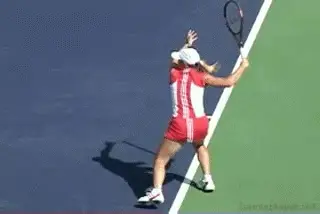
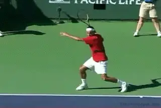
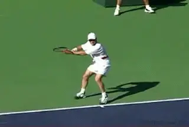
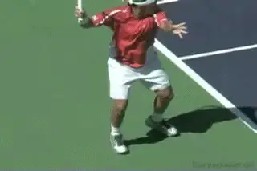
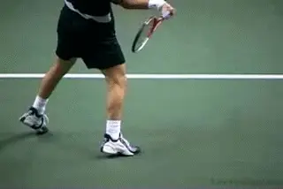
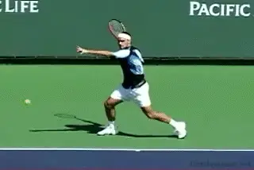
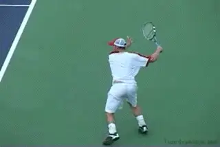
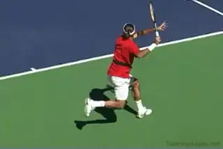
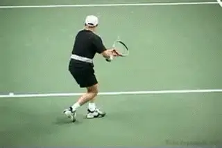
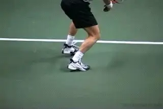

# True Alignment

# By Kerry Mitchell

------------------------------------------------------------------------

**Look closely at the legs\--can you see True Alignment?**

Many coaches talk about the role of the shoulders and the arms in
producing power. Many talk about different stance positions. But few
have talked about the exact role of the legs during the swing in
producing power in tennis shots.

What is the optimum position of the legs? How does this relate to the
position of the hips? By this I mean not only how the legs set up, but
how and when and where the legs move during and after the hit. To what
extent are these positions critical in understanding how to hit a great
tennis shot? What the high-speed video shows may surprise you.

For years teaching professionals taught their students to step into the
shot with their front foot, creating what is called today a square or
neutral stance. Many still teach this, but with the age of Borg and
those that followed him, teaching the stances has become confusing and
often a struggle for both the player and the instructor.

**Can teaching extreme stances create more problems than it solves?**

Now many coaches are teaching open stance almost exclusively, even to
beginners from the first ball they hit. This has caused a new set of
problems that often leads to poor leg position around the hit. Don't
get me wrong, open stance is important for players at all levels on all
shots. It should be taught, and every player should eventually learn it.

But even with open stance positioning, I say that the ideal position for
the legs around the contact has not changed substantially. Only how you
get there has changed. The optimum position remains similar to the
neutral stance hit. This is a concept that I call True Alignment.

**The most important time to look at the positions of the legs and hips is around the hitting zone, that is, just before contact, at contact, and just after contact.** This is
impossible to capture with the naked eye and just up until recently,
difficult to see with normal video images. Now with high-speed video we
can see just what the legs and hips do in the most crucial section of
the stroke.

Let's see what happens in the pro game and see how this relates to what
is sometimes taught. In this article I will look at True Alignment on
the forehand. In the next article, I'll explain how true alignment
works on the backhand. Then after that, I'll go on to the volley and
the serve.

**True Alignment: Forehand**

As discussed in my open stance forehand article [(Click
Here](What%20is%20Open%20Stance.docx)) the alignment of the hips and
legs are crucial for a successful shot. As I explained there, **the first goal is to set up behind the ball on the outside foot. From that point, there are 3 general options on the forehand: neutral stance, semi-open stance, and open stance.With a neutral stance the player steps into the shot from this set up behind the ball.** Normally we see the alignment
of the feet roughly parallel to the target line in the hitting zone.
Sometimes the player will keep both feet on the ground aligned on the
same line all the way through the swing. Usually (though not always)
this is followed by a recovery step around and to the side.

**In the Neutral Stance the feet align along the target line.**

The movement happens very fast and this confuses some observers who
think the players are trying to rotate their hips completely around and
step thru through the shot with the back foot. From the video this is
quite obviously not the case. The recovery step happens when the racket
is well out into the follow-through and/or wrap.

**On neutral stance balls, the back foot can actually kick backwards and behind the player's to his left.On many neutral balls the player will align to the target line as above, but then he will actually kick his rear leg backwards, to his left, and away from him after the hit. This is actually a less extreme version of the footwork kick back pattern we see in the serve. This foot and leg action unleashes the natural power of the swing. It also prevents over rotation,bringing the hips and legs into true alignment to increase the speed of the swing.** We see
the more extreme version of this leg action when the player is in the
air with both feet. Again, if there is a recovery step, it happens after
this kick back step.

**Semi Open Stance**

With the semi open stance, obviously the players don't step directly
into the line of the shot. But the interesting thing is that the
position of the legs and hips still comes back to the neutral stance
hitting position at contact, or to a variation on that position.
**Before the contact, the left hip pulls or snaps the leg across and into the true alignment position. At the contact, you can see the same line of the feet along the target line as with the neutral stance, or something close to it.The big difference is that one or both feet are usually in the air.**

**A line along the stance is parallel to the target line. Again, the step through with the back foot comes after the hit.A line along the stance is parallel to the target line. Again, the step through with the back foot comes after the hit.**

With the more extreme grips it is true you will tend to see more
shoulder and hip rotation at contact, and the line may be slightly more
\"open.\" **The point is that the hips and the feet have not over-rotated, spinning the body around and causing a loss of power.** Despite all the effort that seems to go
into this type of rotating swing, the player never produces the pace
that he hopes for. In reality, it's the opposite. **When the player reaches true alignment, it seems to naturally decreases the hip rotation.The principle of true alignment applies even more in the full open stance.When the player stays down on the court, or only comes off the court slightly, the line of the feet will be more open to the target line compared to the semi-open stance, but the line is still at an angle to the baseline. The rear leg stays behind the front leg in the hitting zone, with the front foot closer to the net.**

**Watch the left leg move from the extreme open stance into true alignment.The foot comes around in the recovery step after the hit. When it lands the back foot can be even with the front foot, parallel to the baseline, or even ahead of the front foot.In more extreme examples when the players are coming up off the court, the stance actually narrows in the air. The left hip pulls the leg around and into an alignment position that is again extremely similar to the neutral stance\--a line across the back foot, to the front foot, and out to the target line.** From this
position you will actually see the legs scissor\--with the front leg
going forward and the back leg going back. Rather than coming around in
a recovery step, the back leg is actually moving in the opposite
direction.

**What makes this position crucial is that it allows a freer arm swing.** This produces more power and also
maintains the correct pattern of the swing. It also creates greater
potential to generate spin.

When the rear leg comes through too soon the result is the loss of this
true alignment. This often causes the arm swing to come across the body
instead of out through the ball. It also causes a loss of power. If the
hips are moving too soon, this brings your rear leg around too soon.

We can see true alignment quite clearly on two of the most explosive
shots in tennis. **The first is the inside out or inside in forehand.** This is actually where I would say that
the concept of true alignment is seen most clearly. If you look at the
animation at the top of the article, you'll recognize this and see the
scissoring of the legs. **Players set up on their rear foot in an open stance, then explode into the ball opening the shoulders at the same time the legs are snapped closed back into a neutral stance.** This creates true alignment and
incredible arm acceleration.

**After pulling into alignment, the legs scissor, and move in opposite directions.The second explosive shot is the running forehand.** If open stance hitting and full hip
rotation are the keys to power, how do we account for this shot? When
the player is on the run, his last step before contact is with the rear
foot. But as he swings, the front leg is pulled through closing the hips
into alignment (perpendicular with the net). At the finish the hips and
shoulders are still more or less square to the net. Now, the rear leg
will swing all the way around, so the torso is parallel with the
baseline. Again, this is after the hit and the start of the recovery
stage.

**The step with the rear foot, the front foot pulls into alignment, the contact with the torso square, and finally the recovery step.So in all the cases, we see the recover step happens after the swing is complete.** It's true on all the stances from
neutral to extreme open. This goes against current teaching which
stresses rotating the hips and feet through the shot, including bringing
the outside foot around for a recovery step during the actual swing.

**Regardless of stance the foot comes around after the follow-through.Yes, the top players definitely bring the outside foot around to recover. But the video shows that the timing is different than often supposed.In virtually all cases, the rear leg stays behind until the completion of the shot.The players maintain true alignment well out into the follow-through, somewhere close to the start of the wrap. Then and only then does the rear leg release to the outside. The stroke and the recovery step are usually distinct not overlapping stages.What To Do?**

The common thread is that in all these cases, the back leg stays behind
the player until after contact. How can this be achieved? Unfortunately,
in many cases it is a matter of undoing rather than doing. Once players
have the idea and the habit of jumping through the ball, it can be
difficult to develop the feeling of true alignment and the explosiveness
that goes with it.

**Artificially keeping the back foot down and behind you can help develop a feel for true alignment.**

The first step is to go back to the set up and open stance as I
discussed before. [Click Here](What%20is%20Open%20Stance.docx) The
player then must relearn to how stay behind the ball all the way through
the shot, keeping the back foot down, and not allowing the hips or feet
to come through, no matter how out of balance he feels. To do this
initially he should hit relatively low bouncing balls near the center of
the court.

Another alternative is to practice the neutral stance and the back leg
kick back. For advanced players who leave the ground and explode up into
high balls, you can experiment with controlling the left leg and
bringing it forward and in toward you as you swing. None of this will be
possible without the use of on court video. As I said, it's just too
hard to see with the naked eye.

|  | numerous ranked junior players and coached |
|  | a series of championship high school teams. |
|  | He was highly ranked both sectionally and |
|  | nationally in men's 30 and 35 singles. |
|  |  |
|  | After 15 years as the Head Teaching Pro at |
|  | the John Yandell Tennis School in San |
|  | Francisco, California Kerry and his partner |
|  | are now splitting time between homes in |
|  | Merida, Mexico and Toronto, Canada. He has |
|  | continued to coach and to have great |
|  | competitive success winning Canadian |
|  | National seniors titles---not to mention |
|  | continuing to write articles for |
|  | Tennisplayer from his unique perspective. |

------------------------------------------------------------------------
