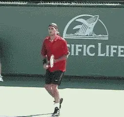
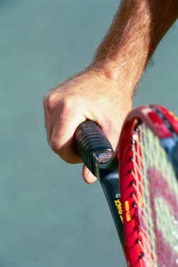
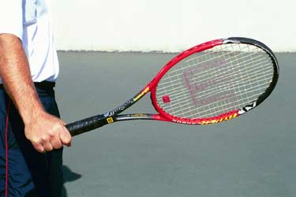
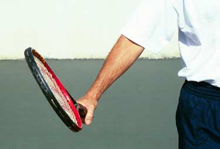
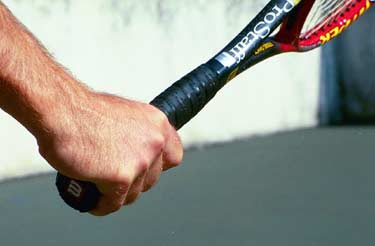
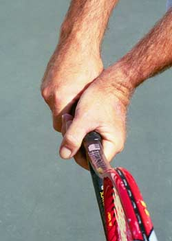
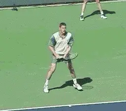
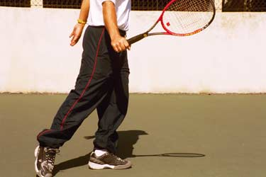

# Private Lessons: Understanding The Backhand Grips

### By Kerry Mitchell

------------------------------------------------------------------------

**Modern one-handers like Roger Federer have the explosive firepower of the best two-handed players.**

In comparison to the forehand, which can be hit with 4 or 5 distinct
grip styles, the backhand grips are much simpler. For the one-handed
backhand there are just two options: the continental grip (see part 1 of
this series) or the eastern grip.

On the two-handed backhand, the grip for the dominant, or bottom hand
(i.e., the right hand for a right-hander) should be a continental. This
can be combined with either an eastern or a mild semi-western grip with
the top (or left) hand.

**One-Handed Backhand**

The one-handed backhand, once the standard in the game, is on its way
back after years of being considered a second-class citizen. Many of the
top players have one-handed topspin backhands equal in firepower to the
two-handed players. This marks a major evolution in the modern game.

In years past, one-handers hit mainly with slice (continental grip).
There were two reasons. One, the slice backhand was a great rallying
tool. With wood racquets there was little danger of the opponent
producing a lot of energy off a slower ball. Two, the slice was a great
weapon in terms of approaching the net, and the game, at the highest
levels, was primarily serve and volley. The ball stayed low and slid
through on the faster surfaces that were prevalent (3 of the 4 majors
were played on grass courts).

                                                              
                                                         **The eastern backhand grip allows you to drive the ball with topspin.**
  --------------------------------------------------------------------------------------------------------------------------------------------------------------------------------------
  --------------------------------------------------------------------------------------------------------------------------------------------------------------------------------------

  --------------------------------------------------------------------------------------------------------------------------------------------------------------------------------------

The players of the past were so proficient at controlling speed and
angle with the slice that the drive backhand was used in a very limited
fashion. When players did drive the ball they usually hit it flat or
even with a little bit of underspin, for example, the \"slice drive\" of
Ken Rosewall.

But as the speed of the game increased with the two-handed backhand and
the improving racquet technology, one-handers found they needed to hit
more topspin to control the ball. This necessitated a change in grip
position from the continental to the eastern.

**Eastern Backhand**

The eastern backhand grip can be used to hit either flat or topspin
balls. Much like the eastern forehand grip, it requires a player to take
the ball on the rise more often, which also requires better movement and
preparation.

This is the major reason why most one-handed backhand players, at the
club level, still slice more often in match situations. **The continental grip (underspin grip) allows a player to hit late balls and high balls more effectively, a situation that can be traced mainly to bad footwork and slow preparation.To be a complete one-handed player, however, requires the ability not only to slice but to drive the ball flat and also with at least some topspin.** This is obviously true in the pro game.
It's also a big advantage at the club level.

                                                         
                                      **Visualizing the racquet head above the wrist is essential to controlling the eastern backhand.**
  ---------------------------------------------------------------------------------------------------------------------------------------------------------------------------
  ---------------------------------------------------------------------------------------------------------------------------------------------------------------------------

  ---------------------------------------------------------------------------------------------------------------------------------------------------------------------------

**As with all grips, the secret to developing control with the eastern backhand grip is mental imaging. The player must develop mental images which lead to the correct position of the racquet head at contact.**

On the one-handed backhand, there are three key mental pictures. **The first is the image of the racquet head above the wrist.** This image is essential to controlling the
ball, whether the shot is hit with topspin or slice.

**The leverage on the one-handed backhand is better when your hand position is near waist level.The only way to play higher balls and keep the hand at that level is to raise the racquet head to the level of the ball.If you raise the hand to the ball level, there is a tendency to drop the racquet head causing the ball to fly out.This is why the image of the racquet head above the wrist is critical.**

                                                         
                                 **The mental image of the closed racquet face counteracts the natural tendency to open the hand to the sky.**
  ---------------------------------------------------------------------------------------------------------------------------------------------------------------------------
  ---------------------------------------------------------------------------------------------------------------------------------------------------------------------------

  ---------------------------------------------------------------------------------------------------------------------------------------------------------------------------

**The second image is of the racquet face partially closed at contact.** As I discussed with the forehand grips,
this image counteracts the natural tendency for players to open their
palms toward the sky.

The more vertical the swing pattern and/or the greater the swing
velocity, the more the natural reaction of racquet hand to open toward
the sky, causing the racquet face to open.

**Another way to develop this position is with the image of the knuckles pointing somewhat towards the ground.**
Every attempt should be made to maintain this image throughout the swing
path to guarantee consistent contact and the desired reaction of the
ball off the strings.

Learning to control the amount of topspin, much like on the serve, will
go a long way in a players ability to play at higher levels.

                                                    
                                      **Another way to control the racquet head is the image of the knuckles turned toward the ground.**
  ---------------------------------------------------------------------------------------------------------------------------------------------------------------------------
  ---------------------------------------------------------------------------------------------------------------------------------------------------------------------------

  ---------------------------------------------------------------------------------------------------------------------------------------------------------------------------

The ability to drive the one-handed backhand with topspin during match
play is difficult for most club players but can be achieved by improving
footwork. This is done by **learning to hit the one-hander with open stance positioning, emphasizing the alignment of the back foot with the path of the incoming ball (left foot for righties\--right foot for lefties).** This can take a while to become
comfortable because, just like an open stance forehand, the trunk of the
body has to rotate (read: turn position) to generate good power.

The eastern backhand grip position can be used for slicing the
one-handed backhand, but especially at the higher levels of the game
this will be difficult. This is due to the many quick low balls a player
receives that require opening the racquet face without the dropping of
the racquet head (much like low volleys).

**The right solution to be a complete one-handed player is to combine the ability to drive with the eastern grip with the ability to slice using the continental.**

                                     **The best grip combination for two hands, a continental combined with an eastern or mild semi-western.**
  -------------------------------------------------------------------------------------------------------------------------------------------------------------------------------
   
  -------------------------------------------------------------------------------------------------------------------------------------------------------------------------------

  -------------------------------------------------------------------------------------------------------------------------------------------------------------------------------

**Two-Handed Backhand**

The two-handed backhand, which has become a dominate force in the game
today, is the easiest way for beginners to learn quickly. Kids can start
the process of playing points and matches much earlier in their
development with the two-handed backhand. This is one of the reasons why
younger and younger players have been successful on the pro tour in the
last 20 years.

Players like Chris Evert, Tracy Austin, Jimmy Connors, and Bjorn Borg
showed the world how effective the two-handed backhand can be. They had
so much success that, for a while, it was thought the two-hander was the
only way to make it in today's high-speed game.

Fortunately, that train of thought has waned with the resurgence of the
one-hander. But even with that resurgence, the two-handed backhand shows
no sign of losing its popularity. The two-handed backhand is here to
stay.

**Two-Handed Backhand Grips**

One of the numerous reasons the two-handed backhand is so much easier
for beginners to learn is the grip positions. The dominant (bottom hand)
shifts from a forehand grip to the continental grip position. The
non-dominate (top hand) is placed in an eastern grip position, or a mild
semi-western.

It is possible to use a non-continental grip position (i.e., your usual
forehand grip) on the dominate hand, but this makes it awkward to
coordinate the proper racquet face angle at contact.

                                                         
  ---------------------------------------------------------------------------------------------------------------------------------------------------------------------------------------
  ---------------------------------------------------------------------------------------------------------------------------------------------------------------------------------------

  ---------------------------------------------------------------------------------------------------------------------------------------------------------------------------------------

It can also cause what I call a \"dominate hand lead\" in the swing,
making the shot less powerful. The more western the forehand grip, the
greater the chance of this happening.

Keeping the forehand grip on the dominate hand also makes slicing the
ball very difficult because the face of the racquet is too open at
contact. At the high levels of the game, you rarely, if ever, see a
player keep the forehand grip position on the dominant hand, due to the
necessity of producing a quality slice backhand.

The driving force in the two-handed backhand is the non-dominant arm
(left arm for righties). In earlier two-handers this was not always the
case, but as the need for more power and control in the game has come
about, there has been an increased need to swing like the forehand.

This is why you see tremendous power generated by the pros on the
two-handed backhand today (To study a great model for the two-handed
backhand, check out Matat Safin in the Advanced Tennis high speed DVDs.
[Click Here](http://www.advancedtennis.com).) Much like the modern
forehand, they use extreme torso rotation and uncoiling, and slingshot
the rear arm through the contact at incredible speeds.

The new-found speed makes the need to control the angle of the racquet
face very important. Unlike the forehand, however, there is no need to
go to a full semi western or a western grip on the non-dominate arm to
create racquet face closure. This is because the two hands work together
to attain the proper angle, using a swing plane that is less steep than
the westernized forehand.

                                 **The two-handed key mental image of the racquet head above the wrists and the closed racquet face.**
  --------------------------------------------------------------------------------------------------------------------------------------------------------------------
   
  --------------------------------------------------------------------------------------------------------------------------------------------------------------------

  --------------------------------------------------------------------------------------------------------------------------------------------------------------------

The combination of the continental position (dominate hand) and the
eastern position or mild semi-western (non-dominate hand) is quite
efficient in controlling the racquet head. This combination also makes
the two-hander more efficient in terms of swing length (shorter). This
makes difficult balls (high and low) easier to handle under pressure.

**Much like the forehand and the one-handed backhand, the two key mental images for the two-hander are of the racquet head above the hands at contact, and of the partially closed racquet face.**

We actually see this physical position-face closed, racquet head above
wrist\--on more and more balls in the pros, particularly high balls.
This image may not be the reality in your game, or may exaggerate the
reality. But it is necessary to create it in your mind's eye in order
to control the shot consistently.

|  |  |
| **In the modern pro game, players like Safin and Federer, at times, actually model the key image of the racquet head above the wrists.** |  |

**Two-Hands or One?**

I am often asked, which backhand is better to use? I used a two-handed
backhand for 18 years before I had to switch to a one-hander (due to an
injury to my non-dominate hand) and have used the one-handed backhand
for the last 10 years.

Having played extensively with both in different parts of my career I
can honestly say that neither is better. Each has its benefits and its
problems.

What I found, which is surprising to some, is that hitting the
one-handed backhand well required a more acute awareness of my movement.
Learning to drive the one-hander in tournament play required me to focus
intently on aligning my rear foot to the ball, which made it possible to
be on time more often.

                                                          
                                    **To drive the the one-hander in tournament play, learn to align your rear foot to the oncoming ball.**
  ----------------------------------------------------------------------------------------------------------------------------------------------------------------------------
  ----------------------------------------------------------------------------------------------------------------------------------------------------------------------------

  ----------------------------------------------------------------------------------------------------------------------------------------------------------------------------

I also had to focus much more on the image of the closed racquet face at
contact and the image of the racquet head above the wrist (having
previously played with two-hands made this process much easier).
**What I like about the one-hander is the explosive nature of the shot. Hitting a great one-handed backhand is far more thrilling then hitting a great two-handed shot.The two-hander allowed me more freedom to adjust.** Simply put, I did not have to be as good
with the two-hander. I could get away with slight errors in movement and
technique and still compete well. Both mentally and physically, it was
easier to adapt to difficult balls with two hands. I started playing
with the two-hander as a teenager because my heroes, Borg and Evert used
it, and as a beginner, I found **the two-hander much easier to learn than even the forehand.I did learn how to hit a one-handed slice later, mainly out of the necessity to reach for wide balls and low balls.**
Learning to hit a one-handed slice was good training for hitting a
one-handed backhand volley. **As noted below, the transition to the one-handed drive was far more difficult.Should You Switch?**

One question I am often asked, is should I switch? My firm answer is no.
The reason is the time it takes. Like most players I was a bit naive
thinking I could make the switch to the one-hander easily, having
already learned how to hit a one-handed slice.

It took me 7 years to bring my new one-handed backhand up to the level
of the old two-hander. It took yet another 2 years to bring it to where
it is today, which is a far greater shot than my two-hander ever was.
Making the switch requires learning a whole new stroke from scratch, but
without the luxury of playing at a lower level to hone the skills
necessary.

I hope this series on understanding grips will help you have a greater
awareness of what you do and what you can do to improve. Deep down all
players want to play to their ultimate potential and understanding how
grips affect the game goes a long way in realizing that dream. My most
important thought: Have Fun!

|  | numerous ranked junior players and coached |
|  | a series of championship high school teams. |
|  | He was highly ranked both sectionally and |
|  | nationally in men's 30 and 35 singles. |
|  |  |
|  | After 15 years as the Head Teaching Pro at |
|  | the John Yandell Tennis School in San |
|  | Francisco, California Kerry and his partner |
|  | are now splitting time between homes in |
|  | Merida, Mexico and Toronto, Canada. He has |
|  | continued to coach and to have great |
|  | competitive success winning Canadian |
|  | National seniors titles---not to mention |
|  | continuing to write articles for |
|  | Tennisplayer from his unique perspective. |

------------------------------------------------------------------------
