# What is Open Stance?

# By Kerry Mitchell

------------------------------------------------------------------------

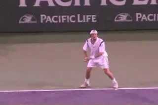

**Open stance is standard in modern tennis\--but what is the key to developing it?**

\"Open-stance\" hitting has become the standard with players and coaches
alike. The trend has been developing for a long time, but how did this
really come about? Often times, \"modern\" open stance hitting is
contrasted with the \"obsolete\" footwork of the past.

Like many observers of the game, I just assumed that the players of the
past stepped into every ball. But I had to examine that assumption after
I watched a video called \"Kings of the Court,\" with some great
historical footage, produced by my fellow Tennisplayer contributor Ed
Atkinson. ([link](http://www.tennis-warehouse.com/descpageYANDELL-VKINGS.html).) The
video is revealing because it has so many instances of open stance
hitting, from Bill Tilden to Rod Laver. The fact is that even before the
start of the open era, the great players were using open stance
positioning. Today it may be done by design, but the great players of
the past slipped into open stance hitting as easily and gracefully as
today's players.

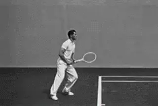

**Great past champions often hit open stance, as the great American champion of the 1930s and 40s, Bobby Riggs, demonstrates on this high forehand.**

The video also shows there was a progression. Gradually players used
more and more open stance hitting. Probably this progression was due to
three factors. One factor was the accelerating ball speed. The second
factor was the increased use of topspin. We can see this in the forehand
of Rod Laver, who hit the ball harder and with more topspin than
previous players. For Laver, hitting open stance became more and more
common, a decision or choice.

The final factor, and possibly the most important, was the change in
surfaces, with more and more tournaments on clay and hard courts,
replacing grass, which was once the surface of 3 of the 4 Grand Slams.
The shift to harder courts produced much higher bounces in the rallies,
which made it difficult to \"step in\" on every ball.

Open stance had always been a natural part of the game. Great players
knew when and how to use it, and as the evolution of tennis dictated,
they naturally used it more and more.

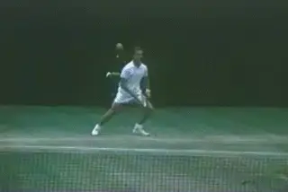

**As power and topspin increased, players like Rod Laver began to hit more open stance by design.**

The way the game was taught was an entirely different matter though.
Open stance was heresy, the mark of a lazy, poorly skilled player.

There was one player who changed all that: Bjorn Borg. Unlike players of
the past, Borg used open stance positioning almost exclusively on his
forehand. His western grip (mild by modern standards!) and open stance
hitting proved to be a potent combination, especially with Borg's
incredible speed around the court.

Borg showed the world that even on grass, an open-stance, westernized
baseliner could dominate serve and volley players. It was something the
commentators and teachers couldn't believe and consistently criticized.
But once players and coaches saw the possibilities of this stance
position both in terms of control (topspin) and power, there was no
turning back.

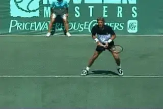

**Borg showed the world the potent combination of a western grip and open stance hitting.**

When we use the term open stance, we have to be precise in what we mean.
There are several versions of open stance, and judging how \"open\" the
stance is on a given ball also depends on shot direction, among other
factors. To understand this we have to look at the shape and dimensions
of the tennis court itself. **The tennis court is a rectangle. It's defined by right angles. But the most basic shot in the game is not hit on a right angle\--it is hit crosscourt, on a diagonal to the lines of the court.What does it mean then to \"step into\" a shot? Many instructors will say that you step directly forward so that a line across your toes is parallel with the sidelines of the court. This is where the confusion starts.I say that \"stepping in\" means that the front foot steps in the direction of the shot**. **On a crosscourt shot the step would be on a diagonal. This means a line drawn across the edges of the toes would be parallel to the target line.** The sharper the crosscourt angle, the
sharper the diagonal.

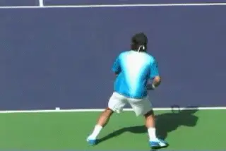

**Do you step in according to the lines of the court or the line of the shot?**

Often I feel the court lines themselves confuse players in terms of
direction. If we were able to move the court lines with each shot to
line them up with the target, footwork would make more sense to the
general player. **When hitting crosscourt the trajectory of the shot does not match the vertical court lines so why should the stance?**

In learning proper alignment, this same basic principle applies when it
comes to open stance hitting. The player may not place his front foot on
the court, but **when he begins his open stance swing, a line drawn from the back foot across the front foot should still be more or less on the target line.** With open stance the front foot
may be in the air, but the same geometry applies. **You can draw a line from the back foot to the front foot that is parallel to the flight of the ball.**

If you learn to look closely or spend a lot of time in the Stroke
Archive, you'll see this alignment in a significant percentage of the
open stance forehands hit in pro tennis. It should be the basis for
developing your own open stance style, as I'll explain below.

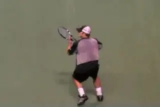

**The front foot is in the air, but notice the alignment of the stance to the target line.After the open stance hit the front foot will often come back around with the body rotation and land on the players left side.But look at the alignment during the critical moments around the contact. The feet are aligned on the diagonal of the shot line.Whether one foot or both feet or neither foot is on the court during the hit is not a function of alignment per se. Rather this is a function of ball height and the player's ability to unload upward into the shot (and into the air off the court.)**

This basic diagonal alignment has to be distinguished from the more
extreme open stance in which the front foot stays much further back,
sometimes almost parallel to the back foot. And there are reasons and
advantages for developing this after the basic alignment is solid and
natural.

Although it varies with the player, most pros hit with this more extreme
version of the open stance at certain times for certain reasons. One is
disguise. It allows them and go down the line at the last second without
giving away the shot selection. The second is it allows them to break
off sharper angles crosscourt. The third reason is that they are often
forced or rushed by the ball.

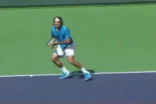

**More extreme open stance gives players more advanced options.But it's a fatal mistake for recreational players to immediately copy the more extreme versions in learning open stance.** It is far more difficult to understand
and feel the basic turn with an extreme open stance. Players at lower
levels who stress this too early tend to end up with less body turn and
less rotation\--the supposed benefits of the open stance in the first
place. So let's see how to develop the benefits by learning the more
basic open stance positioning.

To a certain extent, then, the whole debate about \"open\" versus
\"closed stance\" is a red herring. It can distract players from
understanding **the most important element in any of the stances, which is alignment to the target line.** This gets
me to the most important underlying point about stances\--**the critical role of the backfoot in achieving alignment. All the debate about stances is focused on the front foot, but in reality the key is understanding how to align the backfoot to the ball.** When you understand this the amount you
open your stance on a given ball will happen almost naturally.

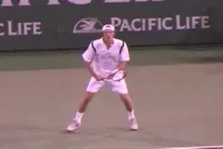

**Understanding the role of the back foot in alignment is the key to the open stance forehand.To gain the proper alignment to the target, what foot would you initially align with the incoming ball? In every case, it is the rear foot, or the right foot for a righthander.** It is
sometimes also called the outside foot. ([Click
here](../Footwork/Court%20Movement%20-%20The%20Forehand.docx) for Bob
Hansen's excellent article on positioning on the forehand.) This should
be done when \"stepping in\". It's also the same for \"true\" open
stance hitting of all kinds. **The positioning of the rear foot is the most important point.The first aspect of correct alignment is what I call learning to \"chase\" or \"lead\" with the rear foot to the incoming ball.** Chasing with the rear foot is critical but
is rarely explained or understood in most lessons.

If you watch top players you will often see them **take a number of small positioning or adjusting steps around the ball in order to create this critical alignment between the rear foot and the incoming ball.**

This chasing aspect is also used even when moving forward to a short
ball. The concept of chasing with the rear foot is probably the toughest
part for club players to achieve because it requires the upper body
rotation to occur without the front foot coming around in the
preparation.

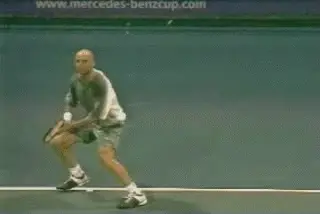

**Watch Andre use precise, small steps to position behind the ball.**

Most players, as beginners, struggle with the basic concept of getting
turned sideways to the ball. So many instructors teach their students to
get around with both feet to help in this initial process. Once the
front foot comes too far around in the initial move, it has the
potential to completely disrupt the movement pattern and actually
prevent correct alignment to the ball.

Unfortunately, once they bring the front or left foot across, many
players learn to chase the incoming ball by leading with their front
foot. This means they often reach the ball with a step across the body,
and often actually hit with a closed stance. Ironically, they believe
that are correctly \"stepping into\" the shot. Instead, this blocks the
rotation of the torso and makes them feel jammed by the ball. Because
they feel \"too close to the ball\" and sometimes trying to correct this
makes the problem even worse. They develop the habit of stopping even
further away and stepping even further across with the front foot to
reach the ball. The result is poor alignment and loss of power for any
shot except down the line hit from near the center of the court, or an
inside out, and this happens only by accident.

In reality, you want to chase the ball with your rear foot, the right
foot for a right-handed forehand. There are more extreme cases where the
first step can a drop move, or on the run a player does take a big cross
step with the left foot early in the movement pattern, but let's talk
here about the basic principles of developing good alignment.

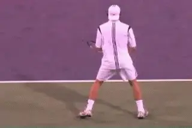

**Watch how Safin makes the initial turn, then recreates a similar position behind the ball.This means that the player should learn to step out with the rear foot.** The body turns but the left foot should
stay on the left side, with the left foot up on the toes. The goal
should be to achieve the full turn position of the upper body on this
first step. Once he has a feel for this initial full turn without a
cross-step, the player should learn to move with the goal of recreating
this position behind the ball.

This means he **reaches the ready to hit or step-up position with the right foot, with the left foot still on the left side. At the set up, the weight is on the right rear foot with the toe of the front foot on the ground just for balance.The upper body should be as upright as possible.The hip alignment is perpendicular to the net or as close to that as possible**.
Aligning with the rear foot also allows for greater adjustability for
irregular bounces that do occur more often in today's game. It allows
more freedom of placing (or not placing) the front foot where necessary
to make last minute adjustments.

**From this proper foot alignment, the angle of the stance can now range from 45 to 90 degrees to the baseline, depending on the angle of the diagonal of the shot.** The player can hit with
a mild open stance, or step into the shot and hit with the front foot on
the court. The alignment is the same.

**What are the advantages of developing this well-aligned open-stance hitting? And when should players employ it? One advantage which I mentioned earlier is adjustability. Hitting open-stance allows the player to play balls higher and/or further back in the stance.** This is true for every grip position.
With the use of more power and topspin in today's game this kind of
adjustability is necessary.

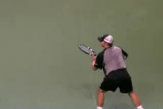

**More rotation equals more torque equal more power and spin.The second advantage is the increased potential for creating topspin.** Open-stance hitting has made creating
topspin possible on all types of balls. The more traditional player with
an eastern grip who tries to step in on every ball is only comfortable
with creating topspin on lower balls. **Open stance hitting allows even a traditional styled player to hit topspin on all types of balls, even high balls that would be far above the strike zone with an eastern grip otherwise.**

This aspect goes hand in hand with the next advantage of hitting
open-stance which is power production. The amount of forward rotation
placed on the ball is huge today compared to the pre-open era.

Power production is tremendously increased when open-stance hitting is
done properly. I believe that open-stance hitting is equally as
responsible for the increase in the power of today's game as the
advancement of racket technology.

The amount of torque possible when hitting open stance is far greater
than hitting with a more traditional stance position. Shoulder rotation
both into and out of the turn have dramatically increased. You can see
this in the angle of the shoulders at the completion of the
follow-through. Extreme grip players routinely finish with the front
shoulder pointing at the opponent. Now Federer has demonstrated how this
same level of extreme rotation can be achieved with even a quite
conservative grip.

**Trying to step or land with the front foot parallel with the vertical lines of the court drastically impedes this rotation.** Borg
started the trend of increased torso rotation mainly to hit more topspin
for control, but players today have taken it to new heights in terms of
creating ball speed.

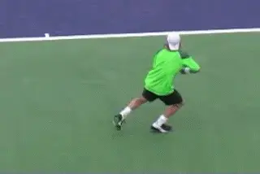

**Watch Lleyton take one small extra breaking step and make an efficient balanced recovery.The fourth advantage to hitting open-stance is court coverage. Recovering back into the court for the next shot is far more efficient than with a closed stance; which often has a player falling off balance toward the outside of the court.** This
is in evidence time and time again when pros use their rear foot to stop
their momentum after a long run. By landing on the rear foot, it is far
easier to stay upright and maintain good balance throughout the swing.
They do this even by taking an extra step to the side with the rear foot
after the first landing. The positioning for recovery is still far more
favorable.

**The fifth and final advantage of open-stance hitting is the better use of the court in shot making, particularly in terms of creating angle.** Aligning the feet to the true direction of
the shot, and not with the court, opens up the possibility of greater
and greater angles. Hitting with a traditional closed stance makes these
kinds of shots difficult because of the necessity to swing across the
body plane (pulling your arm across the body).

Is open-stance hitting only for the forehand? As we look at the pros
today I would say no. More and more two-handed backhand players are
hitting more exclusively open-stance (especially in the women's game)
taking advantage of the potential in terms of power generation and court
coverage.

Even one-handed backhand players are starting to see the potential of
hitting open-stance especially on wide or high balls (much like the
players of the past did). It has opened up angles, for the one-handed
players, which were only thought possible for the two-hander. More on
the open stance and the backhands in upcoming articles.

|  | numerous ranked junior players and coached |
|  | a series of championship high school teams. |
|  | He was highly ranked both sectionally and |
|  | nationally in men's 30 and 35 singles. |
|  |  |
|  | After 15 years as the Head Teaching Pro at |
|  | the John Yandell Tennis School in San |
|  | Francisco, California Kerry and his partner |
|  | are now splitting time between homes in |
|  | Merida, Mexico and Toronto, Canada. He has |
|  | continued to coach and to have great |
|  | competitive success winning Canadian |
|  | National seniors titles---not to mention |
|  | continuing to write articles for |
|  | Tennisplayer from his unique perspective. |

