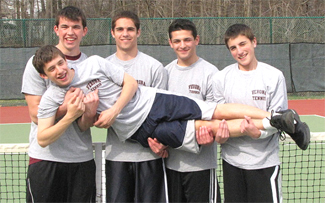
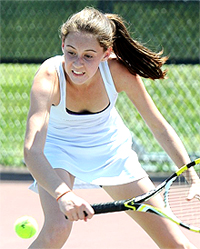
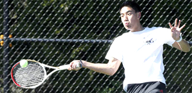
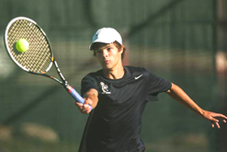
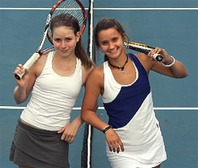

# Coaching High School Tennis

### Roy Gessford

------------------------------------------------------------------------

**High school tennis can create a sport and friendships that last for life.**

With less than 1 percent of high school athletes receiving a college
scholarship, the high school team is the pinnacle of many athletes'
experience. A tennis team can be a positive experience that inspires
friendships and play over a lifetime, or a negative experience that
results in a player losing interest in the sport completely.

Coaching a high school tennis team is a dynamic endeavor. It is also a
huge responsibility. The student athletes are full of energy and coaches
have a great opportunity to help players in their growth toward being
successful athletes and young adults.

The skill set needed to be a great tennis coach is different from those
needed to be a great tennis player. When I look back at the coaches, I
most enjoyed coaching against and whose team members enjoyed playing for
them the most, I see very few professional or even collegiate level
tennis players. Instead, I see school teachers, basketball coaches,
dentists and a city manager.

**What does it mean to be a role model?Role Models**

At the first team meeting every year I ask my players, \"Who considers
themselves a role model?\" At first only a few hands would go up.

But I wanted each player to know that I considered them a role model.
Every time my players took to the court, they represented their schools
and families as well as themselves. I would continue to ask the question
and was not satisfied until each player raised his or her hand.

As a coach you need to be sure that your schedule includes competitive
matches. If you have a weaker squad and schedule only strong teams, you
had better be good at giving speeches on overcoming discouragement.

If your team is strong, seek out strong teams to play against, even if
they are not from your area. In either case of a strong or weak team,
the balance of appropriate matches may need to take place in non-league
matches.

Each season and each team are unique. For your players there is a level
of challenge that is enough to move them forward without being so
difficult that they quite, or so facile that they get complacent.

The prospect of cutting players includes the possibility of taking away
a student's opportunity to gain a love for the sports they could play
for a lifetime. If the varsity becomes too large, form a junior varsity
or Varsity A and Varsity B team. When high school tennis coaches have
no-cuts policies, tennis in the community grows.

**Who plays number one can mean a great deal individually and to the team.**

A short run and quick stretch before practice is important for the kids
to loosen up. It also allows the individual to be surrounded by their
teammates and feel the energy of the group. Most importantly, I used
this time to gauge the mood of the team. I adjusted the practice level
**accordingly.The Number One Player**

Who to play at the top of the singles lineup? The answer can often mean
a great deal to the player and the program.

A player may remember the opportunity to play number 1 for the rest of
his or her life. The program is often defined by how that player
represents the school.

But how to determine your best player is not always easy. Some years a
player is so dominant that there is little doubt who should fill the
number one spot. Other years a coach may have four players at the same
level.

As a coach you must find the balance in letting players challenge for
the top spot. Too many challenge matches may lead to backbiting while
too few may leave players smug or stagnant. What worked best for me as a
coach was to have challenge matches at the beginning of the season and
then have one or two periods when challenges were allowed during the
season.

**When they learn to make pressure volleys players love the net.Doubles**

In high school tennis when two even teams square off, more often than
not the match will be decided by the lowest doubles team. This is the
reason I coach every player to angle volleys away at the net. We played
to win, even when we lost. It took a lot of trust on the part of the
players to continue with a strategy if it was not initially successful.
But as soon as they started making volleys in pressure situations, I
could not keep them off the net.

**Disputes**

From my experience 90 percent of all disagreements between players stem
from line calls and from keeping score. Most of the time when players
lose track of the score it because the server did not call out the score
at the start of the point.

From day 1, I will not let the players start a point without first
agreeing on the score. If the opponent does not call out the score, I
teach players to politely ask the server to call the score out loud.

**Having teammates\--one of the most beautiful aspects of high school tennis.**

If the habit of not calling the score is engrained, I teach my players
to let the serve go without making an effort to return, or to catch the
ball. The returner then asks the server to please announce the score and
then gives the server a first serve.

As for line calls, \"Are you sure?\" is an ineffective question. The
better question is \"Will you please point to the spot on the court
where you saw the ball land?\" I encourage players to question one or
two line calls, but if blatant bad calls persist to ask the coaches to
provide a line judge.

**Staying to the End**

One of the most beautiful aspects of competing on a tennis team is that
you have teammates who are counting on your support. Therefore, I made
it a team policy that you had to stay and support your teammates until
the last match finished. You may not be the most popular coach on campus
the first day or two after implementing a rule requiring that players
stay until the entire match is finished, but if popularity is a big
reason you are coaching, you are in the profession for the wrong
reasons.

                                                                                                                                                                                     there he went on to play internationally in
                                                                                                                                                                                     France and Mexico as well as across the United
                                                                                                                                                                                     States. He has coached girls' and boys' high
                                                                                                                                                                                     school tennis teams at schools in the Monterey
                                                                                                                                                                                     Peninsula area in California for almost 20 years,
                                                                                                                                                                                     and also directed an annual team invitational
                                                                                                                                                                                     tournament. During the same period he was also
                                                                                                                                                                                     the director of junior development at Carmel
                                                                                                                                                                                     Valley Ranch, where he developed high school
                                                                                                                                                                                     players who were finalists in over 20 individual
                                                                                                                                                                                     sectional championships. [link](mailto:rmgessford@gmail.com) to email Roy!
  ------------------------------------------------------------------------------------------------------------------------------------------------------------------------------------------------------------------------------------
                                                                                                                                                       at the University of Californa, San Diego. From
  ---------------------------------------------------------------------------------------------------------------------------------------------------------------------------------- -------------------------------------------------

  ------------------------------------------------------------------------------------------------------------------------------------------------------------------------------------------------------------------------------------
