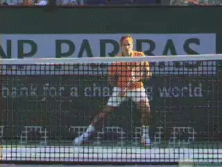
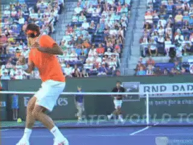
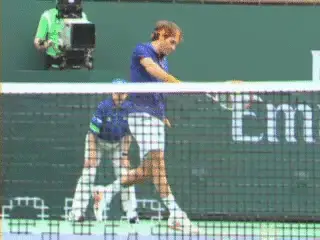
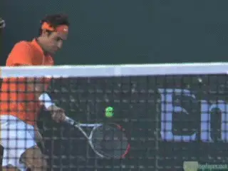
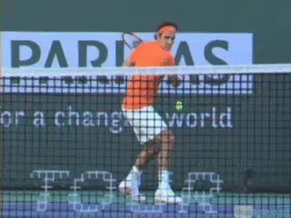
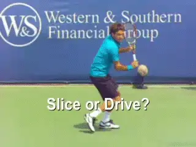

# Building A World Class One-Handed Backhand: Disguise

In the last two articles we have looked at the preparation ([link](https://www.tennisplayer.net/members/classiclessons/chris_lewit/one_handed_backhand_part_3/))
and the forward swing ([link](https://www.tennisplayer.net/members/classiclessons/chris_lewit/one_handed_backhand_part_4/))
in building a world class one-hander. But my goal in teaching the one
handed backhand is not just to build a technical foundation.

My goal is to build a technical foundation that simultaneously creates
disguise. Disguise is essential to creating a real weapon, a superior
shot that cannot be easily read.

So let's review the one-handed stroke we have built from a different
perspective. Let's see how the same technical elements that create
world class ball striking create disguise.

**What is it like to try to read a world class one-handed backhand from court level?**

Let's illustrate this combination of shot making and deception by
looking at what it's like to be at court level on the other side of the
net from one of the greatest one-handers in tennis history, Roger
Federer. See for yourself if you can read what he is doing with his
racket and how this relates to shot location.

### Deep Turn

The first component to look at is the deep shoulder coil. As we saw in
the previous articles, this coil is essential to utilizing the core
explosively in the shot.

**The back turned to the opponent in the deep coil hides the racquet work.**

But look how the same move disguises the shot. The deep turn of the body
up to 150 degrees or more shows part or most of the back to the
opponent. With this turn, the back naturally hides the racquet work in
the backswing and the start of the forward swing.

If the player's shoulders are not turned this far and are closer to
perpendicular to the net at around 90 degrees--as is often advised by
coaches-- the power potential is less. But perhaps more importantly,
the potential to disguise the shot is reduced or eliminated. The thin
profile of the perpendicular shoulder preparation will not hide the
racquet work and the player's intention.

In my system, the backswing and racquet work take place directly behind
the coiled body. This blocks the sightline of the opponent during the
critical phase of the swing.

If the player does not get that big, 150-degree shoulder coil, the
racquet work will peak out on the right side of the body--the left side
from the opponent's viewpoint. At the highest level, where so little
separates the good from the great, this "tell," like in poker, can be a
major disadvantage.

### Hip and Shoulder Position

**Look at the angle of the hitting shoulder--can you read the location of Roger's shot?**

The second element in creating disguise is the hip and shoulder position
at contact.

Players can reveal the intention of their shots by opening their hips
and shoulders too soon, typically giving away a crosscourt play. Or hold
them sideways longer going down the line. I like to teach players to
keep their hips the same on both crosscourt and down the line shots and
to use the hand and wrist to control the direction of the ball.

I want players who can, with the same exact hip preparation and hip
position at contact, hit the down the line and also hit a crosscourt
angle. Too often, players learn to direct the ball with their hip and
shoulders rather than with the wrist, hand, and racquet face angle.

Often I see players coil less in the preparation for a crosscourt shot,
or start the uncoiling of the hip earlier. These subtle differences in
the swing can where the shot is heading.

### Head Position

In the last article, we saw the critical importance of keeping the head
still at contact. Balance, body rotation, shot line--are all related to
head position. No one demonstrates the effectiveness of this element
better than Roger Federer.

**Roger's amazing head position gives no indication of shot direction.**

Keeping the head still is critical to disguise. Just as a player's hips
and shoulders can telegraph a shot, the head can look up and the eyes
can look in the direction of the intended shot.

This is a very common tactical problem, as well as a basic biomechanical
issue. Moving the head disrupts the stroke production, but looking up
too soon also gives away the intention and direction of the shot.

### Racket Angle

The racquet face angle during the backswing is another factor players
must control in creating disguise. If the racquet face angle changes too
much from shot to shot, this can signal the shot intention.

For example, many players close the racquet face much more on the
backswing for heavy spin shots. This makes the shot easily readable by
the opponent. Players should be careful not to turn the wrists and
racquet face on the preparation for different types of shots.

**Look at the consistency of the racket face angle as Roger begins the forward swing.**

Well-trained players have less variance in racquet face angle. As we saw
in the previous article, this should be between 0 and a maximum of about
10 to 20 degrees no matter what the shot. The shot should surprise not
telegraph.

Players must be able to have flexible wrists in order to control shots
that, for whatever reason, they have caught late. Late contact is an
easier adjustment on the two-hander.

But regardless of whether a player has a two-handed shot or one-handed
shot, he must learn to use the wrists properly at the contact,
especially at the last minute when catching the ball late.

This wrist control dovetails with the importance of keeping the hips and
shoulders in line. They work in concert to control the ball with minimal
telegraphing.

Players should be able to direct the ball with the wrist and racquet
face angle rather than their hips and shoulders. Players with a stiff
wrist on the one-handed backhand need to swing their hips open to hit
the ball crosscourt.

### Advanced Backswings

### 

**Roger's backswing, with the racket face slightly open, is the same on the slice and the drive.**

A final advanced element in backhand disguise is the racket face angle
in the preparation. Players like Federer or Tommy Haas actually open the
racquet face slightly in the backswing--no matter what spin they are
preparing to hit. I call this the racquet to the ear preparation.

This positioning prevents the opponent from reading topspin or slice. If
the racket face is radically different in this phase then the other
disguise elements are not as effective. Together however, the elements
in my system help any one-hander create the best of both worlds.
Superior shot making and world class disguise.

So that's it for the relationship between technique and disguise! Now
let's move into my unique series of training drills for court movement,
defending, taking the ball early, and building racket speed. Stay tuned!

