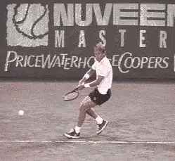
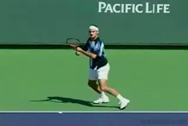
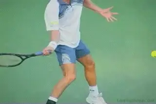
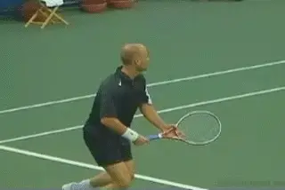
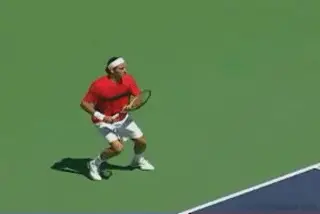

# Forehand Completion

### Private Lessons:

### Forehand Completion

### Scott Murphy

In [Part One](Forehand%20Preparation.docx) of this series we left you
coiled, locked in, and poised to unleash the remainder of your forehand
groundstroke. Again, using examples of the world's top pros, let's
examine the essential elements necessary to keep the rest of your
forward swing on the money.

### Establishing the Contact Range

It is important to note that the catalyst for the forward swing (and the
back swing) is the correct contact range. Nothing hinders your game more
than failing to meet the ball comfortably out in front of you. This is
what prompts the timing of the take back and forward swing. If done
correctly, the entire process will be perfectly continuous, as seen in
the Bjorn Borg animation. Notice how his forehand stroke flows from
start to finish. Finding the most effective contact range for your
forehand (or any stroke) will come through experimentation in practice,
and the realization that your own sense of balance and leverage is your
best guide.

Whether you are using an open stance or square stance on your forehand,
make sure to create an "avenue" through which you make your forward
swing. For the square stance step OUT to the ball, stepping across the
body (closed stance), will prevent proper hip and trunk rotation, and
risk crowding the shot. In other words, you won't be able to get your
body out of the way. Remember for the open stance, keep your back foot
to the inside of the ball, or you'll be forced to swing across your
body instead of forward towards your target. Additionally, regardless of
the stance, be sure to flex your knees when hitting the ball. Without
knee flexion the upper body has to compensate for the loss of leverage
resulting in a stroke that is off balance and ineffective.

**A well developed feel for his contact range allows Federer's forehand to flow from beginning to end.**

### The Wrist and Arm Position

The moment before the forward swing begins it is essential to lock your
wrist and elbow in position. Lay the wrist back at an approximately 90
degree angle to the forearm, and bend the elbow so that another 90
degree angle is formed between the forearm and the upper arm.
Maintaining this position to the point of impact and well beyond is a
must, because it steadies the racquet head as it collides with the ball.
The key to maintaining the locked in position is "to let the handle
lead the strings". It's as if the butt of the handle and the heel of
your hand are combining to pull the racquet head through the contact
point and on into the follow through. If you're truly locked in and the
BACK of the wrist initiates forward movement of the racket wherein the
strings lead the handle, it's likely you're hitting late. All the more
reason to work on that range of contact! More about that wrist break
later.

### The Role of the Non-dominant Arm

### 

**The wrist is laid back 90 degrees to forearm. The forearm is 90 degrees to the upper arm.**

As the hips, trunk, and shoulders begin to rotate forward, make sure to
keep your shoulders perfectly level to make a steadier more even swing.
When striking the ball, the plane of your shoulders should be level and
facing the target; however, one deterrent to this I often see is
improper movement of the non-hitting arm. That arm has the role of
"pace car" to the hitting arm's role of "race car", and in the
process they should work commensurately. Notice in the sequence of
Martina Hingis, how well synchronized her arms are from start to finish.
I've seen so many players unaware of their non-hitting arm flying up in
the air, or dropping like a lead weight and staying there, or scissoring
across the body having started too far to the left (for a right hander),
as well as other variations. These are counter productive to overall
balance and can cause the racket to be out of sync with the force
provided by the elastic action of the trunk.

**Agassi's shoulders: perfectly level. His arms: perfectly synchronized.**

### The Follow Through

Finally, and I can't stress this enough, follow through, or in other
words, HIT THROUGH THE BALL! I often see players end their swing
prematurely (at the moment of impact), creating a floppy wristed finish.
The fact is, a good deal of the swing takes place after the ball is hit,
and so "following through" means driving the racket head well beyond
the impact point. This will provide power and consistency, because
pulling the racket ALL the way through the stroke prevents unwanted
wristy errors.

**Wonder how he hits those effortless winners? Watch Federer's incredible extension through the ball.**

A flowing, well-timed, well-balanced, and complete forehand can be a
real weapon. Instead of fearing your forehand, develop a forehand your
opponents will fear. Armed with the information above and in the
previous article, the powerful images of the world's greatest players,
and plenty of practice time, you'll be on your way to a forehand you
can count on!

**Scott Murphy** is from Marin County, California where he started
playing tennis at age 5 in a family of tennis nuts. Both of his parents
were major influences in his development. He also took lessons from
Marin legend Hal Wagner and former top 10, Harry Roach. Scott is a
graduate of the University of California at Berkeley where he played
baseball and football but continued to work on his tennis game with
renowned coach Chet Murphy. He was the head pro at San Domenico/Sleepy
Hollow Tennis Club for over 20 years. He also directed the Nike Tahoe
Tennis Camp at the Granlibakken Resort for 10 years. Scott now teaches
privately in Ross, Marin County and in the summer he directs the Tuscan
Tennis Academy which he founded in Quarrata, Italy.

Check out Scott's website at
[scottmurphytennis.net](http://www.scottmurphytennis.net)

You can contact Scott directly at: <scottmrph@yahoo.com>
